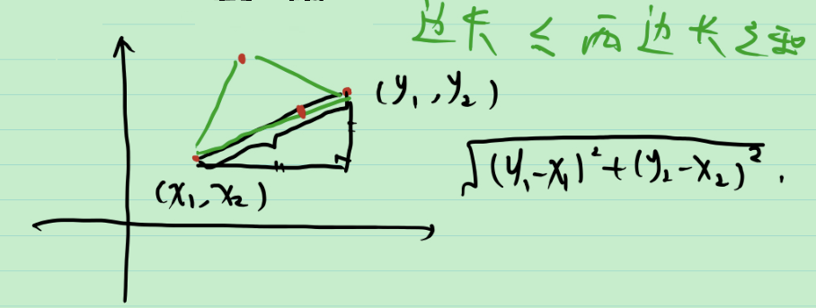
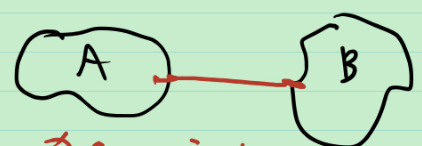
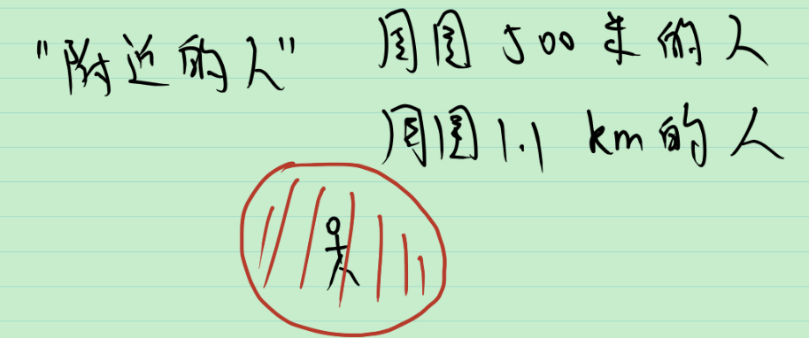
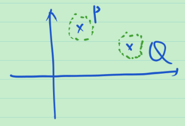

# 10_度量空间和欧式空间

为了描述空间中点的远近, 引入距离的概念.

**例** 

1. $\mathbb R$ 中的距离

2. $\mathbb{R}^2$ 中的距离

推广"距离"

**定义** (度量空间) 设 $X$ 是一个集合, $d:X\times X\to \mathbb{R}$ 满足

1.  非负性: $\forall x,y\in X, d(x,y)\ge 0$ , $d(x,y)= 0\Leftrightarrow x=y$.
2. 对称性: $\forall x,y\in X, d(x,y)=d(y,x)$
3. Cauchy三角不等式: $\forall x,y,z\in X, d(x,y)\le d(x,z)+d(z,y)$

则称 $(X,d)$ 为度量空间.

**例**

1. $\mathbb R$ 中, $d(x,y):=|x-y|$
2.  $\mathbb{R}^2$ 中, $d\left((x_1,x_2),(y_1,y_2)\right):=\sqrt{(x_1-y_1)^2+(x_2-y_2)^2}$
3.  $\mathbb{R}^n$ 中, $d\left((x_1,x_2,\cdots,x_n),(y_1,y_2,,\cdots,y_n)\right):=\left|(x_1-y_1)^2+(x_2-y_2)^2+\cdots+(x_n-y_n)^2\right|$ 

易证 $(\mathbb{R}^n,d)$ 是度量空间. 非负性和对称性显然, 只需验证Cauchy不等式.

也可以在 $\mathbb{R}^n$ 中定义其他"距离", 如:

$d_1(x,y)=|x_1-y_1|+|x_2-y_2|+\cdots+|x_n-y_n|$ 

$d_2(x,y)=\max \left\{|x_1-y_1|,|x_2-y_2|,\cdots,|x_n-y_n|\right\}$ 

**定义** (欧式空间) 把度量空间 $(R^n, d)$ 称为欧式空间.

**定义** (子空间) 设 $Y\sub X$ 非空, 则 $(Y,d)$ 也是度量空间, 称为 $(X, d)$ 的子空间.

> 问: 如何定义子空间之间的距离? 希望将距离定义为离得 "最近"(未必能达到, 取下确界)的长度.
>
> 

**定义** 设 $A$ , $B$ 为度量空间 $X$ 的两个子空间, 定义 $A$ , $B$ 的距离 
$$
d(A,B):=\inf_{P\in A, Q\in B} d(P,Q)
$$

> 问: 如何定义子集的直径? 希望将直径定义为"最远"(未必能达到, 取上确界)的两点间的距离.

**定义** (直径) 设 $E$ 为度量空间 $X$ 的子集, 定义 $E$ 的直径
$$
\delta (E):=\sup_{{P\in E, Q\in E}} d(P,Q)
$$
如果 $\delta (E) < \infty$ , 则称 $E$ 有界(为有界集).

在 $\mathbb{R}^n$ 中, 子集 $E$ 所有点离原点的距离有界 $\Leftrightarrow $  子集 $E$ 有界.

## $\mathbb{R}^n$ 中的邻域

> 怎样描述"在一个点的'附近'"?
>
> 

**定义** ( $\delta $ 邻域 ) 在 $\mathbb{R}^n$ 中, 定义以 $P_0$ 为 中心, $\delta$ 为半径的邻域 $U(P_0,\delta ):=\{P:d(P,P_0)<\delta \}$ , 称为  $P_0$ 的一个 $\delta-邻域$ , 不考虑邻域半径时可简记为 $U(P_0)$ .

**例** 

**性质** 

1. $P\in U(P)$ 

2. 任取 $\delta_1,\delta_2 >0$ , 则存在 $\delta _3>0$ , 使 $U(P,\delta _3)\sub U(P,\delta _1)\cap U(P,\delta _2)$ 

3. $\forall Q \in U(P), \exist U(Q)\sub U(P)$ 

   

4. (分离性, Hausdorff) 已知 $P\ne Q$ , 则存在 $U(P)$和 $U(Q)$ , 使 $U(P)\cap U(Q)=\varnothing$ 

   

重写 $\mathbb{R}^n$ 中收敛的定义

> 在 $\mathbb{R}$ 中收敛的定义: 
>
> $\mathbb{R}$ 中一列点 $\{x_n\}\to x_0\in \mathbb{R}$ , 如果 $\forall \varepsilon >0, \exist N\in \mathbb{N}, s.t. \forall n>N, |x_n-x_0|<\varepsilon$ . 
>
> 而 $|x_n-x_0|=d(x_n,x_0)$ , 于是

在 $\mathbb{R}^n$ 中收敛可以定义为 $\lim_{n\to \infty} d(x_n,x_0)=0$ .

推广到一般的度量空间

在 $(X,d)$ 中, 设 $P_n$ 是 $X$ 中的一列点, $P_0\in X$ .若当 $n\to \infty $ ,有 $d(P_n,P_0)\to 0$ , 则称 $\{P_n\}$ 收敛于 $P_0$ , 记为 $\lim_{n\to \infty} P_n=P_0$ 或 $P_n\to P_0 (n\to \infty)$.

用邻域的语言重写 $\lim_{n\to \infty} P_n=P_0:\Leftrightarrow \forall \varepsilon >0, \exist N\in \mathbb{N}, s.t.\forall n>N, d(P_n,P_0)<\varepsilon$ :

> 由 $d(P_n,P_0)<\varepsilon \Leftrightarrow P_n \in U(P_0, \varepsilon)$

$\lim_{n\to \infty} P_n=P_0:\Leftrightarrow $ 任取 $P_0$ 的一个 $\delta-邻域$ , 存在 $N\in \mathbb{N}$ , 使得当 $n>N$ 时, 有 $P_n \in U(P_0, \delta)$ .

**总结** 将欧式空间 $(\mathbb{R}^n, d)$ 抽象出距离的概念, 推广得出一般的度量空间 $(X,d)$ 的定义, 并在此基础上定义了点列收敛和邻域等概念.

