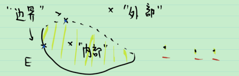
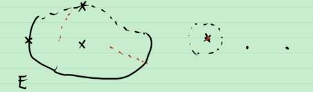
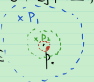

# 11_聚点内点界点

## 内点&外点&边界点

**例** 

内点: 该点 "附近" 全是 $E$ 的点.

外点: 该点 "附近" 全不是 $E$ 的点.

边界点: 该点 "附近" 总是既有 $E$ 的点, 又有不是 $E$ 的点.

用数学语言

**定义** 

1. 内点: $\exist P_0 的一个 \delta-邻域 U(P_0,\delta ),s.t. U(P_0, \delta)\sub E$ .
2. 外点: $\exist P_0 的一个 \delta-邻域 U(P_0,\delta ),s.t. U(P_0, \delta)\sub E^C$ .
3. 边界点: $\forall P_0 的一个 \delta-邻域 U(P_0,\delta ),s.t. U(P_0, \delta)\cap E \ne \varnothing 且 U(P_0, \delta)\cap E^C \ne \varnothing$ .

> **注** $P_0$ 是 $E$ 的外点 $\Leftrightarrow$ $P_0$ 是 $E^C$ 的外点.

**定义** 

1. $E$ 中全体内点的集合称为 $E$ 的开核, 记为 $\overset{\circ}{E}$ .
2. $E$ 中全体边界点的集合称为 $E$ 的边界, 记为 $\partial E$ .

## 聚点&孤立点

**例** 

在 $P_0$ 附近总有 $E$ 的点

1. 异于 $P_0$ : 聚点
2. 只有 $P_0$ : 孤立点

用数学语言写

**定义** 

1. 聚点: $P_0$ 的任一邻域中至少有一个属于 $E$ 而异于 $P_0$ 的点
2. 孤立点: 存在 $P_0$ 的某个邻域 , 其中只有一个 $E$ 中的点 $P_0$ .

> 注: E的边界点要么是聚点, 要么是孤立点.

**定理** (聚点的等价定义) 在度量空间中, 以下命题等价: 

1. $P_0$ 是 $E$ 的聚点( 即 $P_0$ 的任一邻域中至少有一个属于 $E$ 而异于 $P_0$ 的点 );
2. $P_0$ 的任一邻域内有无穷多个属于 $E$ 的点;
3. 存在 $E$ 中互异的点所成的点列 $\{P_n\}$ , 使 $\lim_{n\to \infty} P_n=P_0$ .

> 证: 
>
> $1\Rightarrow 2$: 用反证法. 如果存在 $P_0 的一个 \delta-邻域U(P_0,\delta )$ , 其中 $U(P_0,\delta )\cap E=\{Q_1,\cdots, Q_k\}$ , 如下图所示.
>
> 
>
> 由于 $P_0$ 是聚点, 因此 $\{Q_1,\cdots, Q_k\}-\{P_0\}\ne \varnothing$ . 不妨设 $Q_1,\cdots, Q_k$ 均与 $Q$ 互异, 取 $\delta_0=\frac{1}{2}\min\{\delta,d(P_0, Q_1),\cdots ,d(P_0,Q_k)\}$ ,
>
> 则 $\forall P\in U(P_0, \delta_0)-P_0$ , $P\notin \{P_0,Q_1,\cdots , Q_k\}$ , 故 $P\notin E$ , 即 $(U(P_0, \delta_0)-P_0)\cap E=\varnothing$ 这与 $P_0$ 是聚点矛盾.
>
> $2\Rightarrow 3$: 如下归纳地构造 $\{P_n\}$ . 如图所示,
>
> 
>
> 取 $P_1$ 为任一个 $U(P_0,1)\cap E$ 中与 $P_0$ 互异的点. 
>
> 假设已找到 $P_1,P_2,\cdots,P_{n-1}$ , 使 $P_i\in \left(U(P_0,\frac{1}{i})-P_0\right)\cap E$ , 且 $P_i$ 互异.
>
> 取 $\delta=\frac{1}{2}\min\{\frac{1}{n},d(P_0,P_{n-1})\}$ 
>
> 取 $P_n$ 为 $\left(U(P_0,\delta)-\{P_0\}\right)\cap E$ 的任一点, 则 $P_n\in U(P_0, \frac{1}{n})$ , 且 $P_n$ 与 $P_1,P_2,\cdots,P_n$ 互异.
>
> 于是可取出一列互异的点 $\{P_n\}$ , 且 $P_n \in U(P_0, \frac{1}{n})\cap E$ ,
>
> 从而 $\forall \varepsilon >0, \exist N\in \mathbb{N}, N>\frac{1}{n}, s.t. \forall n>N, d(P_n,P_0)<\frac{1}{n} <\varepsilon$ . 
>
> 即 $\lim_{n\to \infty} P_n=P_0$ .
>
> $3\Rightarrow 1$: 任取 $P_0$ 的一个邻域 $U(P_0, \delta)$ , 由 $\lim_{n\to \infty} P_n=P_0$ 知,
>
> $\exist N\in \mathbb{N}, s.t. \forall n>N, d(P_n,P_0)<\delta$ , 由 $\{P_n\}$互异可知, 存在 $m>N$ , 使 $P_m \ne P_0$ , 因此 $P_0$ 是 $E$ 的聚点. 
>
> 证毕.

**定义** 

1. $E$ 的全体聚点的集合称为 $E$ 的导集, 记为 $E'$ .
2. $E\cup E'$ 称为 $E$ 的闭包, 记为 $\bar{E}$ .

> 注: $\bar{E}=E \cup \partial E=\overset\circ E\cup \partial E=E'\cup \{E的孤立点\}$ .
>
> 直观上看 , $\bar{E}$ ="E中点列跑不出去的范围".

**定理** 

1. $(\overset\circ E)^C=\overline{E^C}$ ;
2. $(\bar{E})^C=\overset\circ{(E^C)}$ ;
3. $(A\cup B)'=A'\cup B'$ ;
4. $E\ne \varnothing$ , $E\ne \mathbb{R}^n$ , 则 $\partial E \ne \varnothing$ ;
5. **Bolzano-Weierstrass 定理** $E\sub \mathbb{R}^n$ 是有界无限集合, 则 $E$ 至少有一个聚点.

> 4 的证明用到 $\mathbb{R}$ 的连通性)
>
> 5 的证明: 用第一数学归纳法.
>
> $n=1$ 时, 会证.
>
> $n=2$ 时, 
>
> 至少有一格有无穷个点, 格子边长越来越小, 总有一个中有无穷个点. 由完备性, 存在极限点.

**总结** 

1. 内点, 外点, 边界点
2. 聚点, 孤立点

之后会根据内点定义开集, 从而可以定义拓扑空间.

