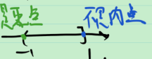
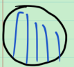
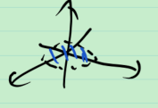
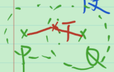

# 12_开集与闭集

直观上, 

数学上, 开集: 集合中的每一点附近都是集合的点; 闭集: 集合中的点列 “跑不出去”, 即聚点落在集合中.

**定义**

1.  $\forall x\in E$ , $x$ 是内点, 则称 $E$ 是开集;
2. 若 $x$ 是 $E$ 的聚点, 可以推出 $x\in E$ , 则称 $E$ 是闭集.

**例** 

1. 在 $\mathbb{R}^n$ 中, $\mathbb{R}^n$ 和 $\varnothing$ 既是开集也是闭集;

2. 在 $\mathbb{R}$ 中, $(-1,1)$ 是开集, $[-1,1]$ 是闭集, $(-1,1]$ 非开非闭. 一般地, 在 $\mathbb{R}^n$ 中, $(a_1,b_1)\times \cdots (a_n,b_n)$ 是开集, 称为开区间; $[a_1,b_1]\times \cdots [a_n,b_n]$ 是闭集, 称为闭区间.

   > 

3. 在 $\mathbb{R}^2$ 中, 开圆盘 $\{(x,y):x^2+y^2<1\}$ 是开集; 闭圆盘 $\{(x,y):x^2+y^2\le1\}$ 是闭集. 把开圆盘放在 $\mathbb{R}^3$ 中, $\{(x,y,z):x^2+y^2<1,z=0\}$ 不是 $\mathbb{R}^3$ 中的开集. 闭圆盘放在 $\mathbb{R}^3$ 中, $\{(x,y,z):x^2+y^2\le 1,z=0\}$ 仍是 $\mathbb{R}^3$ 中的开集.

   > 
   >
   > 
   >
   > 

**定理** 

1. $E$ 是开集 $\Leftrightarrow$ $E=\overset{\circ }{E}$ . 特别地, $\overset{\circ }{E}$ 是开集.
2. $E$ 是闭集 $\Leftrightarrow$ $E=\bar{E}$ . 特别地, $\bar{E}$ 是闭集.

> **注** 证明见书.
>
> 1. $\overset{\circ }{E}\sub E$ , $\overset{\circ }{E}=\bigcup_{G\sub E,G是开集}G$ .即 $\overset{\circ }{E}$ 是包含于 $E$ 的 “最大” 的开集;
> 2. $\bar{E}\supset E$ , $\bar{E}=\bigcap_{F\sub E,F是闭集}G$ .即 $\bar{E}$ 是包含 $E$ 的 “最小” 的闭集.
>
> > 证1: 用定义证.
> >
> > $左\sub 右$ : $\forall x\in \overset{\circ }{E}$, $\overset{\circ }{E}\in E$, $\overset{\circ }{E}$ 为开集, 故 $x\in \overset{\circ }{E}=\bigcup_{G\sub E,G是开集}G $ ;
> >
> > $右\sub 左$ : $\forall x\in \overset{\circ }{E}=\bigcup_{G\sub E,G是开集}G $, 存在开集 $G\sub E$, 使 $x\in G$ , 故存在 $\delta>0$ , $U(x, \delta)\sub G\sub E$ , 即 $x$ 是 $E$ 的内点, 故 $x\in \overset{\circ }{E}$ 

**定理** (对偶性) $E$ 是开集 $\Leftrightarrow$ $E^C$ 是闭集.

> 证: 先证 $E$ 是开集 $\Rightarrow$ $E^C$ 是闭集.
>
> 任取 $x$ 是 $E^C$ 的聚点, 则任取 $x$ 的一个邻域 $U$ , 其中一定存在一个与 $x$ 互异且落在  $E^C$ 中的点, 则 $x$ 一定不是 $E$ 的内点, 又由 $E$ 是开集, 得出$x \in E^C$ , 故 $E^C$ 是闭集.
>
>  再证 $E^C$ 是开集 $\Leftarrow$ $E$ 是闭集.
>
> $\forall x\in E^C$ , 反设 $x$ 不是 $E^C$ 的内点, 则 $x$ 的任一邻域中都有 $E$ 中的点, 而 $x\notin E$ , 故这点与 $x$ 互异, 从而 $x$ 是 $E$ 的聚点, 由已知, $E$ 是闭集, 故 $x\in E$ , 这与 $x\in E^C$ 矛盾.

> **注** 定义了开集, 就可以定义闭集, 反之亦然.

**定理** 

1. 任意多个开集的并仍是开集, 有限多个开集的交仍是开集;
2. 任意多个闭集的交仍是闭集, 有限多个闭集的并仍是闭集;

> 证: 根据对偶性和 De Morgan 公式, 2 可以由 1 推出. 故只需证 1 , 下面给出证明.
>
> **先证任意多个开集的并仍是开集.**
>
> 已知 $G_\lambda (\lambda \in \Lambda)$ 都是开集, 其中 $\Lambda$ 为指标集. 
>
> 则 $\forall x\in \bigcup_{\lambda \in \Lambda} G_\lambda$ , 存在 $\lambda \in \Lambda$ , 使 $x\in G_\lambda$ . 故存在 $\delta >0$ , 使 $U(\lambda, \delta)\sub G_\lambda \sub \bigcup_{\lambda \in \Lambda} G_\lambda$ , 即 $x$ 是 $\bigcup_{\lambda \in \Lambda} G_\lambda$ 的内点, 故 $\bigcup_{\lambda \in \Lambda} G_\lambda$ 是开集. 
>
> **再证有限多个开集的交仍是开集.**
>
> 已知 $G_i (i=1,2,\cdots,n)$ 都是开集, 
>
> 如果 $\bigcap_{i=1}^{n} G_i = \varnothing$ , 则其是开集.
>
> 如果 $\bigcap_{i=1}^{n} G_i \ne \varnothing$ , 则
>
> $\forall x\in \bigcap_{i=1}^{n} G_i$ , $x\in G_i (i=1,2,\cdots,n)$ , 故存在 $\delta_i>0$ , 使 $U(x, \delta_i)\sub G$ .
>
> 取 $\delta = \min\{\delta_1,\cdots,\delta_n\}$ , 则 $U(x, \delta)\sub G_i (i=1,2,\cdots,n)$ , 则 $U(x, \delta)\sub \bigcap_{i=1}^{n} G_i$ , 
>
> 即 $x$ 是 $\bigcap_{i=1}^{n} G_i$ 的内点, 故 $\bigcap_{i=1}^{n} G_i$ 是开集.

**注** 任意个开集的交是开集吗? 上面的证明做不到, 在证明过程中,  $\bigcap_{i=1}^{n} G_i \ne \varnothing$ 时, $\inf {\delta_\lambda}$ 可能等于 0 ! 事实上, 任意个开集的交不一定是开集. 反例: $G_n =(-1-\frac{1}{n}, 1+\frac{1}{n})$ 为开集, 而 $\forall x\in \bigcap_{n=1}^{\infty} G_n=[-1,1]$ 为闭集;  $F_n =[-1+\frac{1}{n}, 1-\frac{1}{n}]$ 为闭集, 而 $\forall x\in \bigcup_{n=1}^{\infty} F_n=(-1,1)$ 为开集. 

**例** ( “分离” 闭集 ) 设 $F_1,F_2\sub \mathbb{R}^n$ 为闭集, $F_1\cap F_2=\varnothing$ , 则存在 $G_1,G_2\sub \mathbb{R}^n$ 是开集, $G_1\cap G_2=\varnothing$ , $G_1\sub F_1$ , $G_2\sub F_2$ .

> 证明的想法: $\forall P\in F_1$ , $P$ 离 $F_2$ “很远”, 从而存在 $P$ 的某个 “附近” $U(P,\delta_P)$ 离 $F_2$ “很远”, 从而 $G_1=\bigcup_{P\in F_1} U(P,\delta_P)$ 离 $F_2$ “很远”. 用类似的方法找到 $G_2$ . 只要 $\delta_P$ 取得足够小, 则 $G_1$ 和 $G_2$ 不相交.
>
> 证: $\forall P\in F_1$ , 断言 $d(P, F_2)>0$ .
>
> > 事实上, 若 $d(P, F_2)=0$ , 即 $\inf_{Q\in F_2} d(P,Q)=0$ , 故存在 $F_2$ 中互异的点列 $\{Q_n\}$ , 使 $\lim_{n\to \infty} d(P, Q_n)=0$ , 即 $P$ 是 $F_2$ 的聚点, 由 $F_2$ 是闭集, 故 $P\in F_2$ , 这与 $F_1\cap F_2=\varnothing$ 矛盾.
>
> 取 $\delta_P=\frac{1}{2} d(P, F_2)$ , 构造 $G_1=\bigcup_{P\in F_1} U(P,\delta_P)$ , 则 $G_1$ 是开集, 且 $F_1\sub G_1$ .
>
> 同理, $\forall Q\in F_2$ , $d(Q,F_1)>0$ , 
>
> 取 $\delta_Q=\frac{1}{2} d(Q, F_1)$ , 构造 $G_2=\bigcup_{Q\in F_2} U(Q,\delta_Q)$ , 则 $G_2$ 是开集, 且 $F_2\sub G_2$ .
>
> 下证 $G_1\cap G_2=\varnothing$ .用反证法.
>
> 若不然, 即 $\exist T\in G_1\cap G_2$ , 则 $\exist P \in F_1, Q\in F_2, s.t.T\in U(P,\delta_P), T\in U(Q,\delta_Q)$ ,
>
> 
>
> 于是 $d(P,Q)\le d(P,T)+d(Q,T)<\delta_P+\delta_Q=\frac{1}{2} d(P, F_2)+\frac{1}{2} d(Q, F_1)\le \frac{1}{2} d(P, Q)+\frac{1}{2} d(P, Q)=d(P, Q)$ , 矛盾.
>
> 证毕.

拓扑学的知识

我们在做 $\mathbb{R}^n$ 中的拓扑学(度量空间中的拓扑学)

怎样定义开集是关键

对于一般的拓扑空间, 什么是开集?

Naive 地讲, 给一些集合 $\mu$ 是全部的开集, 若

1. 集合本身和 $\varnothing$ $\in \mu$ ;
2. 任意个 $\mu$ 中集合的并 $\in \mu$ ;
3. 有限个 $\mu$ 中集合的交 $\in \mu$ ;

知道了什么是开集, 就有了某种拓扑.

在 $\mathbb{R}^n$ 中, 可以给出另一种拓扑结构, 取 $\mu =\{\mathbb{R}^n的子集\}$ , 即所有子集都是开集.

