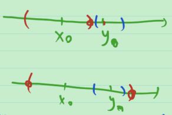

# 14_直线上开集&闭集&完备集的构造

直线 $\mathbb{R}^1$ 上, 开集是什么?

**例** 开区间 $(a,b)\sub \mathbb{R}^1$ 是开集.

> 由开集的任意并和有限交仍是开集, 于是

任意个开区间的并是开集, 有限个开区间的交(为空集或开区间)是开集.

任给 $\mathbb{R}^1$ 中的开集 $G$ , 任取 $x_0\in G$ , 存在 $\delta >0$ , 使 $(x_0-\delta,x_0+\delta)\sub G$ .

记 $A_{x_0}:=\{(a,b):x_0\in (a,b), (a,b)\sub G\}\ne \varnothing$ .

左端点 "向左走", 记左端点 "最小值"(inf) 为 $\alpha$ , 即 $\alpha =\inf_{(a,b)\in A_{x_0}} a$ ;

右端点 "向右走", 记右端点 "最大值"(sup) 为 $\beta$ , 即 $\beta =\sup_{(a,b)\in A_{x_0}} b$ .

问: 怎样刻画好 $(\alpha, \beta)$ ?

1. $(\alpha ,\beta )\sub G$ .

   > 证:
   >
   > 
   >
   > $\forall y\in (\alpha,\beta)$ , 
   >
   > 若 $y = x_0$ , $y\in G$ ;
   >
   > 若 $y<x_0$ , 由 $\alpha$ 是 $a$ 的下确界知, 存在 $a_0\in G, a_0\in(\alpha,y)$ , 设 $a_0$ 对应的右端点为 $b_0$ , 从而 $y\in (a_0,b_0)\sub G$ ; 
   >
   > 若 $y>x_0$ ,同理可证 $y\in G$ .

2. $\alpha,\beta \notin G$ .

   > 证: 若 $\alpha \in G$ , 则存在 $\delta _\alpha >0, s.t.(\alpha-\delta_\alpha,\alpha+\delta_\alpha)\sub G$ , 于是存在 $\delta$ , 使 $(\alpha-\delta_\alpha,x_0+\delta)\sub G$ , 即 $(\alpha-\delta_\alpha,x_0+\delta)\in A_{x_0}$ , 显然, $\alpha-\delta_\alpha<\alpha$ 与 $\alpha$ 是下确界矛盾.
   >
   > 同理 $\beta \notin G$ 

显然, $G=\bigcup_{x_0\in G}(\alpha ,\beta )$ ,暂时将 $(\alpha ,\beta )$ 称为 $G$ 的构成区间, 后面会给出构成区间的定义.

如果 $x_0, y_0\in G$ 且 $x_0\ne G$ , 则包含 $x_0$ 的构成区间与包含 $y_0$ 的构成区间要么不相交, 要么相等.

于是, $G$ 可以写成若干互不相交的构成区间的并.

> "若干" 应是多少? 答案为至多可数个.

**引理** 直线上互不相交的区间的集合是至多可数集.

> 证: 任取其中一个区间 $I$ , 在 $I$ 中任取一个有理数 $x_I$ , 可得单射 $I\mapsto x_I$ 是到 $\mathbb{Q}$ 的单射, 于是这是一个至多可数集.

**定义** (构成区间) 设 $G$ 是直线上的开集, 如果 $(\alpha,\beta)\sub G$ , 而且端点 $\alpha,\beta \notin G$ , 则称 $\alpha,\beta\notin G$, 则称 $\alpha,\beta$ 是 $G$ 的构成区间. 

**定理**  (开集构造定理) 直线上任一个非空开集可以表示成至多可数个互不相交的构成区间的并.

> 证: Step1 $G$ 的不同的构成区间互不相交.
>
> 反证法. 设 $(\alpha_1,\beta_1)$ , $(\alpha_2,\beta_2)$ 是 $G$ 的两个不同的构成区间, 若相交, 必有其中一个区间的端点落在另一区间中, 不妨设 $\alpha_1\in (\alpha_2,\beta_2)\sub G$ , 这与 $(\alpha_1,\beta_1)$ 是构成区间矛盾.
>
> 记 $\tilde{G}=\bigcup_{(\alpha,\beta)\sub G, \alpha,\beta\notin G} (\alpha, \beta)$ 是至多可数个互不相交的区间的并.
>
> Step2: 要证 $G=\tilde{G}$ .
>
> 先证  $(\alpha,\beta)\sub G$ :
>
> $\forall x_0\in G$, 定义 $A_{x_0}:=\{(a,b):x_0\in (a,b), (a,b)\sub G\}\ne \varnothing$ .
>
> 记 $\alpha :=\inf_{(a,b)\in A_{x_0}} a$ ; $\beta :=\sup_{(a,b)\in A_{x_0}} b$ .
>
> 显然, $x_0\in (\alpha,\beta)$ .
>
> 下证 $(\alpha,\beta)$ 是 $G$ 的构成区间.
>
> $\forall y\in (\alpha,\beta)$ , 
>
> 当 $a<y\le x_0$ 时, 由 $\alpha$ 是 $a$ 的下确界知, 存在 $a_0\in G, a_0\in[\alpha,y)$ , 设 $a_0$ 对应的右端点为 $b_0$ , 从而 $y\in (a_0,b_0)\sub G$ ; 
>
> 当 $x_0<y<\beta$ 时 ,同理可证 $y\in G$ .
>
> 于是 $(\alpha,\beta)\sub G$ .
>
> 再证 $\alpha,\beta \notin G$ :
>
> 若 $\alpha \in G$ , 则 $\exist \delta _\alpha >0, s.t.(\alpha-\delta_\alpha,\alpha+\delta_\alpha)\sub G$ , 于是$(\alpha-\delta_\alpha,x_0+\beta)\sub G$ , 即 $(\alpha-\delta_\alpha,x_0+\delta)\in A_{x_0}$ , 而 $\alpha-\delta_\alpha<\alpha$ 这与 $\alpha$ 是下确界矛盾.
>
> 同理 $\beta \notin G$ .
>
> 综上, $(\alpha, \beta)$ 是 $G$ 的构成区间.
>
> 再综上, $G=\tilde{G}$ , 证毕.

**定义** (余区间/邻接区间) 设 $A$ 是 $\mathbb{R}^1$ 上的闭集, 称 $A$ 的余集的构成区间为 $A$ 的余区间/邻接区间.

**定理** 直线上的闭集要么是全直线, 要么是从直线上挖掉至多可数个互不相交的开区间(F的余区间)所得.

> 这是开集构造定理的推论.

完备集是无孤立点的闭集. 又孤立点只能是两个余区间的公共端点, 那么可以将完备集定义为无相邻的余区间的闭集.

$\mathbb{R}^n$ 中的开集是至多可数个半开半闭区间的并.

