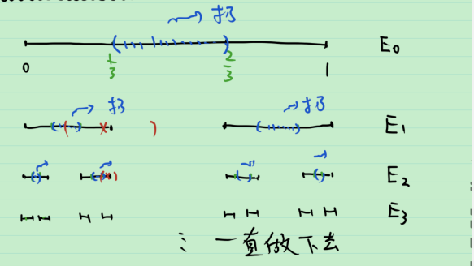
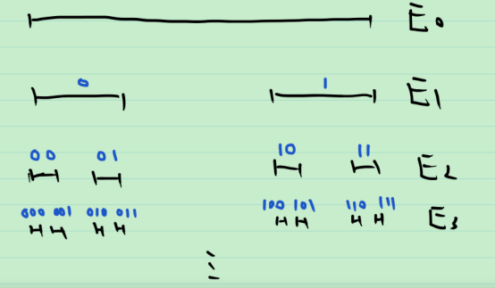

# 15_Cantor三分集

Cantor三分集的构造

得到的集合的极限称为 Cantor 三分集, 记为 $P$ , 即 $P:=\lim_{n\to \infty} E_n=\bigcap_{n=0}^{\infty} E_n$ .

Cantor 三分集的性质;

1. $P$ 是完备集;

   > 证: $P$ 是直线上挖掉可数个不相邻的开区间得到的集合, 于是是完备集.

2. $P$ 是没有内点的集合;

   > 证: $\forall x\in P$ , $U(x,\frac{1}{3^n})$ 中总有不在 $P$ 中的点, 而 $\frac{1}{3^n}\to 0$ , 从而 $x$ 不是 $P$ 的内点. 

   将闭包没有内点的集合称为**无处稠密集(疏朗集)** , 即 $P$ 是无处稠密集.

3. $P$ 有连续基数.

   > 
   >
   > 定义映射 $P\to [0,1]$ , 将 $x\in P$ , 映为一个二进制小数 $0.00100111000\cdots$ .
   >
   > 对于该映射而言, 虽然不同的 $x$ 可能映为同一个二进制小数, (如 $0.1\dot 0=0.0\dot1$ ) 但每一个二进制小数均有原像. 这说明该映射是满射.
   >
   > 从而 $\bar{\bar{P}}\ge \overline{\overline{[0,1]}}=\mathcal{c}$
   >
   > 由 $P\sub [0,1]$ , 得 $\bar{\bar{P}}\le \overline{\overline{[0,1]}}=\mathcal{c}$ 
   >
   > 由 Bernstein 定理, $\bar{\bar{P}}=\mathcal{c}$ . 证毕.

4. $P$ 的 “长度” 为 0 .

   > 挖掉的开区间的总长度 = $\sum_{n=1}^{\infty}\frac{2^{n-1}}{3^n}=1$ .
   >
   > $P$ 的 "长度" = 1 - 1=0

拓展: 分形

