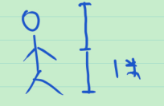
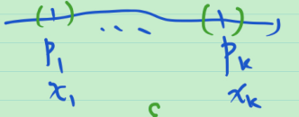

# 16_外测度的定义

**问题** 怎样定义长度, 面积, 体积, ...

圆的面积 = $\pi r^2$ .

$[a,b]$ 长度 = $b-a$ .

……

对"长度"自然的要求:

1. 非负性;
2. 有限可加性;
3. 正则性, 即 $[0,1]$ 的测度为 1.

推广后得到勒贝格测度公理:

1. 非负性

2. > 无穷可加性, 多大的无穷? 任意多则 [0,1] 所有点的长度相加 = 0

   可数可加性

3. 正则性

怎样测量?

$不足\le 身高 \le 有余$ , 且 $不足\xrightarrow{越来越接近} 身高 \xleftarrow{越来越接近} 有余$ .

内测度 := 不足的上确界;

外测度 := 有余的下确界.

当内测度 = 外测度时, 称为可测.

希望只引入外测度就可以定义可测.

随之有如下问题:

1. 可测集的测度满足公理吗?
2. 集合的运算的测度?
3. 所有的可测集长啥样?
4. 不可测集的例子?

## 外测度的定义

直观: 有余的测量的下确界.

数学上, 

尺子 = 开区间

有余 = 整个身子都覆盖住

取下确界就是外测度.

**定义** (外测度) $E\sub \mathbb{R}^n$ , $E$ 的外测度 $m^*(E):=\inf \{\sum_{i=1}^{\infty} |I_i|: \bigcup_{i=1}^{\infty} I_i\supset E\}$ . 其中 $I_i$ 是开区间, $|I_i|$ 是 $I_i$ 的体积.

> **注1** 需要可数个开区间的并. 不能在定义中要求有限个. 因为如果这样定义的话,
>
> $[0,1]$ 有理数集如果被有限个区间覆盖, 则它们 (以及端点) 覆盖 $[0,1]$ . 有理数集的外测度 $\ge$ 1. 同理, 无理数集的外测度 $\ge$ 1.  希望有可加性, 则 $[0,1]$ 的外测度 $\ge$ 2. 而 $[0,1]$ 的显然外测度为 1, 于是矛盾了.
>
> **注2** 对于 $\bigcup_{i=1}^{\infty} I_i\supset E$ , $\{I_i\}$ 中允许有空集. 于是, $\{I_i\}$ 也可以是有限个. 于是, 定义中的 $\bigcup_{i=1}^{\infty} I_i$ 也可以改为之多可数个开区间的并.

**例** 

1. $m^*(\varnothing)=0$ ;

2. 

   1. 对于 $\mathbb{R}$ 中的一个点 $P$ , $m^*(\{P\})=0$ ;

      > 证: 用定义证. 设 $P$ 的坐标为 $x$ .
      >
      > 
      >
      > $\forall \varepsilon>0$ , 取 $I=(x-\frac{\varepsilon}{2},x+\frac{\varepsilon}{2})$ , 则 $|I|=\varepsilon$ , $\{P\}\sub I$ .
      >
      > 于是由外测度的定义, $m^*(\{P\})\le \varepsilon$ . 由 $\varepsilon$ 的任意性, $m^*(\{P\})=0$ .
      >
      > 证毕.

   2. 对于 $\mathbb{R}$ 中的有限个点 $P_1,\cdots,P_k$ , $m^*(\{P_1,\cdots,P_k\})=0$ ;

      > 证: 用定义证.
      >
      > 需要找到覆盖, 体积和 $\le$ $\varepsilon$ .
      >
      > 将长度 $\varepsilon$ 均分到每一个开区间, 则每一个开区间的长度为 $\frac{\varepsilon}{k}$ .
      >
      > 设 $P_i$ 的坐标为 $x_i$ $i=1,\cdots,k$ .
      >
      > 
      >
      > $\forall \varepsilon>0$ , 取 $I_i=(x_i-\frac{\varepsilon}{2k},x_i+\frac{\varepsilon}{2k})$ , 则 $|I_i|=\frac{\varepsilon}{k}$ , $\{P_1,\cdots,P_k\}\sub \bigcup_{i=1}^{k}I_i$ .
      >
      > 由外测度的定义, $m^*(\{P_1,\cdots,P_k\})\le \sum_{i=1}^{k}|I_i|=\sum_{i=1}^{k}\frac{\varepsilon}{k}=\varepsilon$ .
      >
      > 证毕.

   3. 对于 $\mathbb{R}$ 中的可数个点 $P_1,\cdots,P_n,\cdots$ , $m^*(\{P_1,\cdots,P_n,\cdots\})=0$ .

      > 证: 用定义证.
      >
      > 设 $P_i$ 的坐标为 $x_i$ $i=1,2,\cdots$ .
      >
      > 需要找到覆盖, 体积和 $\le$ $\varepsilon$ . 即希望 $\forall i\in \mathbb{Z}^+,P_i\in I_i$ , 且 $\sum_{i=1}^{\infty}|I_i|\le \varepsilon$ .
      >
      > 这是一个无穷正项级数, 而由 $\sum_{i=1}^{\infty}\frac{\varepsilon}{2^i} = \varepsilon$ , 只需令 $|I_i|=\frac{\varepsilon}{2^i}$ , 即 只需令 $I_i=(x_i-\frac{\varepsilon}{2\cdot 2^i},x_i+\frac{\varepsilon}{2\cdot 2^i})$ .
      >
      > 证毕.

**例** 把上述例子中的 $\mathbb{R}$ 换成 $\mathbb{R}^n$ , 结论仍成立. 即至多可数个点的集合为零测集.

> 只需修正怎样找开区间.

**例** $[0,1]$ 中的有理数集是零测集.

> 因为有理数集是可数集

