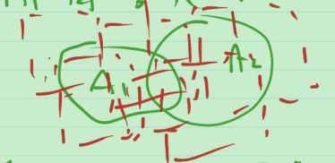

# 17_外测度的基本性质

在上一节希望测度满足勒贝格测度公理:

1. 非负性

2. 可数可加性

3. 正则性

外测度是否满足?

1. 非负性?

   > 显然 $m^*(E)\ge 0$ 且 $m^*(\varnothing)=0$ .

2. 可数可加性?

   > 证: 给出可数个集合 $A_i, i=1,2,\cdots$ .
   >
   > 下证 $m^*(\bigcup_{i=1}^{\infty} A_i)=\sum_{i=1}^{\infty}m^*(A_i)$ .
   >
   > 用定义证.
   > $$
   > m^*(E)=\inf_{I_i是开区间,E\sub \bigcup_{i=1}^{\infty} I_i} \sum_{i=1}^{\infty} |I_i|
   > $$
   >  定义至少告诉两件事: 
   >
   > 1. 任取一个 $E$ 的开区间覆盖 $\{I_i\}_{i=1}^{\infty}$ , $m^*(E)\le \sum_{i=1}^{\infty} |I_i|$ .
   > 2. 存在一个 $E$ 的开区间覆盖 $\{I_i\}_{i=1}^{\infty}$ , 使 $m^*(E)$ 与 $\sum_{i=1}^{\infty} |I_i|$ "差得不太远". 即 $\forall \varepsilon >0$ , $\exist 开区间\{I_i\}_{i=1}^{\infty}$ , $E\sub \bigcup_{i=1}^{\infty} I_i$ , 使 $m^*(E) > \sum_{i=1}^{\infty} |I_i|-\varepsilon$ .
   >
   > 任取 $\bigcup_{i=1}^{\infty} A_i$ 的一个开区间覆盖 $\{I_i\}_{i=1}^{\infty}$ , 与每一个 $A_i$ 有什么关系? 不知道.
   >
   > 
   >
   > 任取 $A_i$ 的一个开区间覆盖 $\{I_{i,m}\}_{m=1}^{\infty}$ , $\bigcup_{i=1}^{\infty} A_i\sub \bigcup_{i=1,m=1}^{\infty} I_{i,m}$ .
   >
   > 右边的集合是可数个开区间的并.
   >
   > 因此 $m^*(\bigcup_{i=1}^{\infty} A_i)\le \sum_{i=1,m=1}^{\infty} |I_{i,m}|$ .
   >
   > 可以取 $I_{i,m}$ , 使 $\sum_{i=1,m=1}^{\infty} |I_{i,m}|$ 与 $\sum_{i=1}^{\infty} m^*(A_i)$ 差得足够小. 先让 $\sum_{m=1}^{\infty} |I_{i,m}|$ 与 $m^*(A_i)$ 差得足够小, 记为 $\delta_i$ , 则需要 $\sum_{i=1}^{\infty} \delta_i$ 也足够小.
   >
   > 任取 $\varepsilon >0$ , 存在开区间 $\{I_{i,m}\}_{m=1}^{\infty}$ , 使 $A_i\sub \bigcup_{m=1}^{\infty} I_{i,m}$ , $m^*(A_i)\ge \sum_{m=1}^{\infty} |I_{i,m}| - \frac{\varepsilon}{2^i}$ .
   >
   > 从而 $\sum_{i=1}^{\infty}{m^*(A_i)}\ge \sum_{i=1,m=1}^{\infty} |I_{i,m}| - \sum_{i=1}^{\infty} {\frac{\varepsilon}{2^i}}=\sum_{i=1,m=1}^{\infty} |I_{i,m}| - \varepsilon$ 
   >
   > 于是 $m^*(\bigcup_{i=1}^{\infty} A_i)\le \sum_{i=1,m=1}^{\infty} |I_{i,m}| \le \sum_{i=1}^{\infty} m^*(A_i)+\varepsilon$ .
   >
   > 由 $\varepsilon$ 的任意性, 得到 $m^*(\bigcup_{i=1}^{\infty} A_i) \le \sum_{i=1}^{\infty} m^*(A_i)$ . 证毕.

   **定理** (次可数可加性) $m^*(\bigcup_{i=1}^{\infty} A_i) \le \sum_{i=1}^{\infty} m^*(A_i)$ .

   > 证: $\forall \varepsilon>0$ , $\exist$ $A_i$ 的开区间覆盖 $\bigcup_{m=1}^{\infty} I_{i,m} \supset A_i$ , s.t. $m^*(A_i)\ge \sum_{m=1}^{\infty} |I_{i,m}| - \frac{\varepsilon}{2^i}$ , 又 $\bigcup_{i=1,m=1}^{\infty} I_{i,m}\supset \bigcup_{i=1}^{\infty} A_i$ , 由外测度的定义, $m^*(\bigcup_{i=1}^{\infty} A_i)\le \sum_{i=1,m=1}^{\infty} |I_{i,m}| \le \sum_{i=1}^{\infty} m^*(A_i) + \sum_{i=1}^{\infty}{\frac{\varepsilon}{2^i}} \le \sum_{i=1}^{\infty} m^*(A_i)+\varepsilon$
   >
   > 由 $\varepsilon$ 的任意性, $m^*(\bigcup_{i=1}^{\infty} A_i) \le \sum_{i=1}^{\infty} m^*(A_i)$ , 证毕.

   不会证可数可加性, 只会证次可数可加性. 不代表是错的. 想说是错的, 需要一个反例.

   **定理** (单调性) $\sub B$ , 则 $m^*(A)\le m^*(B)$ .

   > 证: 任取 $B$ 的一个开区间覆盖 $\{I_i\}_{i=1}^{\infty}$ , 一定也是 $A$ 的开区间覆盖. 故  $m^*(A)\le \sum_{i=1}^{\infty} |I_i|$ . 由外测度的定义和下确界的定义, 
   >
   > $m^*(A)\le m^*(B)$ . 证毕.

3. 正则性, 即 $m^*([0,1])=1$ ?

   **定理** : 若 $I$ 是区间 (开, 闭, 半开半闭) , 则有 $m^*(I)=|I|$ , 即区间的测度等于区间的体积.

   >   证: 
   >
   > **先证** $I$ 是闭区间的情形. 
   >
   > 
   >
   > $\forall \varepsilon >0$ , 总有开区间 $I'\supset I$ , 使 $|I'|\le |I|+\varepsilon$ , 从而 $m^*(I)\le |I'|\le |I|+\varepsilon$ .
   >
   > 由 $\varepsilon$ 的任意性, $m^*(I)\le |I|$ .
   >
   > 反过来, $\forall \varepsilon >0$ , $\exist I$ 的开区间覆盖 $\{I_i\}_{i=1}^{\infty}$ , s.t. $m^*(I)\ge \sum_{i=1}^{\infty} |I_i|-\varepsilon$ . 于是存在 $I$ 的有限子覆盖  $\{I_i\}_{i=1}^{m}$ , s.t. $m^*(I)\ge \sum_{i=1}^{\infty} |I_i|-\varepsilon \ge \sum_{i=1}^{m} |I_i|-\varepsilon$ .
   >
   > 易知, $\sum_{i=1}^{m} |I_i|\ge |I|$ , 
   >
   > > 在 $\mathbb{R}^2$ 中
   > >
   > > 
   >
   > 故 $m^*(I) \ge |I|-\varepsilon$ ,由 $\varepsilon$ 的任意性, $m^*(I) \ge |I|$ .
   >
   > 综上, $m^*(I)=|I|$ .
   >
   > 下面对**一般情况**证明.
   >
   > 设 $I$ 是任意一个区间, $\forall \varepsilon >0$ , 存在闭区间 $I_1$ , $I_2$ , 使 $I_1\sub I\sub I_2$ , 且 $|I_2|-\varepsilon < |I| < |I_1|+\varepsilon $ . 
   >
   > 由测度的单调性, $|I|-\varepsilon<|I_1|=m^*(I_1)\le m^*(I)\le m^*(I_2)=|I_2|<|I|+\varepsilon$ .
   >
   > 由 $\varepsilon$ 的任意性, $m^*(I)=|I|$ . 证毕.

​		

