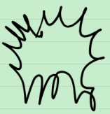
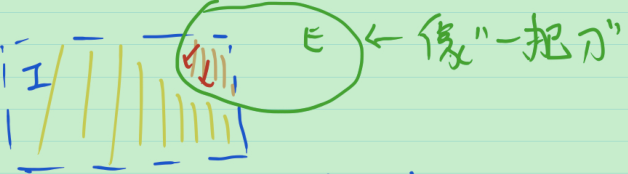

## 18_可测集的定义

"不足" 的测量 对应 内测度

"有余" 的测量 对应 外测度

当 内测度 = 外测度 时, 称集合可测.

外测度的定义: 用可数个开区间覆盖

内测度的定义: 对于有界集 $E\sub I$ ,  $E$ 将区间 $I$ 分为两部分: $E$ 和 $I-E$ . 定义 $m_*(E)=|I|-m^*(I-E)$ .

于是, 对于有界集 $E$ , 内测度 = 外测度 的条件可以转化为 $|I|=m^*(E)+m^*(I-E)$ .

直观上, 

$E$ 可测, 意味着 $E$ 的 "边" 不会太差, 不应该有太多"锯齿".

若这样定义, 随之而来会有两个问题:

1. 定义针对的是 $E$ 有界的情况, 对任何集合 $E$ 该怎样判断是否可测?
2. 有两个定义: 内测度和外测度

Carathéodory

1. $\mathbb{R}^n$ 中, 有界集合 $E$ 

   可测 $\Leftrightarrow$ 任取 $\mathbb{R}^n$ 中的开区间 $I$ , 有 $m^*(I)=m^*(I\cap E)+m^*(I\cap E^C)$ (1).

   直观上, 集合 $E$ "像一把刀", 把区间分为 $E$ 内的部分和 $E$ 外的部分, 刀很好, 锯齿不多, 刀口会很干净, 两个部分"面积"之和=原来的"面积".

   

   

2. (1)式没有用到 $E$ 有界, 用(1)式来对任何 $E\sub \mathbb{R}^n$ 定义可测. 仍不满足, 因此

3. 希望把 "可测" 推广到度量空间中!

   将外测度定义为在一些子集上的函数(集函数), 且满足非负性和次可数可加性.

   但度量空间中没有区间的概念, 因此(1)式并不适用于一般的度量空间. 可以定义如下条件: 

   对于任意的集合 $T$ , 有 $m^*(T)=m^*(T\cap E)+m^*(T\cap E^C)$ (2)

   与区间一样, 可以有直观的理解: 用 $E$ 像一把刀一样划分 $T$ , 刀 “很好” , 切出来的刀口 "很好" , 切出来的两部分的 "面积" 和 = 原来的 "面积" .

   将 $T$ 称为测试集合.

问: 在 $\mathbb{R}^n$ 中, 用 (1) 式 和 (2) 式定义的 "可测" 一样吗?

**定理** 在 $\mathbb{R}^n$ 中, 对于集合 $E$ , 以下两条性质等价.

1. 任取 $\mathbb{R}^n$ 中的开区间 $I$ , 有 $m^*(I)=m^*(I\cap E)+m^*(I\cap E^C)$ .
2. 对于任意的集合 $T$ , 有 $m^*(T)=m^*(T\cap E)+m^*(T\cap E^C)$ .

> 证: ( 1 $\Rightarrow$ 2 ) 由次可数可加性, $m^*(T)\le m^*(T\cap E)+m^*(T\cap E^C)$ , 
>
> 因此, 只需证 $m^*(T)\ge m^*(T\cap E)+m^*(T\cap E^C)$ .
>
> 由外测度的定义, $\forall \varepsilon >0$ , $\exist$ 开区间覆盖 $\{I_i\}$ , s.t. $m^*(T) > \sum_{i=1}^{\infty}|I_i|-\varepsilon$ . 
>
> 由 $(T\cap E)\sub \bigcup_{i=1}^{\infty} (I_i\cap E)$ 及外测度的单调性及次可数可加性, 得 $m^*(T\cap E)\le \sum_{i=1}^{\infty} m^*(I_i\cap E)$ . 类似地,  $m^*(T\cap E^C)\le \sum_{i=1}^{\infty} m^*(I_i'\cap E^C)$ . 两式相加得 $m^*(T\cap E)+m^*(T\cap E^C)\le \sum_{i=1}^{\infty} \left(m^*(I_i\cap E)+m^*(I_i\cap E^C)\right) \xlongequal[]{条件1} \sum_{i=1}^{\infty} \left(m^*(I_i)\right) \le m^*(T)+\varepsilon$ . 
>
> 由 $\varepsilon$ 的任意性, $m^*(T\cap E)+m^*(T\cap E^C)\le  m^*(T)$ . 
>
> ( 2 $\Rightarrow$ 1 ) 显然.
>
> 证毕.

再看一个等价条件.

是否可测? 看 $E$ 和 $E^C$ 把什么东西分成两部分, 看两部分的外测度之和和原外测度是否相等.

**定理** 对于集合 $E$ , 以下两条性质等价.

2. 对于任意的集合 $T$ , 有 $m^*(T)=m^*(T\cap E)+m^*(T\cap E^C)$ .

3. 任取 $A\sub E$ , 任取 $B\sub E^C$ , 有 $m^*(A)+m^*(B)=m^*(A\cup B)$ . (3)

> 证: ( 2 $\Rightarrow$ 3 ) 任取 $A\sub E$ , 任取 $B\sub E^C$ , 取 $T=A\cup B$ , 则 $m^*(A\cup B)=m^*((A\cup B)\cap E)+m^*((A\cup B)\cap E^C)=m^*(A)+m^*(B)$ . 
>
> ( 3 $\Rightarrow$ 2 ) 对于任意的集合 $T$ , 取 $A=T\cap E$ , $B=T\cap E^C$ , 则 $m^*(T\cap E)+m^*(T\cap E^C)=m^*(A)+m^*(B)=m^*(A\cup B)=m^*(T)$ .

**定义** (Carathéodory, 卡拉西奥多里) $E\sub \mathbb{R}^n$ , 称 $E$ 是L-可测的, 如果任取集合 $T\sub \mathbb{R}^n$ , 有 $m^*(I)=m^*(I\cap E)+m^*(I\cap E^C)$ . 此时, $E$ 的外测度称为 $E$ 的测度, 记为 $m(E)$ .

