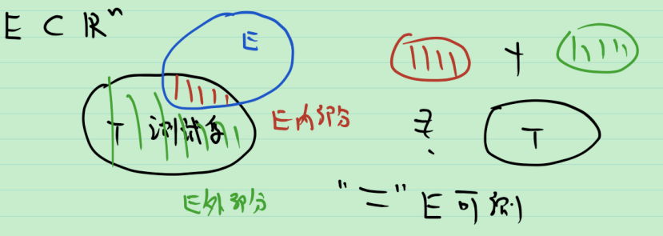
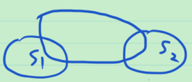

# 19_可测集的运算1

问: 

1. 有没有可测集?

   有可测集, $\varnothing$  和 $\mathbb{R}^n$ 都是可测集. 将可测集的全体称为可测集类, 记为 $\mathcal{M}$ .

2. 什么样的集合是可测集? 暂不回答.

3. 不可测集的例子? 暂不回答.

4. 可测集在集合运算下是否仍可测? 测度如何变化? 运算包括: 并(涉及可数可加性), 交, 余集, 差, 极限, 直积(以后看).

**定理** $S$ 可测 $\Leftrightarrow$ $S^C$ 可测.

由 $(S^C)^C=S$ , 得 $m^*(T)=m^*(T\cap S)+m^*(T\cap S^C)\Leftrightarrow m^*(T)=m^*(T\cap (S^C)^C)+m^*(T\cap S^C)$ . 证毕.

**定理** 若 $S_1$ , $S_2$ 均可测, 则 $S_1\cup S_2$ 可测.

> 证明思路: 如图所示, 取 $T$ 为测试集. 
>
> 132 = $T\cap (S_1\cup S_2)$ ;
>
> 4 = $T\cap (S_1\cup S_2)^C$ ;
>
> 13 = $T\cap S_1$ = $(T\cap (S_1\cup S_2))\cap S_1$ ;
>
> 24 = $T\cap S_1^C$ ;
>
> 2 = $(T\cap (S_1\cup S_2))\cap S_1^C$ = $(T\cap S_1^C)\cap S_2$ .
>
>  
>
> 想证 T = 132 ( $S_1\cup S_2$ 内 ) + 4 ( $S_1\cup S_2$ 外 )
>
>  T = 13 ( $S_1$ 内 ) + 24 ( $S_1$ 外 ) 这是由 $S_1$ 可测得到的.
>
> 132 = 13 ( $S_1$ 内 ) + 2 ( $S_1$ 外 ) 这是由 $S_1$ 可测得到的.
>
> 24 = 2 ( $S_2$ 内 ) + 4 ( $S_2$ 外 ) 这是由 $S_2$ 可测得到的.
>
> 证: 
> $$
> \begin{array}{l}
> m^*(T) &= m^*(T\cap S_1) + m^*(T\cap S_1^C) \\
> 	&= m^*((T\cap (S_1\cup S_2))\cap S_1) + m^*((T\cap S_1^C)\cap S_2) + m^*((T\cap S_1^C)\cap S_2^C) \\
> 	&= \underline{m^*((T\cap (S_1\cup S_2))\cap S_1) + m^*((T\cap (S_1\cup S_2))\cap S_1^C)} + m^*(T\cap (S_1\cup S_2)^C) \\
>     &= m^*(T\cap (S_1\cup S_2)) + m^*(T\cap (S_1\cup S_2)^C)
> \end{array}
> $$
> 于是 $S_1\cup S_2$ 可测. 证毕.

**定理** 设 $S_1$ , $S_2$ 是不相交的可测集, 则任取集合 $T$ , 有 $m^*(T\cap (S_1\cup S_2)) = m^*(T\cap S_1)+m^*(T\cap S_2)$ .

> 证: 因为 $T\cap S_1\sub S_1$ , $T\cap S_2\sub S_1^C$ .

取 $T=\mathbb{R}^n$ , 有如下推论. 

**推论** 设 $S_1$ , $S_2$ 是不相交的可测集, 则 $m^*(S_1\cup S_2) = m^*(S_1)+m^*(S_2)$ .

> **注** 这说明了测度对于两个集合有可加性.

根据以上各定理, 有如下推论.

**推论** 

1. 有限个可测集之并仍为可测集. 如果 $S_1,\cdots,S_k$ 是互不相交的可测集. 任取 $T$ , $m^*(T\cap (S_1\cup \cdots \cup S_k)) = m^*(T\cap S_1)+\cdots +m^*(T\cap S_k)$ . 特别地, $m^*(S_1\cup \cdots \cup S_k) = m^*(S_1)+\cdots +m^*(S_k)$ , 称为测度的有限可加性.

   > 证: 用数学归纳法

2. 有限个可测集之交仍为可测集.

   > 证: 由交和并的对偶性, 易证.

3. 若 $S_1$ , $S_2$ 可测, 则 $S_1-S_2$ 可测.

   > 证: $S_1-S_2=S_1\cap S_2^C$ .

   问题来了, 对于 $S_1\supset S_2$ , 是否有 $m(S_1-S_2)=m{(S_1)}-m{(S_2)}$ ? 下面开始讨论.

   由 $S_1=(S_1-S_2)\cup S_2$ , 且 $(S_1-S_2)\cap S_2=\varnothing$ , 根据有限可加性, 有 $m(S_1)=m{(S_1-S_2)}+m{(S_2)}$ .

   想移项, 不能随便移项, 因为移的东西 (即 $S_2$ 的测度) 可以等于 $\infty$ ! 虽然 $\infty = 1+\infty$ 成立, 但 $1=\infty-\infty$ 不成立.

   **反例** $\mathbb{R}$ 中, 设 $S_1=(1,+\infty)$ ,  $S_2=[2,+\infty)$ , 则 $S_1-S_2=(1,2)$ , $m(S_1-S_2)=1$ , 但 $m(S_1)=\infty$ , $m(S_2)=\infty$ . 不能做减法.

   加入测度有限的条件后, 得到如下定理.

   **定理** 若 $S_1$ , $S_2$ 可测, $S_1\supset S_2$ , $m(S_2)<\infty$ 则 $S_1-S_2$ 可测, 且 $m(S_1-S_2)=m{(S_1)}-m{(S_2)}$ .

启示: 移项时一定要看移的东西是否为 $\infty$ .

