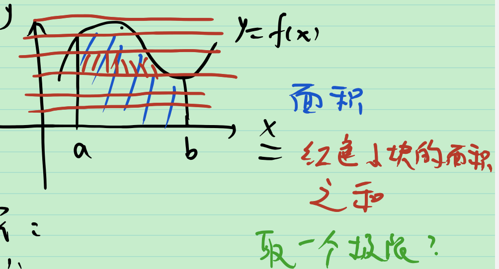

[在线LaTeX公式编辑器-编辑器 (latexlive.com)](https://www.latexlive.com/)

用书: 程其襄

视频: [《实变函数》用书是程其襄等编的书只讲实变部分_哔哩哔哩_bilibili](https://www.bilibili.com/video/BV1o7411N7qx)

$考试范围 = {书上内容} \cap {教学大纲} \cap {视频内容} 的真子集$

# 1_实变函数学什么

问题: 想计算面积

## 黎曼积分

1. 将[a, b] 划分成小区间
2. 面积 = 红色小块面积之和 ≈ 矩形面积之和
3. 取极限 面积 = 矩形面积之和的极限

黎曼积分的局限性

1. Dirichlet函数 $D(x)=
   \begin{cases}
    1 \quad x \in [0, 1] \cap \mathbb Q \\
    0 \quad x \in [0, 1] - \mathbb Q
   \end{cases}$ 不是黎曼可积的.

   然而 $D(x)$ 是可积函数列的极限, 下面加以说明.

   [0, 1] 中的有理数“排成一排”: $r_1, r_2, r_3, ..., r_n,...$

   令 $D_n(x)=
       \begin{cases}
       	1 \quad x \in [0, 1] \cap \{r_1, r_2, r_3, ..., r_n\} \\
       	0 \quad x \in [0, 1] - \{r_1, r_2, r_3, ..., r_n\}
       \end{cases}$

   $D_n(x)$ 是黎曼可积的, 且递增,有
   $$
   D(x) = \lim_{x \to \infty} D_n(x)
   $$

2. 积分和极限不能随便交换顺序, 条件复杂.

3. 黎曼积分中反常积分有点复杂, 如何向无穷区间推广?

4. 黎曼积分是在实数上的积分, 如何向其他空间去推广?

## 勒贝格积分

要研究

1. “红色小块”——集合
2. “红色小块”是实数中集合——欧式空间点集
3. “红色小块”的面积——测度&可测集
4. 什么样的 f 能算——可测函数
5. 新的方法计算面积——勒贝格积分(与黎曼积分做比较)
6. 微积分基本定理——不定积分与微分

**例** Dirichlet函数是勒贝格可积

> 积分 = 0 · ( [0, 1] 中无理数“长度” ) + 1 · ( [0, 1] 中有理数“长度” ) 

## 直观的看法: 数硬币

一枚一枚数: 黎曼积分

先把同样面值的硬币放在一起, 一堆一堆数: 勒贝格积分

