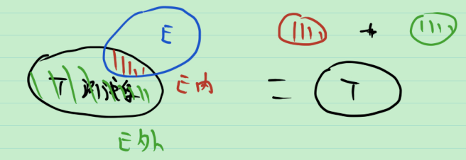
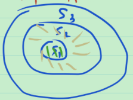

# 20_可测集的运算2

目标: 证明可测集类 $\mathcal{M}$ 对于至多可数并, 至多可数交, 余集, 差集, 极限是封闭的.

在上一节中, 已经证明了可测集类对于有限并, 有限交, 余集, 差集是封闭的. 在这一节中, 将证明可测集类对于可数并, 可数交, 极限是封闭的.

如下图, 想证 $E$ 可测, 要证 $m^*(T\cap E)+m^*(T\cap E^C)=m^*(T)$ . 

而由外测度的次可数可加性, $m^*(T\cap E)+m^*(T\cap E^C)\ge m^*(T)$ 自然成立, 故只需证 $m^*(T\cap E)+m^*(T\cap E^C)\le m^*(T)$ .

首先讨论可测集的可数并的情况.

> 分析: 要证可测集类对可数并封闭, 即已知 $\{S_i\}_{i=1}^{\infty}$ 可测, 想证 $\bigcup_{i=1}^{\infty} S_i$ 可测.
>
> 想证 任取 $T$ ,  $m^*(T)=m^*(T\cap (\bigcup_{i=1}^{\infty} S_i))+m^*(T\cap (\bigcup_{i=1}^{\infty} S_i)^C)$ . 
>
> 只需证 $m^*(T)\ge m^*(T\cap (\bigcup_{i=1}^{\infty} S_i))+m^*(T\cap (\bigcup_{i=1}^{\infty} S_i)^C)$ .
>
> 我们知道有限并的情况成立 $m^*(T)=m^*(T\cap (\bigcup_{i=1}^{k} S_i))+m^*(T\cap (\bigcup_{i=1}^{k} S_i)^C)$ .
>
> 而由外测度的单调性, 有 $m^*(T\cap (\bigcup_{i=1}^{k} S_i)^C)\ge m^*(T\cap (\bigcup_{i=1}^{\infty} S_i)^C)$ .
>
> > 想算 $m^*(T\cap (\bigcup_{i=1}^{k} S_i))$ , 一般情形: 不会!
> >
> > 当 $S_i$ 互不相交时, $m^*(T\cap (\bigcup_{i=1}^{k} S_i))=\sum_{i=1}^{k}m^*(T\cap S_i)$ .
>
> 于是当 $S_i$ 互不相交时, $m^*(T)\ge \sum_{i=1}^{k}m^*(T\cap S_i)+m^*(T\cap (\bigcup_{i=1}^{\infty} S_i)^C)$ .
>
> 等式两边对 $k$ 取极限, 得
> $$
> \begin{array}{c}
> m^*(T)&\ge \sum_{i=1}^{\infty}m^*(T\cap S_i)+m^*(T\cap (\bigcup_{i=1}^{\infty} S_i)^C)\\
> 	&\overset{次可数可加}{\ge}m^*(\bigcup_{i=1}^{\infty}(T\cap S_i))+m^*(T\cap (\bigcup_{i=1}^{\infty} S_i)^C) \\
> 	&=m^*(T\cap (\bigcup_{i=1}^{\infty} S_i))+m^*(T\cap (\bigcup_{i=1}^{\infty} S_i)^C)
> \end{array}
> $$
>
> 证毕.
> 

**定理** 已知 $\{S_i\}$ 是互不相交的可测集, 则 $\bigcup_{i=1}^{\infty} S_i$ 也是可测集, 且有  $m(\bigcup_{i=1}^{\infty} S_i)=\sum_{i=1}^{\infty}{m( S_i)}$ , 称之为可数可加性.

> 证: 先证 $\bigcup_{i=1}^{\infty} S_i$ 可测.
> $$
> \begin{array}{l}
> m^*(T)&=m^*(T\cap (\bigcup_{i=1}^{k} S_i))+m^*(T\cap (\bigcup_{i=1}^{k} S_i)^C) \\
> 	&\overset{单调性}{\ge} m^*(T\cap (\bigcup_{i=1}^{k} S_i))+m^*(T\cap (\bigcup_{i=1}^{\infty} S_i)^C) \\
> 	&= \sum_{i=1}^{k}m^*(T\cap S_i)+m^*(T\cap (\bigcup_{i=1}^{\infty} S_i)^C)
> \end{array}
> $$
> 等式两边取极限, 得到 
> $$
> \begin{array}{c}
> m^*(T)&\ge \sum_{i=1}^{\infty}m^*(T\cap S_i)+m^*(T\cap (\bigcup_{i=1}^{\infty} S_i)^C)\\
> 	&\overset{次可数可加}{\ge}m^*(\bigcup_{i=1}^{\infty}(T\cap S_i))+m^*(T\cap (\bigcup_{i=1}^{\infty} S_i)^C) \\
> 	&=m^*(T\cap (\bigcup_{i=1}^{\infty} S_i))+m^*(T\cap (\bigcup_{i=1}^{\infty} S_i)^C)
> \end{array}
> $$
> 而 $m^*(T) \overset{次可数可加}{\le}m^*(\bigcup_{i=1}^{\infty}(T\cap S_i))+m^*(T\cap (\bigcup_{i=1}^{\infty} S_i)^C)$ 
>
> 故 $m^*(T) = m^*(\bigcup_{i=1}^{\infty}(T\cap S_i))+m^*(T\cap (\bigcup_{i=1}^{\infty} S_i)^C)$ .
>
> 故 $\bigcup_{i=1}^{\infty} S_i$ 可测.
>
> 在 $m^*(T)\ge \sum_{i=1}^{\infty}m^*(T\cap S_i)+m^*(T\cap (\bigcup_{i=1}^{\infty} S_i)^C)$ 中, 令 $T=\bigcup_{i=1}^{\infty} S_i$ , 则 $T\cap S_i=S_i$ , 故 $m^*(\bigcup_{i=1}^{\infty} S_i)\ge \sum_{i=1}^{\infty}m^*(S_i)$ , 即 $m(\bigcup_{i=1}^{\infty} S_i)\ge \sum_{i=1}^{\infty}m(S_i)$ 而由次可数可加性, 有 $m(\bigcup_{i=1}^{\infty} S_i)\le \sum_{i=1}^{\infty}m(S_i)$ , 故 $m(\bigcup_{i=1}^{\infty} S_i) = \sum_{i=1}^{\infty}m(S_i)$ .

对于一般的集合列的可数并, 有如下定理.

**定理** 若 $\{S_i\}_{i=1}^{\infty}$ 是可测集, 则 $\bigcup_{i=1}^{\infty} S_i$ 也是可测集.

> 证: 令 $S_0=\varnothing$ ,  $\tilde{S_i}=S_i-\bigcup_{k=1}^{i-1}S_k, i\ge 1$ . 则 $\bigcup_{i=1}^{\infty} S_i=\bigcup_{i=1}^{\infty} \tilde{S_i}$ ,  $\{S_i\}_{i=1}^{\infty}$ 为互不相交的可测集 (可测是因为其由 $S_i$ 的差与有限并得到).
>
> 于是 $\bigcup_{i=1}^{\infty} \tilde{S_i}$ 可测 , 即 $\bigcup_{i=1}^{\infty} S_i$ 可测.
>
> 

从而知道了可测集的可数交的情况.

**推论** 若 $\{S_i\}_{i=1}^{\infty}$ 是可测集, 则 $\bigcap_{i=1}^{\infty} S_i$ 也是可测集.

> 证: 利用 De Morgan 律, 即 $(\bigcap_{i=1}^{\infty} S_i)^C=\bigcup_{i=1}^{\infty} S_i^C$ .

下面讨论可测集列的极限.

**定理** 若 $\{S_i\}_{i=1}^{\infty}$ 是递增的可测集列, 则 $\lim_{i\to \infty} S_i$ 也是可测集, 且有 $m(\lim_{i\to \infty} S_i)=\lim_{i\to \infty} m(S_i)$ . 

> **注** 定理说明测度和极限可以交换次序.
>
> 证: 由递增的条件, $\lim_{i\to \infty} S_i = \bigcup_{i=1}^{\infty} S_i$ , 因此可测. 
>
> > 如何算其测度? 目前只会算不相交的情况.
>
> 令 $S_0=\varnothing$ ,  $\tilde{S_i}=S_i-S_{i-1}, i\ge 1$ . 则 $\{S_i\}_{i=1}^{\infty}$ 为互不相交的可测集, $\lim_{i\to \infty} S_i = \bigcup_{i=1}^{\infty} S_i=\bigcup_{i=1}^{\infty} \tilde{S_i}$ . 故
> $$
> \begin{array}{l}
> m(\lim_{i\to \infty} S_i) 
> = m(\bigcup_{i=1}^{\infty} \tilde{S_i}) 
> = \sum_{i=1}^{\infty} m(\tilde{S_i}) 
> = \sum_{i=1}^{\infty} m(S_i-S_{i-1}) \\
> = \lim_{k\to \infty} \sum_{i=1}^{k} m(S_i-S_{i-1})
> \xlongequal[]{有限可加} \lim_{k\to \infty} m\left(\sum_{i=1}^{k}(S_i-S_{i-1})\right) \\
> = \lim_{k\to \infty} m(S_k) 
> = \lim_{i\to \infty} m(S_i)
> \end{array}
> $$
> 
>
> 证毕.

**定理** 若 $\{S_i\}_{i=1}^{\infty}$ 是递减的可测集列, 则 $\lim_{i\to \infty} S_i$ 也是可测集, 且当 $m(S_1)<\infty$ 时, 有 $m(\lim_{i\to \infty} S_i)=\lim_{i\to \infty} m(S_i)$ . 

> 证: 由递减的条件, $\lim_{i\to \infty} S_i = \bigcap_{i=1}^{\infty} S_i$ , 因此可测. 
>
> 定义 $\tilde{S_i}=S_1-S_i$ 显然 $\{\tilde{S_i}\}_{i=1}^{\infty}$ 是递增列.
>
> 因此 
> $$
> \lim_{i\to \infty} m(S_1-S_i)=m(\lim_{i\to \infty} (S_1-S_i))\xlongequal{集合运算的分配律} m(S_1-\lim_{i\to \infty} S_i)
> $$
>
> > 差集的测度我们也会, $A\sub B$ , $m(B)<\infty$ , 则 $m(A-B)=m(A)-m(B)$ .
>
> 由 $m(S_1)<\infty$ , 得 $m(S_i)<\infty$ .
> $$
> m(S_1)-\lim_{i\to \infty} m(S_i) = \lim_{i\to \infty} (m(S_1)-m(S_i)) \\
> \xlongequal{m(S_i)<\infty } \lim_{i\to \infty} m(S_1-S_i)  
> \xlongequal{S_1-S_i递增} m(\lim_{i\to \infty} (S_1-S_i)) \\
> \xlongequal{集合运算的分配律} m(S_1-\lim_{i\to \infty} S_i)
> \xlongequal{m(S_i)<\infty } m(S_1)-m(\lim_{i\to \infty}S_i)
> $$
> 由 $m(S_1)<\infty$ , 故可以对 $S_1$ 移项, 
>
> 从而 $\lim_{i\to \infty} m(S_i) = m(\lim_{i\to \infty}S_i)$ . 证毕.

思考: $m(S_1)<\infty$ 能换成其他条件吗?

**注** $m(S_1)<\infty$ 条件不能省略.

反例: 令 $S_n=(n,\infty)$ , 则 $S_1\supset S_2\supset \cdots$ . 于是 $\lim_{i\to \infty} S_n=\bigcap_{i\to \infty} S_n=\varnothing$ , 从而 $m(\lim_{i\to \infty} S_n)=0$ , 但由 $m(S_n)=+\infty $ , $\lim_{n\to \infty} m(S_n)=+\infty$ .

书上习题: 对于一般的集合列 ${S_i}_{i=1}^{\infty}$ , 则可测集合有上下极限, 其测度也有上下极限, 则有如下关系成立.
$$
m(\varliminf_{i\to \infty} S_i)\le \varliminf_{i\to \infty} m(S_i)\le \varlimsup_{i\to \infty} m(S_i) \overset{需要条件 m (\bigcup_{i=1}^{\infty} S_i)<\infty}{\le } m(\varlimsup_{i\to \infty} S_i)
$$
思考: 最右边不等号成立的条件可以改吗?

