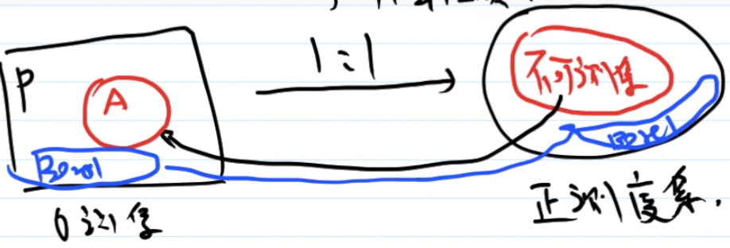
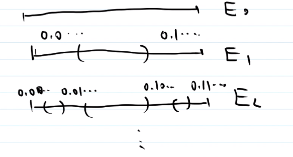

# 26_连续函数&Cantor函数&Borel集

目标: 构造非 Borel 集的可测集.

可测集类 = Borel 集和零测集生成的 $\sigma$ 代数.

零测集的例子:

1. 至多可数个点的集合
2. Cantor集 (作业) , Cantor集的任一子集

想法: 

1. 只需找一个非 Borel 集的零测集. 想在 Cantor 集的子集中找这样的非 Borel 集.

2. 如果从零测集 P 到正测度集的映射 $f$ 具有如下性质:

   

   1. 一一映射
   2. 把 P 映成 正测度集
   3. 保持 Borel 集还是 Borel 集

   则若 $A$ 的像不可测, 则 $A$ 是不是 Borel 集.

## 连续函数的性质

$f:\mathbb{R}\to \mathbb{R}$ 为连续函数 $:\Leftrightarrow$ $\forall x_0\in \mathbb{R}, \forall \varepsilon > 0, \exist \delta >0, \underline{|x-x_0|<\delta 时, |f(x)-f(x_0)|<\varepsilon }$ .  

> 划线部分用集合方法可写为 $U(x_0,\delta )\sub f^{-1}\left(\, \left( f(x_0)-\varepsilon,f(x_0)+\varepsilon \right)\, \right)$ .

$f:\mathbb{R}\to \mathbb{R}$ 为连续函数 $\Leftrightarrow$ $\forall$ 开集 $V\in \mathbb{R}$ , $f^{-1}(V)\sub R$ 仍为开集. (即连续 $\Leftrightarrow$ 任一开集的原像是开集)

> 证: " $\Leftarrow$ ": 显然.
>
>  " $\Rightarrow$ ": 
>
> 当 $f^{-1}(V)=\varnothing$ 时, $\varnothing$ 是开集.
>
> 当 $f^{-1}(V)\ne \varnothing$ 时, $\forall x_0\in f^{-1}(V)$ , 即 $f(x_0)\in V$ , 
>
> 由 $V$ 是开集, 得 $\exist\varepsilon >0$, s.t. $(\, f(x_0)-\varepsilon, f(x_0)+\varepsilon \,)\sub V$ , 
>
> 于是 $f^{-1}(\, (f(x_0)-\varepsilon, f(x_0)+\varepsilon) \,)\sub f^{-1}(V)$ .
>
> $\exist \delta >0, s.t. U(x_0, \delta) \sub f^{-1}(\, (f(x_0)-\varepsilon, f(x_0)+\varepsilon) \,)\sub f^{-1}(V)$ , 即 $f^{-1}(V)$ 是开集.

推广到一般的拓扑空间, 连续映射的定义如下: 

已知映射 $f: X\to Y$ 的, 如果 $Y$ 中任一开集的原像是 $X$ 中的开集, 则称 $f$ 为连续映射.

> 类似于一维情况, 之前在数学分析中的 $\mathbb{R}^n\to \mathbb{R}^n$ 的连续映射的定义也与上述定义等价的. 

$X$ 是一个拓扑空间, 若 $A\sub X$ , 则在 $A$ 上面有子空间拓扑: $A$ 的所有开集是 $X$ 的所有开集与 $A$ 相交得来. 随之可以定义 $f:A\to Y$ 的连续性, 事实上, 子空间拓扑上连续性等价于: $\forall $ 开集 $V\sub Y$ , 有 $f^{-1}(V)=U\cap A$ , 其中 $U$ 为 $X$ 中的开集.

连续函数能把 Borel 集映成 Borel 集吗? 答: 不一定!

**引理** 对于连续函数 $f:\mathbb{R}\to \mathbb{R}$ , Borel 集的原像仍是 Borel 集.

> 证: 
>
> **引理的引理** 设 $f:E\sub \mathbb{R}\to \mathbb{R}$ 为任意函数, 则取 $\mathbb{R}$ 中的一个 $\sigma$ 代数 $\Sigma$ , 使 $E\in \Sigma$ , 则 $\mathcal{A}=\{X\sub \mathbb{R}:f^{-1}(X)\in \Sigma \}$ 是 $\sigma$ 代数.
>
> > 证: 
> >
> > 1. 由 $f^{-1}(\mathbb{R})=E\in \Sigma$ , 知 $\mathbb{R} \in \mathcal{A}$ ;
> > 2. 如果 $X_i\in \mathcal{A}$ , 即 $f^{-1}(X_i)\in \Sigma$ , 则 $f^{-1}(\bigcup_{i=1}^{\infty}X_i)=\bigcup_{i=1}^{\infty}f^{-1}(X_i)\in \Sigma$ , 即 $\bigcup_{i=1}^{\infty}X_i\in \mathcal{A}$ .
> > 3. 如果 $X\in \mathcal{A}$ , 即 $f^{-1}(X)\in \Sigma$ , 则 $f^{-1}(X^C)=E-f^{-1}(X)\in \Sigma$ , 即 $X^C\in \mathcal{A}$ .
> >
> > 综上, $\mathcal{A}$ 是 $\sigma$ 代数.
>
> 由引理的引理知道, 如果  $f:\mathbb{R}\to \mathbb{R}$ 连续, $\Sigma$  是 $\mathbb{R}$ 中的 Borel $\sigma$ 代数, 则 $\mathcal{A}=\{X\sub \mathbb{R}:f^{-1}(X)\in \Sigma \}$ 是 $\sigma$ 代数. 而 $开集\in \mathcal{A}$ (由开集的原像是开集) ,  Borel $\sigma$ 代数是由开集生成的最小的 $\sigma$ 代数, 因此 Borel $\sigma$ 代数 $\sub \mathcal{A}$ .

由引理知道, 找把 Borel 集映成 Borel 集的函数, 只需找使 $f^{-1}$ 连续的函数 $f$ . 

小结: 要找 $f$ , 满足

1. 把 $P$ 映成正测度
2. 一一对应
3. $f^{-1}$ 连续

为此有 Cantor 函数.

## Cantor 函数

如上图所示, Cantor 集 P 中的点对应于 [0,1] 中的二进制小数(如 $0.101101\cdots$ ) , 于是存在满射 $P\to [0,1]$ . 想将其延拓到 [0,1] 上, 成为 $f:[0,1]\to [0,1]$ . 对于 $x\in [0,1]-P$ , 由于 $P$ 是挖掉可数个构成区间所得到, 因此 $x$ 一定落在某一个构成区间中, 设 $x\in (\alpha, \beta)$ 定义 $f(x)=f(\alpha)$ , 则 $f(x)=\sup\{f(y):y\in P, y<x \}$ . 称这样得到的函数为 Cantor 函数.

以下两点说明 $f$ 是连续的.

1. $f$ 是递增函数, 因此只有第一类间断点;
2. $f$ 是满射, $f$ 递增, 因此不可能由第一类间断点. 

此外, 在所有的构成区间上, 函数值相等, 因此 $f$ 不是单射.

接下来在 Cantor 函数的基础上构造一个 1:1 映射.

定义 $F(x):=\frac{1}{2} (f(x)+x)\in[0,1]$ . 这是一个严格增函数, 是满射, 是连续函数, 是一一映射. 满足**第一条**.

因此 $F^{-1}:[0,1]\to [0,1]$ 是一一映射. 此外,  $F^{-1}$ 是连续的(也是由满射且递增推出), **满足第三条**.

下面看 $F(P)$ 是正测度集吗?

对于 $\forall (\alpha, \beta)\sub [0,1]-P$ , $\forall x\in (\alpha, \beta)$ $f(x)=f(\alpha)$ 为常值. $F(x)=\frac{1}{2} (f(x)+x)=\frac{1}{2} (f(\alpha)+x)$ . 

不难验证 $F((\alpha, \beta))$ 为开集.

$m(F((\alpha, \beta)))=\frac{1}{2}(\beta -\alpha )$ . 

又 $\Sigma_{(\alpha, \beta)是构成区间} (\beta-\alpha)=1$ ,

于是 $m(F([0,1]-P))=1-\frac{1}{2}=\frac{1}{2}$ ,

从而 $m(F(P))=1-\frac{1}{2}=\frac{1}{2}$ , 因此 $F(P)$ 是正测度集.

在 $F(P)$ 中找一个不可测集 $X$ , 则 $A=F^{-1}(X)\sub P$ 是零测集, 但不是 Borel 集. 

**总结**

1. 连续函数是什么
2. Cantor 函数是什么
3. 想找函数 $F:[0,1]\to [0,1]$ .
   1. $F$ 是1-1 对应的;
   2. $F(P)$ 是正测度集, 即把康托集映成正测度集;
   3. $F^{-1}$ 是连续的.

