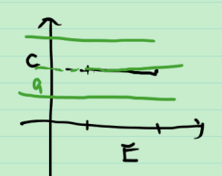

# 30_可测函数的运算(四则运算绝对值)

想知道如果 $f,g:E\to \mathbb{R}\cup\{-\infty ,+\infty \}$ 可测, 那么 $f+g,f-g,f\cdot g,\frac{f}{g}$ 是否也可测?

分三步去解决这个问题. 关于可测函数, 现在只知道定义. 

另外, $|f|$ 可测吗?

## 1. 常值函数

常值函数 $g:E\to \mathbb{R}\cup\{-\infty,+\infty\}\\ x\mapsto g(x)\equiv C\in \mathbb{R}$  是可测函数.

证: 

$\forall a\in \mathbb{R}$ , $E[f>a]=\begin{cases}E,a<C\\ \varnothing, a\ge C\end{cases}$ 为可测集, 由可测函数的定义,  $g$ 可测.

两个常值函数的四则运算仍是常值函数, 因此仍可测.

## 2. 可测函数与常值函数的四则运算

对于可测函数 $f:E\to \mathbb{R}\cup\{-\infty ,+\infty \}$ , 常值函数 $g:E\to \mathbb{R}\cup\{-\infty,+\infty\}\\ x\mapsto g(x)\equiv C\in \mathbb{R}$ , $f+C,f-C,f\cdot C,\frac{f}{C}$ 可测吗? 

> 分析: 只需讨论 $f+C$ 和 $f\cdot C$ 的情况.

用定义去看.

$\forall a>0$ , $E[f+C>a]=E[f>a-C]$ 是可测集, 因此 $f+C$ 可测.

$C\ne 0$ 时, $E[f\cdot C>a]=\begin{cases}E[f>\frac{a}{c}],C>0\\ E[f<\frac{a}{c}],C<0 \end{cases}$ 是可测集.

$C = 0$ 时, $f\cdot C$ 是常值函数, 可测.

综上, $f\cdot C$ 可测.

总结: 若 $f:E\to \mathbb{R}\cup\{-\infty ,+\infty \}$ 可测, 则 $f+C,f\cdot C$ 可测, 进而 $f-C,\frac{f}{C}$ 可测.

## 3. 可测函数之间的四则运算

已知 $f,g:E\to \mathbb{R}\cup\{-\infty ,+\infty \}$ 可测, 那么 $f+g,f-g,f\cdot g,\frac{f}{g}$ 是否也可测?

> 分析: 由 $f-g=f+(-1)\cdot g$ , $\frac{f}{g}=f\cdot \frac{1}{g}$ , 只要说明 $f+g$ , $f\cdot g$ , $\frac{1}{g}$ 是可测的, 那么四则运算得到的函数是可测的.

先证 $\frac{1}{g}$ 可测. 需要讨论 $E[\frac{1}{g}>a]$ .

当 $g>0$ 时, 得到 $ag<1$ ,

1. $a>0$ 时, $g<\frac{1}{a}$ ;
2. $a=0$ 时, $g\ne +\infty$ ;
3. $a<0$ 时, $g>\frac{1}{a}$ , 总成立.

当 $g<0$ 时, 得到 $ag>1$ ,

1. $a>0$ 时, $g>\frac{1}{a}$ , 不成立;
2. $a=0$ 时, 也不成立;
3. $a<0$ 时, $g<\frac{1}{a}$ .

将各情况综合, 得到
$$
E[\frac{1}{g}>a] = \begin{cases}
E[g>0]\cap E[g<\frac{1}{a}] \\
E[g>0]\cap E[g\ne +\infty] \\
E[g>0]\cup E[g<\frac{1}{a}]
\end{cases}
$$
其为可测集. 于是 $\frac{1}{g}$ 可测. 证毕.

接下来证 $f+g$ 可测.

**引理** 若 $f,g:E\to \mathbb{R}\cup\{-\infty ,+\infty \}$ 可测, 则 $E[f>g]$ 是可测集.

> 证:  .assets/image-20211223172244311.png)
>
> > $\forall a$ , 有 $(E[f>a]\cap E[g<a])\sub E[f>g]$ . 左边这些集合以 $a$ 为指标的并集与右边集合相等. 而可测集的任意并不一定是可测集, 需要将数量减小为可数个.
>
> 一方面, $\forall x\in E[f>g]$ , 即 $f(x)>g(x)$ , 总能找到 $r\in \mathbb{Q}$ , s.t. $f(x)>r>g(x)$ , 即 $x\in E[f>r]\cap E[g<r]$ , 于是 $E[f>g]\sub \bigcup_{r\in \mathbb{Q}}(E[f>r]\cap E[g<r])$ .
>
> 另一方面, $\forall x\in \bigcup_{r\in \mathbb{Q}}(E[f>r]\cap E[g<r])$ , $\exist r\in \mathbb{Q}$ , 使 $x\in E[f>r]\cap E[g<r]$ , 从而 $f(x)>g(x)$ , 即 $\forall x\in E[f>g]$ , 于是 $E[f>g]\sub \bigcup_{r\in \mathbb{Q}}(E[f>r]\cap E[g<r])$ .
>
> 综上, $E[f>g] = \bigcup_{r\in \mathbb{Q}}(E[f>r]\cap E[g<r])$ , 这就将 $E[f>g]$ 写成了可数个可测集的并, 仍是可测集. 证毕.

> **注** $E[f\ge g]=(E[f<g])^C=(E[g>f])$ 也是可测集.

由引理, $E[f+g>a]=E[f>a-g]$ , 又 $a-g$ 是可测函数, 于是  $E[f+g>a]$ 是可测集. 从而 $f+g$ 可测.

最后证 $f\cdot g$ 可测.

书上将 $E[f\cdot g>a]$ 分为若干种情况, 有些复杂. 这里我们采用另一种方法. 还是采用从特殊到一般, 转化与化归的思想.

结合二次型的知识, 交叉项可以写成平方项之差的形式, 我们有 $f\cdot g=\frac{1}{4}((f+g)^2-(f-g)^2)$ .

因此转化为只需看 $f^2$ 可测.
$$
E[f^2>a]=\begin{cases}
E, a<0 \\
E[f>\sqrt{a}]\cup E[f<-\sqrt{a}], a\ge 0
\end{cases}
$$
于是 $f^2$ 可测. 因此 $f\cdot g$ 可测. 证毕. 

至此, 我们证明了, 可测函数进行有限次四则运算仍是可测函数.

## 4. 可测函数的绝对值运算

若 $f$ 是 $E$ 上的可测函数, $|f|$ 可测吗? 

类似于上面的证法, $\forall a\in \mathbb{R}$ , 
$$
E\{|f|>a\}=
\begin{cases}
E, a<0 \\
E[f>a]\cup E[f<-a], a\ge0
\end{cases}
$$
仍为可测集, 因此 $|f|$ 可测.

**总结** 可测函数进行有限次四则运算, 绝对值运算, 仍是可测函数.

