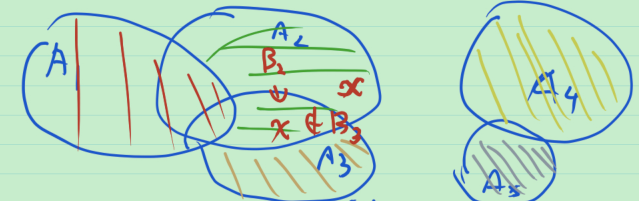
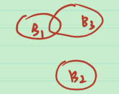
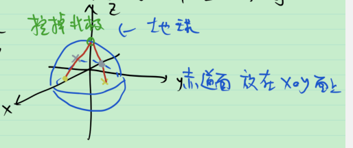

# 32_第一章习题课

1. 为什么空集 $\varnothing$ 是任何一个集合的子集?

   > 空集: 什么都没有, 记为 $\varnothing$ .
   >
   > 子集: 若 $\forall x\in B, x\in A$ , 则称 $B$ 是 $A$ 的子集, 记为 $B\sub A$ .
   >
   > 逻辑学中有一个术语, 叫vacuous truth: 空虚的真实. 空集中什么都没有, 空集中的任意元素能满足任意性质.

2. 命题中的 "任意" 对应于集合的 "交"; 命题中的 "存在" 对应于集合的 "并".

   > 用一个例子来看.
   >
   > $\{x:\{f_n(x)\}有界\}$ , " $\{f_n(x)\}有界$ " 是一个命题, $\{x:\{f_n(x)\}有界\}$ 即为满足这个命题的所有元素的集合, 因此可以写为
   > $$
   > \{x:\exist M\in \mathbb{R}^+, \forall n\ge 1, |f_n(x)|<M \}
   > \xlongequal{将\mathbb{R}^+看成指标集} \bigcup_{M\in \mathbb{R}^+}\{x:\forall n\ge 1, |f_n(x)|<M \} \xlongequal{将n看成指标} \bigcup_{M\in \mathbb{R}^+}\bigcap_{n\ge 1}\{x:|f_n(x)|<M \}
   > $$

3. 对于集合列 $\{A_n\}$ , 定义 $B_1=A_1$ , $B_n=A_n-(\bigcup_{v=1}^{n-1} A_n), \forall n>1$ . 则 $\{B_n\}$ 互不相交,  $\bigcup_{v=1}^n A_v\supset \bigcup_{v=1}^n B_v,\forall n\in \mathbb{Z}^+$ 且 $\bigcup_{v=1}^{\infty} A_v=\bigcup_{v=1}^{\infty} B_v$ .

   > 证: 有时为了叙述方便, 定义 $A_0=\varnothing$ , $B_1=A_1-A_0$ , 这样就有统一的形式 $B_n=A_n-(\bigcup_{v=1}^{n-1} A_n), \forall n>0$ .
   >
   > 先证$\{B_n\}$ 互不相交
   >
   > 
   >
   > $\forall i,j$ , $B_i\cap B_j=(A_i-\bigcup_{v=1}^{i-1} A_v)\cup (A_j-\bigcup_{v=1}^{j-1} A_v)$ , 于是 $(A_i-\bigcup_{v=1}^{i-1} A_v)\sub A_i$ , 而  $\bigcup_{v=1}^{j-1} A_v\supset A_i$ , 于是 $B_i\cap B_j=\varnothing$ .
   >
   > > 注：只有 $B_n\cap B_{n+1}=\varnothing$ 并不能说明 $\{B_n\}$ 互不相交, 如下图所示. 
   > >
   > > 
   >
   > 接下来证 $\bigcup_{v=1}^n A_v\supset \bigcup_{v=1}^n B_v,\forall n\in \mathbb{Z}^+$ 且 $\bigcup_{v=1}^{\infty} A_v=\bigcup_{v=1}^{\infty} B_v$ .
   >
   > 由 $A_v\bigcup B_v$ ,  得 $\bigcup_{v=1}^n A_v\supset \bigcup_{v=1}^n B_v$ . 
   >
   > $\forall x\in \bigcup_{v=1}^n A_n$ , $\exist i\in \{1,\cdots,n\}$ , s.t. $x\notin A_{j},0\le j\le i-1$ , 但 $x\in A_i$ .
   >
   > 即 $x\in A_i-(\bigcup_{v=1}^{i-1} A_i)=B_i$ , 于是 $x\in \bigcup_{v=1}^n B_v$ . 
   >
   > 综上, $\bigcup_{v=1}^n A_v = \bigcup_{v=1}^n B_v$ .
   >
   > 对两边取极限, 从而 $\bigcup_{v=1}^{\infty} A_v=\bigcup_{v=1}^{\infty} B_v$ . 证毕.

4. 求证 $\{x:f(x)>g(x)\}=\bigcup_{n=1}^{\infty}\{x:f(x)>g(x)+\frac{1}{n}\}$ .

   > 注: 错误证明示例. $\{x:f(x)>g(x)+\frac{1}{n}\}$ 是递增的集合列, 因此 $\bigcup_{n=1}^{\infty}\{x:f(x)>g(x)+\frac{1}{n}\}=\lim_{n\to \infty} \{x:f(x)>g(x)+\frac{1}{n}\}\xlongequal{没有道理}\{x:f(x)>g(x)\}$ . 第二个等号没有道理是因为集合的极限和数列的极限不是一回事.
   >
   > 证: 经过移项, 可以得到原命题的等价命题, 电子版教材第8页例5. 即 $\{x:f(x)>0\}=\bigcup_{n=1}^{\infty}\{x:f(x)>\frac{1}{n}\}$ . 下面证明上式成立.
   >
   > 用左边包含于右边, 且右边包含于左边.
   >
   > 右 $\sub$ 左: 这是显然的.
   >
   > 左 $\sub$ 右: 这是因为 $\frac{1}{n}$ 可以任意小. 

   虽然集合的极限和数列的极限不是一回事, 但有如下的关系.
   $$
   \{x:\sup_n f_n(x)\le C \}=\bigcap_{n=1}^{\infty}\{x:f_n(x)\le C\} \\
   \{x:\sup_n f_n(x)>C\}=\bigcup_{n=1}^{\infty}\{x:f_n(x)>C\} \\
   \{x:\inf_n f_n(x)<C\}=\bigcup_{n=1}^{\infty}\{x:f_n(x)<C\} \\
   \{x:\inf_n f_n(x)\ge C\}=\bigcap_{n=1}^{\infty}\{x:f_n(x)\ge C\}
   $$

5. 若 $f_n(x)\le f_{n+1}(x),\forall x\in E$ , $A_n=\{x:f_n(x)>C\}$ , 则 $\{A_n\}$ 是单调递增的集合列, 且 $\lim_{n\to \infty}A_n=\{x:\lim_{n\to \infty}f_n(x)>C\}$ .

   > 证: 显然, $\{A_n\}$ 是单调递增的集合列.
   >
   > 于是 $\lim_{n\to \infty}A_n=\bigcup_{n=1}^{ \infty}A_n=\{x:\sup_n f_n(x)>C\}=\{x:\lim_{n\to \infty}f_n(x)>C\}$ .

6. 球面挖掉一点与平面对等.

   > 证: 用球极投影的方法. 将单位球的中心放在 $O$ 点, 赤道面放在 $xOy$ 平面上, 挖掉北极点, 对于挖掉北极点的球面上的任意一点, 作北极点与该点的连线, 交 $xOy$ 平面于唯一点. 反过来, 平面上的任意一点与北极点的连线也会与挖掉北极点的球面有唯一的交点. 即, 平面上的任意一点与挖掉北极点的球面一一对应. 这就证明了球面挖掉一点与平面对等. 可以写出其解析表达式.
   >
   > 
   >
   > 对于球面 $x^2+y^2+z^2=1$ , 挖掉北极点 $(0,0,1)$ , 球面上任意一点 $(x,y,z)$ $\mapsto$ $xOy$ 面上唯一的点 $(\frac{x}{1-z},\frac{y}{1-z},0)$ . 反过来,  $xOy$ 面上任意一点 $(u,v,0)$ $\mapsto$ 球面上唯一的点 $(\frac{2u}{1+u^2+v^2},\frac{2v}{1+u^2+v^2},\frac{u^2+v^2-1)}{1+u^2+v^2)})$ . 两者互为逆映射.

7. 对于 $E_n=\{\frac{m}{n}:m\in \mathbb{Z} \},n=1,2,\cdots$ , 则 $\varlimsup_{n\to \infty}E_n=\mathbb{Q}$ .

   > 证: $\varlimsup_{n\to \infty}E_n=\bigcap_{n=1}^{\infty}\bigcup_{k=n}^{\infty} E_k=\{x:存在无穷多个E_n, 使x\in E_n\}$ .
   >
   > 显然 $\varlimsup_{n\to \infty}E_n\sub \mathbb{Q}$ , 另一方面, 
   >
   > $\forall x=\frac{p}{q}\in \mathbb{Q}, p\in \mathbb{Z}, q\in \mathbb{Z}^+, (p,q)=1(互素)$ , 有 $x\in E_q$ , 从而 $x\in E_{2q}$ (由于 $x=\frac{2p}{2q}$ ), $\cdots$ , $x\in E_{mq}$ (由于 $x=\frac{mp}{mq}$ ), $\cdots$ .
   >
   > 从而 $x$ 属于无穷多个 $E_n$ , 即 $x\in \varlimsup_{n\to \infty}E_n$ . 从而 $\varlimsup_{n\to \infty}E_n\supset \mathbb{Q}$ .
   >
   > 证毕.

8. {全校大学生} 与 {全国大学生} 对等吗? 答案是否定的.

   > 当 $m\ne n$ ( m, n 是正整数 ) 时, 集合 $\{1,2,\cdots,m\}$ 与集合 $\{1,2,\cdots,n\}$ 不对等.

9. {超越数的全体} 和 $(0,1)$ 对等.

   > 证: {超越数的全体} = $\mathbb{R}-$ {代数数的全体} . 而 {代数数的全体} 是一个可数集. 而  $\overline{\overline{\mathbb{R}- \{可数集的全体\}}} \le \bar{\bar{R}}$ , 另一方面, $\overline{\overline{\mathbb{R}- \{可数集的全体\}}} \ge \overline{\overline{(0,1)}}$ , ( 这是因为可以取可数集在 $(0,1)$ 之外, 如取为 $\mathbb{R}-\{100,101,\cdots\}$ ) . 由 Bernstein 定理, $\overline{\overline{\mathbb{R}- \{可数集的全体\}}} = \overline{\overline{(0,1)}}$ . 证毕.

