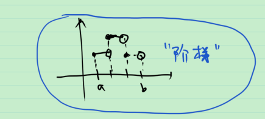

# 33_可测函数的例子

**例1** $\mathbb{R}^n$ 中可测集 $E$ 上常值函数是可测函数.

> 证: 见 "30_可测函数的运算(四则运算绝对值)"

**例2** $\mathbb{R}^n$ 中可测集 $E$ 上的连续函数是可测函数.

> 证: 连续函数, 即开集的原像是可测集.
>
> $E\in \mathbb{R}^n$ 中的开集 $V=U\cap E$ , 其中 $U$ 是 $\mathbb{R}^n$ 中的开集.
>
> $\forall a\in \mathbb{R}$ , $E[f>a]=E\cap f^{-1}((a,+\infty])$ , 由 $(a,+\infty]$ 是开集, 因此, $f^{-1}((a,+\infty])$ 是 $\mathbb{R}^n$ 中的开集, 是可测集. 又 $E$ 是可测集, 因此 $E\cap f^{-1}((a,+\infty])$ 是可测集. 证毕.

问: 连续函数和可测函数差多远? 以后会回答.

**例3** $[a,b]$ 上的单调函数是可测函数.

> 证: 用定义证.
>
> 
>
> 不妨设 $f$ 是单调增加的. ( 单调减少的情况可以类似证明或由单调增加的情况推出 )
>
> 则 $\forall C\in \mathbb{R}$ , 
>
> 若 $E[f\ge C]=\varnothing$ , 则其是可测集.
>
> 若 $E[f\ge C]\ne \varnothing$ , 下面证其是区间.
>
> 记 $x_0=\inf E[f\ge C]$ , 下证其是左端点.
>
> $\forall x>x_0$ , 则有 $f(x)\ge C$ , 即 $x\in E[f,C]$ . 
>
> > 事实上, 反设 $f(x)<C$ , 则 $\forall z\in E[f\ge C]$ , 由递增, 有 $z>x$ , 结合 $x_0$ 的定义, 于是 $x_0\ge x$ 这与 $x>x_0$ 矛盾.
>
> 另一方面, $\forall y<x_0$ , 则有 $f(x)<C$ , 即 $x\notin E[f,C]$ . 
>
> > 事实上, $\forall y<x_0$ , 由 $x_0$ 是 $E[f\ge C]$ 的下确界, $y\notin E[f\ge C]$ .
>
>  综上, 当 $x_0\in E[f\ge C]$ , $E[f\ge C]=[x_0,b]$ ,  $x_0\notin E[f\ge C]$ , $E[f\ge C]=(x_0,b]$ . 两种情况下, $E[f\ge C]$ 都是可测集. 故 $f$ 是可测函数. 证毕.

**定义** $\mathbb{R}^n$ 中可测集 $E$ 划分成有限个互不相交的可测集 $E_1, \cdots, E_s$ , 即 $E=\bigcup_{i=1}^{s} E_i$ , 且 $E_i,E_j$ 互不相交. 若 $f:E\to \mathbb{R}\cup \{-\infty,+\infty \}$ 是常值函数, 则称 $f$ 为简单函数.

**例4** 简单函数是可测函数.

> 若证明以下的引理, 则该命题显然成立.

**引理** 

1. $f$ 是可测集 $E$ 上的可测函数, $E_1$ 是 $E$ 的可测子集, 则 $f|_{E_1}$ 是 $E_1$ 上的可测函数.
2. $f$ 是可测集 $E_1,\cdots,E_s$ 的并集 $E=\bigcup_{i=1}^{s} E_i$ 上的函数, 若 $f$ 在 $E_i (i=1,\cdots,s)$ 上都可测, 则 $f$ 在 $E$ 上可测.

> 证: 
>
> 1. $\forall a\in \mathbb{R}$ , $E_1[f>a]=E_1\cap E[f>a]$ 可测, 因此 $f|_{E_1}$ 可测.
> 2. $\forall a\in \mathbb{R}$ , $E_[f>a]=\bigcup_{i=1}^{s} E_i[f>a]$ 可测, 因此 $f$ 在 $E$ 上可测.

**例** $[0,1]$ 上的 Dirichlet 函数是简单函数.

**例** 阶梯函数是简单函数.

