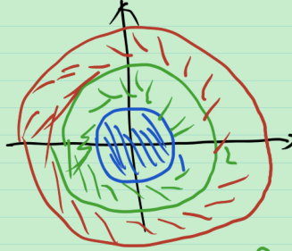

# 38_可测函数与连续函数

可测函数: Borel 集的原像是可测集.

连续函数: 开集的原像是开集.

因此, 定义在可测集上的连续函数一定是可测函数.

可测函数与连续函数差多远?

**鲁津定理** (Lusin) 设 $f(x)$ 是定义在可测集 $E$ 上a.e. 有限的可测函数, 则 $\forall \delta>0,\exist 闭集 F_\delta \sub E$ ,s.t. $m(E-F_\delta)<\delta$ , 且 $f(x)$ 在 $F_\delta$ 上连续.

> 证: 从简单的例子出发, 看自己会不会. 即从特殊到一般的思想(该思想贯彻于整个课程).
>
> 1. 对于常值函数 $f(x)=C$ , 可以找到闭集 $F_\delta$ 使 $m(E-F_\delta)<\delta$ . 显然 $f(x)$ 在 $F_\delta$ 上为常值函数, 连续.
>
> 2. 简单函数情形. 定义在 $E=\bigcup_{i=1}^{s}E_i$ , 其中 $E_i$ 为可测集, $E_i\cap E_j=\varnothing, i\ne j$ , $f(x)=C_i,\forall x\in E_i$ . 其在每个 $E_i$ 上都是常值函数.
>
>    $\forall \delta>0$ , 存在闭集 $F_{i,\delta}\sub E_i$ , s.t. $m(E_i-F_{i,\delta}<\frac{\delta}{s})$ , 且 $f|_{E_i}$ 在 $F_{i,\delta}$ 上是常值函数, 连续. 令 $F_\delta = \bigcup_{i=1}^{s} F_{i,\delta}$ , 则 $F_\delta$ 是闭集, 且
>    $$
>    m(E-F_\delta)=m(\bigcup_{i=1}^{s}E_i-\bigcup_{i=1}^{s} F_{i,\delta})
>    =m(\bigcup_{i=1}^{s}(E_i-F_{i,\delta})) \\
>    =\sum_{i=1}^{s}m(E_i-F_{i,\delta})
>    <\delta
>    $$
>    $f$ 在 $F_\delta$ 上连续吗? 答案是肯定的. 现加以说明. 讨论一个比较一般的问题. 映射 $f:X\to Y$ , $X=\bigcup_{i=1}^{s}X_i$ , $X_i$ 是闭集. 对应于上面, 有 $X=F_\delta, X_i=F_{i,\delta}, Y=\mathbb{R}$ . 如果 $f|_{X_i}:X_i\to Y$ 连续, 则 $f:X\to Y$ 连续吗? $f$ 连续 $\Leftrightarrow$ 开集的原像是开集 $\Leftrightarrow$ 闭集的原像是闭集. 任取 $Y$ 中的闭集 $C$ , 则 $f^{-1}(C)=\bigcup_{i=1}^{s}f^{-1}|_{X_i}(C)$ , 而 $f^{-1}|_{X_i}(C)=F_i(X中的闭集)\cap  X_i$ 是 $X_i$ 中的闭集, 因此 $f^{-1}(C)$ 是闭集. 从而 $f:X\to Y$ 连续.
>
>    > 注: 当 $X_i$ 是开集的时候, 条件减弱为可数个子集, 结论不变.
>    >
>    > 这是拓扑学的知识.
>
> 3. 对于一般的可测函数, 可以由简单函数逼近. 即对于可测函数 $f(x)$ , 存在简单函数列 $\{\varphi_k(x) \}$ , 使 $\lim_{k\to \infty} \varphi_k(x)=f(x)$ , 对 $\varphi_k(x)$ , 可以找到闭集 $F_{k,\delta}$ , 使 $m(E-F_{k,\delta})<\frac{\delta}{2^k}$ . 取 $F_\delta = \bigcap_{k-1}^{\infty}F_{k,\delta}$ 为闭集, 且 $\varphi_k$ 在 $F_\delta$ 上连续. 从而 $m(E-F_\delta)=m(E-\bigcap_{k=1}^{\infty} F_{k,\delta})=m(\bigcup_{k=1}^{\infty} (E-F_{k,\delta}))\le \sum_{k=1}^{\infty} m(E-F_{k,\delta})\le \delta$ .  
>
>    这样就找到了 $F_\delta$ , 使 $m(E-F_\delta)\le \delta$ 且 $\varphi_k(x)$ 在 $F_{k,\delta}$ 上连续. 连续函数的极限连续吗? 不一定. 当一致收敛时, 一定连续. 因此, 希望 $\{\varphi_k(x)\}$ 能一致收敛于 $f(x)$ . 由两件事可以分别得出这一点. 
>
>    1. 如果 $f(x)$ 有界, 则可以找到简单函数列 $\{\varphi(x)\}$ , 使 $\{\varphi_k\}$ 一致收敛于 $f$ .
>    2. 如果 $E$ 的测度有限, 由叶果罗夫定理, $\{\varphi_k\}$ “基本上” 一致收敛于 $f$ .
>
>    因此, 有两条路可以走, 
>
>    1. 希望从有界函数推出一般可测函数. 任给 $f(x)$ , 由几乎处处有限, $m(x:|f(x)|=+\infty)=0$ , 故不妨假设 $f(x)$ 在 $E$ 上有限.
>
>       定义 $g(x)=\frac{f(x)}{1+|f(x)|},x\in E$ , 则 $|g(x)|<1$ , 于是 $g(x)$ 为有界可测函数, 从而在 $F_\delta$ 上连续. 而 $f(x)=\frac{g(x)}{1-|g(x)|}$ ( $|g(x)|<1$ ) 在 $F_\delta$ 上连续. 
>
>    2. 先证有限测度集的情况, 再从有限测度集推出一般可测集.
>
>       (1) 先来看 $m(E)<\infty$ 的情况. 若 $m(E)<\infty$ , 则 $\forall \delta>0$ , 存在简单函数列 $\{\varphi_k \}$ , 使 $\lim_{k\to \infty} \varphi_k(x)=f(x)$ , $\exist 闭集 F_\delta^1 \sub E$ ,s.t. $m(E-F_\delta^1)<\frac{\delta}{3}$ , 且 $\varphi_k$ 在 $F_\delta^1$ 上连续. 由叶果罗夫定理, $\exist 集合E_\delta\in E$ , 使 $m(E_\delta)<\frac{\delta}{3}$ , 且 $\{\varphi_k\}$ 在 $E-E_\delta$ “基本上” 一致收敛于 $f$ . 问能否取 $F_\delta=F_\delta^1\cap (E-E_\delta)$ ? 不行, 因为 $E-E_\delta$ 可能不是闭集, 但 $\exist 闭集F_\delta^2\sub E-E_\delta,s.t. m((E-E_\delta)-F_\delta^2)<\frac{\delta}{3}$ . 
>    
>       令 $F_\delta=F_\delta^1\cap F_\delta^2$ , 则在 $F_\delta$ 上, $\varphi_k$ 连续, 且 $\{\varphi_k\}$ 一致收敛于 $f$ .
>       $$
>       m(E-F_\delta)=m(E-(F_\delta^1\cap F_\delta^2)) \\
>       =m((E-F_\delta^1)\cup (E-F_\delta^2)) 
>       \le m(E-F_\delta^1)+m(E-F_\delta^2) \\
>       \le m(E-F_\delta^1)+m((E-E_\delta)-F_\delta^2)+m(E_\delta)<\delta
>       $$
>       (2) 从有限测度集推出一般可测集. 
>
>       
>    
>       如上图所示, 令圆环列 $A_k=B(0,k)-B(0,k-1)$ , 定义 $E$ 在第 $k$ 个圆环内的部分 $E_k=E\cap A_k$ , 则 $E_k$ 为有界, 测度有限的集合, 且它们互不相交, $E=\bigcup_{k=1}^{\infty}E_k$ . 在每个 $f|_{E_k}$ 上都能找到满足性质的集合. 再用之前的方法易证.
>

**注** 虽然挖掉的闭集的测度可以任意小, 但不能改为零测集.

在 $\mathbb{R}^1$ 上, Lusin 定理的另一形式.

**定理** 设 $f(x)$ 是定义在可测集 $E\in \mathbb{R}^1$ 上a.e. 有限的可测函数, 则 $\forall \delta>0,\exist 闭集 F_\delta \sub E$ 及 $\mathbb{R}^1$ 上的连续函数 $g_\delta(x)$ , s.t. $m(E-F_\delta)<\delta$ , 且 $f(x)$ 与 $g_\delta(x)$ 在 $F_\delta$ 上相等, 且
$$
\sup_{\mathbb{R}^1}g_\delta(x)=\sup_{F_\delta}f(x) \\
\inf_{\mathbb{R}^1}g_\delta(x)=\inf_{F_\delta}f(x)
$$

> 证: 只需证 $F_\delta$ 上的连续函数, 可以将其做延拓得到 $\mathbb{R}^1$ 上的连续函数. 
>
> 由于 $\mathbb{R}^1$ 开集结构的特殊性, $\mathbb{R}^1-F_\delta$ 是至多个互不相交的构成区间 $(a_k,b_k)$ 的并. 可能某一个 $a_k=-\infty$ , 某一个 $b=+\infty$ .
>
> 
>
> 如上图所示, 在 $F_\delta$ 上, 定义 $g_\delta(x)=f(x)$ ; 在 $\mathbb{R}^1-F_\delta$ 的构成区间上, 定义 $g_\delta$ 为“直线”, 即
> $$
> g_\delta(x)=\begin{cases}
> f(x),\quad x\in F_\delta \\
> f(a_k)+\frac{f(b_k)-f(a_k)}{b_k-a_k}(x-a_k),\quad x\in(a_k,b_k),a_k,b_k\in \mathbb{R} \\
> f(b_k),\quad x\in (-\infty,b_k) \\
> f(a_k),\quad x\in (a_k,+\infty)
> \end{cases}
> $$
> 那么, 易证 $g_\delta(x)$ 在 $\mathbb{R}^1$ 上连续. ( $\varepsilon-\delta$ 语言 说明左连续和右连续 )
>
> 显然, $\sup_{\mathbb{R}^1}g_\delta(x)=\sup_{F_\delta}f(x), \inf_{\mathbb{R}^1}g_\delta(x)=\inf_{F_\delta}f(x)$ .

**注1** 定理说明, 可测函数经过修整可以变为连续函数, 且可以延拓. 

**注2** 实际上, 对于一般的 $\mathbb{R}^n$ , 该定理也成立.

**Tietze 延拓定理** 设 $X$ 是正规的拓扑空间, 闭子集 $F\sub X$ , 则可将 $F$ 上的连续函数延拓成 $X$ 上的连续函数. (这里正规的拓扑空间是指满足 $T_4$ 分离性的拓扑空间. 即任意两个不相交的并集可以由两个开集分离开.)

其证明用到以下引理.

**Urysohn引理** 设 $X$ 是正规的拓扑空间, 闭子集 $A,B\sub X$ , 则 $\exist 连续函数f:X\to [0,1],s.t. f|_A\equiv 0, f|_B\equiv 1$ .

容易证明该引理在 $\mathbb{R}^n$ 中的情形.

**总结** 

1. 鲁津定理及其证明, 从例子出发, 一步一步
   1. 从常值函数
   2. 到简单函数
   3. 到一般函数有两条路:
      1. 有界函数到一般函数
      2. 测度有限的集合到一般集合
2. Tietze 延拓定理
3. 一般拓扑下, Urysohn 引理

