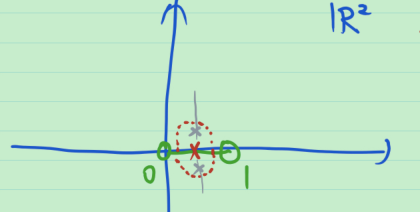
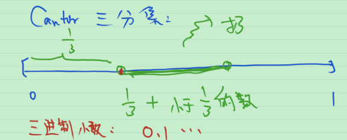
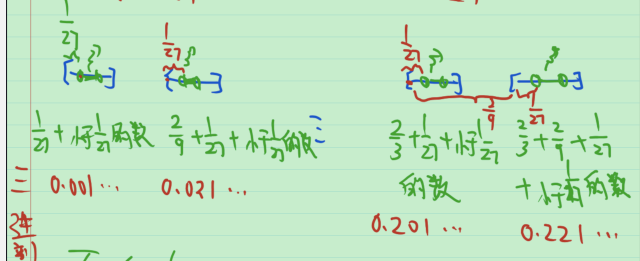
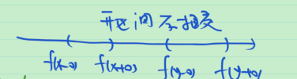

# 39_第二章习题课

## 知识点梳理

第二章实际上是拓扑学中欧式拓扑的知识.

最低限度掌握:

1. 知道各种定义: 内点, 开集, 紧集, ......
2. 知道一些常见例子: $\mathbb{R}^1$ 中的开区间是开集, $\mathbb{R}^1$ 中的闭区间是闭集, $\mathbb{R}^2$ 中的开圆盘是 $\mathbb{R}^2$ 中的开集. 给一个集合, 能判断其是开集 or 闭集.
3. 开集, 闭集的一些运算性质. 开集的补集是闭集, 闭集的补集是开集. 开集的任意并和有限交是开集.
4. 有限覆盖定理. 在欧式空间 $\mathbb{R}^n$ 中, 有界闭集就是紧集. 有界闭区间的任一开覆盖可以找到有限子覆盖.

## 作业题目

1. 设集合 $E$ 是 $[0,1]$ 上全体的有理数, 求 $E',\overset{\circ}{E},\bar{E}$ .

   > 解: 先猜. $E'=[0,1],\overset{\circ}{E}=\varnothing,\bar{E}=[0,1]$ . 再用定义证.

2. $\mathbb{R}^2$ 中的 $(0,1)$ 是开集吗?

   > 解: 不是 $\mathbb{R}^2$ 中的开集. 理由见下图.
   >
   > 

3. 在后面比较详细地讲了连续函数. 连续函数: 开集的原像是开集.

4. 判断 $\frac{1}{2},\frac{1}{13},\frac{5}{12}$  是否为 Cantor 三分集中的点.

   > 解: 
   >
   > 
   >
   > 
   >
   > 
   >
   > 如上图所示, 不在 Cantor 三分集中的点的三进制小数表示中一定会出现数字 1 , 反之亦然. 于是要判断某数是否在 Cantor 三分集中, 只需将其化为三进制小数.
   >
   > > **例** 3的二进制表示.
   > >
   > > $2\le 3<2^2, 2^0\le 3-1\cdot 2=1<2, 3=1\cdot 2+1\cdot 2^0$ , 因此 3 的二进制表示为 11 .
   >
   > 先看 $\frac{1}{2}$ 的三进制表示.
   >
   > $\frac{1}{3}\le \frac{1}{2}<3^0,\frac{1}{2}-\frac{1}{3}=\frac{1}{6}<\frac{1}{3}$ , 从而
   > $$
   > \frac{1}{2}=\frac{1}{3}+\frac{1}{6}
   > =\frac{1}{3}+\frac{1}{3}\cdot \frac{1}{2}
   > =\frac{1}{3}+\frac{1}{3}\cdot (\frac{1}{3}+\frac{1}{3}\cdot \frac{1}{2}) \\
   > =\frac{1}{3}+\frac{1}{3^2}+\frac{1}{3^2}\cdot \frac{1}{2}
   > =\cdots
   > $$
   > 因此, $\frac{1}{2}$ 的三进制表示为 $0.111111\cdots $ . 于是, $\frac{1}{2}$ 不在 Cantor 三分集中.
   >
   > 再来看 $\frac{1}{13}$ 的三进制表示.
   >
   > $\frac{1}{27}=\frac{1}{3^3}\le \frac{1}{13}<\frac{1}{3^2}=\frac{1}{9}$ , $\frac{1}{27}=\frac{1}{3^3}\le \frac{1}{13}-\frac{1}{27}=\frac{14}{13\cdot 3^3}<\frac{1}{3^2}=\frac{1}{9}$ , $\frac{1}{13}-\frac{1}{27}-\frac{1}{27}=\frac{1}{13\cdot 3^3}<\frac{1}{27}$ .
   >
   > 从而
   > $$
   > \frac{1}{13}
   > =\frac{2}{3^3}+\frac{1}{3^3}\cdot \frac{1}{13} 
   > =\frac{2}{3^3}+\frac{1}{3^3}\cdot (\frac{2}{3^3}+\frac{1}{3^3}\cdot \frac{1}{13}) \\
   > =\frac{2}{3^3}+\frac{2}{3^6}+\frac{1}{3^6}\cdot (\frac{2}{3^3}+\frac{1}{3^3}\cdot \frac{1}{13}) 
   > =\cdots
   > $$
   > 因此, $\frac{1}{13}$ 的三进制表示为 $0.002002002\cdots $ , 于是, $\frac{1}{13}$ 在 Cantor 三分集中.

5. $[0,1]$ 中的数用十进制表示时, 不会出现数字7的数组成的集合是完备集.

   > 证: 类似于 Cantor 三分集是完备集. 把 $[0,1]$ 分成 10 份, 把第 8 个开区间扔掉, 一直做下去, 就得到了不会出现数字7的数组成的集合. 挖掉了可数个开区间, 因此是闭集, 而且, 这些开区间没有公共端点, 因此没有孤立点. 没有孤立点的闭集是完备集. 证毕.

6. 举出一个 $\overline{A\cap B}\ne \bar{A}\cap \bar{B}$ 的例子.

   > 证: 取 $A=(0,1),B=(1,2)$ , 则 $\overline{A\cap B}=\bar{\varnothing}=\varnothing$ , 而 $\bar{A}\cap \bar{B}=[0,1]\cap[1,2]=\{1\}$ .
   >
   > 于是 $\overline{A\cap B}\ne \bar{A}\cap \bar{B}$ .

7. 已知 $f:(-\infty,+\infty)\to (-\infty,+\infty)$ 是增函数, 则不连续点组成至多可数集.

   > 证: 定义映射, 将不连续点 $x$ 映到 $(f(x-0),f(x+0))$ . 对于任意的不连续点 $x,y(x<y)$ ,有
   >
   > $f(x-0)<f(x+0)<f(y-0)<f(y+0)$ . 如下图所示,  $(f(x-0),f(x+0))\cap(f(y-0),f(y+0))=\varnothing$ . 因此, 值域是直线上互不相交的开区间的集合, 是至多可数集. 此外映射,这也说明映射是单射, 因此, 定义域, 即不连续点的集合也是至多可数集.证毕.
   >
   > 

