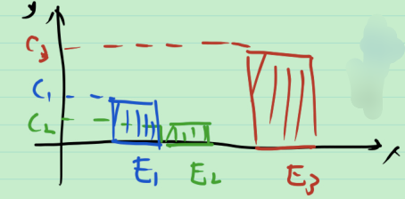

# 40_非负简单函数的勒贝格积分

回忆: 非负简单函数的定义如下. 在可测集 $E=\bigcup_{i=1}^{s}E_i$ ( 其中 $E_i$ 为互不相交的可测集) 上定义函数 $f(x)=c_i,\forall x\in E_i,c_i\ge 0$ , 称其为简单函数.

为了叙述方便, 引入特征函数的概念. 空间中的每一个集合 $E$ 对应于一个特征函数(或称为指示函数) $\chi_E$ ,  
$$
\chi_E=\begin{cases}
1, x\in E \\
0, x\notin E
\end{cases}
$$
这样, 就可以将非负简单函数表示为更紧凑的形式: $f(x)=\sum_{i=1}^{s}c_i\cdot \chi_{E_i}(x), c_i\ge 0$ .

## 非负简单函数的勒贝格积分

用数硬币的思想, 一堆一堆数.

如图, 有 $E$ 上的 Lebsgue 积分 $\int_E f(x)=c_1\cdot m(E_1)+c_2\cdot m(E_2)+c_3\cdot m(E_3)$ .

**定义** 已知可测集 $E=\bigcup_{i=1}^{s}E_i$ ( 其中 $E_i$ 为互不相交的可测集), 定义在 $E$ 上的非负简单函数 $f(x)=\sum_{i=1}^{s}c_i\cdot \chi_{E_i}(x), c_i\ge 0$ , 可定义 $f$ 在 $E$ 上的 Lebsgue 积分  $\int_E f(x):=\sum_{i=1}^{s}c_i\cdot m(E_i)$ . 对于 $E$ 的可测子集 $A\sub E$ , 有 $f|_A(x)=c_i,\forall x\in A\cap E_i$ , 定义 $f$ 在 $A$ 上的 Lebsgue 积分为 $f|_A$ 在 $A$ 上的 Lebsgue 积分, 即 $\int_A f(x):=\int_A f|_A(x)=\sum_{i=1}^{s}c_i\cdot m(A\cap E_i)$ .

> 注: 定义要求函数非负, 是因为若函数不是非负的, 则 $c_i$ 可能既有正无穷和负无穷, 相加无意义.

想看这个积分的性质. 

运算的性质包括: 

1. 集合的运算
2. 函数的运算

**例** 集合的运算性质

1. 若集合 $A,B$ 是 $E$ 的不相交的可测子集, 则 $\int_{A\cup B} f(x)dx=\int_A f(x)dx+\int_B f(x)dx$ .

   > 证: 用定义证.
   > $$
   > \begin{array}{l}
   > \int_{A\cup B} f(x)dx
   > &=\sum_{i=1}^{s} c_i\cdot m((A\cup B)\cap E_i) \\
   > &=\sum_{i=1}^{s} c_i\cdot m((A\cap E_i)\cup (B\cap E_i)) \\
   > &=\sum_{i=1}^{s} c_i\cdot (m(A\cap E_i)+m(B\cap E_i)) \\
   > &=\sum_{i=1}^{s} c_i\cdot m(A\cap E_i)+c_i\cdot m(B\cap E_i) \\
   > &=\int_A f(x)dx+\int_B f(x)dx
   > \end{array}
   > $$
   > 证毕.

2. 若可测集合列 $\{A_n\}_{n=1}^{\infty}$ 递增, 即 $A_1\sub A_2\sub \cdots \sub A_n\sub \cdots $ , 记 $E=\bigcup_{n=1}^{\infty}A_n=\lim_{n\to \infty} A_n$ , 则定义在 $E$ 上的非负简单函数 $f$ 有以下性质:  $\int_E f(x)dx=\lim_{n\to \infty} \int_{A_n} f(x)dx$ .

   > **注** 该性质说明极限和积分可以互换位置. $\int_{\lim_{n\to \infty} A_n} f(x)dx=\lim_{n\to \infty} \int_{A_n} f(x)dx$ .
   >
   > 证: 由 $\{A_n\}_{n=1}^{\infty}$ 递增知 $\{A_n\cap E_i\}_{n=1}^{\infty}$ 递增, 于是 $m(E_i)=m(\lim_{n\to \infty}(A_n\cap E_i))=\lim_{n\to \infty} m(A_n\cap E_i)$ , 从而
   > $$
   > \int_E f(x)dx
   > =\sum_{i=1}^{s}c_i\cdot m(E_i)
   > =\sum_{i=1}^{s}c_i\cdot \lim_{n\to \infty} m(A_n\cap E_i) \\
   > =\lim_{n\to \infty} \sum_{i=1}^{s}c_i\cdot m(A_n\cap E_i) 
   > =\lim_{n\to \infty} \int_{A_n} f(x)dx
   > $$
   > 证毕.

**例** 函数的运算性质(积分的线性): $\forall 非负实数 \alpha, \beta$ , $\forall 定义在E上的非负简单函数 f,g$ , 有 $\int_E (\alpha f(x)+\beta g(x))dx=\alpha \int_E f(x)dx+\beta \int_E g(x)dx$ .

> 证: 需要证明两件事: 第一是 $\alpha f(x)+\beta g(x)$ 是非负简单函数, 才可以算积分; 第二是 $\int_E (\alpha f(x)+\beta g(x))dx=\alpha \int_E f(x)dx+\beta \int_E g(x)dx$ . 只需证以下两命题成立. 
>
> 1. $\forall 非负实数 c$ , $\forall 定义在E上的非负简单函数 f$ , 则 $c\cdot f$ 是非负简单函数, 且 $\int_E c\cdot f(x)dx=c\int_E f(x)dx$ .
>
>    > 证: 由 $c\cdot f(x)=\sum_{i=1}^{s}c\cdot c_i\cdot \chi_{E_i}(x)$ , 这里 $c\cdot c_i\ge 0$ , 故 $c\cdot f$ 是非负简单函数. 于是可以对其计算其积分,有
>    > $$
>    > \int_E c\cdot f(x)dx
>    > =\sum_{i=1}^{s}c\cdot c_i\cdot m(E_i) \\
>    > =c\cdot \sum_{i=1}^{s}c_i\cdot m(E_i)
>    > =c\int_E f(x)dx
>    > $$
>    > 证毕.
>
> 2. $\forall 定义在E上的非负简单函数 f,g$ , 则 $f+g$ 是非负简单函数, 且 $\int_E (f(x)+g(x))dx=\int_E f(x)dx+\int_E g(x)dx$ .
>
>    > 证: 如图, 设 $f(x)=\sum_{i=1}^{s}c_i\cdot \chi_{E_i}(x), g(x)=\sum_{i=1}^{p}d_i\cdot \chi_{\tilde{E}_i}(x)$
>    >
>    > 
>    >
>    > 则各 $E_i\cap \tilde{E}_j$ 互不相交. 在 $E_i\cap \tilde{E}_j$ 上, $f(x)+g(x)=c_i+d_j$ . 这是简单函数的分段表示法. 将其写为特征函数的形式为 $f(x)+g(x)=\sum_{1\le i\le s,1\le j\le p}(c_i+d_j)\cdot \chi_{E_i\cap \tilde{E}_j}(x)$ , 这里的 $c_i+d_j\ge 0$ . 故 $f(x)+g(x)$ 是非负简单函数. 对其计算积分, 有
>    > $$
>    > \int_E (f(x)+g(x))dx
>    > =\sum_{1\le i\le s,1\le j\le p}(c_i+d_j)\cdot m(E_i\cap \tilde{E}_j) \\
>    > =\sum_{1\le i\le s,1\le j\le p}c_i\cdot m(E_i\cap \tilde{E}_j)+\sum_{1\le i\le s,1\le j\le p}d_j\cdot m(E_i\cap \tilde{E}_j) \\
>    > =\sum_{1\le i\le s}c_i\sum_{1\le j\le p} m(E_i\cap \tilde{E}_j)+\sum_{1\le j\le p}d_i\sum_{1\le i\le s} m(E_i\cap \tilde{E}_j) \\
>    > \xlongequal[测度的可数可加性]{E_i\cap \tilde{E}_j互不相交} \sum_{1\le i\le s}c_i m(E_i)+\sum_{1\le j\le p}d_j\cdot m(\tilde{E}_j) \\
>    > =\int_E f(x)dx+\int_E g(x)dx
>    > $$
>    > 证毕.

**总结** 

1. 用特征函数把简单函数写得更紧凑
2. 非负简单函数的 Lebesgue 积分
3. 非负简单函数的 Lebesgue 积分的运算性质
   1. 集合运算
   2. 函数运算

