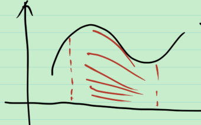

# 41_我们讲勒贝格积分要讲什么

## 勒贝格积分的引入

黎曼积分有哪些缺点?

1. 极限与积分交换次序难
2. 有些函数不可积
3. 无穷区间上的积分不妙
4. 从欧式空间推广到其他空间困难

为此引入勒贝格积分

要求非负函数 $y=f(x)$ 的下方图形的面积, 可以对定义域进行分割, 得到 $\sum f(\xi_i)(x_i-x_{i-1})$ , 称为 Riemann 积分, 也可以对值域进行分割, 得到 $\sum f(\xi_i)m(E[y_i\le f<y_{i+1}], \xi_i\in[y_i,y_i+1))$ , 称为 Lebesgue 积分. 直观地看, 将做积分看成数硬币, 则 Riemann 积分是一枚一枚地数, 而 Lebesgue 积分是一堆一堆地数. 

但分割值域的做法有点麻烦, 今天的教科书并不这么处理, 而是

1. 从非负简单函数出发, 

   用数硬币的思想, 如 Dirichlet 函数的 Lebesgue 积分 = $0\cdot 无理数的测度 + 1\cdot 有理数测度 = 0 .$

2. 到非负可测函数(可用非负简单函数逼近), 

   Lebesgue 积分 = lim?

3. 再到一般可测函数(可表示为非负可测函数的差).

   $f=f^+-f^-$ .

   积分 = 积分 - 积分?

 这样, 一步一步给出 "合理" 的定义.

## Lebesgue 积分与 Riemann 积分作比较

Lebesgue 积分与 Riemann 积分

1. 运算
   1. 集合的运算
   2. 函数的运算
2. 可积性
3. 极限与积分的关系(重点)
4. 两积分有什么关系
5. 重积分与累次积分
6. 几何意义

