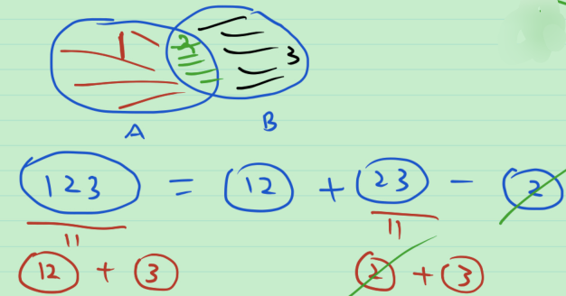

# 45_第三章习题课

1. 直线上有理数的测度是 $0$ .

   > 可数个点的集合的测度为0. 这是因为单点集的测度为0, 且测度有可数可加性.

2. Cantor 三分集的测度是 $0$ .

   > Cantor 三分集的构造 = [0,1] - 可数个互不相交的开区间
   >
   > 这些可数个互不相交的开区间的测度之和为1, 有限.
   >
   > 于是Cantor 三分集的测度=1-1=0

3. 将 (0,1) 中的数按十进制小数展开, 第 100 位是 6 的小数组成的集合的测度为 $\frac{1}{10}$ .

   > 概率论: 第 100 位是 6 的概率为 $\frac{1}{10}$ .

4. 设 $G$ 是直线上的开集, $G$ 与 $G$ 的闭包的测度一定相等吗?

   > 不一定. 反例如下.
   >
   > 将直线上的有理数排成一排, $\mathbb{Q}=\{r_1,r_2,\cdots,r_k,\cdots\}$ .
   >
   > 定义开区间 $I_k=(r_k-\frac{1}{2^{k+1}},r_k+\frac{1}{2^{k+1}})$ , 其长度为 $\frac{1}{2^k}$ .
   >
   > 取 $G=\bigcup_{n=1}^{\infty} I_k$ , 则其为开集, 且 $\bar{G}=\mathbb{R}$ .
   >
   > 于是 $m(G)\le \sum_{k=1}^{\infty} |I_k|=1<m(\bar{G})=+\infty$ .

5. 是否存在闭集 $F$ , 使 $F$ 是闭区间 $[a,b]$ 的真子集, 且 $F$ 的测度等于 $b-a$ ?

   > 不存在. 用反证法. 反设存在这样的 $F$ .
   >
   > 
   >
   > 首先, 由闭集 $F$ 是闭区间 $[a,b]$ 的真子集, 易证其是开区间 $(a,b)$ 的真子集. 
   >
   > 从而 $(a,b)-F$ 为非空开集. 
   >
   > 于是 $\exist x\in (a,b)-F$ , $\exist(x-\frac{\delta}{2},x+\frac{\delta}{2})\sub (a,b)-F$ .
   >
   > 于是 $m((a,b)-F)\ge \delta$ .
   >
   > 于是 $m(F)=m((a,b))-m((a,b)-F)\le b-a-\delta<b-a$ .

6. 任意个可测集的交一定是可测集吗?

   > 不一定. 命题等价于任意个可测集的并不一定是可测集.
   >
   > 理由: 任取一个不可测集 $N$ , 则 $N=\bigcup_{x\in N} \{x\}$ .

7. 可测集一定是 Borel 集吗?

   > 不一定.

8. 可测集平移之后一定是可测集.

9. 命题

   1. 任意个零测集之交仍是零测集.

      > 测度的单调性.

   2. 任意个零测集之并不一定是零测集. 

      > 理由: 任取一个不可测集 $N$ , 则 $N=\bigcup_{x\in N} \{x\}$ .

   3. 开区间与其闭包的测度相等. 

      > 开区间 $(a,b)$ 的闭包为闭区间 $[a,b]$ .

   4. 在一个测度是正数的集合中, 可找到一个测度为正数的闭子集.

      > 证: 由可测集与闭集的关系, 对于测度是正数的可测集 $E$ , $\forall \varepsilon>0$ , 存在闭子集 $F\sub E$ , 使 $m(E-F)<\varepsilon$ . 
      >
      > 当 $m(F)<+\infty$ 时, $m(E)-m(F)=m(E-F)<\varepsilon$ . 令 $\varepsilon<\frac{1}{2}m(E)$ , 则 $m(F)\ge m(E)-\varepsilon>\frac{1}{2}m(E) >0$ .
      >
      > 当 $m(F)=+\infty$ 时, $m(F)>0$ 自然成立.
      >
      > 综上, 对于测度是正数的可测集 $E$ , 存在闭子集 $F\sub E$ , 使 $m(F)>0$ . 证毕.

书上的题

**第7题** 求证: 若集合 $A$ 可测, 集合 $B$ 的外测度 $m^*(B)<+\infty$ , 则 $m^*(A\cup B)=m^*(A)+m^*(B)-m^*(A\cap B)$ .

> 证: 由 $m^*(B)\le +\infty$ , 得 $m^*(A\cap B)<+\infty$ , 这保证了等式右侧有意义. 思路如下图所示, 蓝字为要证的部分.
>
> 

**第10题** 求证: 已知可测集列 $\{E_n\}$ , 则 $\varlimsup_{n\to \infty} E_n$ , $\varliminf_{n\to \infty} E_n$ 都可测, 且

1. $m(\varliminf_{n\to \infty} E_n)\le \varliminf_{n\to \infty} m(E_n)$ 
2. 若 $m(\bigcup_{n=1}^{\infty}) E_n<\infty$ , 则 $m(\varlimsup_{n\to \infty} E_n)\ge \varliminf_{n\to \infty} m(E_n)$ 

> 提示: $\varliminf_{n\to \infty} E_n=\bigcup_{j=1}^{\infty}\bigcap_{k=j}^{\infty} E_k$ . 记 $\tilde{E}_j=\bigcap_{k=j}^{\infty} E_k$ , 则其为递增列. 故极限的测度等于测度的极限.

**第9题** 对于集合 $E$ , 若 $\exist$ 可测集列 $\{A_n\},\{B_n\}$ , s.t. $A_n\sub E\sub B_n$ , 且 $m(B_n-A_n)\to 0, (n\to \infty)$ , 则 $E$ 可测.

> **注** 不一定有 $m(B_n)-m(A_n)\to 0, (n\to \infty)$ , 这是因为有可能 $m(A_n)=+\infty$ .
>
> 提示: 前面讨论测度的外正规性和内正则性时, 证明了
>
> 当$E$ 是有界集时,  若 $\inf\{m(G):E\sub G, G为开集\}=\sup\{m(K):E\supset K, K为紧集\}$ , 则 $E$ 是可测集, 与之证明思路类似, 将所有的 $A_n$ 都并起来,
>
> 
>
> 有 $E=(\bigcup_{i=1}^{\infty} A_n)\cup (E-\bigcup_{i=1}^{\infty} A_n)$ .
>
> 而 $\bigcup_{i=1}^{\infty} A_n$ 可测, 只需证明 $E-\bigcup_{i=1}^{\infty} A_n$ 是零测集.

