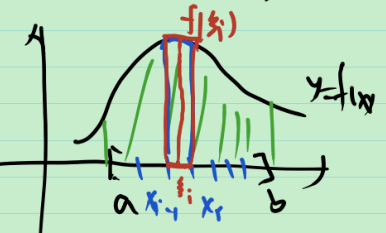
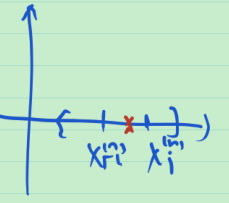

# 50_黎曼积分与勒贝格积分的关系

回忆黎曼积分, 对 $[a,b]$ 上的有界函数 $f$ ( $|f|\le M$ ) , 取分划 $T:a=x_0\le x_1\le \cdots \le x_n=b$ , 每一段中取一个标记点 $\xi_i$ , $x_{i-1}\le \xi_i\le x_i$ , 我们定义分划 $T$ 的长度为 $\delta(T)=\max \{x_i-x_{i-1}:1\le i\le n\}$ . 称 $f$ 在 $[a,b]$ 上 R 可积, 如果 $\exist$ 确定的实数 $J$ , s.t. $lim_{\delta(T)\to 0} \sum_{i=1}^{n} f(\xi_i)(x_i-x_{i-1})=J$ . 称 $J$ 是 $f$ 的 R 积分, 记为 $J=\int_a^b f(x)dx$ , 在这里, 记为 $(R)\int_a^b f(x)dx$ , 其中 R 表示 R 积分.

怎样判断 R-可积 ?

记 $M_i=\sup\{f(x):x_{i-1}\le x\le x_i\}$ , $m_i=\inf\{f(x):x_{i-1}\le x\le x_i\}$ .

我们定义达布上和 $S(f,T)=\sum_{i=1}^{n} M_i(x_i-x_{i-1})$ , 达布下和 $s(f,T)=\sum_{i=1}^{n} m_i(x_i-x_{i-1})$ . 进而可以定义达布上积分 $\bar \int_{a}^{b} f(x)dx=\lim_{\delta(T)\to 0} S(f,T)=\inf_T S(f,T)$ , (可以证明其存在), 达布下积分 $\underline \int_{a}^{b} f(x)dx=\lim_{\delta(T)\to 0} s(f,T)=\sup_T s(f,T)$ . 若 $\bar \int_{a}^{b} f(x)dx=\underline\int_{a}^{b} f(x)dx$ , 则 $f$ 在 $[a,b]$ 上 R 可积. 反之亦然. 由 $f$ 有界知, $\bar \int_{a}^{b} f(x)dx<+\infty$ 且 $\underline\int_{a}^{b} f(x)dx<+\infty$ . 于是可以做减法, 只需考虑 $\bar \int_{a}^{b} f(x)dx-\underline\int_{a}^{b} f(x)dx=0$ ?

由上下确界的定义, 存在一列分划 $T^{(n)}:a=x_0^{(n)}\le x_1^{(n)}\le \cdots \le x_{p_n}^{(n)}=b$ , 使 $\bar \int_{a}^{b} f(x)dx=\lim_{n\to \infty} S(f,T^{(n)})$ , $\underline \int_{a}^{b} f(x)dx=\lim_{n\to \infty} s(f,T^{(n)})$ . 记 $M_i^{(n)}=\sup\{f(x):x_{i-1}^{(n)}\le x\le x_i^{(n)}\}$ , $m_i=\inf\{f(x):x_{i-1}\le x\le x_i\}$ .

于是
$$
\bar \int_{a}^{b} f(x)dx-\underline\int_{a}^{b} f(x)dx
=\lim_{n\to \infty} (S(f,T^{(n)})-s(f,T^{(n)})) \\
=\lim_{n\to \infty} (\sum_{i=1}^{p_n} M_i^{(n)}(x_i-x_{i-1})-\sum_{i=1}^{p_n} m_i^{(n)}(x_i-x_{i-1}))) \\
=\lim_{n\to \infty} (\sum_{i=1}^{p_n} (M_i^{(n)}-m_i^{(n)})(x_i-x_{i-1}))
$$
问 $\sum_{i=1}^{p_n} (M_i^{(n)}-m_i^{(n)})(x_i-x_{i-1})$ 是什么?

试图想, 令 $\varphi_n(x)=\sum_{i=1}^{p_n}(M_i^{(n)}-m_i^{(n)})\chi_{[x_{i-1},x_i]} $ , 则可化为勒贝格积分, 即 $\sum_{i=1}^{p_n} (M_i^{(n)}-m_i^{(n)})(x_i-x_{i-1})=(L)\int_{[a,b]} \varphi_n(x)dx$ , 考虑 $(L)\lim_{n\to \infty} \int_{[a,b]} \varphi_n(x)dx=0$ , 若积分与极限可交换, 则 $(L)\int_{[a,b]} \lim_{n\to \infty} \varphi_n(x)dx=0$ , 从而 $\lim_{n\to \infty} \varphi_n(x)=0$ a.e. 于 $E$ .

定义振幅  $\omega(x)=\lim_{\delta\to 0^+} \sup\{|f(y)-f(z)|:y,z\in (x-\delta,x+\delta)\cap [a,b]\}$ , 则易验证, 当 $x$ 不是分点时, $\lim_{n\to \infty}\varphi_n(x)=\omega(x)$ . 设 $E=分点全体$ , 则 $E$ 是可数集, $m(E)=0$ . 于是 $\lim_{n\to \infty} \varphi_n(x)=0$ a.e. 于 $E$ $\Leftrightarrow$ $\omega(x)=0$ a.e. 于 $E$  $\Leftrightarrow$ $f$ 在 $E$ 上 a.e. 连续. ( 第二个等价是因为 $\omega(x)=0\Leftrightarrow f在x处连续$ ) . 于是, 证明了极限与积分能换序和是不是分点细节的问题 就有下面的定理.

**定理** 有界函数 $f$ 在 $[a,b]$ 上 R 可积 $\Leftrightarrow$ $f$ 在 $[a,b]$ 上 a.e. 连续.  

> 证: 定义 
> $$
> h_n(x)=\begin{cases} 
> M_i^{(n)}-m_i^{(n)},\quad x_{i-1}^{(n)}<x<x_i^{(n)} \\
> 0,\quad x是分点
> \end{cases}
> $$
> 则 $h_n(x)$ 是非负可测函数. 设 $|f(x)|\le M,x\in [a,b]$ , 则 $|h_n(x)|\le M_i^{(n)}+m_i^{(n)}\le 2M$ . 由 $g(x)=2M$ 在 $[a,b]$ 上 L 可积. 从而
> $$
> \bar \int_{a}^{b} f(x)dx-\underline\int_{a}^{b} f(x)dx
> =\lim_{n\to \infty} (S(f,T^{(n)})-s(f,T^{(n)})) \\
> =\lim_{n\to \infty} (\sum_{i=1}^{p_n} M_i^{(n)}(x_i-x_{i-1})-\sum_{i=1}^{p_n} m_i^{(n)}(x_i-x_{i-1}))) \\
> =\lim_{n\to \infty} (\sum_{i=1}^{p_n} (M_i^{(n)}-m_i^{(n)})(x_i-x_{i-1})) \\
> =\lim_{n\to \infty} (L)\int_{[a,b]} h_n(x)dx
> \xlongequal[]{勒贝格控制收敛定理} \\
> =(L)\int_{[a,b]} \lim_{n\to \infty} h_n(x)dx
> =(L)\int_{[a,b]} \omega(x)dx
> $$
>  于是 $f$ 在 $[a,b]$ 上 R 可积 $\Leftrightarrow$ $(L)\int_{[a,b]} \omega(x)dx=0$ $\Leftrightarrow$ $\omega(x)=0$ a.e. 于 $E$  $\Leftrightarrow$ $f$ 在 $E$ 上 a.e. 连续.

**例** 单调函数是 $R$ 可积的.

> 证: 这是因为单调函数的不连续点是零测集.

L 积分 与 R 积分 的关系?

**定理** 有界函数 $f$ 在 $[a,b]$ 上 R 可积, 则 $f$ 在 $[a,b]$ 上 $L$ 可积, 且 $(L)\int_{[a,b]} f(x)dx=(R)\int_{a}^{b} f(x)dx$ .

注: 这说明 L 积分 是 R 积分 的推广, 给出了特殊情况下计算 L 积分的办法

> 证: $f$ 在 $[a,b]$ 上 R 可积, 则 $f$ 在 $[a,b]$ 上几乎处处连续. 易由定义证明, $f$ 是 $[a,b]$ 上的可测函数. 即 $f$ 是 $[a,b]$ 上的有界可测函数, 故 $f$ 在 $[a,b]$ 上 L 可积 . 
>
> 定义 $g_n(x)=\begin{cases} 
> M_i^{(n)},\quad x_{i-1}^{(n)}<x<x_i^{(n)} \\
> 0,\quad x是分点
> \end{cases}$ , 设 $f_n(x)\le M$ , 则 $|g_n(x)|\le M$ . 当 $x\in[a,b]$ 不是分点且是连续点时, $\lim_{n\to \infty} g_n(x)= f(x)$ . 于是有
> $$
> (L)\int_{[a,b]} f(x)dx-(R)\int_{a}^{b} f(x)dx \\
> =(L)\int_{[a,b]} f(x)dx-\lim_{n\to \infty} (\sum_{i=1}^{p_n} M_i^{(n)}(x_i-x_{i-1})) \\
> =(L)\int_{[a,b]} f(x)dx-\lim_{n\to \infty} (L)\int_{[a,b]} g_n(x)dx \\
> =(L)\int_{[a,b]} f(x)dx-(L)\int_{[a,b]} \lim_{n\to \infty} g_n(x)dx \\
> =(L)\int_{[a,b]} f(x)dx-(L)\int_{[a,b]} f_n(x)dx 
> =0
> $$
> 证毕.

对于反常积分呢?

**定理** $f$ 是 $[a,b]$ 上的非负实函数, 若 $\forall A>a$ , 在 $[a,A]$ 上 $f$ R 可积 , 且 R 反常积分 $(R)\int_{a}^{+\infty} f(x)dx$ 收敛, 则 $f$ 在 $[a,+\infty)$ 上 L 可积, 且 $(L)\int_{[a,+\infty)}f(x)dx=(R)\int_{a}^{+\infty} f(x)dx$ . 若 $(R)\int_{a}^{+\infty} f(x)dx$ 发散, 则 $(L)\int_{[a,+\infty)}f(x)dx=+\infty$ .

> 证: 任取数列 ${A_n}$ , 使 $A_n>a$ , 且 $\lim_{n\to \infty} A_n=+\infty$ , 则 $\lim_{n\to \infty} [a,A_n]=[a,+\infty)$ , 于是
> $$
> (L)\int_{[a,+\infty)}f(x)dx
> =\lim_{n\to \infty}(L)\int_{[a,A_n]}f(x)dx \\
> =(R)\int_{a}^{A_n} f(x)dx
> =(R)\int_{a}^{+\infty} f(x)dx
> $$
> 同理, 若 $(R)\int_{a}^{+\infty} f(x)dx$ 发散, 则 $(L)\int_{[a,+\infty)}f(x)dx=+\infty$ .

当 $f$ 不是非负时, 没有这样的结论. 即 L 积分 不是 R 反常积分的推广!

**反例** 已知
$$
f(x)=\begin{cases}
\frac{\sin x}{x}, x>0 \\
1, x=0
\end{cases}
$$
则 $f(x)$ 连续, 且 $(R)\int_0^{+\infty} f(x)dx=(R)\int_0^{+\infty} \frac{\sin x}{x}dx=\frac{\pi}{2}$ . (利用复变函数中的留数定理) . 
$$
(L)\int_{[0,+\infty)} f^+(x)dx
=\sum_{n=0}^{\infty}(L)\int_{[2n\pi,(2n+1)\pi]} \frac{\sin x}{x}dx \\
=\sum_{n=0}^{\infty}(R)\int_{2n\pi}^{(2n+1)\pi} \frac{\sin x}{x}dx
=\sum_{n=0}^{\infty}(R)\int_{0}^{\pi} \frac{\sin (2n\pi +t)}{2n\pi +t}dx \\
=\sum_{n=0}^{\infty}(R)\int_{0}^{\pi} \frac{\sin t}{2n\pi +t}dx
\ge \sum_{n=0}^{\infty} \frac{1}{(2n+1)\pi} (R)\int_{0}^{\pi} \sin tdx \\
=\sum_{n=0}^{\infty} \frac{2}{(2n+1)\pi}
=+\infty
$$
同理 $(L)\int_{(-\infty,0]} f^+(x)dx=+\infty$ , 于是 $f$ 在  $[0,+\infty)$ 不是 L 可积 的.

**总结**

1. 回忆 R 积分
   1. 达布上下和达布上下积分, 
   2. 振幅, 振幅等于0等价于连续.
2. 对于有界函数, R 可积 等价于几乎处处连续 (注意分点的问题)
3. 用类似的技巧可以证明 L 积分是 R 积分的推广.
4. L 积分不是 R 反常积分的推广.
   1. 对于非负函数, 可以
   2. 对于一般的函数, 不行
5. 因此, 有时可以根据 R 积分 去算 L 积分.

