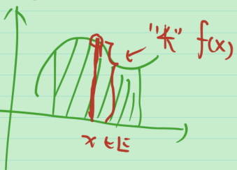
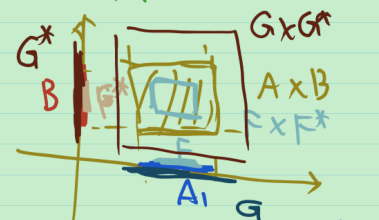

# 勒贝格积分的几何意义 Fubini定理

## 勒贝格积分的几何意义

直观看勒贝格积分

**定义** (下方图形) 设 $f(x)$ 是在 $E\sub \mathbb{R}^n$ 上的非负函数, $\{(x,z):x\in E,0\le z<f(x)\}\sub \mathbb{R}^{n+1}$ 称为 $f(x)$ 在 $E$ 上的下方图形, 记为 $G(E,f)$ .

**定理** (非负可测函数勒贝格积分的几何意义) 设 $f(x)$ 为可测集 $E\sub \mathbb{R}^n$ 上的非负函数, 则

1. $f(x)$ 是 $E$ 上的可测函数 $\Leftrightarrow$ $G(E,f)$ 是 $\mathbb{R}^{n+1}$ 中的可测集.
2. 当 $f(x)$ 在 $E$ 上可测时, $\int_E f(x)dx=m(G(E, f))$ .

> 分析: 
>
> 1. " $\Rightarrow$ ": 从特殊到一般
>
>    (1) 对于常值函数 $f(x)=C\ge 0$ ,
>
>    
>    $$
>    G(E,f)=\begin{cases}
>    E\times [0,C), C>0 \\
>    \varnothing, C=0
>    \end{cases}
>    $$
>    是不是可测集? 还不知道. 需要知道 $E\times [0,C)$ 是不是可测集. 而 $E$ 和 $[0,C)$ 都是可测集, 因此只要可测集的直积是可测集, 则定理在常值函数情形下成立. 若成立, 则有以下部分.
>
>    (2) 对于非负简单函数 $f(x)$ , $f(x)=c_i,x\in E_i$ , $E=\bigcup_{i=1}^{k}E_i$ , 其中 $E_i$ 是互不相交的可测集. 则 $G(E,f)=\bigcup_{i=1}^{k} G(E_i, f)$ . 由 $G(E_i, f)$ 可测, 则 $G(E,f)$ 可测.
>
>    
>
>    (3) $f$ 是一般的非负可测函数, 则存在一列递增的非负简单函数 $0\le \varphi_k(x)\le \varphi_{k+1}(x)$ , 使 $\lim_{n\to \infty} \varphi_k(x)=f(x),x\in E$ . 显然 $G(E,\varphi_k)\sub G(E,\varphi_{k+1})$ . 易证 $\bigcup_{k=1}^{\infty} G(E,\varphi_k)=G(E,f)$ . 由 $G(E,\varphi_k)$ 可测, 知 $G(E,f)$ 可测.
>
>    综上, 只需说明可测集的直积是可测集.
>
>    " $\Leftarrow$ ": 想证 $x$ 处切一刀得到的图形, (称为截面) 的 “长度”  $f(x)$ 作为 $x$ 的函数可测.
>
>    
>
> 2. 即证截面面积的积分 = 图形面积.
>
> 要搞清楚这三件事, 要研究直积和截面.

**定义** (直积) $A\times B:=\{(x,y):x\in A, y\in B \}$ .

**定义** (截面) 设点集 $E\sub \mathbb{R}^{p+q}$ , $x_0$ 是 $\mathbb{R}^p$ 中的一个固定点, 则 $\{y\in \mathbb{R}^q:(x_0, y)\in E \}\sub \mathbb{R}^q$ 称为 $E$ 关于 $x_0$ 的截面, 记为 $E_{x_0}$ .

直积与截面的性质

1. 若 $A_1\sub A_2$ , 则 $A_1\times B\sub A_2\times B$ ;
2. 若 $A_1\cap A_2=\varnothing$ , 则 $(A_1\times B)\cap(A_2\times B)=\varnothing$ ;
3. $(\bigcup_i A_i)\times B = \bigcup_i (A_i\times B)$ , $(\bigcap_i A_i)\times B = \bigcap_i (A_i\times B)$ ;
4. $(A_1-A_2)\times B=(A_1\times B)-(A_2\times B)$ ; 
5. 若 $A_1\sub A_2$ , 则 $(A_1)_x\sub(A_2)_x$ ;
6. 若 $A_1\cap A_2=\varnothing$ , 则 $(A_1)_x\cap (A_2)_x=\varnothing$ ;
7. $(\bigcup_i A_i)_x=\bigcup_i (A_i)_x$ , $(\bigcap_i A_i)_x=\bigcap_i (A_i)_x$ ;
8. $(A_1-A_2)_x=(A_1)_x-(A_2)_x$ .

> 直观看 $(A_1-A_2)\times B=(A_1\times B)-(A_2\times B)$ .
>
> 

**性质** 设闭集 $F_1\sub \mathbb{R}^p$ , 闭集 $F_2\sub \mathbb{R}^q$ , 则 $F_1\times F_2$ 是 $\mathbb{R}^{p+q}$ 中的闭集. 设开集 $G_1\sub \mathbb{R}^p$ , 开集 $G_2\sub \mathbb{R}^q$ , 则 $G_1\times G_2$ 是 $\mathbb{R}^{p+q}$ 中的开集.

> 证: 对于闭集情况, $\mathbb{R}^p\times \mathbb{R}^q-F_1\times F_2=(\mathbb{R}^p\times (\mathbb{R}^q-F_2))\cup ((\mathbb{R}^p-F_1)\times \mathbb{R}^q)$ . 等号右侧的两部分的解释: 第一部分是第二个坐标不在 $F_2$ 中, 第二部分是第一个坐标不在 $F_1$ 中. 因此只要性质对开集情况成立, 则 $\mathbb{R}^p\times \mathbb{R}^q-F_1\times F_2$ 是开集, 于是 $\mathbb{R}^p\times \mathbb{R}^q-F_1\times F_2$ 是开集, 即 $F_1\times F_2$ 是闭集. 于是只需对开集情况证明. 
>
> 对于开集情况, 由下图易证.
>
> 
>
> 证毕.

利用开集和闭集直积的性质可以得到下面的定理.

**定理** 若 $A\sub \mathbb{R}^p$ 是可测集, $B\sub \mathbb{R}^q$ 是可测集, 则 $A\times B$ 是 $\mathbb{R}^{p+q}$ 中的可测集. 即可测集的直积是可测集.

> 证: 要证明集合可测有三种方法, 第一种是用定义, 第二种是用开集和紧集测量是否相等, 第三种是看它能否由可测集的运算得出. 这里用第二种方法.
>
> 
>
> 不妨设 $A,B$ 有界. (因为无界时可以将其分解为可数个互不相交的有界集的并) . $\forall \varepsilon>0$ , $\exist$ $\mathbb{R}^p$ 中的开集 $G$ , 闭集 $F$ 及 $\mathbb{R}^q$ 中的开集 $G^*$ , 闭集 $F^*$ , 有界开区间 $I\supset G,I^*\supset G^*$ , 使 $m(G-F)<\frac{\varepsilon}{4|I|^*}$ , $m(G^*-F^*)<\frac{\varepsilon}{4|I|}$ . 于是 $\exist$ 开区间列 $\{I_i\},\{I_i^*\}$ , 使 $G-F\sub \bigcup_{i} I_i,G^*-F^*\sub \bigcup_{i} I_i^*$ , $\sum_{i} |I_i|<\frac{\varepsilon}{2|I|^*},\sum_{i} |I_i^*|<\frac{\varepsilon}{2|I|}$ .
>
> 则 $F\times F^*,G\times G^*$ 分别是 $\mathbb{R}^{p+q}$ 中的闭集和开集
> $$
> G\times G^*-F\times F^*
> =(G\times (G^*-F^*))\cup ((G-F)\times G^*) \\
> \sub (I\times \bigcup_{i} I_i^*)\cup (\bigcup_{i} I_i \times I^*)
> =(\bigcup_{i} (I\times I_i^*))\cup (\bigcup_{i} (I_i \times I^*))
> $$
> 从而
> $$
> m(G\times G^*-F\times F^*)
> \le \sum_{i} |I\times I_i^*|+\sum_{i} |I_i\times I^*| \\
> =|I|\cdot \sum_{i} |I_i^*|+|I^*|\cdot \sum_{i} |I_i|
> <|I|\cdot \frac{\varepsilon}{2|I|}+|I^*|\cdot \frac{\varepsilon}{2|I|^*}
> =\varepsilon
> $$
> 由 $\varepsilon$ 的任意性, 可知 $A\times B$ 是可测集. 证毕.

**定理** (截面定理) 若 $E\sub \mathbb{R}^{p+q}$ 是可测集, 则

1. 对于 $\mathbb{R}^p$ 中几乎所有的点 $x$ , $E_x$ 是 $\mathbb{R}^q$ 中的可测集;
2. $m(E_x)$ 作为 $x$ 的函数, 是 $\mathbb{R}^p$ 上 a.e. 有定义的可测函数;
3. $m(E)=\int_{\mathbb{R}^p} m(E_x)dx$ .

> 证: 思路. 可测集可以写成 $G_\delta$  集 $\cup$ 零测集. 而 $G_\delta$  集可以写成可数个开集的交, 开集可以写成一些左开有闭区间的并.
>
> 先假设 $E$ 是有界集. 分为四步: 
> $$
> \left. \begin{array}{c}
> 1. 左开右闭区间, 2. 开集, 3. G_\delta 集 \\
> 4. 零测集
> \end{array} \right \} 
> \Rightarrow 5. 一般可测集
> $$
>
> 1. $E = I^p\times I^q$ , $x\in \mathbb{R}^p$ ,
>    $$
>    E_x=\{y\in \mathbb{R}^q:(x,y)\in I^p\times I^q\}
>    =\begin{cases}
>    \varnothing , x\notin I^p \\
>    I^q, x\in I^p
>    \end{cases}
>    $$
>     是可测集.
>    $$
>    m(E_x)=\begin{cases}
>    0 , x\notin I^p \\
>    |I^q|, x\in I^p
>    \end{cases}
>    =|I^q|\times \chi_{I^p}(x)
>    $$
>    是可测函数.
>    $$
>    m(E)=|I^p|\cdot |I^q|
>    =|I^q|\cdot \int_{I^p}1dx \\
>    =|I^q|\cdot \int_{\mathbb{R}^p}\chi_{I^p} (x)dx
>    =\int_{\mathbb{R}^p} m(E_x)dx
>    $$
>
> 2. 若 $E$ 是开集. 则 $E$ 可以写成一些互不相交的左开右闭区间的并, 即 $E=\bigcup_{n=1}^{\infty} I_n$ . 因此 $E_x=\bigcup_{n=1}^{\infty} (I_n)_x$ 是可测集, $m(E_x)=\sum_{n=1}^{\infty} m(I_n)_x$ 是可测函数. 而
>    $$
>    m(E)=\sum_{n=1}^{\infty} m(I_n)
>    =\sum_{n=1}^{\infty} \int_{\mathbb{R}^p} m((I_n)_x)dx \\
>    \xlongequal[]{\text{Levi定理推论}} \int_{\mathbb{R}^p} \sum_{n=1}^{\infty} m((I_n)_x)dx
>    =\int_{\mathbb{R}^p} m(\bigcup_{n=1}^{\infty} (I_n)_x)dx \\
>    =\int_{\mathbb{R}^p} m((\bigcup_{n=1}^{\infty} I_n)_x)dx
>    =\int_{\mathbb{R}^p} m(E_x)dx
>    $$
>
> 3. 若 $E$ 是 $G_\delta$ 集, 则存在开集列 $G_1\supset G_2\supset \cdots$ , 使 $E=\bigcap_{n=1}^{\infty} G_n$ . 于是 $E_x=\bigcap_{n=1}^{\infty} (G_n)_x$ 是可测集. 
>    $$
>    m(E)=\lim_{n\to \infty} m(G_n)
>    =\lim_{n\to\infty}\int_{\mathbb{R}^p} m((G_n)_x)dx
>    =\int_{\mathbb{R}^p} m(E_x)dx
>    $$
>    最后一个等号是因为 $m((G_n)_x)\le m((G_1)_x))$ , $\int_{\mathbb{R}^p} m((G_1)_x)dx=m(G_1)<\infty$ . 用控制收敛定理.
>
> 4. 若 $E$ 是零测集, 则存在 $G_\delta$ 集 $G\supset E$ , $m(G)=0$ , $\int_{\mathbb{R}^p}m(E_x)dx\le \int_{\mathbb{R}^p}m(G_x)dx=m(G)=0=m(E)$ . $m(E_x)$ 在 $\mathbb{R}^p$ 上几乎处处为 0 .
>
> 5. 对于一般的可测集 $E=G-E_0$ , $E_x=G_x-(E_0)_x$ a.e. 是可测集. $m(G_x)\ge m(E_x)\ge m(G_x)-m((E_0)_x)-m(G_x)$ . 于是 $m(E_x)=m(G_x)$ 可测.
>    $$
>    m(E)=m(G)
>    =\int_{\mathbb{R}^p} m(G_x)dx
>    =\int_{\mathbb{R}^p} m(E_x)dx
>    $$
>    证毕.

**推论** 若 $A\sub \mathbb{R}^p$ 可测, $B\sub \mathbb{R}^q$ 可测, 则 $m(A\times B)=m(A)\times m(B)$ .

> 证: 由 $(A\times B)_x=\begin{cases}
> \varnothing , x\notin A \\
> B, x\in A
> \end{cases}$ , 得
> $$
> m(A\times B)
> =\int_{\mathbb{R}^p} m((A\times B)_x)dx
> =\int_{\mathbb{R}^p} m(B)\cdot \chi_A(x)dx \\
> =\int_{A} m(B)dx
> =m(A)\cdot m(B)
> $$
> 证毕.

至此我们证明了勒贝格积分的几何意义. 下面是勒贝格积分的几何意义推论.

**推论** 当 $f$ 可积时,

1. $\int_E f(x)dx=m(G(E,f^+))-m(G(E,f^-))$ ;
2. $f\in L(E)\Leftrightarrow m(G(E,f^+))<+\infty,m(G(E,f^-))<+\infty$ .

## Fubini定理

**定理** (Fubini) 已知 $A\sub \mathbb{R}^p$ 可测, $B\sub \mathbb{R}^q$ 可测, 则

1. 若 $f(P)=f(x,y)$ 在 $A\times B\sub \mathbb{R}^{p+q}$ 上非负可测, 则对 a.e. 的 $x\in A$ , $f(x,y)$ 作为 $y$ 的函数在 $B$ 上可测, 且 $\int_{A\times B} f(P)dP=\int_A(\int_B f(x,y)dy)dx$ , 这时, 记 $\int_A(\int_B f(x,y)dy)dx=:\int_Adx(\int_B f(x,y)dy)$ .
2. 若 $f(P)=f(x,y)$ 在 $A\times B\sub \mathbb{R}^{p+q}$ 上可积, 则对 a.e. 的 $x\in A$ , $f(x,y)$ 作为 $y$ 的函数在 $B$ 上可积, $\int_B f(x,y)dy$ 作为 $x$ 的函数在 $A$ 上可积, 且 $\int_{A\times B} f(P)dP=\int_A(\int_B f(x,y)dy)dx$ .

> 证: 
>
> 1. 由已知, $E=G(A\times B,f)$ 可测, 由截面定理, $E_x$ 对 a.e. 的 $x\in A$ 都可测. 于是 $E_x=\begin{cases}
>    \varnothing , x\notin A \\
>    \{(y,z)\in B\times \mathbb{R}:0\le z\le (x,y)\}, x\in A
>    \end{cases}$ , 即将 $x$ 固定后, $f(x,y)$ 作为 $y$ 的函数在 $E$ 上的下方图形. 于是
>    $$
>    m(E)=\int_{A\times B} f(P)dP
>    =\int_{\mathbb{R}^p} m(E_x)dx
>    \xlongequal[]{截面定理}\int_A(\int_B f(x,y)dy)dx
>    $$
>
> 2. 根据 $f=f^+-f^-$ , 对正部和负部分别应用第一部分的结论即可.

显然, 由定理的第二部分, 有如下推论.

**推论** 若重积分有限, 则重积分 = 先 y 后 x 的累次积分 = 先 x 后 y 的累次积分.

**例** $f(x,y)=\frac{x^2-y^2}{(x^2+y^2)^2}$ , $E=(0,1)\times (0,1)$ . 判断 $f$ 是否可积.

> 解: $\int_{(0,1)}dx\int_{(0,1)} f(x,y)dy=\frac{\pi}{4}$ , 而 $\int_{(0,1)}dy\int_{(0,1)} f(x,y)dx=-\frac{\pi}{4}$ . 累次积分不相等, 因此, 由 Fubini 定理, $f$ 不可积.

**总结**

1. 截面定理
2. 可测集直积的性质
3. 几何意义
4. Fubini 定理

