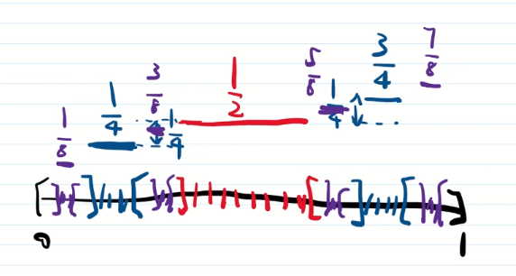

# 54_单调函数可微性的两个例子

上一节得出, 单调增函数有两个性质:

1. 几乎处处可微;
2. $\int_{a}^{b}f'(x)dx\le f(b)-f(a)$ .

例1说明, 单调增函数未必处处可微, 因此第一个结论无法改进. 

**例1** 已知 $E\sub [a,b]$ 是零测集, 存在 $[a,b]$ 上的增函数, 使 $f(x)$ 在 $E$ 上不可微. 事实上, 存在 $[a,b]$ 上的增函数 $f(x)$ , 使 $\forall x\in E, f'(x)=+\infty$ . 

> 证: 存在一列开集 $G_1\supset G_2\supset \cdots$ , 使 $E\sub G_n$ , 且 $m(G_n)<\frac{1}{2^n}$ .
>
> 令 $f_n(x)=m([a,x]\cap G_n)$ , 则 $f_n(x)$ 在 $[a,b]$ 上单调增, 连续(之前做过习题). 由 $0\le f_n(x)\le m(G_n)<\frac{1}{2^n}$ , 因此 $f(x)=\sum_{n=1}^{\infty}f_n(x)$ 是一致收敛的. 因此 $f(x)$ 在 $[a,b]$ 上连续, 单调增. 下面说明 $\forall x\in E, f'(x)=+\infty$ .
>
> $\forall x\in E$ , 设 $x\in G_n$ , 当 $x\neq b$ , 给定 $k\in \mathbb{N}$ , 存在  $\varepsilon >0$ , 使 $0<h<\varepsilon$ 时, $[x,x+h]\sub G_1, G_2, \cdots, G_k$ .
> $$
> \frac{1}{h}[f(x+h)-f(x)]
> =\frac{1}{h}[\sum_{i=1}^{\infty}f_i(x+h)-\sum_{i=1}^{\infty}f_i(x)] \\
> =\frac{1}{h}\sum_{i=1}^{\infty}[(f_i(x+h)-f_i(x)]
> \ge \frac{1}{h}\sum_{i=1}^{k}[(f_i(x+h)-f_i(x)] \\
> =\frac{1}{h}\sum_{i=1}^{k}[m([a,x+h]\cap G_i)-m([a,x]\cap G_i)]
> =\frac{1}{h}\sum_{i=1}^{k}[(x+h-a)-(x-a)] \\
> =\frac{1}{h}\sum_{i=1}^{k}h
> =k
> $$
>  故 $f'_+(x)=+\infty$ .
>
> 同理, $\forall x\in E$ , 当 $x\neq a$ , $f'_-(x)=+\infty$ .
>
> 综上, $f(x)$ 在 $[a,b]$ 上的单调增, 连续, $\forall x\in E, f'(x)=+\infty$ . 证毕.

例2说明, $\int_{a}^{b}f'(x)dx$ 可以严格小于 $f(b)-f(a)$ .

**例2** $P_0:$  Cantor 三分集. $G_0:=P_0$ 在 $[0,1]$ 中的余集.

定义函数 $\theta (x)$ . 在 $G_0$ 上, $\theta(x)$ 在第 $n$  类区间的 $2^{n-1}$ 个开区间上依次取值 $\frac{1}{2^n},\frac{3}{2^n},\frac{5}{2^n},\cdots, \frac{2^n-1}{2^n}$ .

对 $x_0\in P_0$ , 定义 $\theta(x_0)=\sup_{x\in G_0,x\le x_0} \theta(x)$ .

可以验证 $\theta(x)$ 是 $[0,1]$ 上的连续函数.

由 $\theta(x)$ 是增函数, 可证明 $\lim_{x\to x_0^-}\theta(x)=\lim_{x\to x_0^+}\theta(x)=\theta(x_0)$ .

综上, $\theta(x)$ 是 $[0,1]$ 上的连续增函数. 由 Lebesgue 定理,  $\theta(x)$ 几乎处处可微. 对 $x\in G_0,\theta'(x)=0$ , 因此 $\theta'(x)$ 几乎处处为0, 由 Lebesgue 积分的性质, $\int_{0}^{1}\theta'(x)=0$ , 而 $\theta(1)-\theta(0)=1-0=1$ , 因此 $\int_{0}^{1}\theta'(x)<\theta(1)-\theta(0)$ .

后面将会学习等号成立的条件.

