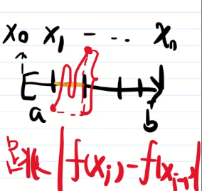
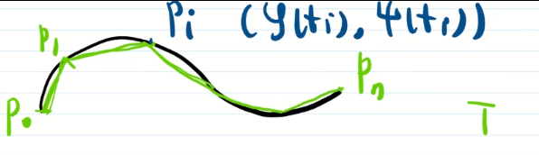

# 55_有界变差函数

问题：

$f(x) \overset{求导}{\underset{R-积分还原}{\longleftrightarrows}} f'(x) R-可积$ .

N-L 公式: $f(x)-f(a)=\int_{a}^{x}f'(t)dt$ .

Riemann 积分中, 积分和求导互为逆运算. 能不能推广到 Lebesgue 积分中?

$f(x)$ 在 $[a,b]$ 上是增函数, 则

1. $f'(x)$ a.e. 存在;
2. $f’(x)\in L[a,b]$ ;
3. $\int_{a}^{b}f'(x)dx\le f(b)-f(a)$ .

第三条的不等号可能是严格成立的. 因为在上一节中构造了奇异的函数 $\theta(x)$ , $\theta(x)$ 在 $[0,1]$ 不是常数, 但 $\theta'(x)$ 在 $[0,1]$ a.e. 为 0 . 而 $\int_{0}^{1}\theta'(x)dx=0\neq \theta(1)-\theta(0)$ .

问: 什么函数满足 $f(x)-f(a)=\int_{a}^{x}f'(t)dt$ ?

$\int_{a}^{x}g(t)dt$ 满足什么性质?

由 Lebesgue 积分的定义, $\int_{a}^{x}g(t)dt=\int_{a}^{x}g^+(t)dt-\int_{a}^{x}g^-(t)dt$ . 而 $\int_{a}^{x}g^+(t)dt$ 和 $\int_{a}^{x}g^-(t)dt$ 都是增函数. 于是 $\int_{a}^{x}g(t)dt$ 可以写成两个增函数之差的形式.

**定义1** (有界变差函数) 已知 $f(x)$ 在 $[a,b]$ 上有限. 若 $f(x)=g(x)-h(x)$ , 这里 $g(x),h(x)$ 在 $[a,b]$ 上增, 则称 $f(x)$ 是 $[a,b]$ 上的有界变差函数. 这种形式称为 Jordan 分解.

**定义1'** (有界变差函数) 已知 $f(x)$ 在 $[a,b]$ 上有限. 对 $[a,b]$ 做分划, 若 $\{\sum_{i=1}^{n}|f(x_j)-f(x_{i-1})| \}_{任一分划T}$ 是一个有界集, 称 $f(x)$ 是 $[a,b]$ 上的有界变差函数. $\sum_{i=1}^{n}|f(x_j)-f(x_{i-1})|$ 称为分划 $T$ 下对应的变差. 集合 $\{\sum_{i=1}^{n}|f(x_j)-f(x_{i-1})| \}_{任一分划T}$ 的上确界称为 $f(x)$ 在 $[a,b]$ 上的全变差, 记为 $\bigvee_{a}^{b}(f)$ .

定义 1' 的函数从哪儿来?

其来源于求弧长

 

用上确界定义弧长. 对于取点方式 $T$ , 内接折线长为 $L(T)$ . 若 $\{L(T)\}$ 是有界集, 称该曲线是可求长的, 定义 $L=\sup_{L}L(T)<\infty$ , 称为该曲线的长度.

对于曲线
$$
\begin{cases}
	x = \varphi(t) \\
	y = \psi(t)
\end{cases},
\quad t\in[\alpha, \beta]
$$
做分划 $T:\alpha=t_0<\cdots<t_n=\beta$ . 则折线长 $L(T)=\sum_{i=1}^{n} \left\{[\varphi(t_i)-\varphi(t_{i-1})]^2+[\psi(t_i)-\psi(t_{i-1})]^2\right\}^\frac{1}{2}$ . 而 
$$
\sum_{i=1}^{n} |\varphi(t_i)-\varphi(t_{i-1})|
\le \sum_{i=1}^{n} \left\{[\varphi(t_i)-\varphi(t_{i-1})]^2+[\psi(t_i)-\psi(t_{i-1})]^2\right\}^\frac{1}{2} \\
\sum_{i=1}^{n} |\psi(t_i)-\psi(t_{i-1})|
\le \sum_{i=1}^{n} \left\{[\varphi(t_i)-\varphi(t_{i-1})]^2+[\psi(t_i)-\psi(t_{i-1})]^2\right\}^\frac{1}{2} \\
\sum_{i=1}^{n} \left\{[\varphi(t_i)-\varphi(t_{i-1})]^2+[\psi(t_i)-\psi(t_{i-1})]^2\right\}^\frac{1}{2}
\le \sum_{i=1}^{n} \left[|\varphi(t_i)-\varphi(t_{i-1})|
+|\psi(t_i)-\psi(t_{i-1})|\right]
$$
从而 $L(T)$ 有上界 $\Leftrightarrow$ $\sum_{i=1}^{n} |\varphi(t_i)-\varphi(t_{i-1})|$ 与 $\sum_{i=1}^{n} |\psi(t_i)-\psi(t_{i-1})|$ 均有上界, 即 $\varphi,\psi$ 在定义1' 下, 在 $[\alpha,\beta]$ 上是有界变差的.

下面考虑满足定义 1' 的函数, 有什么性质?

1. 有界
2. 所有的有界变差函数可以做成一个线性空间, 即 $f+g$ , $cf$ 不会跑出去.
3. 若 $f,g$ 满足定义 1' , 则 $f\cdot g$ 满足定义 1’ .

> 证: 1, 2 是显然的, 现证 3 .
>
> 由 $f,g$ 有界变差, 得 $f,g$ 都是有界的, 于是 $\exist M,s.t.|f(x)|\le M,|g(x)|\le M,\sum_{i=1}^{n}|f(x_i)-f(x_{i-1})|<M,\sum_{i=1}^{n}|g(x_i)-g(x_{i-1})|<M$ .
>
> 任取分划 $a=x_0<x_1<\cdots<x_n=b$ , 
> $$
> \sum_{i=1}^{n}|f\cdot g(x_i)-f\cdot g(x_{i-1})|
> =\sum_{i=1}^{n}|f(x_i)g(x_i)-f(x_{i-1})g(x_{i-1})| \\
> =\sum_{i=1}^{n}|f(x_i)g(x_i)-f(x_{i-1})g(x_i)+f(x_{i-1})g(x_i)-f(x_{i-1})g(x_{i-1})| \\
> =\sum_{i=1}^{n}|[f(x_i)-f(x_{i-1})]g(x_i)+f(x_{i-1})[g(x_i)-g(x_{i-1})]| \\
> \le \sum_{i=1}^{n}|f(x_i)-f(x_{i-1})|\cdot |g(x_i)|+\sum_{i=1}^{n}|f(x_{i-1})|\cdot |g(x_i)-g(x_{i-1})| \\
> \le M\sum_{i=1}^{n}|f(x_i)-f(x_{i-1})|+M\sum_{i=1}^{n}\cdot |g(x_i)-g(x_{i-1})| \\
> \le 2M^2
> $$
>  故 $f\cdot g$ 满足定义 1' .

4. $f$ 在 $[a,b]$ 上满足定义 1' , 则在 $[a,b]$ 的任一子区间 $[a_1,b_1]$ 上也满足定义 1' . 若 $a<c<b$ , $f(x)$ 在 $[a,c]$ 及 $[c,b]$ 上满足定义 1' . 则
   $$
   \bigvee_{a}^{b}(f)=\bigvee_{a}^{c}(f)+\bigvee_{c}^{b}(f)
   $$
   该性质称为可加性.

> 证: 只证可加性. 
>
> 先证 $左边\le 右边$ . 想证上确界小于等于某个数.
>
> 任取分划 $T:a=x_0<x_1<\cdots<x_n=b$ , 
>
> 如果 $c$ 是 $T$ 的分点, 设 $c=x_k$ , 
>
> 
>
> 有
> $$
> \bigvee_{a}^{b}(f)
> =\sum_{i=1}^{n}|f(x_i)-f(x_{i-1})|
> =\sum_{i=1}^{k}|f(x_i)-f(x_{i-1})|+\sum_{i=k+1}^{n}|f(x_i)-f(x_{i-1})| \\
> \le \bigvee_{a}^{c}(f) + \bigvee_{c}^{b}(f)
> $$
> 如果 $c$ 不是分点, 设 $x_k<c<x_{k+1}$ , 
>
>  
> $$
> \bigvee_{a}^{b}(f)
> =\sum_{i=1}^{n}|f(x_i)-f(x_{i-1})| \\
> =\sum_{i=1}^{k}|f(x_i)-f(x_{i-1})|
> +|f(x_{k+1})-f(x_{k})|
> +\sum_{i=k+2}^{n}|f(x_i)-f(x_{i-1})| \\
> \le \left(\sum_{i=1}^{k}|f(x_i)-f(x_{i-1})|
> +|f(c)-f(x_{k})|\right) + \left(|f(x_{k+1})-f(c)|
> +\sum_{i=k+2}^{n}|f(x_i)-f(x_{i-1})|\right) \\
> \le \bigvee_{a}^{c}(f) + \bigvee_{c}^{b}(f)
> $$
> 于是, $\bigvee_{a}^{b}(f)\le \bigvee_{a}^{c}(f)+\bigvee_{c}^{b}(f)$ .
>
> 下面证 $右边\le 左边$ . 想证上确界加上确界小于等于某数.
>
> $\forall \varepsilon>0$ , 找到分划 $T_1:a=y_0<y_1<\cdots<y_m=c$ , $T_2: c=z_0<z_1<\cdots<z_n=b$ , 使
> $$
> \bigvee_{a}^{c}(f)<\sum_{i=1}^{m}|f(y_i)-f(y_{i-1})|+ \frac{\varepsilon}{2}\\
> \bigvee_{c}^{b}(f)<\sum_{i=1}^{n}|f(z_i)-f(z_{i-1})|+ \frac{\varepsilon}{2}
> $$
> 将 $T_1$ 和 $T_2$ 合并, 得到 $[a,b]$ 的分划 $T$ , 对应的变差
> $$
> \sum_{i=1}^{m}|f(y_i)-f(y_{i-1})|+\sum_{i=1}^{n}|f(z_i)-f(z_{i-1})|
> >\bigvee_{a}^{c}(f)+\bigvee_{c}^{b}(f)-\varepsilon
> $$
> 从而 $\bigvee_{a}^{b}(f)>\bigvee_{a}^{c}(f)+\bigvee_{c}^{b}(f)-\varepsilon$ .
>
> 由 $\varepsilon$ 的任意性, 得 $\bigvee_{a}^{b}(f)\ge \bigvee_{a}^{c}(f)+\bigvee_{c}^{b}(f)$ .
>
> 综上, $\bigvee_{a}^{b}(f)=\bigvee_{a}^{c}(f)+\bigvee_{c}^{b}(f)$ . 证毕.

根据 4 , 若 $f$ 在 $[a,b]$ 上满足定义 1' , 则 可以定义 $\bigvee_{a}^{x}(f),a\le x\le b$ . 其是 $[a,b]$ 上的增函数.

> 证: 对于 $a\le x_1<x_2\le b$ , $\bigvee_{a}^{x_2}(f)-\bigvee_{a}^{x_1}(f)=\bigvee_{x_1}^{x_2}(f)\ge 0$ . 因此 $\bigvee_{a}^{x}(f)$ 是 $[a,b]$ 上的增函数.

下面说明定义 1 与 定义 1' 等价.

> 先证 $f$ 满足定义 1 $\Rightarrow$ $f$ 满足定义 1' . 分两步, 易证: 增函数满足定义 1' + {满足定义 1' 的函数} 是线性空间. 
>
> 再证 $f$ 满足定义 1' $\Rightarrow$ $f$ 满足定义 1 .
>
> 令 $g(x)=\bigvee_{a}^{x}(f)$ , $g(x)$ 增.
>
> 令 $h(x)=g(x)-f(x)$ . 任取 $a\le x_1<x_2\le b$ , 
> $$
> h(x_2)-h(x_1)
> =(\bigvee_{a}^{x_2}(f)-f(x_2))-(\bigvee_{a}^{x_1}(f)-f(x_1)) \\
> =\bigvee_{x_1}^{x_2}(f)-[f(x_2)-f(x_1)]
> \ge |f(x_2)-f(x_1)|-[f(x_2)-f(x_1)]\ge 0
> $$
> 
>
> 即 $h(x)$ 是增函数.

**总结**

1. 定义1' 定义了有界变差函数

   1. 求弧长而来
   2. $\Leftrightarrow$ 定义1 增函数之差

   Jordan 分解

2. $f(x)$ 是 $[a,b]$ 上的有界变差函数, 则

   1. $f(x)$ 在 $[a,b]$ 上几乎处处存在导数;

   1. $f'(x)\in L[a,b]$ .

想回答: 什么函数能满足 N-L 公式?

要在有界变差函数之内选, 但并不是所有的有界变差函数都行.

**例** $\theta(x)$ 是有界变差函数, 但不满足 N-L 公式.

要去掉 $\theta(x)$ 这样的函数.  $\theta(x)$ 的特点: $\theta(x)$ 不是常数, 但 $\theta'(x)$ a.e. 为 0 . 

