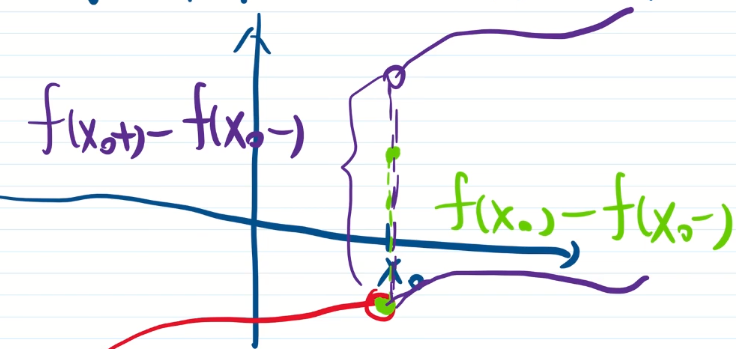
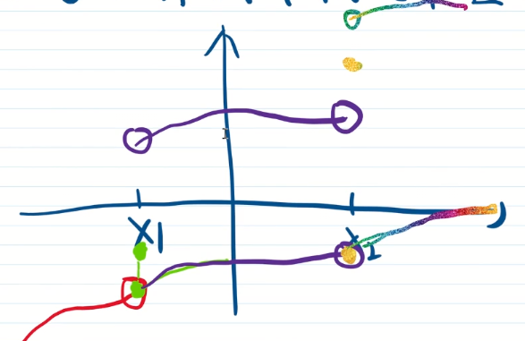
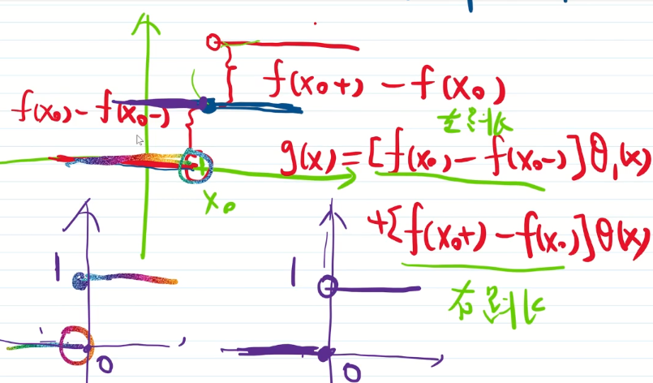

# P56_有界变差函数的补充说明

1. Jordan 分解. 有界变差 = 增 - 增. 注意, 这两个增函数并不是唯一的. 如 $f(x)=g(x)-h(x)$ , 其中 $g(x),h(x)$ 都是增函数, 取增函数 $a(x)$ , 则 $g(x)+a(x),h(x)+a(x)$ 仍是增函数, 而 $f(x)=[g(x)+a(x)]-[h(x)+a(x)]$ . 可以取特殊的增函数 $P(x)=\frac{1}{2}[\bigvee_{a}^{x}(f)+f(x)-f(a)]$ , $n(x)=\frac{1}{2}[\bigvee_{a}^{x}(f)-f(x)+f(a)]$ . 可以验证, 这两个函数都是增函数. 而 $\bigvee_{a}^{x}(f)=P(x)+n(x)$ , $f(x)-f(a)=P(x)-n(x)$ . 称 $P(x)$ 为正变差函数, $n(x)$ 为负变差函数, 将该分解称为正规分解.

2. 有界变差与连续.

   1. 有界变差不一定连续.

      例: 

      

      是增函数, 因此有界变差, 但不连续. 

      增函数的间断点

      - 只能是第一类间断点(即左右极限都存在) 
      - 只有至多可数个

      有界变差函数是两增函数之差, 因此其间断点应该也有这样的性质, 即

      - 只能是第一类间断点(即左右极限都存在) 
      - 只有至多可数个

   2. 连续函数不一定是有界变差函数.

      反例: 不停震荡的连续函数
      $$
      f(x)=\begin{cases}
      x\sin(\frac{1}{x}), \quad 0<x\le 1 \\
      0, \quad x=0
      \end{cases}
      $$
      做分划 $x_0=0, x_1=\frac{1}{(n-2)\pi+\frac{\pi}{2}}, x_2=\frac{1}{(n-3)\pi+\frac{\pi}{2}},\cdots, x_{n-1}=\frac{1}{\pi+\frac{\pi}{2}}, x_n=1$ .

      则
      $$
      \sum_{i=1}^{n}|f(x_i)-f(x_{i-1})|
      =|x_1\sin{\frac{1}{x_1}}-0|+|x_2\sin{\frac{1}{x_2}}-x_1\sin{\frac{1}{x_1}}| \\
      +\cdots+|x_{n-1}\sin{\frac{1}{x_{n-1}}}-x_{n-2}\sin{\frac{1}{x_{n-2}}}|+|\sin 1-x_{n-1}\sin{\frac{1}{x_{n-1}}}| \\
      \ge x_1+(x_2+x_1)+\cdots+(x_{n-1}+x_{n-2})+\sin 1+x_{n-1} \\
      \ge 2x_1+2x_2+\cdots +2x_{n-1}+\sin 1
      $$
      当 $n\to \infty$ 时, $2x_1+2x_2+\cdots +2x_{n-1}+\sin 1$ 是发散的, 因此 $f(x)$ 不是有界变差函数.
   
   3. 有界变差与连续的关系
   
      先看增函数. 如果 $f(x)$ 只有一个间断点 $x_0$ , 如下图, 令
   
      
      $$
      g(x)=\begin{cases}
      0, x<x_0 \\
      f(x_0)-f(x_0^-), x=x_0 \\
      f(x_0^+)-f(x_0^-), x>x_0
      \end{cases}
      $$
      定义 $h(x):=f(x)-g(x)$ , 则
      $$
      h(x_0^-)=f(x_0^-)-g(x_0^-)=f(x_0^-) \\
      h(x_0)=f(x_0)-g(x_0)=f(x_0^-) \\
      h(x_0^-)=f(x_0^+)-g(x_0^+)=f(x_0^-)
      $$
      于是 $h(x_0^-)=h(x_0)=h(x_0^+)$ , 即 $h(x)$ 连续. 于是 $f(x)=g(x)+h(x)$ , 其中 $g(x)$ 是阶梯函数, $h(x)$ 是连续函数.
   
      如果 $f(x)$ 有两个间断点 $x_1<x_2$ , 如下图, 令
   
      
      $$
      g(x)=\begin{cases}
      0, x<x_1 \\
      f(x_1)-f(x_1^-), x=x_1\\
      f(x_1^+)-f(x_1^-), x_1<x<x_2 \\
      f(x_1^+)-f(x_1^-)+f(x_2)-f(x_2^-), x=x_2 \\
      f(x_1^+)-f(x_1^-)+f(x_2^+)-f(x_2^-), x>x_2 \\
      \end{cases}
      $$
      定义 $h(x):=f(x)-g(x)$ , 显然 $h(x)$ 连续. 于是 $f(x)=g(x)+h(x)$ , 其中 $g(x)$ 是阶梯函数, $h(x)$ 是连续函数.
   
      若 $f(x)$ 有 $n$ 个间断点, 完全类似地,  $f(x)=阶梯+连续$ . 
   
      若 $f(x)$ 有可数个间断点, 需要用另外的方法构造阶梯函数.
   
      
   
      定义
      $$
      \theta(x)=\begin{cases}
      0,x\le 0 \\
      1,x>0
      \end{cases},\quad
      \theta_1(x)=\begin{cases}
      0,x<0 \\
      1,x\ge0
      \end{cases}
      $$
      令 $g(x)=[f(x_0)-f(x_0^-)]\theta_1(x-x_0)+[f(x_0^+)-f(x_0)]\theta(x-x_0)$  ,
   
      
   
      定义
      $$
      g(x)
      =\mu_1\theta_1(x-x_1)+\lambda_1\theta(x-x_1)+\cdots+\mu_n\theta_1(x-x_n)+\lambda_n\theta(x-x_n) \\
      =\sum_{i=1}^{n}\mu_n \theta_1(x-x_n)+\sum_{i=1}^{n}\lambda_n \theta(x-x_n)
      $$
      其满足间断点只有 $P_1,\cdots,P_n,\cdots$ . 其在 $P_n$ 的左边跳了 $\mu_n=f(P_n)-f(P_n^-)$ , 其在 $P_n$ 的右边跳了 $\lambda_n=f(P_n^+)-f(P_n)$ . 构造 $g(x)=\sum_{i=1}^{n}\mu_n\theta_1(x-x_n)+\sum_{i=1}^{n}\lambda_n\theta(x-x_n)$ . 定义 $h(x):=f(x)-g(x)$ , 则 $h(x)$ 连续. 于是得到结论: 增函数 = 阶梯函数 + 连续函数.
   
      而有界变差函数是两个增函数的差, 因此得到定理
   
      有界变差函数 = 阶梯函数 + 连续函数

**总结** 有界变差的分解

1. Jordan 分解
   1. 不唯一
   2. 正规分解
2. 有界变差 = 阶梯 + 连续
   1. 后面会讲勒贝格分解

