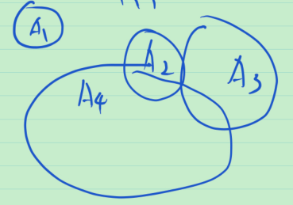

# 5_集合列的上极限和下极限

数列 $\{a_n\}$ 的上下极限的定义
$$
\varlimsup_{n \to \infty}{a_n} :=  
\inf_{n \ge 1}\sup_{k\ge n}\{a_k\} \\
\varliminf_{n \to \infty}{a_n} := 
\sup_{n \ge 1}\inf_{k\ge n}\{a_k\}
$$
想法: 要找集合的"上下确界"

数列 ${a_n}$  的上确界 ≈(直观上) 比 $a_n$ 都大的数中"最小"的那个

通过类比, 集合列 $\{A_n\}$ 的上确界是比 $A_n$ 都"大"的集合中"最小"的那个, 直观上, A 比 B "大"( B 比 A 小 ) 即 $B \sub A$ .

对于集合列 $\{A_n\}$ 的上确界(想找的集合), $A_n$ 中所有的点都应落在其中, 从而$\bigcup_{n=1}^{\infty}{A_n} \sub 想找的集合$ , 而显然 $A_n \in \bigcup_{n=1}^{\infty}{A_n}$ , 即 $\bigcup_{n=1}^{\infty}{A_n}$ 比所有的 $A_n$ 都大. 

于是, 集合列 $\{A_n\}$ 的上确界为 $\bigcup_{n=1}^{\infty}{A_n}$ .

同理, 集合列 $\{A_n\}$ 的下确界为 $\bigcap_{n=1}^{\infty}{A_n}$ .

定义集合列 ${A_n}$ 的上下极限: 
$$
\varlimsup_{n \to \infty}{A_n} :=  
\bigcap_{n \ge 1}\bigcup_{k\ge n}\{A_k\} \\
\varliminf_{n \to \infty}{A_n} := 
\bigcup_{n \ge 1}\bigcap_{k\ge n}\{A_k\}
$$
思考:为什么能定义上下极限? 即: 数列和集合列有什么共性让我们能定义上下极限?

**例** (单调集列)

> 单调数列: 
>
> 递增数列: $a_1 \le a_2 \le  a_3 \le \cdots$ .
>
> 递减数列: $a_1 \ge a_2 \ge  a_3 \ge \cdots$ .

递增集列: $A_1 \sub A_2 \sub A_3 \sub \cdots$ .

递减集列: $A_1 \supset A_2 \supset A_3 \supset \cdots$ 

**定义** (集合列的极限)

> 对于数列 $\{a_n\}$ : 若 $\varlimsup_{n \to \infty}{a_n} = \varliminf_{n \to \infty}{a_n}$ , 则称数列 $\{a_n\}$ 有极限, 记为 $\lim_{n \to \infty}{a_n} := \varlimsup_{n \to \infty}{a_n} = \varliminf_{n \to \infty}{a_n}$ .

对于集合列 $\{A_n\}$ , 若 $\varlimsup_{n\to \infty} A_n = \varliminf_{n\to \infty} A_n$ , 则称 ${A_n}$ 有极限, 记为
$$
\lim_{n\to \infty} A_n := \varlimsup_{n\to \infty} A_n = \varliminf_{n\to \infty} A_n
$$
 **例** 对于递增集列 $A_n$ , 易验证
$$
\varlimsup_{n \to \infty}{A_n} = 
\bigcap_{n \ge 1}\bigcup_{k\ge n}\{A_k\} = \bigcup_{n \ge 1}\bigcap_{k\ge n}\{A_k\} = 
\varliminf_{n \to \infty}{A_n} 
$$
> 如下图所示, 直观上, $\lim_{n\to \infty}A_n$ 存在, 为 $\bigcup_{n=1}^{\infty}A_n$ . 
>
> > 递增数列 $\{a_n\}$ , $\lim_{n\to \infty}a_n \sup_{n\ge 1}a_n$ .
>
> 
>
> 可以验证, $\lim_{n\to \infty}A_n = \bigcup_{n=1}^{\infty}A_n$ . 
>
> 同理, 对于递减集合列 ${B_n}$ , 可以验证 $\lim_{n\to \infty}B_n = \bigcap_{n=1}^{\infty}B_n$ . 

与书上定义看似不一样! 对于上极限 $\varlimsup_{n \to \infty}{A_n} :=  
\bigcap_{n \ge 1}\bigcup_{k\ge n}\{A_k\}$ ,  $x\in \varlimsup_{n \to \infty}{A_n}$ ,即 $\forall{n \ge 1}, \exist{k\ge n}, s.t. x \in \{A_k\}$ ,与书上上极限的定义完全一样. 对于下极限 $\varliminf_{n \to \infty}{A_n} :=  
\bigcup_{n \ge 1}\bigcap_{k\ge n}\{A_k\}$ ,  $x\in \varliminf_{n \to \infty}{A_n}$ ,即 $\exist{n \ge 1}, \forall{k\ge n}, s.t. x \in \{A_k\}$ , 与书上下极限的定义完全一样.

**例** 已知 $A_n =
\begin{cases}
[0, 2-\frac{1}{2m+1}], \quad n=2m+1, m=0,1,\cdots \\
[0, 1+\frac{1}{2m}], \quad n=2m, m=1,2, \cdots 
\end{cases}$ , 求 $\varlimsup_{n\to \infty}A_n$ 和 $\varliminf_{n\to \infty}A_n$ .

> 猜: $\varlimsup_{n\to \infty}A_n \in 0到2的区间$ , 开? 闭? 有开有闭? 
>
> 用定义算(练习)
>
> 由 $\bigcup_{k\ge n}\{A_k\} = [0, 2)$ ,得上极限 $\varlimsup_{n \to \infty}{A_n} =  
> \bigcap_{n \ge 1}\bigcup_{k\ge n}\{A_k\}$ 
>
> 由 $\bigcap_{k\ge n}\{A_k\} = [0, 1]$ , 得下极限 $\varliminf_{n \to \infty}{A_n} =  
> \bigcup_{n \ge 1}\bigcap_{k\ge n}\{A_k\} = [0, 1]$ 

**例** 数列 $a_n$ 的极限也可以用下述定义: $\lim_{n\to \infty}a_n=a :\Leftrightarrow \forall \varepsilon > 0, \exist N \in \mathbb N, s.t. \forall n \ge N, |a_n-a|<\varepsilon$ .

用集合的语言表示, 则 $a\in \bigcap_{\varepsilon\in \mathbb{R_+}}\bigcup_{N=1}^{\infty}\bigcap_{n\ge N}\{x: |a_n-x|<\varepsilon\}$ ,即 $a\in \bigcap_{\varepsilon\in \mathbb{R_+}}\varliminf_{n\to \infty}\{x: |a_n-x|<\varepsilon\}$ .

**例** $f(x)$ 是定义在 $E$ 上的有限函数,  $F_n = \{x: |f(x)|\ge \frac{1}{n}\}, n=1,2,\cdots $, 则 $\{F_n\}$ 是递增集合列, 且 $\lim_{n\to \infty}F_n = \bigcup_{n=1}^{\infty}\{x: |f(x)|\ge \frac{1}{n}\}, n=1,2,\cdots = \{x: f(x)\ne 0\}$ . $E_n = \{x:f(x)>n\}$ ,  $\{E_n\}$ 是递减的集合列, $\lim_{n\to \infty}E_n = \bigcap_{n=1}^{\infty}\{x:f(x)>n\}\ne \varnothing$ .

> 注: 有限不等于有界

**总结** 集合列的上下极限&极限(收敛)&单调集列可以类比数列. 唯一需要的是比大小. 集合列的 $\sub$ 对应于数列的 $\le$ .

> 注: 为了对比, $A_1 \sub A_2 \sub A_3 \sub \cdots$ 称为递增集列, 书上称为增加集列. 
>
> 

