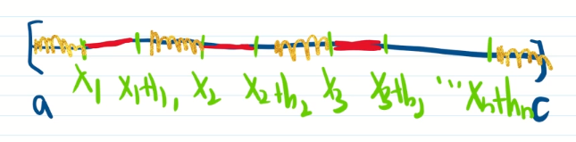

# 60_微积分基本定理之先微分再积分

$f'(x)\in L[a,b]$ , $\int_{a}^{x}f'(t)dt=f(x)-f(a)$ ? 前面已经知道这不一定成立, 问: 什么样的函数满足此等式?

首先要看先积分再微分是否成立, 已经证好了.

再看 $f'(x)\equiv 0$ a.e.成立 $\Rightarrow$ $f(x)$ 为常数?

问题: 什么样的函数 $f(x)$ 满足 $f'(x)\equiv 0$ a.e.成立 $\Rightarrow$ $f(x)$ 为常数?

来看 $f(x)$ 不是常数, 但 $f'(x)\equiv 0$ a.e.成立, 有什么性质? 则 $f(x)$ 不应满足这个性质.

**引理** 若 $f(x)$ 在 $[a,b]$ 上几乎处处可微, $f'(x)=0$ a.e. 于 $[a,b]$ , $f(x)$ 在 $[a,b]$ 上不是常值函数, 则 $\exist \varepsilon>0,\forall \delta>0$ , 存在 $[a,b]$ 内互不相交的区间 $(x_1,y_1),\cdots,(x_n,y_n)$ , 使这些区间的长度和 $\sum_{i=1}^{n}|y_i-x_i|< \delta$ , 且 $\sum_{i=1}^{n}|f(y_i)-f(x_i)|>\varepsilon$ . 将满足 $f'(x)=0$ a.e. 于 $[a,b]$ 且不是常值函数的函数 $f(x)$ 称为奇异函数.

> 证: 由 $f(x)$ 不是常数, 得 $\exist c\in [a,b]$ , s.t. $f(a)\neq f(c)$ .
>
> $\exist E\sub [a,c]$ , s.t. $m([a,c]-E)=0$ , $\forall x\in E$ , $f'(x)=0$ , 即 $\lim_{h\to 0}|\frac{f(x+h)-f(x)}{h}|=0$ , 只证 $h>0$ 的情况, 即只证 $\lim_{h\to 0^+}|\frac{f(x+h)-f(x)}{h}|=0$ . 在严格单调增函数几乎处处可导的引理时, 看到这样一个等式, 就可以构造出 Vitali 覆盖.
>
> **取 $2\varepsilon=|f(c)-f(a)|>0$ , 固定 $r=\frac{\varepsilon}{c-a}$ ,**
>
> > 任取 $r>0$ ,
>
>  $\exist \delta_1>0$ , 当 $0<h<\delta_1$ 时, $|f(x+h)-f(x)|<rh$ . 则所有这样的 $[x,x+h]$ 构成了 $E$ 的一个覆盖, 且是 Vitali 覆盖. 于是 $\forall \delta>0$ , $\exist [x_1,x_1+h_1],\cdots,[x_n,x_n+h_n]$ , s.t. 它们互不相交, 且 $m(E-\bigcup_{i=1}^{n}[x_i,x_i+h_i])<\delta$ . 不妨设 $x_1<x_1+h_1<\cdots<x_n<x_n+h_n$ , 如图, 黄色线的总长度小于 $\delta$ ,
>
> 
>
> 即 $m\left((a_1,x_1)\cup \bigcup_{i=1}^{n}(x_i+h_i,x_{i+1})\cup (x_n+h_n,c)\right)<\delta$ .
>
> 而 $\sum_{i=1}^{n}|f(x_i+h_i)-f(x_i)|<r\sum h_i<r(c-a)$ $\bold{=\varepsilon}$ , 又
> $$
> |f(x)-f(a)|+\sum_{i=1}^{n}|f(x_{i+1})-f(x_i+h_i)|+|f(c)-f(x_n+h_n)| \\
> +\sum_{i=1}^{n}|f(x_i+h_i)-f(x_i)| \\
> \ge
> |f(x)-f(a)+\sum_{i=1}^{n}[f(x_{i+1})-f(x_i+h_i)]+f(c)-f(x_n+h_n) \\
> +\sum_{i=1}^{n}[f(x_i+h_i)-f(x_i)]|
> =|f(c)-f(a)|
> $$
>
> > 而 $|f(c)-f(a)|$ 是一个固定的正数, $r(c-a)$ 可以任意小, 因此调整 $r$ 就可以让 $|f(x)-f(a)|+\sum_{i=1}^{n}|f(x_{i+1})-f(x_i+h_i)|+|f(c)-f(x_n+h_n)$ 大于某固定的正数.
>
> 于是 $|f(x)-f(a)|+\sum_{i=1}^{n}|f(x_{i+1})-f(x_i+h_i)|+|f(c)-f(x_n+h_n)|>\varepsilon$ , 证毕.

将奇异函数的定义反过来写, 得到绝对连续函数的定义.

**定义** (绝对连续函数)  $\forall \varepsilon>0,\exist \delta>0$ , 任取 $[a,b]$ 内互不相交的区间 $(x_1,y_1),\cdots,(x_n,y_n)$ , 若 $\sum_{i=1}^{n}|y_i-x_i|$ $< \delta$  可以推出  $\sum_{i=1}^{n}|f(y_i)-f(x_i)|<\varepsilon$ . 则称 $f(x)$ 为绝对连续函数. 

若引理已证好, 则已知 $f(x)$ 为绝对连续函数, $f'(x)\equiv 0$ a.e.成立 $\Rightarrow$ $f(x)$ 为常数. 

要满足 $f(x)-\int_{a}^{x}f'(t)dt\equiv C$ , 只需 $f(x)-\int_{a}^{x}f'(t)dt$ 是绝对连续函数. 

问: 什么样的函数 $f$ 满足 $f(x)-\int_{a}^{x}f'(t)dt$ 绝对连续? 前面曾得到过以下性质.

**性质** (积分的绝对连续性) $\forall \varepsilon>0,\exist \delta>0,m(E)<\delta, \int_E|g(x)|dx<\varepsilon$ .

猜测 $\int_{a}^{x}g(t)dt$ 是绝对连续的.

事实上, 若 $(x_1,y_1),\cdots,(x_n,y_n)$ 互不相交, 长度和 $< \delta$ .
$$
\sum_{i=1}^{n}|\int_{a}^{y_i}g(t)dt-\int_{a}^{x_i}g(t)dt|
=\sum_{i=1}^{n}|\int_{x_i}^{y_i}g(t)dt|
\le \int_{x_i}^{y_i}|g(t)|dt \\
=\int_{\bigcup_{i=1}^{n}(x_i,y_i)}|g(t)|dt 
< \varepsilon
$$
结论: 若 $g(x)\in L[a,b]$ , 则 $\int_{a}^{x}g(t)dt$ 绝对连续.

性质: $[a,b]$ 上绝对连续函数构成线性空间.

> 有了该性质, 就回答了 
>
> 问: 什么样的函数 $f$ 满足 $f(x)-\int_{a}^{x}f'(t)dt$ 绝对连续?  
>
> 答案: 绝对连续函数

**总结** $f'(x)$ a.e.存在, $f'(x)\in L[a,b]$ , 则 $f(x)=\int_{a}^{x}f'(t)dt+f(a)$ $\Leftrightarrow$ $f(x)$ 是一个绝对连续函数.

还不满足, 条件是否独立? $f'(x)$ a.e.存在, $f'(x)\in L[a,b]$ 是否可以自动满足?

**定理** 绝对连续函数是有界变差函数.

> 证: 取 $\varepsilon=1$ , $\exist \delta>0$ , 任取 $[a,b]$ 内互不相交的区间 $(x_1,y_1),\cdots,(x_n,y_n)$ , 若 $\sum_{i=1}^{n}|y_i-x_i|$ $< \delta$  , 则 $\sum_{i=1}^{n}|f(y_i)-f(x_i)|<\varepsilon$ . 
>
> 
>
> 取正整数 $N$ (固定数), 使 $\frac{b-a}{N}<\delta$ , 对 $[a,b]$ $N$ 等分, 每个小区间上变差 $< \varepsilon=1$ . 则 $(\bigvee_{a}^{b})(f)=\sum_{i=1}^{N}第i个小区间变差<N$ . 故绝对连续函数是有界变差函数. 证毕.

**推论** $f’(x)$ a.e. 存在, $f'(x)\in L[a,b]$ .

从而我们得到了

**微积分基本定理** 若 $f(x)$ 是在 $[a,b]$ 绝对连续, 则 $f(x)-f(a)=\int_{a}^{x}f'(t)dt$

 绝对连续函数的其他性质: 绝对连续函数是连续函数

1. 绝对连续函数的例子: $f(x)$ 在 $[a,b]$ 上满足 Lipschitz 条件, 即 $|f(x)-f(y)|\le M|x-y|$ , 则 $f$ 在 $[a,b]$ 上绝对连续.
2. 奇异函数的例子: 
   1. 阶梯函数 
   2. 前面例:连续函数, $f'(x)=0$ a.e. 成立, 但 $f(x)$ 不是常数.

Lebesgue 分解:

对于在 $[a,c]$ 上的有界变差函数 $f(x)$ , 必存在一个阶梯函数 $\varphi(x)$ (可能是0), 存在一个绝对连续函数 $f_1(x)$ (可能是0), 存在一个连续的奇异函数 $f_2(x)$ (可能是0), 使 $f(x)=\varphi(x)+f_1(x)+f_2(x)$ . 且这三个函数在差常数的情况下是唯一的.

> 证: 已证 $f(x)=\varphi(x)+g(x)$ , 其中 $\varphi(x)$ 是阶梯函数 $g(x)$ 是连续函数, 进一步可以证明 $g(x)$ 是有界变差函数. 考虑 $f_1(x)=\int_{a}^{x}g'(t)dt$ , 其是绝对连续函数, $f_2(x)=g(x)-f_1(x)$ 若非零,则是奇异函数, 且为连续函数. 
>
> 易证这三个函数在差常数的情况下是唯一的

**总结** 

1. 绝对连续函数
   1. 与之相反的是奇异函数
   2. 绝对连续函数满足微积分基本定理
2. Lebesgue 分解
   1. 有界变差 = 阶梯 + 绝对连续 + 奇异连续
   2. 在之后学习的测度论中也有与这种分解类似的表述

