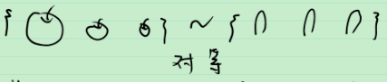
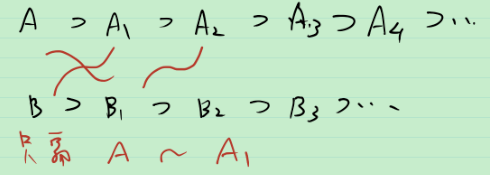
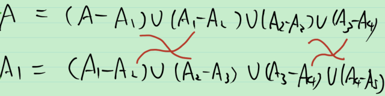

# 6_对等与基数

怎样“数数”

幼儿: 

数学: 

想看两个集合 A 和 B 的元素是不是 “一样多”

**定义** (映射) 非空集合 $A$ , $B$ , 用某种方式 $\varphi$ 将 $A$ 中的每个元素都对应于 $B$ 中的某一个元素, 这种对应方式称为 $A$ , $B$ 间的映射, 记为
$$
\varphi: A\to B \\
x\mapsto y=\varphi(x)
$$
其中, $y$ 称为 $x$ 的像, $x$ 称为 $y$ 的原像. 特别地, $\varphi$ 被称为

1. 单射: $x\ne y \Leftrightarrow \varphi(x) \ne \varphi(y)$ ;
2. 满射: $\forall y \in B, \exist x\in A, s.t. y=\varphi(x)$ ;
3. 双射(又称为一一映射): 既单又满.

有如下事实成立: 若 $\varphi : A\to B$ 是双射, 则 $\exist \varphi^{-1}:B\to A , s.t.$  $\varphi \circ \varphi^{-1} = \text{id}_B, \varphi^{-1} \circ \varphi = \text{id}_A$ .

**定义** (对等) 如果存在从 $A$ 到 $B$ 的一一映射, 我们就称 $A$ 与 $B$ 对等, 记为 $A\sim B$ .   规定 $\varnothing$ 与 $\varnothing$ 相等.

注:对等在某些书中叫 "等势". 

**定理** 对等关系是等价关系.

> 等价关系即为满足如下三条性质的关系:
>
> 1. 反身性: $A\sim A$ ;
> 2. 对称性: $A\sim B \Leftrightarrow B \sim A$ ;
> 3. 传递性: $若A\sim B且B\sim C, 则 A\sim C$ .

**例1** 

推广: 其元素"数量"(有限个) 相等的集合都对等.

**有限集** 集合 $A$ 与 $1,2,\cdots ,n$ 对等, 则称 $A$ 是一个有限集. 此外, 规定 $\varnothing$ 是有限集. 

**无限集** 不是有限集的集合称为无限集.

**例2** 整数集合 $\mathbb Z \sim 所有奇数的集合$ .

> 证: $n\mapsto 2n+1$ , 此映射为一一映射 

怪怪的:一个集合的子集居然与原集合有"一样多"的元素!

希尔伯特旅馆

无限集与有限集不一样! 显然, 无限集中存在着一个真子集与它对等!

**例3** $(0,1)\sim \mathbb R$

> $x\mapsto \tan(\pi x-\frac{\pi}{2})$

$任意区间 \sim \mathbb R$ 

怎样定义数量?

**定义** (基数)  

1. 若 $A\sim B$ , 则称 $A$ 与 $B$ 有相同基数, 记为 $\bar{\bar{A}} = \bar{\bar{B}}$
2. $A$ 与 $B$ 不对等, 但 $A$ 与 $B$ 的一个真子集对等, 则称 $A$ 比 $B$ 有较小的基数 ( $B$ 比 $A$ 有较大的基数 ), 记为 $\bar{\bar{A}} < \bar{\bar{B}}$ ( $\bar{\bar{B}} > \bar{\bar {A}} $ )

> 注1: 有限集的基数即为其元素的个数.
>
> 注2: "基数" 在有些书中称为"势".

对于 $A$ , $B$ , 下面三种基数关系必居其一且只居其一: $\begin{cases} \bar{\bar{A}} = \bar{\bar{B}} \\ \bar{\bar{A}} < \bar{\bar{B}} \\ \bar{\bar{A}} > \bar{\bar{B}} \end{cases}$ .

有时候, $\bar{\bar{A}} = \bar{\bar{B}} 或 \bar{\bar{A}} < \bar{\bar{B}}$ 也记为 $\bar{\bar{A}} \le \bar{\bar{B}}$ .

类似地, $\bar{\bar{A}} = \bar{\bar{B}} 或 \bar{\bar{A}} > \bar{\bar{B}}$ 也记为 $\bar{\bar{A}} \ge \bar{\bar{B}}$ .

> 注: $\bar{\bar{A}} \le \bar{\bar{B}}$ $\Leftrightarrow$ $A$ 与 $B$ 的一个子集对等 $\Leftrightarrow$ 存在 $A$ 到 $B$ 的一个子集的双射 $\Leftrightarrow$ 存在 $A$ 到 $B$ 的单射 $\Leftrightarrow$ 存在 $B$ 到 $A$ 的满射
>
> 存在 $A$ 到 $B$ 的单射 $\Leftrightarrow$ 存在 $B$ 到 $A$ 的满射的证明:
>
> “ $\Rightarrow$ ”: 假设存在单射 $\psi : B\to A$ ,
>
> 则 $\psi : B\to A^*=\psi(B) \sub A$ 是单射.
>
> 用以下方法构造 $\varphi :A\to B$ :
>
> 1. 对于 $x\in A^*$ , $x\mapsto x在B中的原像$ ;
> 2. 对于 $x\notin A^*$ , $x\mapsto B中的选定的某一元素b$ .
>
> 易验证 $\varphi$ 是满射.
>
> “ $\Leftarrow$ ”: 假设存在满射 $\varphi : A\to B$ ,
>
> 构造 $\psi : B\to A$ , $b\mapsto b的某一个原像$ 
>
> 易验证 $\psi$ 是单射.

对于实数, $a\le b, b\le a 则 a=b$ . 对于集合呢?

**定理** (伯恩斯坦定理) 若 $\bar{\bar{A}} \le \bar{\bar{B}}$ 且 $\bar{\bar{B}} \le \bar{\bar{A}}$ 则 $\bar{\bar{A}} = \bar{\bar{B}}$ 

> 注: 定理即
>
> (1) $A$ 与 $B$ 的一个子集对等且 $B$ 与 $A$ 的一个子集对等, 则 $A$  与 $B$ 对等.
>
> (2)  存在 $A$ 到 $B$ 的单射 和  $B$ 到 $A$ 的单射, 则 存在 $A$ 到 $B$ 的双射.

应用: 想建立集合之间双射, 有点难! 可以用伯恩斯坦定理证明双射的存在性.

**例** $(0,1)$ 与 $(0,1]$ 之间是否存在双射?

> 根据伯恩斯坦定理, 由
> $$
> \begin{array}{l}(0,1)&\overset{1:1}\to (0,1) \sub (0,1] \\ x&\mapsto x
> \end{array}
> $$
> 且
> $$
> \begin{array}{l}(0,1]&\overset{1:1}\to (0,\frac{1}{2}] \sub (0,1) \\ x&\mapsto \frac{x}{2}
> \end{array}
> $$
> 则 $(0,1)\sim (0,1]$

总结: 要证 $A\sim B$ , 可以有以下两种方法:

1. 建立 $A$ 到 $B$ 的单射 和 $B$ 到 $A$ 的单射
2. 建立 $A$ 到 $B$ 的单射 和 $A$ 到 $B$ 的满射

应用: 证明 $A \supset B \supset C$ , $A \sim C$ ,则 $A \sim B$ . 

> 证: $B \overset{单射(由A\supset B)}{\to} A$
>
> $A\overset{单射(由A\sim C)}{\to} C \overset{单射(由B\supset C)}{\to} B$ 
>
> 证毕.

伯恩斯坦定理 Sketch of proof:

$$
A \overset{\varphi}{\underset{1:1}{\to}} B_1=\varphi(A) \sub B \\
B \overset{\psi}{\underset{1:1}{\to}} A_1=\psi(B) \sub A \\
A_1 \overset{\varphi}{\underset{1:1}{\to}} B_2=\varphi(A_1) \sub B_1 \\
B_1 \overset{\psi}{\underset{1:1}{\to}} A_2=\psi(B_1) \sub A_1 \\
\vdots
$$
有 

而 $A$ 和 $A_1$ 分别可以做如下划分(写成若干集合的无交并):
$$
A=(A-A_1)\cup(A_1-A_2)\cup(A_2-A_3)\cup(A_3-A_4)\cup \cdots \\
A_1=(A_1-A_2)\cup(A_2-A_3)\cup(A_3-A_4)\cup(A_4-A_5)\cup \cdots
$$
由 
$$
A \sim A_2 \sim A_4 \sim A_6 \sim \cdots \\
A_1 \sim A_3 \sim A_5 \sim A_7 \sim \cdots
$$
得 $A-A_1 \sim A_2 -A_3$ .

一直进行下去可以发现

交错相等! 证毕.

根据该证明过程, 可以精确地定义双射. 任取 $x\in A$ , $x$ 总落在某段中, 可以利用上述相等来构造像.

**总结**

1. 对等(数数)
2. 基数(数量)
3. 伯恩斯坦定理(会用)

