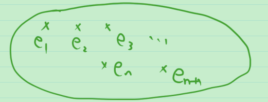

# 7_可数集合

对等关系是等价关系. 抽象出等价类. 如基数为3的集合抽象出了数字"3".

**定义** 与 $\mathbb Z^+$ 对等的集合称为可数集合(可列集合).

> 可以排成一列

**例** $\mathbb N$ , $\mathbb Z$ , 奇数的集合, 偶数的集合 都是可数集合

**定理0** : 可数集合是无限集合.

> 证: 反证法. 
>
> 用定义证 不是有限集

**例** 当 $m\ne n$ 时, $\{1,2,\cdots , n\}$ 与 $\{1,2,\cdots m\}$ 不对等.

> 证: 用反证法

**定理1** 任何无限集合都至少包含一个可数子集.

> 可数集是"最小"的无限集.
>
> 证:  直观上,
>
> 
>
> 用归纳法, 设无限集为 $M$ ,
>
> Step1: 设集合 $M$ 是无限集, 任取 $M$ 中一个元素 $e_1$ .
>
> Step2: 假设已取到互不相同的元素 $e_1,\cdots,e_{n-1}$ , 由于 $M$ 是无限集, 故 $M-\{e_1,\cdots,e_{n-1}\}$ 非空. 从中任取一个元素 $e_n$ , 显然 $e_1,\cdots,e_n$ 互不相同.
>
> $\vdots$
>
> 综上, 可以取出 $M$ 的子集 $S=\{e_1,e_2,\cdots,e_n,\cdots\}$ , 其中 $e_1,e_2,\cdots,e_n,\cdots$ 互不相同, 易知 $S$ 是可数集.

**定理2** 可数集的任何无限子集仍是可数集.

> 思路: 设 $S \sub M$ 是可数集 $M$ 的无限子集.
>
> 由定理1, 存在可数集 $S_1\sub S$ , 于是 $S_1\sub S\sub M$, 又 $S_1$ 和 $M$ 对等,
>
> 由伯恩斯坦定理, $S$ 和 $M$ 对等, 即 $S$ 是可数集.

从而, 可数集的任一子集或者是有限集, 或者是可数集.

把有限集和可数集统称为**至多可数集**. 

> 等价定义: 与 $\mathbb Z^+$ 的子集对等的集合称为**至多可数集**.

有限个有限集的并仍是有限集, 那至多可数集的并呢?

**定理3** 至多可数个至多可数集的并仍是至多可数集.

> 证: 我们只对可数个互不相交的可数集的并来进行说明.
>
> 如何一个一个去数? 用对角线法, 如下图所示.
>
> 
>
> 思考: 怎样把上述一一对应具体写下来?
>
> 即 $\cup_{i=1}^{n}A_i\to \mathbb Z^+ \\a_{ij}\mapsto?$

**推论** 有理数集 $\mathbb Q$ 是可数集.

> 证: 构造 $A_i=\{\frac{1}{i},\frac{2}{i},\frac{3}{i},\cdots\}$ 是至多可数集.
>
> 从而正有理数集 $\mathbb Q^+=\bigcup_{i=1}^{\infty}A_i$ 是至多可数集, 于是负有理数集 $\mathbb Q^-$ 也是至多可数集.
>
> 从而 $\mathbb Q = \mathbb Q^+ \cup \mathbb Q^-$ 是至多可数集.
>
> 而 $\mathbb Z^+ \sub \mathbb Q$ , 从而 $\bar{\bar{\mathbb Q}} \ge \overline{\overline{\mathbb Z^+}}$ ,故 $\mathbb Q$ 是可数集.

**定理4** 有限个至多可数集的直积仍是至多可数集.

> 证: 显然, 有限个有限集的直积仍是有限集. 于是只需说明有限个可数集的直积仍是可数集. 用归纳法.
>
> Step1: 1个集合的情形, 显然成立.
>
> Step2: 假设 n-1 个至多可数集的直积是至多可数集, 对 n 个的情形, $A_1,A_2,\cdots ,A_n$ 是至多可数集.
>
> 因为 $A_n$ 是可数集, 所以可以记 $A_n = \{a_1,a_2,\cdots, a_k,\cdots\}$ .
>
> 记 $\tilde{A_k} = A_1\times A_2\times \cdots \times A_{n-1} \times A_k \sim A_1\times A_2\times \cdots \times A_{n-1}$ , 由归纳假设, $\tilde{A_k}$ 是至多可数集.
>
> 从而 $A_1\times A_2\times \cdots  \times A_n = \bigcup_{k=1}^{\infty}\tilde{A_k}$ 是至多可数集.
>
> 证毕.

**推论** 代数数的全体是可数集.

> 代数数: 整系数多项式的根.
>
> 超越数: 不是代数数的数.
>
> **例** 代数数 
>
> 100 是 $x-100=0$ 的根 
>
> $\frac{13}{100}$ 是 $100x-13=0$ 的根
>
> $\sqrt{3}$ 是 $x^2-3=0$ 的根
>
> $\sqrt{-1}$ 是 $x^2+1=0$ 的根
>
> 
>
> 超越数: $\pi$ 

> 证: 设 $A_n=n次整系数多项式的全体=\{f:f=a_0x^0+a_1x+\cdots+a_nx^n,\quad 其中a_0,\cdots,a_{n-1}\in \mathbb Z, a_n \in \mathbb Z-\{0\}\}$
>
> 则有单射 $A_n\to \underbrace{Z\times Z\times \cdots Z}_{n个} \\f\mapsto (a_0,a_1,\cdots, a_n)$  , 从而 $A_n$ 是至多可数集.
>
>  设 $B_n$ 是 n 次整系数多项式的根的全体,
>
> 则有满射 $A_n\times \{1,2,\cdots,n\}\to B_n \\ (f,k) \mapsto f的第k个根$ .
>
> 故 $\overline{\overline{B_n}} \le \overline{\overline{A_n\times \{1,2,\cdots,n\}}}$ . 从而 $B_n$ 是至多可数集.
>
> 于是, $代数数的全体 = \bigcup_{n=1}^{\infty}B_n$ 为至多可数集 .
>
> 又 $\mathbb Z^+ \sub 代数数的全体$ .
>
> 故代数数的全体是可数集.
>
> 证毕.

思考: 可数个至多可数集的直积是至多可数集吗?

**总结**

1. 可数集( $\sim \mathbb Z^+$ )和至多可数集( $\sim \mathbb Z^+的子集$ )的定义
2. 可数集与无限集的关系
   1. 可数集是无限集
   2. 可数集是"最小"的无限集
3. 至多可数集的运算
   1. 至多可数个并
   2. 有限个直积
4. 例子: $\mathbb Q$ , 代数数的全体 都是可数集

