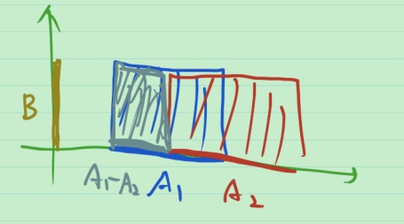
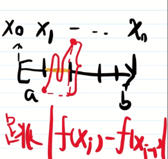
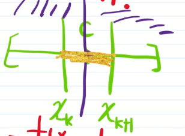

[在线LaTeX公式编辑器-编辑器 (latexlive.com)](https://www.latexlive.com/)

用书: 程其襄

视频: [《实变函数》用书是程其襄等编的书只讲实变部分_哔哩哔哩_bilibili](https://www.bilibili.com/video/BV1o7411N7qx)

$考试范围 = {书上内容} \cap {教学大纲} \cap {视频内容} 的真子集$

# 1_实变函数学什么

问题: 想计算面积

## 黎曼积分

1. 将[a, b] 划分成小区间
2. 面积 = 红色小块面积之和 ≈ 矩形面积之和
3. 取极限 面积 = 矩形面积之和的极限

黎曼积分的局限性

1. Dirichlet函数 $D(x)=
   \begin{cases}
    1 \quad x \in [0, 1] \cap \mathbb Q \\
    0 \quad x \in [0, 1] - \mathbb Q
   \end{cases}$ 不是黎曼可积的.

   然而 $D(x)$ 是可积函数列的极限, 下面加以说明.

   [0, 1] 中的有理数“排成一排”: $r_1, r_2, r_3, ..., r_n,...$

   令 $D_n(x)=
       \begin{cases}
       	1 \quad x \in [0, 1] \cap \{r_1, r_2, r_3, ..., r_n\} \\
       	0 \quad x \in [0, 1] - \{r_1, r_2, r_3, ..., r_n\}
       \end{cases}$

   $D_n(x)$ 是黎曼可积的, 且递增,有
   $$
   D(x) = \lim_{x \to \infty} D_n(x)
   $$

2. 积分和极限不能随便交换顺序, 条件复杂.

3. 黎曼积分中反常积分有点复杂, 如何向无穷区间推广?

4. 黎曼积分是在实数上的积分, 如何向其他空间去推广?

## 勒贝格积分

要研究

1. “红色小块”——集合
2. “红色小块”是实数中集合——欧式空间点集
3. “红色小块”的面积——测度&可测集
4. 什么样的 f 能算——可测函数
5. 新的方法计算面积——勒贝格积分(与黎曼积分做比较)
6. 微积分基本定理——不定积分与微分

**例** Dirichlet函数是勒贝格可积

> 积分 = 0 · ( [0, 1] 中无理数“长度” ) + 1 · ( [0, 1] 中有理数“长度” ) 

## 直观的看法: 数硬币

一枚一枚数: 黎曼积分

先把同样面值的硬币放在一起, 一堆一堆数: 勒贝格积分

# 2_集合的表示与运算

## 什么是集合?

**例** {1, 2, 3, 4} 是集合; 自然数的全体是集合, 记为 $\mathbb N$

集合的表示

1. 列举法: {1, 2, 3, 4}
2. 描述法 {x: x是自然数}

元素与集合的关系

1. 属于符号: $元素 \in 集合$
2. 不属于符号: $元素 \notin 集合$

集合的关系

1.  $A$ 的元素与 $B$ 的元素相同, 称 $A$ 等于 $B$ , 记为 $A=B$ .
2.  $A$ 的元素都是 $B$ 的元素, 称 $A$ 包含于 $B$ ( $B$ 包含 $A$ ), 记为 $A\subset B (B\supset A)$, 这时称 $A$ 是 $B$ 的子集.
3. 若 $A\subset B$ 且 $A\ne B$ , 称 $A$ 是 $B$ 的真子集, 记为 $A\subsetneqq B$

**例** 高个子的全体 不是集合

**例** 所有集合的全体 不是集合

注: 与罗素悖论有关

> 证: 反证法
>
> 假设它是集合, 记为 $S$ .
>
> 则 $S_1 = \{A \in S: A \notin A\}$ 是集合, 所以是 $S$ 的子集, 即 $S_1 \in S$ .
>
> 若 $S_1 \in S_1$, 则由 $S_1$ 的定义, 得到 $S_1 \notin S_1$ 则矛盾.
>
> 若 $S_1 \notin S_1$ , 则由 $S_1$ 的定义, 得到 $S_1 \in S_1$ 矛盾.
>
> 证毕.

范畴论 (Category)

## 集合的运算

### 两个集合的情形

定义

| 名称     | 符号表示                                      |
| -------- | --------------------------------------------- |
| 交       | $A \cap B = \{x: x \in A 且 x \in B\}$        |
| 并       | $A \cup B = \{x: x \in A 或 x \in B\}$        |
| 差, 余集 | $A - B = \{x: x \in A 但 x \notin B\}$        |
| 直积     | $A \times B = \{(x, y): x \in A 且 y \in B\}$ |

特殊情况: $B\subset A$ , $B^C$ 代表 $A-B$, 称为 $B$ 的余集

运算律

1. 交换律: $A \cap B = B \cap A, A \cup B = B \cup A$
2. 结合律: $A\cup (B\cup C) = (A\cup B)\cup C, A\cap (B\cap C) = (A\cap B)\cap C$
3. 分配律: $A\cap (B\cup C) = (A\cap B)\cup(A\cap C)$
4. De Morgan公式: $(A\cup B)^C = A^C \cap B^C, (A\cap B)^C = A^C \cup B^C$

### 任意多个集合的运算

> 数学中, 如果知道2, 就应该知道3, 进一步, 应该知道10000, 进一步, 应该去想“任意个”

解释 “任意个”

2个集合: $\{A_1, A_2\}$ 表示为 $\{A_n\}_{n=1,2}$

自然数那么多个集合: $\{A_1, A_2, A_3, ..., A_n, ...\}$ 表示为 $\{A_n\}_{n\in\mathbb N}$

#### 指标集 $\Lambda$

$\Lambda$ 那么多个集合: $\{A_\lambda\}_{\lambda\in\Lambda}$ 

**例** 有实数那么多个集合 $\{A_\lambda\}_{\lambda\in\mathbb R}$, 这是用实数去给集合**编号**

已知指标集 $\Lambda$ , $\{A_\lambda\}_{\lambda\in\Lambda}$ 的

| 名称                                       | 符号表示                                                     |
| ------------------------------------------ | ------------------------------------------------------------ |
| 交                                         | $\bigcap_{\lambda \in \Lambda} A_\lambda = \{x: \forall \lambda \in \Lambda, x \in A_\lambda\}$ |
| 并                                         | $\bigcup_{\lambda \in \Lambda} A_\lambda = \{x: \exist \lambda \in \Lambda, x \in A_\lambda\}$ |
| 直积(只考虑有限个集合或自然数那么多个集合) | $A_1 \times A_2 \times ... \times A_n = \{(x_1, ..., x_n): x_1 \in A_1,..., x_n \in A_n\}$ $\Pi_{i=1}^{\infty} A_i = A_1 \times A_2 \times \cdots = \{(x_1, \cdots, x_n, \cdots): x_1 \in A_1, \cdots, x_n \in A_n, \cdots\}$ 从而可以定义 $A^n =\underbrace{A \times \cdots \times A}_ {n个}$ |

运算律

1. 分配律: 
   $$
   A\cap (\bigcup_{\lambda \in \Lambda} B_{\lambda}) = \bigcup_{\lambda \in \Lambda}(A\cap B_{\lambda})
   $$

2. De Morgan公式:
   $$
   (\bigcup_{\lambda \in \Lambda} A_{\lambda})^C = \bigcap_{\lambda \in \Lambda} A_{\lambda}^C\\
   (\bigcap_{\lambda \in \Lambda} A_{\lambda})^C = \bigcup_{\lambda \in \Lambda} A_{\lambda}^C
   $$

怎样证两个集合相等?
$$
\left.\begin{array}{c}
先证 A\subset B\quad (\forall x \in A, x \in B) \\
再证 B\subset A\quad (\forall x \in B, x \in A)
\end{array}\right\}
\Rightarrow A=B
$$

> 证明 De Morgan公式 的第二式 $(\bigcap_{\lambda \in \Lambda} A_{\lambda})^C = \bigcup_{\lambda \in \Lambda} A_{\lambda}^C$
>
> **证**: 
>
> 1. 先证 $左边 \subset 右边$ 
>
>     $\forall x \in (\bigcap_{\lambda \in \Lambda} A_{\lambda})^C$ , 即 $x\notin \bigcap_{\lambda \in \Lambda} A_{\lambda}$, 
>
>    至少存在某个 $\lambda_0 \in \Lambda$ , 使 $x \notin A_{\lambda_0}$, 即 $x \in A_{\lambda_0}^C$
>
>    于是 $x \in \bigcup_{\lambda \in \Lambda} A_{\lambda}^C$, 故 $左边 \subset 右边$ 
>
> 2. 再证 $左边 \subset 右边$ 
>
>    $\forall x \in \bigcup_{\lambda \in \Lambda} A_{\lambda}^C$ , 存在某个 $\lambda_0 \in \Lambda$ , 使 $x \in A_{\lambda_0}^C$ , 即 $x \notin A_{\lambda_0}$,
>
>    从而 $x\notin \bigcap_{\lambda \in \Lambda} A_{\lambda}$, 即 $x \in (\bigcap_{\lambda \in \Lambda} A_{\lambda})^C$
>
>    故 $右边 \subset 左边$
>
> 3. 综上, 证毕.
> 4. 

# 3_用集合描述性质的例子

1. $f$ 是定义在 $E$  上的函数, 则值域$f(E) = \{f(x): x \in E\}$.  $D\in \mathbb R$, 则 $f^{-1}(D) = \{ x\in E: f(x) \in D \}$

2. $f$ 是定义在 $\mathbb R$ 上的函数, 在 $[a, b]$ 上有上界 $M$. 即 $\forall x \in [a, b], f(x) \le M$ .

   > $[a, b]$ 是一个集合, 同时 $f(x) \le M$ 描述了 $x$ 的性质, 将其做成一个集合. 所以上面的叙述等价于两个集合之间的包含关系, 即

   $[a, b] \subset \{ x: f(x) \le M \} = f^{-1}([-\infty , M])$

3. $f$ 在 $\mathbb R$ 上连续, 取定 $x_0\in \mathbb R$ ,则 $\forall \epsilon > 0, \exist \delta > 0,\quad s.t. \forall x \in (x_0 - \delta, x_0 + \delta)$ , 有 $|f(x)-f(x_0)|<\epsilon$ . 即

   $(x_0 - \delta, x_0 + \delta) \subset \{x:|f(x)-f(x_0)|<\epsilon\} = \{x: f(x_0) - \epsilon < f(x) < f(x_0) + \epsilon\} = f^{-1}(\left(f(x_0)-\epsilon, f(x_0)+\epsilon\right))$

   $f(x_0 - \delta, x_0 + \delta) \subset \left(f(x_0)-\epsilon, f(x_0)+\epsilon\right)$

4. $f$ 在 $\mathbb R$ 上定义, 在 $\mathbb R$ 上有上界 $M$, 则

   $\mathbb R = \{ x:f(x)\le M \} = \{ x:f(x)\le M+1 \} = f^{-1}([-\infty , M])$

5. $f$ 在 $[a,b]$ 上连续, 则

   $f([a, b]) = [m, M]$. 其中 $m = \min{f(x)}: x \in [a, b], \quad M = \max{f(x)}: x \in [a, b]$ 

6. $f, g$ 是定义在 $E$  上的函数, 则 $\forall C \in \mathbb R$, 有

   $\{x=\max \{f(x), g(x)\}>C\}=\{x: f(x)>c\} \cup\{x=g(x)>C\}$

   怎样证呢

7.  ${f_n(x)}$ 是 $E$ 上的一列函数. $\forall C \in \mathbb R$ ， 有

    (1) $\{x:\sup{f_n(x)}\le C\} = \bigcap_{n=1}^{\infty} \{x:f_n(x)\le C\}$

    (2) $$\{x:\sup{f_n(x)} > C\} = \bigcup_{n=1}^{\infty} \{x:f_n(x) > C\}$$

    > 证(2): $\forall x \in \{x:\sup{f_n(x)} > C\}$ , 则存在 $n \in \mathbb N$ , $\{x:f_n(x) > C\}$ , 即 $x \in \bigcup_{n=1}^{\infty} \{x:f_n(x) > C\}$ , 于是 $左边\subset 右边$ .
    >
    > > 若不然, $\forall n \in \mathbb N, f_n(x)\le C$ , 则 $\sup{f_n(x)} \le C$ , 矛盾.
    >
    > $\forall x \in \bigcup_{n=1}^{\infty} \{x:f_n(x) > C\}$ , 则存在 $n_0 \in \mathbb N$ , s.t.  $f_n(x) > C$ , 则 $\sup{f_n(x)} > C$ , 即 $x \in \{x:\sup{f_n(x)} > C\} = \bigcup_{n=1}^{\infty} \{x:f_n(x) > C\}$ , 于是 $右边\subset 左边$ .
    >
    > 综上, 左边 = 右边 . 证毕.

8. (有限覆盖原理) $[a, b] \in \bigcup_{\lambda \in \Lambda} {I_\lambda}$ , 其中 $\forall \lambda \in \Lambda$ , $I_\lambda$ 为开区间. 则存在 $\lambda_1, \cdots, \lambda_n$ , s.t. $[a, b] \in \bigcup_{i=1}^n {I_{\lambda_i}}$ .

9. (闭区间套原理) $[a_n, b_n] \in [a_{n-1}, b_{n-1}]$ , $\lim_{n\to \infty}(b_n-a_n) = 0$ , 则存在唯一的 $\alpha \in \mathbb R$ , s.t. $\alpha \in [a_n, b_n]$ 对所有的 $n$ 都成立, 即 s.t. $\alpha \in \bigcap_{n=1}^{\infty}{[a_n, b_n]}$ . 而 $唯一 \Rightarrow \{\alpha\} = \bigcap_{n=1}^{\infty}{[a_n, b_n]}$ .

10. $(a, b) = \bigcup_{n=1}^{\infty} [a+\frac{1}{n}, b-\frac{1}{n}]$ .

    > 证: 
    >
    > ( $左\sub 右$ ) $\forall x \in (a, b)$ , 有 $x-a>0$ , $b-x>0$ .
    >
    > 则存在 $n\in \mathbb N$ , 使 $\frac{1}{n} \le \min\{a-x, b-x\}$ , 即 $x \in [a-\frac{1}{n}, b+\frac{1}{n}]$ , 于是 $左\sub 右$ .
    >
    > ( $右\sub 左$ ) $\forall x \in \bigcup_{n=1}^{\infty} [a+\frac{1}{n}, b-\frac{1}{n}]$ , 则存在 $n\in \mathbb N$ , 使 $x \in [a+\frac{1}{n}, b-\frac{1}{n}] \sub (a, b)$ , 于是 $右 \sub 左$ .
    >
    > 综上, 左 = 右. 证毕

11. $f$ 是 $E$ 上的函数, ${x: f(x) > 0} = \bigcup_{n=1}^{\infty}{x:f(x)> \frac{1}{n}}$ .

    > 证: 方法同10.

**以下很重要**

命题中出现 "**存在**", "**任意**", 怎样用集合写?
$$
\bigcup_{\lambda \in \Lambda}{A_\lambda} = \{x:\textbf{存在}\lambda \in \Lambda, 使x \in A_{\lambda}\} \\
\bigcap_{\lambda \in \Lambda}{A_\lambda} = \{x:\textbf{任意}\lambda \in \Lambda, 使x \in A_{\lambda}\}
$$
$并 \leftrightarrow 存在, 交 \leftrightarrow 任意$ 

**例** $\{f_n(x)\}$是定义在 $E$ 上的函数列, 对于 $x\in E$ ,

 $\{f_n(x)\}$ 有界 $\Leftrightarrow$ 存在 $M>0$ , 使得对于任意的 $n \in \mathbb N$ , $|f_n(x)|\le M$ .

则使 $\{f_n(x)\}$ 有界的点的集合为 $\bigcup_{M \in \mathbb {R_+}}{\bigcap_{n=1}^{\infty}{\{x: |f_n(x)|\le M\}}}$ , 其中 $\mathbb {R_+}$ 表示大于0的实数. 使 $\{f_n(x)\}$ 无界的点的集合为
$$
\left(\bigcup_{M \in \mathbb {R_+}}{\bigcap_{n=1}^{\infty}{\{x: |f_n(x)|\le M\}}}\right)^C \xlongequal[]{\text {de Morgan}}
\bigcap_{M \in \mathbb {R_+}}\left({\bigcap_{n=1}^{\infty}{\{x: |f_n(x)|\le M\}}}\right)^C \xlongequal[]{\text {de Morgan}}
\bigcap_{M \in \mathbb {R_+}}{\bigcup_{n=1}^{\infty}\left({\{x: |f_n(x)|\le M\}}\right)^C} =
\bigcap_{M \in \mathbb {R_+}}{\bigcup_{n=1}^{\infty}{\{x: |f_n(x)| > M\}}}
$$
**例** ( $\varepsilon - N$ 语言 ) $\{f_n(x)\}$ 为 $E$ 上的函数列, $x$ 是使 $\{f_n(x)\}$ 收敛于 0 的点. 即 $\forall \varepsilon > 0 , \exist N \in \mathbb N, s.t. \forall n\ge \mathbb N, 有 |f_n(x)| < \varepsilon$ . 则所有使 $\{f_n(x)\}$ 收敛于 0 的点的集合为 $\bigcap_{\varepsilon \in \mathbb {R_+}} 
\bigcup_{N \in \mathbb N}
\bigcap_{n \ge N}
\left\{x: |f_n(x)| < \varepsilon\right\}$ . 所有不使 $\{f_n(x)\}$ 收敛于 0 的点的集合 $\{x: \lim_{n\to \infty}\ne0或不存在\}$ 为
$$
\left(
\bigcap_{\varepsilon \in \mathbb {R_+}} 
\bigcup_{N \in \mathbb N}
\bigcap_{n \ge N}
\left\{x: |f_n(x)| < \varepsilon\right\}
\right)^C \xlongequal[]{\text {de Morgan}}
\bigcup_{\varepsilon \in \mathbb {R_+}} 
\bigcap_{N \in \mathbb N}
\bigcup_{n \ge N}
\left\{x: |f_n(x)| \ge \varepsilon\right\}
$$

##  总结

1. 用集合的语言描述函数性质
2. 怎样证两个集合相等? 左边包含于右边&右边包含于左边
3. "存在"对应于并集, "任意" 对应于交集.

# 4_数列的上极限和下极限

直观上, 已知数列 $\{a_n\} = \{a_1, a_2, \cdots\}$

上极限: 向上走的最终趋势

> 第一步: 从 $a_1$ 开始走, 最高能到达的"最大值"(未必取到) $\sup\{a_1, a_2, \cdots\}$ 
>
> 第二步: 从 $a_2$ 开始走, 最高能到达的"最大值"(未必取到) $\sup\{a_2, a_3, \cdots\}$ 
>
> .....
>
> 第n步: 从 $a_n$ 开始走, 最高能到达的"最大值"(未必取到) $\sup\{a_n, a_{n+1}, \cdots\} = \sup_{k\ge n}\{a_k\}$ 

最终趋势为 $\lim_{n \to \infty}\sup_{k\ge n}\{a_k\}$ 称为数列 $\{a_n\}$ 的上极限, 记为
$$
\varlimsup_{n \to \infty}{a_n}
$$
数学上, $\left\{\sup_{k\ge n}\{a_k\}\right\}_{n=1}^{\infty}$ 是递减数列, 总有极限(包括 $\infty$ ), 可以定义上极限
$$
\varlimsup_{n \to \infty}{a_n} = \lim_{n \to \infty}\sup_{k\ge n}\{a_k\} =
\inf_{n \ge 1}\sup_{k\ge n}\{a_k\}
$$
同理, 可以定义下极限
$$
\varliminf_{n \to \infty}{a_n} = \lim_{n \to \infty}\inf_{k\ge n}\{a_k\} =
\sup_{n \ge 1}\inf_{k\ge n}\{a_k\}
$$
也可以用聚点来看. 对于有界数列 $\{a_n\}$ ,
$$
\varlimsup_{n \to \infty}{a_n}: 最大的聚点 \\
\varliminf_{n \to \infty}{a_n}: 最小的聚点
$$

# 5_集合列的上极限和下极限

数列 $\{a_n\}$ 的上下极限的定义
$$
\varlimsup_{n \to \infty}{a_n} :=  
\inf_{n \ge 1}\sup_{k\ge n}\{a_k\} \\
\varliminf_{n \to \infty}{a_n} := 
\sup_{n \ge 1}\inf_{k\ge n}\{a_k\}
$$
想法: 要找集合的"上下确界"

数列 ${a_n}$  的上确界 ≈(直观上) 比 $a_n$ 都大的数中"最小"的那个

通过类比, 集合列 $\{A_n\}$ 的上确界是比 $A_n$ 都"大"的集合中"最小"的那个, 直观上, A 比 B "大"( B 比 A 小 ) 即 $B \sub A$ .

对于集合列 $\{A_n\}$ 的上确界(想找的集合), $A_n$ 中所有的点都应落在其中, 从而$\bigcup_{n=1}^{\infty}{A_n} \sub 想找的集合$ , 而显然 $A_n \in \bigcup_{n=1}^{\infty}{A_n}$ , 即 $\bigcup_{n=1}^{\infty}{A_n}$ 比所有的 $A_n$ 都大. 

于是, 集合列 $\{A_n\}$ 的上确界为 $\bigcup_{n=1}^{\infty}{A_n}$ .

同理, 集合列 $\{A_n\}$ 的下确界为 $\bigcap_{n=1}^{\infty}{A_n}$ .

定义集合列 ${A_n}$ 的上下极限: 
$$
\varlimsup_{n \to \infty}{A_n} :=  
\bigcap_{n \ge 1}\bigcup_{k\ge n}\{A_k\} \\
\varliminf_{n \to \infty}{A_n} := 
\bigcup_{n \ge 1}\bigcap_{k\ge n}\{A_k\}
$$
思考:为什么能定义上下极限? 即: 数列和集合列有什么共性让我们能定义上下极限?

**例** (单调集列)

> 单调数列: 
>
> 递增数列: $a_1 \le a_2 \le  a_3 \le \cdots$ .
>
> 递减数列: $a_1 \ge a_2 \ge  a_3 \ge \cdots$ .

递增集列: $A_1 \sub A_2 \sub A_3 \sub \cdots$ .

递减集列: $A_1 \supset A_2 \supset A_3 \supset \cdots$ 

**定义** (集合列的极限)

> 对于数列 $\{a_n\}$ : 若 $\varlimsup_{n \to \infty}{a_n} = \varliminf_{n \to \infty}{a_n}$ , 则称数列 $\{a_n\}$ 有极限, 记为 $\lim_{n \to \infty}{a_n} := \varlimsup_{n \to \infty}{a_n} = \varliminf_{n \to \infty}{a_n}$ .

对于集合列 $\{A_n\}$ , 若 $\varlimsup_{n\to \infty} A_n = \varliminf_{n\to \infty} A_n$ , 则称 ${A_n}$ 有极限, 记为
$$
\lim_{n\to \infty} A_n := \varlimsup_{n\to \infty} A_n = \varliminf_{n\to \infty} A_n
$$
 **例** 对于递增集列 $A_n$ , 易验证
$$
\varlimsup_{n \to \infty}{A_n} = 
\bigcap_{n \ge 1}\bigcup_{k\ge n}\{A_k\} = \bigcup_{n \ge 1}\bigcap_{k\ge n}\{A_k\} = 
\varliminf_{n \to \infty}{A_n} 
$$
> 如下图所示, 直观上, $\lim_{n\to \infty}A_n$ 存在, 为 $\bigcup_{n=1}^{\infty}A_n$ . 
>
> > 递增数列 $\{a_n\}$ , $\lim_{n\to \infty}a_n \sup_{n\ge 1}a_n$ .
>
> 
>
> 可以验证, $\lim_{n\to \infty}A_n = \bigcup_{n=1}^{\infty}A_n$ . 
>
> 同理, 对于递减集合列 ${B_n}$ , 可以验证 $\lim_{n\to \infty}B_n = \bigcap_{n=1}^{\infty}B_n$ . 

与书上定义看似不一样! 对于上极限 $\varlimsup_{n \to \infty}{A_n} :=  
\bigcap_{n \ge 1}\bigcup_{k\ge n}\{A_k\}$ ,  $x\in \varlimsup_{n \to \infty}{A_n}$ ,即 $\forall{n \ge 1}, \exist{k\ge n}, s.t. x \in \{A_k\}$ ,与书上上极限的定义完全一样. 对于下极限 $\varliminf_{n \to \infty}{A_n} :=  
\bigcup_{n \ge 1}\bigcap_{k\ge n}\{A_k\}$ ,  $x\in \varliminf_{n \to \infty}{A_n}$ ,即 $\exist{n \ge 1}, \forall{k\ge n}, s.t. x \in \{A_k\}$ , 与书上下极限的定义完全一样.

**例** 已知 $A_n =
\begin{cases}
[0, 2-\frac{1}{2m+1}], \quad n=2m+1, m=0,1,\cdots \\
[0, 1+\frac{1}{2m}], \quad n=2m, m=1,2, \cdots 
\end{cases}$ , 求 $\varlimsup_{n\to \infty}A_n$ 和 $\varliminf_{n\to \infty}A_n$ .

> 猜: $\varlimsup_{n\to \infty}A_n \in 0到2的区间$ , 开? 闭? 有开有闭? 
>
> 用定义算(练习)
>
> 由 $\bigcup_{k\ge n}\{A_k\} = [0, 2)$ ,得上极限 $\varlimsup_{n \to \infty}{A_n} =  
> \bigcap_{n \ge 1}\bigcup_{k\ge n}\{A_k\}$ 
>
> 由 $\bigcap_{k\ge n}\{A_k\} = [0, 1]$ , 得下极限 $\varliminf_{n \to \infty}{A_n} =  
> \bigcup_{n \ge 1}\bigcap_{k\ge n}\{A_k\} = [0, 1]$ 

**例** 数列 $a_n$ 的极限也可以用下述定义: $\lim_{n\to \infty}a_n=a :\Leftrightarrow \forall \varepsilon > 0, \exist N \in \mathbb N, s.t. \forall n \ge N, |a_n-a|<\varepsilon$ .

用集合的语言表示, 则 $a\in \bigcap_{\varepsilon\in \mathbb{R_+}}\bigcup_{N=1}^{\infty}\bigcap_{n\ge N}\{x: |a_n-x|<\varepsilon\}$ ,即 $a\in \bigcap_{\varepsilon\in \mathbb{R_+}}\varliminf_{n\to \infty}\{x: |a_n-x|<\varepsilon\}$ .

**例** $f(x)$ 是定义在 $E$ 上的有限函数,  $F_n = \{x: |f(x)|\ge \frac{1}{n}\}, n=1,2,\cdots $, 则 $\{F_n\}$ 是递增集合列, 且 $\lim_{n\to \infty}F_n = \bigcup_{n=1}^{\infty}\{x: |f(x)|\ge \frac{1}{n}\}, n=1,2,\cdots = \{x: f(x)\ne 0\}$ . $E_n = \{x:f(x)>n\}$ ,  $\{E_n\}$ 是递减的集合列, $\lim_{n\to \infty}E_n = \bigcap_{n=1}^{\infty}\{x:f(x)>n\}\ne \varnothing$ .

> 注: 有限不等于有界

**总结** 集合列的上下极限&极限(收敛)&单调集列可以类比数列. 唯一需要的是比大小. 集合列的 $\sub$ 对应于数列的 $\le$ .

> 注: 为了对比, $A_1 \sub A_2 \sub A_3 \sub \cdots$ 称为递增集列, 书上称为增加集列. 
>
> 

# 6_对等与基数

怎样“数数”

幼儿: 

数学: 

想看两个集合 A 和 B 的元素是不是 “一样多”

**定义** (映射) 非空集合 $A$ , $B$ , 用某种方式 $\varphi$ 将 $A$ 中的每个元素都对应于 $B$ 中的某一个元素, 这种对应方式称为 $A$ , $B$ 间的映射, 记为
$$
\varphi: A\to B \\
x\mapsto y=\varphi(x)
$$
其中, $y$ 称为 $x$ 的像, $x$ 称为 $y$ 的原像. 特别地, $\varphi$ 被称为

1. 单射: $x\ne y \Leftrightarrow \varphi(x) \ne \varphi(y)$ ;
2. 满射: $\forall y \in B, \exist x\in A, s.t. y=\varphi(x)$ ;
3. 双射(又称为一一映射): 既单又满.

有如下事实成立: 若 $\varphi : A\to B$ 是双射, 则 $\exist \varphi^{-1}:B\to A , s.t.$  $\varphi \circ \varphi^{-1} = \text{id}_B, \varphi^{-1} \circ \varphi = \text{id}_A$ .

**定义** (对等) 如果存在从 $A$ 到 $B$ 的一一映射, 我们就称 $A$ 与 $B$ 对等, 记为 $A\sim B$ .   规定 $\varnothing$ 与 $\varnothing$ 相等.

注:对等在某些书中叫 "等势". 

**定理** 对等关系是等价关系.

> 等价关系即为满足如下三条性质的关系:
>
> 1. 反身性: $A\sim A$ ;
> 2. 对称性: $A\sim B \Leftrightarrow B \sim A$ ;
> 3. 传递性: $若A\sim B且B\sim C, 则 A\sim C$ .

**例1** 

推广: 其元素"数量"(有限个) 相等的集合都对等.

**有限集** 集合 $A$ 与 $1,2,\cdots ,n$ 对等, 则称 $A$ 是一个有限集. 此外, 规定 $\varnothing$ 是有限集. 

**无限集** 不是有限集的集合称为无限集.

**例2** 整数集合 $\mathbb Z \sim 所有奇数的集合$ .

> 证: $n\mapsto 2n+1$ , 此映射为一一映射 

怪怪的:一个集合的子集居然与原集合有"一样多"的元素!

希尔伯特旅馆

无限集与有限集不一样! 显然, 无限集中存在着一个真子集与它对等!

**例3** $(0,1)\sim \mathbb R$

> $x\mapsto \tan(\pi x-\frac{\pi}{2})$

$任意区间 \sim \mathbb R$ 

怎样定义数量?

**定义** (基数)  

1. 若 $A\sim B$ , 则称 $A$ 与 $B$ 有相同基数, 记为 $\bar{\bar{A}} = \bar{\bar{B}}$
2. $A$ 与 $B$ 不对等, 但 $A$ 与 $B$ 的一个真子集对等, 则称 $A$ 比 $B$ 有较小的基数 ( $B$ 比 $A$ 有较大的基数 ), 记为 $\bar{\bar{A}} < \bar{\bar{B}}$ ( $\bar{\bar{B}} > \bar{\bar {A}} $ )

> 注1: 有限集的基数即为其元素的个数.
>
> 注2: "基数" 在有些书中称为"势".

对于 $A$ , $B$ , 下面三种基数关系必居其一且只居其一: $\begin{cases} \bar{\bar{A}} = \bar{\bar{B}} \\ \bar{\bar{A}} < \bar{\bar{B}} \\ \bar{\bar{A}} > \bar{\bar{B}} \end{cases}$ .

有时候, $\bar{\bar{A}} = \bar{\bar{B}} 或 \bar{\bar{A}} < \bar{\bar{B}}$ 也记为 $\bar{\bar{A}} \le \bar{\bar{B}}$ .

类似地, $\bar{\bar{A}} = \bar{\bar{B}} 或 \bar{\bar{A}} > \bar{\bar{B}}$ 也记为 $\bar{\bar{A}} \ge \bar{\bar{B}}$ .

> 注: $\bar{\bar{A}} \le \bar{\bar{B}}$ $\Leftrightarrow$ $A$ 与 $B$ 的一个子集对等 $\Leftrightarrow$ 存在 $A$ 到 $B$ 的一个子集的双射 $\Leftrightarrow$ 存在 $A$ 到 $B$ 的单射 $\Leftrightarrow$ 存在 $B$ 到 $A$ 的满射
>
> 存在 $A$ 到 $B$ 的单射 $\Leftrightarrow$ 存在 $B$ 到 $A$ 的满射的证明:
>
> “ $\Rightarrow$ ”: 假设存在单射 $\psi : B\to A$ ,
>
> 则 $\psi : B\to A^*=\psi(B) \sub A$ 是单射.
>
> 用以下方法构造 $\varphi :A\to B$ :
>
> 1. 对于 $x\in A^*$ , $x\mapsto x在B中的原像$ ;
> 2. 对于 $x\notin A^*$ , $x\mapsto B中的选定的某一元素b$ .
>
> 易验证 $\varphi$ 是满射.
>
> “ $\Leftarrow$ ”: 假设存在满射 $\varphi : A\to B$ ,
>
> 构造 $\psi : B\to A$ , $b\mapsto b的某一个原像$ 
>
> 易验证 $\psi$ 是单射.

对于实数, $a\le b, b\le a 则 a=b$ . 对于集合呢?

**定理** (伯恩斯坦定理) 若 $\bar{\bar{A}} \le \bar{\bar{B}}$ 且 $\bar{\bar{B}} \le \bar{\bar{A}}$ 则 $\bar{\bar{A}} = \bar{\bar{B}}$ 

> 注: 定理即
>
> (1) $A$ 与 $B$ 的一个子集对等且 $B$ 与 $A$ 的一个子集对等, 则 $A$  与 $B$ 对等.
>
> (2)  存在 $A$ 到 $B$ 的单射 和  $B$ 到 $A$ 的单射, 则 存在 $A$ 到 $B$ 的双射.

应用: 想建立集合之间双射, 有点难! 可以用伯恩斯坦定理证明双射的存在性.

**例** $(0,1)$ 与 $(0,1]$ 之间是否存在双射?

> 根据伯恩斯坦定理, 由
> $$
> \begin{array}{l}(0,1)&\overset{1:1}\to (0,1) \sub (0,1] \\ x&\mapsto x
> \end{array}
> $$
> 且
> $$
> \begin{array}{l}(0,1]&\overset{1:1}\to (0,\frac{1}{2}] \sub (0,1) \\ x&\mapsto \frac{x}{2}
> \end{array}
> $$
> 则 $(0,1)\sim (0,1]$

总结: 要证 $A\sim B$ , 可以有以下两种方法:

1. 建立 $A$ 到 $B$ 的单射 和 $B$ 到 $A$ 的单射
2. 建立 $A$ 到 $B$ 的单射 和 $A$ 到 $B$ 的满射

应用: 证明 $A \supset B \supset C$ , $A \sim C$ ,则 $A \sim B$ . 

> 证: $B \overset{单射(由A\supset B)}{\to} A$
>
> $A\overset{单射(由A\sim C)}{\to} C \overset{单射(由B\supset C)}{\to} B$ 
>
> 证毕.

伯恩斯坦定理 Sketch of proof:

$$
A \overset{\varphi}{\underset{1:1}{\to}} B_1=\varphi(A) \sub B \\
B \overset{\psi}{\underset{1:1}{\to}} A_1=\psi(B) \sub A \\
A_1 \overset{\varphi}{\underset{1:1}{\to}} B_2=\varphi(A_1) \sub B_1 \\
B_1 \overset{\psi}{\underset{1:1}{\to}} A_2=\psi(B_1) \sub A_1 \\
\vdots
$$
有 

而 $A$ 和 $A_1$ 分别可以做如下划分(写成若干集合的无交并):
$$
A=(A-A_1)\cup(A_1-A_2)\cup(A_2-A_3)\cup(A_3-A_4)\cup \cdots \\
A_1=(A_1-A_2)\cup(A_2-A_3)\cup(A_3-A_4)\cup(A_4-A_5)\cup \cdots
$$
由 
$$
A \sim A_2 \sim A_4 \sim A_6 \sim \cdots \\
A_1 \sim A_3 \sim A_5 \sim A_7 \sim \cdots
$$
得 $A-A_1 \sim A_2 -A_3$ .

一直进行下去可以发现

交错相等! 证毕.

根据该证明过程, 可以精确地定义双射. 任取 $x\in A$ , $x$ 总落在某段中, 可以利用上述相等来构造像.

**总结**

1. 对等(数数)
2. 基数(数量)
3. 伯恩斯坦定理(会用)

# 7_可数集合

对等关系是等价关系. 抽象出等价类. 如基数为3的集合抽象出了数字"3".

**定义** 与 $\mathbb Z^+$ 对等的集合称为可数集合(可列集合).

> 可以排成一列

**例** $\mathbb N$ , $\mathbb Z$ , 奇数的集合, 偶数的集合 都是可数集合

**定理0** : 可数集合是无限集合.

> 证: 反证法. 
>
> 用定义证 不是有限集

**例** 当 $m\ne n$ 时, $\{1,2,\cdots , n\}$ 与 $\{1,2,\cdots m\}$ 不对等.

> 证: 用反证法

**定理1** 任何无限集合都至少包含一个可数子集.

> 可数集是"最小"的无限集.
>
> 证:  直观上,
>
> 
>
> 用归纳法, 设无限集为 $M$ ,
>
> Step1: 设集合 $M$ 是无限集, 任取 $M$ 中一个元素 $e_1$ .
>
> Step2: 假设已取到互不相同的元素 $e_1,\cdots,e_{n-1}$ , 由于 $M$ 是无限集, 故 $M-\{e_1,\cdots,e_{n-1}\}$ 非空. 从中任取一个元素 $e_n$ , 显然 $e_1,\cdots,e_n$ 互不相同.
>
> $\vdots$
>
> 综上, 可以取出 $M$ 的子集 $S=\{e_1,e_2,\cdots,e_n,\cdots\}$ , 其中 $e_1,e_2,\cdots,e_n,\cdots$ 互不相同, 易知 $S$ 是可数集.

**定理2** 可数集的任何无限子集仍是可数集.

> 思路: 设 $S \sub M$ 是可数集 $M$ 的无限子集.
>
> 由定理1, 存在可数集 $S_1\sub S$ , 于是 $S_1\sub S\sub M$, 又 $S_1$ 和 $M$ 对等,
>
> 由伯恩斯坦定理, $S$ 和 $M$ 对等, 即 $S$ 是可数集.

从而, 可数集的任一子集或者是有限集, 或者是可数集.

把有限集和可数集统称为**至多可数集**. 

> 等价定义: 与 $\mathbb Z^+$ 的子集对等的集合称为**至多可数集**.

有限个有限集的并仍是有限集, 那至多可数集的并呢?

**定理3** 至多可数个至多可数集的并仍是至多可数集.

> 证: 我们只对可数个互不相交的可数集的并来进行说明.
>
> 如何一个一个去数? 用对角线法, 如下图所示.
>
> 
>
> 思考: 怎样把上述一一对应具体写下来?
>
> 即 $\cup_{i=1}^{n}A_i\to \mathbb Z^+ \\a_{ij}\mapsto?$

**推论** 有理数集 $\mathbb Q$ 是可数集.

> 证: 构造 $A_i=\{\frac{1}{i},\frac{2}{i},\frac{3}{i},\cdots\}$ 是至多可数集.
>
> 从而正有理数集 $\mathbb Q^+=\bigcup_{i=1}^{\infty}A_i$ 是至多可数集, 于是负有理数集 $\mathbb Q^-$ 也是至多可数集.
>
> 从而 $\mathbb Q = \mathbb Q^+ \cup \mathbb Q^-$ 是至多可数集.
>
> 而 $\mathbb Z^+ \sub \mathbb Q$ , 从而 $\bar{\bar{\mathbb Q}} \ge \overline{\overline{\mathbb Z^+}}$ ,故 $\mathbb Q$ 是可数集.

**定理4** 有限个至多可数集的直积仍是至多可数集.

> 证: 显然, 有限个有限集的直积仍是有限集. 于是只需说明有限个可数集的直积仍是可数集. 用归纳法.
>
> Step1: 1个集合的情形, 显然成立.
>
> Step2: 假设 n-1 个至多可数集的直积是至多可数集, 对 n 个的情形, $A_1,A_2,\cdots ,A_n$ 是至多可数集.
>
> 因为 $A_n$ 是可数集, 所以可以记 $A_n = \{a_1,a_2,\cdots, a_k,\cdots\}$ .
>
> 记 $\tilde{A_k} = A_1\times A_2\times \cdots \times A_{n-1} \times A_k \sim A_1\times A_2\times \cdots \times A_{n-1}$ , 由归纳假设, $\tilde{A_k}$ 是至多可数集.
>
> 从而 $A_1\times A_2\times \cdots  \times A_n = \bigcup_{k=1}^{\infty}\tilde{A_k}$ 是至多可数集.
>
> 证毕.

**推论** 代数数的全体是可数集.

> 代数数: 整系数多项式的根.
>
> 超越数: 不是代数数的数.
>
> **例** 代数数 
>
> 100 是 $x-100=0$ 的根 
>
> $\frac{13}{100}$ 是 $100x-13=0$ 的根
>
> $\sqrt{3}$ 是 $x^2-3=0$ 的根
>
> $\sqrt{-1}$ 是 $x^2+1=0$ 的根
>
> 
>
> 超越数: $\pi$ 

> 证: 设 $A_n=n次整系数多项式的全体=\{f:f=a_0x^0+a_1x+\cdots+a_nx^n,\quad 其中a_0,\cdots,a_{n-1}\in \mathbb Z, a_n \in \mathbb Z-\{0\}\}$
>
> 则有单射 $A_n\to \underbrace{Z\times Z\times \cdots Z}_{n个} \\f\mapsto (a_0,a_1,\cdots, a_n)$  , 从而 $A_n$ 是至多可数集.
>
>  设 $B_n$ 是 n 次整系数多项式的根的全体,
>
> 则有满射 $A_n\times \{1,2,\cdots,n\}\to B_n \\ (f,k) \mapsto f的第k个根$ .
>
> 故 $\overline{\overline{B_n}} \le \overline{\overline{A_n\times \{1,2,\cdots,n\}}}$ . 从而 $B_n$ 是至多可数集.
>
> 于是, $代数数的全体 = \bigcup_{n=1}^{\infty}B_n$ 为至多可数集 .
>
> 又 $\mathbb Z^+ \sub 代数数的全体$ .
>
> 故代数数的全体是可数集.
>
> 证毕.

思考: 可数个至多可数集的直积是至多可数集吗?

**总结**

1. 可数集( $\sim \mathbb Z^+$ )和至多可数集( $\sim \mathbb Z^+的子集$ )的定义
2. 可数集与无限集的关系
   1. 可数集是无限集
   2. 可数集是"最小"的无限集
3. 至多可数集的运算
   1. 至多可数个并
   2. 有限个直积
4. 例子: $\mathbb Q$ , 代数数的全体 都是可数集

# 8_不可数集合

已知: 有限集, 可数集( $\mathbb{N, Z, Z^+, Q, \cdots}$ ), 有没有其他的基数?

**定义** 不是可数集的无限集叫做不可数集合.

问: 存在不可数集合吗? 基数可以不断增大吗. 有没有最大的基数?

> 根据下面的定理可以看到,
>
> $2^{\mathbb Z^+}>\mathbb Z^+$ , 从而 $2^{\mathbb Z^+}$ 是不可数集合.
>
> 基数可以不断增大.

**定理** (康托尔) 设 $M$ 是任意一个集合, 它的所有子集做成新的集合 $\mu$ (记为 $2^M$ , 称为 $M$ 的幂集), 则 $\bar{\bar \mu} > \bar{\bar M}$ .

>  证: 用反证法. 
>
> 反设 $\bar{\bar \mu} \le \bar{\bar M}$ , 
>
> 由单射 $M\to \mu \\ a\mapsto \{a\}$ 知, $\bar{\bar \mu} \ge \bar{\bar M}$ , 从而 $\bar{\bar \mu} = \bar{\bar M}$ ,即存在双射 $f: M\to \mu$ .
>
> 记 $f$ 的逆映射为 $g:\mu \to M$ .
>
> 记 $A=\{x\in M: x\notin f(x)\}\sub M$ , 即 $A\in \mu$ .
>
> 如果 $g(A)\in A$ , 则 $g(A)\notin f(g(A))=A$ , 这是矛盾的;
>
> 如果 $g(A)\notin A=f(g(A))$ , 则 $g(A)\in A$ , 这是矛盾的.
>
> 证毕.

> **注** 对于有限集, 
> $$
> M=\varnothing, \mu = \{\varnothing\}, 0个<1个; \\
> M=\{1\}, \mu = \left\{\varnothing, \{1\}\right\}, 0个<1个; \\
> M=\{1,2\}, \mu = \left\{\varnothing,\{1\},\{2\},\{1,2\}\right\}, 2个<4个; \\
> \vdots \\
> M=\{1,2,\cdots,n\}, \mu = \left\{\cdots\right\}, n个<2^n个;
> $$
> **罗素悖论**(所有集合的全体 $M$ 不是集合)的另一证明: 
>
> 用反证法.
>
> 假设 $M$ 是集合, 则 $M$ 的所有子集 $\mu$ 也是集合, 从而 $\mu \sub M$ , 于是 $\bar{\bar \mu} \le \bar{\bar M}$ .
>
> 这与康托尔定理矛盾. 证毕.

**定理** $\mathbb R$ 是不可数集合.

> **注** 事实上, $\mathbb R$ 与 $2^\mathbb N$ 对等.

> 证: 根据之前的结论, $\mathbb R$ 与 $(0,1)$ 对等, 故只需证 $(0,1)$ 是不可数集合. 用反证法.
>
> 反设 $(0,1)$ 可数, 则可以排成一排 $a^{(1)},a^{(2)},a^{(3)},\cdots,a^{(n)},\cdots$ . 每一个数有十进制小数表示, 即
> $$
> \begin{array}{l}
> a^{(1)} = 0.\underline{a_1^{(1)}}a_2^{(1)}a_3^{(1)}\cdots \\
> a^{(2)} = 0.a_1^{(2)}\underline{a_2^{(2)}}a_3^{(2)}\cdots \\
> a^{(3)} = 0.a_1^{(3)}a_2^{(3)}\underline{a_3^{(3)}}\cdots \\
> \vdots \\
> a^{(n)} = 0.a_1^{(n)}a_2^{(n)}a_3^{(n)}\cdots \underline{a_n^{(n)}}\cdots\\
> \vdots
> \end{array}
> $$
>
> > 想构造一个小数, 与 $a^{(1)},a^{(2)},a^{(3)},\cdots,a^{(n)},\cdots$ 全不相同
> >
> > 构造想法: $0.a_1a_2\cdots$ , 其中, $a_1$ 与 $a^{(1)}$ 的第一位不一样, $a_2$ 与 $a^{(2)}$ 的第二位不一样, …
>
> 可以令 $a_n = \begin{cases} 2, \quad a_n^{(n)}=1\\ 1, \quad a_n^{(n)}\ne 1\end{cases}$ .
>
> 于是 $a=0.a_1a_2\cdots a_n\cdots$ 的第 $n$ 位与 $a^{(n)}$ 的第 $n$ 位不一样, 于是 $a\ne a^{(n)}$ .
>
> 这样, 构造了一个 $(0,1)$ 上的小数, 不等于这列数中的任何一个数, 矛盾. 证毕.

**定义** 用 $\mathcal{c}$ 表示 $\mathbb R$ 的基数, 用 $\aleph_0$ (希伯来字母阿列夫)表示 $\mathbb{Z}^{+}$ 的基数. 

根据上面的定理, $\mathcal{c}>\aleph_0$ .

**连续统假设** $\aleph_0$ 和 $\mathcal{c}$ 之间没有别的基数.

## 连续基数集合的运算

**定理** 已知 $A_n, n\in \mathbb Z^+$ 是可数个互不相交的具有连续基数的集合( $\overline{\overline{A_n}}=\mathcal{c}, n=1,2, \cdots$ ). 则 $\overline{\overline{\bigcup_{n=1}^{\infty} A_n}}=\mathcal{c}$ .

> 证:
>
> 由任何一个区间都有连续基数, 即任何一个区间与 $\mathbb R$ 对等, 得到 $A_n \sim [n,n+1)$ , 于是 $\bigcup_{n=1}^{\infty} A_n \sim \mathbb R$ 

> **注** 很容易推广到“至多可数”. 即 至多可数个(不为0)互不相交的具有连续基数的集合的并仍是具有连续基数的集合.

**定理** 已知 $A_n, n\in \mathbb Z^+$ 是可数个互不相交的具有连续基数的集合( $\overline{\overline{A_n}}=\mathcal{c}, n=1,2, \cdots$ ). 则 $\overline{\overline{\Pi_{n=1}^{\infty} A_n}}=\mathcal{c}$ .

> 注: 定力的条件可以改为 “至多可数个”.

> 证: (Sketch of proof)
>
> 由 $A_n$ 具有连续基数, 
>
> 存在单射 $f_n:$ $\mathbb{R} \to A_n \\x \mapsto f_n(x)$ , 从而 $\mathbb{R} \to \Pi_{n=1}^{\infty} A_n \\x \mapsto (f_1(x),f_2(x),\cdots f_n(x),\cdots)$ 是单射,于是 $\overline{\overline{\Pi_{n=1}^{\infty} A_n}}\ge \mathcal{c}$ 
>
> 因此, 只需证 $\overline{\overline{\Pi_{n=1}^{\infty} A_n}}\le \mathcal{c}$ , 只需找到一个单射 $\overline{\overline{\Pi_{n=1}^{\infty} A_n}}\to \mathbb{R}$ , 下面给出对应法则.
>
> 对于 $(a^{(1)}, a^{(2)},\cdots )\in \Pi_{n=1}^{\infty} A_n$ , 记
>
> 
>
> 如上图所示, 用对角线法(红色)找出一列数码, 这就构造出了一个实数 $0.a_1a_2a_3\cdots$ , 证毕.

**例** 已知 $B_n, n\in \mathbb Z^+$ , $B_n = \{0,1\}, n=1,2, \cdots$ . 则 $\overline{\overline{\Pi_{n=1}^{\infty} B_n}}=\mathcal{c}$ .

> 这说明可数个至多可数集的直积不一定可数!

> 证: (Sketch of proof)
>
> 记 $A_n, n\in \mathbb Z^+$ 是可数个互不相交的具有连续基数的集合, 则 $\overline{\overline{B_n}} \le \overline{\overline{A_n}}$ .
>
> 易证 $\overline{\overline{\Pi_{n=1}^{\infty} B_n}} \le \overline{\overline{\Pi_{n=1}^{\infty} A_n}}=\mathcal{c}$ .
>
> 因此, 只需证 $\overline{\overline{\Pi_{n=1}^{\infty} B_n}} \ge \mathcal{c}$ , 只需构造单射 $(0,1)\to \Pi_{n=1}^{\infty} B_n$ .
>
> 根据二进制小数表示, 可以将 $0.a_1a_2\cdots a_n\cdots \mapsto (a_1,a_2,\cdots,a_n,\cdots)$ , 显然这是一个单射.

**思考** 怎样证 $\overline{\overline{\mathbb{R} }} =\overline{\overline{2^{\mathbb{Z^+}} }}$ ?

**推论** $\mathbb{R^n}$ 的基数为 $\mathcal{c}$ .

> 因为 $\mathbb{R^n}$ 是 $n$ 个 $\mathbb{R}$ 的直积.

**推论** $\mathbb{C}$ 的基数为 $\mathcal{c}$ .

> 因为 $\mathbb{C} \sim \mathbb{R^2}$ .

**推论**  $\mathcal{c}$ 个基数为 $\mathcal{c}$ 的集合的并的基数仍为 $\mathcal{c}$ .

> 证: 只需对两两不相交的情况进行证明.
>
> 对于 $A_x \sim \mathbb{R},x\in \mathbb{R}$ , 有双射 $f_x:$ $A_x \to \mathbb{R}\\a_x\mapsto f_x(a_x)$ . 
>
> 于是, 每个 $A_x$ 与平面上纵坐标为 $x$ 的一条直线一一对应, 如下图所示.
>
> 
>
> 
>
> 构造映射 $\bigcup_{x\in \mathbb{R}} A_x \to \mathbb{R}^2 \\ a_x\mapsto (f_x(a_x), x)$ ,显然其是双射. 
>
> 从而 $\bigcup_{x\in \mathbb{R}} A_x \sim \mathbb{R}^2$ ,于是 $\bigcup_{x\in \mathbb{R}} A_x$ 的基数是 $\mathcal{c}$ .
>
> 证毕.

下面的例子说明了有时可以用可数个集合(集合列)的运算来代替不可数多个集合的运算.

**例1** $\{x:|f(x)|=0 \}=\bigcap_{\varepsilon \in \mathbb{R}^+} \{x:|f(x)|<\varepsilon\}$ .

这是 $\mathcal{c}$ 个集合, 如何用可数个集合(集合列)去刻画?

转化为 $\{x:|f(x)|=0 \}=\bigcap_{n=1}^{\infty} \{x:|f(x)|<\frac{1}{n} \}$ .

**例2** $\{x:\lim_{n\to \infty} f_n(x)=0 \}=\bigcap_{\varepsilon \in \mathbb{R}^+} \bigcup_{N=1}^{\infty} \bigcap_{n=N}^{\infty} \{x:|f(x)|<\varepsilon\}$ .

这是 $\mathcal{c}$ 个集合, 如何用可数个集合(集合列)去刻画?

转化为 $\{x:\lim_{n\to \infty} f_n(x)=0 \}=\bigcap_{k=1}^{\infty} \bigcup_{N=1}^{\infty} \bigcap_{n=N}^{\infty} \{x:|f(x)|<\frac{1}{k} \}$

**例3** $\{x:\lim_{n\to \infty} f_n(x)\ne 0 或不存在\}=\bigcup_{\varepsilon \in \mathbb{R}^+} \bigcap_{N=1}^{\infty} \bigcup_{n=N}^{\infty} \{x:|f(x)|<\varepsilon\}$ .

这是 $\mathcal{c}$ 个集合, 如何用可数个集合(集合列)去刻画?

转化为 $\{x:\lim_{n\to \infty} f_n(x)\ne 0 或不存在\}=\bigcup_{k=1}^{\infty} \bigcap_{N=1}^{\infty} \bigcup_{n=N}^{\infty} \{x:|f(x)|<\frac{1}{k} \}$ 

# 9_实数有小数表示

$a\in (0,1)$ , 则 $a$ 有

十进制表示 $a=\sum_{n=1}^{\infty}\frac{a_n}{10^n}=0.a_1a_2a_3a_4\cdots$ , 其中 $a_n=0,1,\cdots ,9$ .

> 为了避免出现 $0.99999\cdots=1?$ (极限)这一问题, 规定 $a_1,a_2,\cdots $ 不全为9.
>
> 为了避免出现 $0.0100000\cdots =0.09999\cdots?$ 类似的问题, 规定不能以 $0$ 为循环节.

二进制表示 $a=\sum_{n=1}^{\infty}\frac{a_n}{2^n}=0.a_1a_2a_3a_4\cdots$  , 其中 $a_n=0,1,\cdots ,9$ .

> 为了避免出现 $0.11111\cdots=1?$ (极限)这一问题, 规定 $a_1,a_2,\cdots $ 不全为1.
>
> 为了避免出现 $0.0100000\cdots =0.0111111\cdots?$ 类似的问题, 规定不能以 $0$ 为循环节(即不能从某个 $a_n$ 开始后面全是0).

# 10_度量空间和欧式空间

为了描述空间中点的远近, 引入距离的概念.

**例** 

1. $\mathbb R$ 中的距离

2. $\mathbb{R}^2$ 中的距离

推广"距离"

**定义** (度量空间) 设 $X$ 是一个集合, $d:X\times X\to \mathbb{R}$ 满足

1.  非负性: $\forall x,y\in X, d(x,y)\ge 0$ , $d(x,y)= 0\Leftrightarrow x=y$.
2. 对称性: $\forall x,y\in X, d(x,y)=d(y,x)$
3. Cauchy三角不等式: $\forall x,y,z\in X, d(x,y)\le d(x,z)+d(z,y)$

则称 $(X,d)$ 为度量空间.

**例**

1. $\mathbb R$ 中, $d(x,y):=|x-y|$
2.  $\mathbb{R}^2$ 中, $d\left((x_1,x_2),(y_1,y_2)\right):=\sqrt{(x_1-y_1)^2+(x_2-y_2)^2}$
3.  $\mathbb{R}^n$ 中, $d\left((x_1,x_2,\cdots,x_n),(y_1,y_2,,\cdots,y_n)\right):=\left|(x_1-y_1)^2+(x_2-y_2)^2+\cdots+(x_n-y_n)^2\right|$ 

易证 $(\mathbb{R}^n,d)$ 是度量空间. 非负性和对称性显然, 只需验证Cauchy不等式.

也可以在 $\mathbb{R}^n$ 中定义其他"距离", 如:

$d_1(x,y)=|x_1-y_1|+|x_2-y_2|+\cdots+|x_n-y_n|$ 

$d_2(x,y)=\max \left\{|x_1-y_1|,|x_2-y_2|,\cdots,|x_n-y_n|\right\}$ 

**定义** (欧式空间) 把度量空间 $(R^n, d)$ 称为欧式空间.

**定义** (子空间) 设 $Y\sub X$ 非空, 则 $(Y,d)$ 也是度量空间, 称为 $(X, d)$ 的子空间.

> 问: 如何定义子空间之间的距离? 希望将距离定义为离得 "最近"(未必能达到, 取下确界)的长度.
>
> 

**定义** 设 $A$ , $B$ 为度量空间 $X$ 的两个子空间, 定义 $A$ , $B$ 的距离 
$$
d(A,B):=\inf_{P\in A, Q\in B} d(P,Q)
$$

> 问: 如何定义子集的直径? 希望将直径定义为"最远"(未必能达到, 取上确界)的两点间的距离.

**定义** (直径) 设 $E$ 为度量空间 $X$ 的子集, 定义 $E$ 的直径
$$
\delta (E):=\sup_{{P\in E, Q\in E}} d(P,Q)
$$
如果 $\delta (E) < \infty$ , 则称 $E$ 有界(为有界集).

在 $\mathbb{R}^n$ 中, 子集 $E$ 所有点离原点的距离有界 $\Leftrightarrow $  子集 $E$ 有界.

## $\mathbb{R}^n$ 中的邻域

> 怎样描述"在一个点的'附近'"?
>
> 

**定义** ( $\delta $ 邻域 ) 在 $\mathbb{R}^n$ 中, 定义以 $P_0$ 为 中心, $\delta$ 为半径的邻域 $U(P_0,\delta ):=\{P:d(P,P_0)<\delta \}$ , 称为  $P_0$ 的一个 $\delta-邻域$ , 不考虑邻域半径时可简记为 $U(P_0)$ .

**例** 

**性质** 

1. $P\in U(P)$ 

2. 任取 $\delta_1,\delta_2 >0$ , 则存在 $\delta _3>0$ , 使 $U(P,\delta _3)\sub U(P,\delta _1)\cap U(P,\delta _2)$ 

3. $\forall Q \in U(P), \exist U(Q)\sub U(P)$ 

   

4. (分离性, Hausdorff) 已知 $P\ne Q$ , 则存在 $U(P)$和 $U(Q)$ , 使 $U(P)\cap U(Q)=\varnothing$ 

   

重写 $\mathbb{R}^n$ 中收敛的定义

> 在 $\mathbb{R}$ 中收敛的定义: 
>
> $\mathbb{R}$ 中一列点 $\{x_n\}\to x_0\in \mathbb{R}$ , 如果 $\forall \varepsilon >0, \exist N\in \mathbb{N}, s.t. \forall n>N, |x_n-x_0|<\varepsilon$ . 
>
> 而 $|x_n-x_0|=d(x_n,x_0)$ , 于是

在 $\mathbb{R}^n$ 中收敛可以定义为 $\lim_{n\to \infty} d(x_n,x_0)=0$ .

推广到一般的度量空间

在 $(X,d)$ 中, 设 $P_n$ 是 $X$ 中的一列点, $P_0\in X$ .若当 $n\to \infty $ ,有 $d(P_n,P_0)\to 0$ , 则称 $\{P_n\}$ 收敛于 $P_0$ , 记为 $\lim_{n\to \infty} P_n=P_0$ 或 $P_n\to P_0 (n\to \infty)$.

用邻域的语言重写 $\lim_{n\to \infty} P_n=P_0:\Leftrightarrow \forall \varepsilon >0, \exist N\in \mathbb{N}, s.t.\forall n>N, d(P_n,P_0)<\varepsilon$ :

> 由 $d(P_n,P_0)<\varepsilon \Leftrightarrow P_n \in U(P_0, \varepsilon)$

$\lim_{n\to \infty} P_n=P_0:\Leftrightarrow $ 任取 $P_0$ 的一个 $\delta-邻域$ , 存在 $N\in \mathbb{N}$ , 使得当 $n>N$ 时, 有 $P_n \in U(P_0, \delta)$ .

**总结** 将欧式空间 $(\mathbb{R}^n, d)$ 抽象出距离的概念, 推广得出一般的度量空间 $(X,d)$ 的定义, 并在此基础上定义了点列收敛和邻域等概念.

# 11_聚点内点界点

## 内点&外点&边界点

**例** 

内点: 该点 "附近" 全是 $E$ 的点.

外点: 该点 "附近" 全不是 $E$ 的点.

边界点: 该点 "附近" 总是既有 $E$ 的点, 又有不是 $E$ 的点.

用数学语言

**定义** 

1. 内点: $\exist P_0 的一个 \delta-邻域 U(P_0,\delta ),s.t. U(P_0, \delta)\sub E$ .
2. 外点: $\exist P_0 的一个 \delta-邻域 U(P_0,\delta ),s.t. U(P_0, \delta)\sub E^C$ .
3. 边界点: $\forall P_0 的一个 \delta-邻域 U(P_0,\delta ),s.t. U(P_0, \delta)\cap E \ne \varnothing 且 U(P_0, \delta)\cap E^C \ne \varnothing$ .

> **注** $P_0$ 是 $E$ 的外点 $\Leftrightarrow$ $P_0$ 是 $E^C$ 的外点.

**定义** 

1. $E$ 中全体内点的集合称为 $E$ 的开核, 记为 $\overset{\circ}{E}$ .
2. $E$ 中全体边界点的集合称为 $E$ 的边界, 记为 $\partial E$ .

## 聚点&孤立点

**例** 

在 $P_0$ 附近总有 $E$ 的点

1. 异于 $P_0$ : 聚点
2. 只有 $P_0$ : 孤立点

用数学语言写

**定义** 

1. 聚点: $P_0$ 的任一邻域中至少有一个属于 $E$ 而异于 $P_0$ 的点
2. 孤立点: 存在 $P_0$ 的某个邻域 , 其中只有一个 $E$ 中的点 $P_0$ .

> 注: E的边界点要么是聚点, 要么是孤立点.

**定理** (聚点的等价定义) 在度量空间中, 以下命题等价: 

1. $P_0$ 是 $E$ 的聚点( 即 $P_0$ 的任一邻域中至少有一个属于 $E$ 而异于 $P_0$ 的点 );
2. $P_0$ 的任一邻域内有无穷多个属于 $E$ 的点;
3. 存在 $E$ 中互异的点所成的点列 $\{P_n\}$ , 使 $\lim_{n\to \infty} P_n=P_0$ .

> 证: 
>
> $1\Rightarrow 2$: 用反证法. 如果存在 $P_0 的一个 \delta-邻域U(P_0,\delta )$ , 其中 $U(P_0,\delta )\cap E=\{Q_1,\cdots, Q_k\}$ , 如下图所示.
>
> 
>
> 由于 $P_0$ 是聚点, 因此 $\{Q_1,\cdots, Q_k\}-\{P_0\}\ne \varnothing$ . 不妨设 $Q_1,\cdots, Q_k$ 均与 $Q$ 互异, 取 $\delta_0=\frac{1}{2}\min\{\delta,d(P_0, Q_1),\cdots ,d(P_0,Q_k)\}$ ,
>
> 则 $\forall P\in U(P_0, \delta_0)-P_0$ , $P\notin \{P_0,Q_1,\cdots , Q_k\}$ , 故 $P\notin E$ , 即 $(U(P_0, \delta_0)-P_0)\cap E=\varnothing$ 这与 $P_0$ 是聚点矛盾.
>
> $2\Rightarrow 3$: 如下归纳地构造 $\{P_n\}$ . 如图所示,
>
> 
>
> 取 $P_1$ 为任一个 $U(P_0,1)\cap E$ 中与 $P_0$ 互异的点. 
>
> 假设已找到 $P_1,P_2,\cdots,P_{n-1}$ , 使 $P_i\in \left(U(P_0,\frac{1}{i})-P_0\right)\cap E$ , 且 $P_i$ 互异.
>
> 取 $\delta=\frac{1}{2}\min\{\frac{1}{n},d(P_0,P_{n-1})\}$ 
>
> 取 $P_n$ 为 $\left(U(P_0,\delta)-\{P_0\}\right)\cap E$ 的任一点, 则 $P_n\in U(P_0, \frac{1}{n})$ , 且 $P_n$ 与 $P_1,P_2,\cdots,P_n$ 互异.
>
> 于是可取出一列互异的点 $\{P_n\}$ , 且 $P_n \in U(P_0, \frac{1}{n})\cap E$ ,
>
> 从而 $\forall \varepsilon >0, \exist N\in \mathbb{N}, N>\frac{1}{n}, s.t. \forall n>N, d(P_n,P_0)<\frac{1}{n} <\varepsilon$ . 
>
> 即 $\lim_{n\to \infty} P_n=P_0$ .
>
> $3\Rightarrow 1$: 任取 $P_0$ 的一个邻域 $U(P_0, \delta)$ , 由 $\lim_{n\to \infty} P_n=P_0$ 知,
>
> $\exist N\in \mathbb{N}, s.t. \forall n>N, d(P_n,P_0)<\delta$ , 由 $\{P_n\}$互异可知, 存在 $m>N$ , 使 $P_m \ne P_0$ , 因此 $P_0$ 是 $E$ 的聚点. 
>
> 证毕.

**定义** 

1. $E$ 的全体聚点的集合称为 $E$ 的导集, 记为 $E'$ .
2. $E\cup E'$ 称为 $E$ 的闭包, 记为 $\bar{E}$ .

> 注: $\bar{E}=E \cup \partial E=\overset\circ E\cup \partial E=E'\cup \{E的孤立点\}$ .
>
> 直观上看 , $\bar{E}$ ="E中点列跑不出去的范围".

**定理** 

1. $(\overset\circ E)^C=\overline{E^C}$ ;
2. $(\bar{E})^C=\overset\circ{(E^C)}$ ;
3. $(A\cup B)'=A'\cup B'$ ;
4. $E\ne \varnothing$ , $E\ne \mathbb{R}^n$ , 则 $\partial E \ne \varnothing$ ;
5. **Bolzano-Weierstrass 定理** $E\sub \mathbb{R}^n$ 是有界无限集合, 则 $E$ 至少有一个聚点.

> 4 的证明用到 $\mathbb{R}$ 的连通性)
>
> 5 的证明: 用第一数学归纳法.
>
> $n=1$ 时, 会证.
>
> $n=2$ 时, 
>
> 至少有一格有无穷个点, 格子边长越来越小, 总有一个中有无穷个点. 由完备性, 存在极限点.

**总结** 

1. 内点, 外点, 边界点
2. 聚点, 孤立点

之后会根据内点定义开集, 从而可以定义拓扑空间.

# 12_开集与闭集

直观上, 

数学上, 开集: 集合中的每一点附近都是集合的点; 闭集: 集合中的点列 “跑不出去”, 即聚点落在集合中.

**定义**

1.  $\forall x\in E$ , $x$ 是内点, 则称 $E$ 是开集;
2. 若 $x$ 是 $E$ 的聚点, 可以推出 $x\in E$ , 则称 $E$ 是闭集.

**例** 

1. 在 $\mathbb{R}^n$ 中, $\mathbb{R}^n$ 和 $\varnothing$ 既是开集也是闭集;

2. 在 $\mathbb{R}$ 中, $(-1,1)$ 是开集, $[-1,1]$ 是闭集, $(-1,1]$ 非开非闭. 一般地, 在 $\mathbb{R}^n$ 中, $(a_1,b_1)\times \cdots (a_n,b_n)$ 是开集, 称为开区间; $[a_1,b_1]\times \cdots [a_n,b_n]$ 是闭集, 称为闭区间.

   > 

3. 在 $\mathbb{R}^2$ 中, 开圆盘 $\{(x,y):x^2+y^2<1\}$ 是开集; 闭圆盘 $\{(x,y):x^2+y^2\le1\}$ 是闭集. 把开圆盘放在 $\mathbb{R}^3$ 中, $\{(x,y,z):x^2+y^2<1,z=0\}$ 不是 $\mathbb{R}^3$ 中的开集. 闭圆盘放在 $\mathbb{R}^3$ 中, $\{(x,y,z):x^2+y^2\le 1,z=0\}$ 仍是 $\mathbb{R}^3$ 中的开集.

   > 
   >
   > 
   >
   > 

**定理** 

1. $E$ 是开集 $\Leftrightarrow$ $E=\overset{\circ }{E}$ . 特别地, $\overset{\circ }{E}$ 是开集.
2. $E$ 是闭集 $\Leftrightarrow$ $E=\bar{E}$ . 特别地, $\bar{E}$ 是闭集.

> **注** 证明见书.
>
> 1. $\overset{\circ }{E}\sub E$ , $\overset{\circ }{E}=\bigcup_{G\sub E,G是开集}G$ .即 $\overset{\circ }{E}$ 是包含于 $E$ 的 “最大” 的开集;
> 2. $\bar{E}\supset E$ , $\bar{E}=\bigcap_{F\sub E,F是闭集}G$ .即 $\bar{E}$ 是包含 $E$ 的 “最小” 的闭集.
>
> > 证1: 用定义证.
> >
> > $左\sub 右$ : $\forall x\in \overset{\circ }{E}$, $\overset{\circ }{E}\in E$, $\overset{\circ }{E}$ 为开集, 故 $x\in \overset{\circ }{E}=\bigcup_{G\sub E,G是开集}G $ ;
> >
> > $右\sub 左$ : $\forall x\in \overset{\circ }{E}=\bigcup_{G\sub E,G是开集}G $, 存在开集 $G\sub E$, 使 $x\in G$ , 故存在 $\delta>0$ , $U(x, \delta)\sub G\sub E$ , 即 $x$ 是 $E$ 的内点, 故 $x\in \overset{\circ }{E}$ 

**定理** (对偶性) $E$ 是开集 $\Leftrightarrow$ $E^C$ 是闭集.

> 证: 先证 $E$ 是开集 $\Rightarrow$ $E^C$ 是闭集.
>
> 任取 $x$ 是 $E^C$ 的聚点, 则任取 $x$ 的一个邻域 $U$ , 其中一定存在一个与 $x$ 互异且落在  $E^C$ 中的点, 则 $x$ 一定不是 $E$ 的内点, 又由 $E$ 是开集, 得出$x \in E^C$ , 故 $E^C$ 是闭集.
>
>  再证 $E^C$ 是开集 $\Leftarrow$ $E$ 是闭集.
>
> $\forall x\in E^C$ , 反设 $x$ 不是 $E^C$ 的内点, 则 $x$ 的任一邻域中都有 $E$ 中的点, 而 $x\notin E$ , 故这点与 $x$ 互异, 从而 $x$ 是 $E$ 的聚点, 由已知, $E$ 是闭集, 故 $x\in E$ , 这与 $x\in E^C$ 矛盾.

> **注** 定义了开集, 就可以定义闭集, 反之亦然.

**定理** 

1. 任意多个开集的并仍是开集, 有限多个开集的交仍是开集;
2. 任意多个闭集的交仍是闭集, 有限多个闭集的并仍是闭集;

> 证: 根据对偶性和 De Morgan 公式, 2 可以由 1 推出. 故只需证 1 , 下面给出证明.
>
> **先证任意多个开集的并仍是开集.**
>
> 已知 $G_\lambda (\lambda \in \Lambda)$ 都是开集, 其中 $\Lambda$ 为指标集. 
>
> 则 $\forall x\in \bigcup_{\lambda \in \Lambda} G_\lambda$ , 存在 $\lambda \in \Lambda$ , 使 $x\in G_\lambda$ . 故存在 $\delta >0$ , 使 $U(\lambda, \delta)\sub G_\lambda \sub \bigcup_{\lambda \in \Lambda} G_\lambda$ , 即 $x$ 是 $\bigcup_{\lambda \in \Lambda} G_\lambda$ 的内点, 故 $\bigcup_{\lambda \in \Lambda} G_\lambda$ 是开集. 
>
> **再证有限多个开集的交仍是开集.**
>
> 已知 $G_i (i=1,2,\cdots,n)$ 都是开集, 
>
> 如果 $\bigcap_{i=1}^{n} G_i = \varnothing$ , 则其是开集.
>
> 如果 $\bigcap_{i=1}^{n} G_i \ne \varnothing$ , 则
>
> $\forall x\in \bigcap_{i=1}^{n} G_i$ , $x\in G_i (i=1,2,\cdots,n)$ , 故存在 $\delta_i>0$ , 使 $U(x, \delta_i)\sub G$ .
>
> 取 $\delta = \min\{\delta_1,\cdots,\delta_n\}$ , 则 $U(x, \delta)\sub G_i (i=1,2,\cdots,n)$ , 则 $U(x, \delta)\sub \bigcap_{i=1}^{n} G_i$ , 
>
> 即 $x$ 是 $\bigcap_{i=1}^{n} G_i$ 的内点, 故 $\bigcap_{i=1}^{n} G_i$ 是开集.

**注** 任意个开集的交是开集吗? 上面的证明做不到, 在证明过程中,  $\bigcap_{i=1}^{n} G_i \ne \varnothing$ 时, $\inf {\delta_\lambda}$ 可能等于 0 ! 事实上, 任意个开集的交不一定是开集. 反例: $G_n =(-1-\frac{1}{n}, 1+\frac{1}{n})$ 为开集, 而 $\forall x\in \bigcap_{n=1}^{\infty} G_n=[-1,1]$ 为闭集;  $F_n =[-1+\frac{1}{n}, 1-\frac{1}{n}]$ 为闭集, 而 $\forall x\in \bigcup_{n=1}^{\infty} F_n=(-1,1)$ 为开集. 

**例** ( “分离” 闭集 ) 设 $F_1,F_2\sub \mathbb{R}^n$ 为闭集, $F_1\cap F_2=\varnothing$ , 则存在 $G_1,G_2\sub \mathbb{R}^n$ 是开集, $G_1\cap G_2=\varnothing$ , $G_1\sub F_1$ , $G_2\sub F_2$ .

> 证明的想法: $\forall P\in F_1$ , $P$ 离 $F_2$ “很远”, 从而存在 $P$ 的某个 “附近” $U(P,\delta_P)$ 离 $F_2$ “很远”, 从而 $G_1=\bigcup_{P\in F_1} U(P,\delta_P)$ 离 $F_2$ “很远”. 用类似的方法找到 $G_2$ . 只要 $\delta_P$ 取得足够小, 则 $G_1$ 和 $G_2$ 不相交.
>
> 证: $\forall P\in F_1$ , 断言 $d(P, F_2)>0$ .
>
> > 事实上, 若 $d(P, F_2)=0$ , 即 $\inf_{Q\in F_2} d(P,Q)=0$ , 故存在 $F_2$ 中互异的点列 $\{Q_n\}$ , 使 $\lim_{n\to \infty} d(P, Q_n)=0$ , 即 $P$ 是 $F_2$ 的聚点, 由 $F_2$ 是闭集, 故 $P\in F_2$ , 这与 $F_1\cap F_2=\varnothing$ 矛盾.
>
> 取 $\delta_P=\frac{1}{2} d(P, F_2)$ , 构造 $G_1=\bigcup_{P\in F_1} U(P,\delta_P)$ , 则 $G_1$ 是开集, 且 $F_1\sub G_1$ .
>
> 同理, $\forall Q\in F_2$ , $d(Q,F_1)>0$ , 
>
> 取 $\delta_Q=\frac{1}{2} d(Q, F_1)$ , 构造 $G_2=\bigcup_{Q\in F_2} U(Q,\delta_Q)$ , 则 $G_2$ 是开集, 且 $F_2\sub G_2$ .
>
> 下证 $G_1\cap G_2=\varnothing$ .用反证法.
>
> 若不然, 即 $\exist T\in G_1\cap G_2$ , 则 $\exist P \in F_1, Q\in F_2, s.t.T\in U(P,\delta_P), T\in U(Q,\delta_Q)$ ,
>
> 
>
> 于是 $d(P,Q)\le d(P,T)+d(Q,T)<\delta_P+\delta_Q=\frac{1}{2} d(P, F_2)+\frac{1}{2} d(Q, F_1)\le \frac{1}{2} d(P, Q)+\frac{1}{2} d(P, Q)=d(P, Q)$ , 矛盾.
>
> 证毕.

拓扑学的知识

我们在做 $\mathbb{R}^n$ 中的拓扑学(度量空间中的拓扑学)

怎样定义开集是关键

对于一般的拓扑空间, 什么是开集?

Naive 地讲, 给一些集合 $\mu$ 是全部的开集, 若

1. 集合本身和 $\varnothing$ $\in \mu$ ;
2. 任意个 $\mu$ 中集合的并 $\in \mu$ ;
3. 有限个 $\mu$ 中集合的交 $\in \mu$ ;

知道了什么是开集, 就有了某种拓扑.

在 $\mathbb{R}^n$ 中, 可以给出另一种拓扑结构, 取 $\mu =\{\mathbb{R}^n的子集\}$ , 即所有子集都是开集.

# 13_紧集与完备集

> **Heine-Borel定理** 有界闭区间的任一开区间覆盖总有有限子覆盖.

**定义** (紧集) 如果 $M\in  \mathbb{R}^n$ 的任一开覆盖 (开集覆盖) 总有有限子覆盖, 则称 $M$ 是紧集.

**定理** 在 $\mathbb{R}^n$ 中, $F$ 是有界闭集, 则 $F$ 是紧集.

> 证: Step1
>
> **引理** 紧集的闭子集仍是紧集.
>
> >  证: 已知 $M$ 是紧集, $F\sub M$ 是闭集, 
> >
> > 任取 $F$ 的开覆盖 $\{U_\lambda \}_{\lambda \in \Lambda}$ ,
> >
> >  
> >
> > > 想把 $\{U_\lambda \}_{\lambda \in \Lambda}$ 加点东西, 把 $M$ 也覆盖住.
> >
> > 则 $\{U_\lambda \}_{\lambda \in \Lambda}\cup F^C$ 是 $M$ 的开覆盖, 从而有有限子覆盖 $U_1,\cdots, U_n,F^C(也可能没有F^C)$ , 于是 ${U_i}_{i=1}^{n}$ 是 $F$ 的有限子覆盖.
> >
> > 故 $F$ 是紧集.
>
> Step2 $F\sub \mathbb{R}^n$ 有界, 故存在 $T_0=[-a,a]^n$ , 使 $F\sub [-a,a]^n$ . 
>
> 
>
> 由 Step1, 只要证 $[-a,a]^n$ 是紧集. 用反证法.
>
> 若不然, 存在 $[-a,a]^n$ 的开覆盖没有有限子覆盖.
>
> 将 $[-a,a]^n$ 均分为边长为 $a$ 的闭区区间, 则至少有一个区间无有限子覆盖, 记为 $T_1$ ;
>
> 将 $T_1$ 均分为边长为 $\frac{a}{2}$ 的区间, 则至少有一个区间无有限子覆盖, 记为 $T_2$ ;
>
> 这样进行下去, 可以得到一列无有限子覆盖的闭区间 $T_1\supset T_2\supset \cdots \supset T_n\supset\cdots$ , 其中 $T_n$ 的边长为 $\frac{a}{2^{n-1}}$ ,体积为 $\left(\frac{a}{2^{n-1}}\right)^n$ . 
>
> 任取 $x_n \in T_n-T_{n-1}$ , 则 ${x_n}$ 是有界互异的无穷数列, 由 Bolzano-Weierstrass 定理, ${x_n}$ 有聚点 $x$ . 故有一列互异点 $\{x_{k_s}\}$ , 使 $x_{k_s}\to x(s\to \infty, k_s\to \infty)$ .
>
> 存在开覆盖中的开集 $G$ , 使 $x\in G$ .
>
> 
>
> 故存在 $\delta>0$ , 使 $U(x,\delta)\sub G$ .
>
> 取 $s$ 足够大, 使 $T_{k_s}的直径<\frac{\delta}{2}$ 且 $d(x_{k_s},x)<\frac{\delta}{2}$ , 由三角不等式, 则 $T_{k_s}\sub U(x,\delta)\sub G$ .
>
> 这与 $T_{k_s}$ 无有限子覆盖矛盾. 证毕.

**定理** 度量空间中, 设 $M\in \mathbb{R}^n$ 是紧集, 则 $M$ 是有界闭集.

> 如何证有界: 找开覆盖, 每个开集有界, 有限个有界集的并是有界集. $\bigcup_{P\in M} U(P,1) \supset M$
>
> 
>
> 如何证闭集: 只需证 $M^C$ 是开集. 对于 $Q\in M^C$ , 要找 $U(Q,\delta)$ , 使 $U(Q,\delta)\cap M=\varnothing$ .
>
> 
>
> $\forall P\in M$ , 可以找到 $\delta_P$ , 使 $U(P,\delta_P)\cap U(Q,\delta_P)=\varnothing$ .
>
> 开覆盖 $\bigcup_{P\in M} U(P,\delta_P) \supset M$ , 可以找到有限子覆盖 $\bigcup_{i=1}^{n} U(P_i,\delta_{P_i}) \supset M$ , 取 $\delta = \min\{\delta_{P_1},\cdots,\delta_{P_n}\}$ , 则 $U(Q,\delta)\cap U(P_i,\delta_{P_i})=\varnothing$ , 
>
> 从而 $U(Q,\delta)\cap M=\varnothing$ .

> 证: 先证有界性.
>
> $\bigcup_{P\in M} U(P,1) \supset M$ , 有有限子覆盖 $U(P_1,1),\cdots,U(P_k,1)$ , 而 $U(P_1,1),\cdots,U(P_k,1)$ 有界, 故 $\bigcup_{i=1}^{k} U(P,1)$ 有界, 故其子集 $M$ 有界.
>
> 再证闭集.
>
> 任取 $Q\in M^C$ , 任取 $P\in M$ , 则 $\exist \delta_P>0 , s.t. U(P,\delta_P)\cap U(Q,\delta_P)=\varnothing$ , (一般的拓扑空间, 互异的P和Q不一定能被开集分开) 开覆盖 $\bigcup_{P\in M} U(P,\delta_P) \supset M$ 可以找到有限子覆盖 $\bigcup_{i=1}^{n} U(P_i,\delta_{P_i}) \supset M$ ,
>
> 取 $\delta = \min\{\delta_{P_1},\cdots,\delta_{P_n}\}$ , 则 $U(Q,\delta)\cap U(P_i,\delta_{P_i})=\varnothing$ , 
>
> 从而 $U(Q,\delta)\cap M=\varnothing$ , 即 $U(Q,\delta)\sub M^C$ , 故 $M^C$ 是开集, 则 $M$ 是闭集.

**总结** 上面的两个定理一起说明了, 在 $\mathbb{R}^n$ 中, 紧集 $\Leftrightarrow$ 有界闭集.

**事实** 可找到反例, 度量空间中的有界闭集不是紧集;  可找到反例, 拓扑空间中的紧集不是有界闭集.

**定义** 

1. 若 $E\sub E'$ ( 即 $E$ 没有孤立点 ), 则称 $E$ 是自密集.
2. 若 $E = E'$ ( 即 $E$ 是没有孤立点的闭集 ), 则称 $E$ 是完备集.

**例** 

1. $\varnothing$ 是完备集;
2. $\mathbb{Q}$ 是自密集;
3. $[a, b]$ 是完备集.

# 14_直线上开集&闭集&完备集的构造

直线 $\mathbb{R}^1$ 上, 开集是什么?

**例** 开区间 $(a,b)\sub \mathbb{R}^1$ 是开集.

> 由开集的任意并和有限交仍是开集, 于是

任意个开区间的并是开集, 有限个开区间的交(为空集或开区间)是开集.

任给 $\mathbb{R}^1$ 中的开集 $G$ , 任取 $x_0\in G$ , 存在 $\delta >0$ , 使 $(x_0-\delta,x_0+\delta)\sub G$ .

记 $A_{x_0}:=\{(a,b):x_0\in (a,b), (a,b)\sub G\}\ne \varnothing$ .

左端点 "向左走", 记左端点 "最小值"(inf) 为 $\alpha$ , 即 $\alpha =\inf_{(a,b)\in A_{x_0}} a$ ;

右端点 "向右走", 记右端点 "最大值"(sup) 为 $\beta$ , 即 $\beta =\sup_{(a,b)\in A_{x_0}} b$ .

问: 怎样刻画好 $(\alpha, \beta)$ ?

1. $(\alpha ,\beta )\sub G$ .

   > 证:
   >
   > 
   >
   > $\forall y\in (\alpha,\beta)$ , 
   >
   > 若 $y = x_0$ , $y\in G$ ;
   >
   > 若 $y<x_0$ , 由 $\alpha$ 是 $a$ 的下确界知, 存在 $a_0\in G, a_0\in(\alpha,y)$ , 设 $a_0$ 对应的右端点为 $b_0$ , 从而 $y\in (a_0,b_0)\sub G$ ; 
   >
   > 若 $y>x_0$ ,同理可证 $y\in G$ .

2. $\alpha,\beta \notin G$ .

   > 证: 若 $\alpha \in G$ , 则存在 $\delta _\alpha >0, s.t.(\alpha-\delta_\alpha,\alpha+\delta_\alpha)\sub G$ , 于是存在 $\delta$ , 使 $(\alpha-\delta_\alpha,x_0+\delta)\sub G$ , 即 $(\alpha-\delta_\alpha,x_0+\delta)\in A_{x_0}$ , 显然, $\alpha-\delta_\alpha<\alpha$ 与 $\alpha$ 是下确界矛盾.
   >
   > 同理 $\beta \notin G$ 

显然, $G=\bigcup_{x_0\in G}(\alpha ,\beta )$ ,暂时将 $(\alpha ,\beta )$ 称为 $G$ 的构成区间, 后面会给出构成区间的定义.

如果 $x_0, y_0\in G$ 且 $x_0\ne G$ , 则包含 $x_0$ 的构成区间与包含 $y_0$ 的构成区间要么不相交, 要么相等.

于是, $G$ 可以写成若干互不相交的构成区间的并.

> "若干" 应是多少? 答案为至多可数个.

**引理** 直线上互不相交的区间的集合是至多可数集.

> 证: 任取其中一个区间 $I$ , 在 $I$ 中任取一个有理数 $x_I$ , 可得单射 $I\mapsto x_I$ 是到 $\mathbb{Q}$ 的单射, 于是这是一个至多可数集.

**定义** (构成区间) 设 $G$ 是直线上的开集, 如果 $(\alpha,\beta)\sub G$ , 而且端点 $\alpha,\beta \notin G$ , 则称 $\alpha,\beta\notin G$, 则称 $\alpha,\beta$ 是 $G$ 的构成区间. 

**定理**  (开集构造定理) 直线上任一个非空开集可以表示成至多可数个互不相交的构成区间的并.

> 证: Step1 $G$ 的不同的构成区间互不相交.
>
> 反证法. 设 $(\alpha_1,\beta_1)$ , $(\alpha_2,\beta_2)$ 是 $G$ 的两个不同的构成区间, 若相交, 必有其中一个区间的端点落在另一区间中, 不妨设 $\alpha_1\in (\alpha_2,\beta_2)\sub G$ , 这与 $(\alpha_1,\beta_1)$ 是构成区间矛盾.
>
> 记 $\tilde{G}=\bigcup_{(\alpha,\beta)\sub G, \alpha,\beta\notin G} (\alpha, \beta)$ 是至多可数个互不相交的区间的并.
>
> Step2: 要证 $G=\tilde{G}$ .
>
> 先证  $(\alpha,\beta)\sub G$ :
>
> $\forall x_0\in G$, 定义 $A_{x_0}:=\{(a,b):x_0\in (a,b), (a,b)\sub G\}\ne \varnothing$ .
>
> 记 $\alpha :=\inf_{(a,b)\in A_{x_0}} a$ ; $\beta :=\sup_{(a,b)\in A_{x_0}} b$ .
>
> 显然, $x_0\in (\alpha,\beta)$ .
>
> 下证 $(\alpha,\beta)$ 是 $G$ 的构成区间.
>
> $\forall y\in (\alpha,\beta)$ , 
>
> 当 $a<y\le x_0$ 时, 由 $\alpha$ 是 $a$ 的下确界知, 存在 $a_0\in G, a_0\in[\alpha,y)$ , 设 $a_0$ 对应的右端点为 $b_0$ , 从而 $y\in (a_0,b_0)\sub G$ ; 
>
> 当 $x_0<y<\beta$ 时 ,同理可证 $y\in G$ .
>
> 于是 $(\alpha,\beta)\sub G$ .
>
> 再证 $\alpha,\beta \notin G$ :
>
> 若 $\alpha \in G$ , 则 $\exist \delta _\alpha >0, s.t.(\alpha-\delta_\alpha,\alpha+\delta_\alpha)\sub G$ , 于是$(\alpha-\delta_\alpha,x_0+\beta)\sub G$ , 即 $(\alpha-\delta_\alpha,x_0+\delta)\in A_{x_0}$ , 而 $\alpha-\delta_\alpha<\alpha$ 这与 $\alpha$ 是下确界矛盾.
>
> 同理 $\beta \notin G$ .
>
> 综上, $(\alpha, \beta)$ 是 $G$ 的构成区间.
>
> 再综上, $G=\tilde{G}$ , 证毕.

**定义** (余区间/邻接区间) 设 $A$ 是 $\mathbb{R}^1$ 上的闭集, 称 $A$ 的余集的构成区间为 $A$ 的余区间/邻接区间.

**定理** 直线上的闭集要么是全直线, 要么是从直线上挖掉至多可数个互不相交的开区间(F的余区间)所得.

> 这是开集构造定理的推论.

完备集是无孤立点的闭集. 又孤立点只能是两个余区间的公共端点, 那么可以将完备集定义为无相邻的余区间的闭集.

$\mathbb{R}^n$ 中的开集是至多可数个半开半闭区间的并.

# 15_Cantor三分集

Cantor三分集的构造

得到的集合的极限称为 Cantor 三分集, 记为 $P$ , 即 $P:=\lim_{n\to \infty} E_n=\bigcap_{n=0}^{\infty} E_n$ .

Cantor 三分集的性质;

1. $P$ 是完备集;

   > 证: $P$ 是直线上挖掉可数个不相邻的开区间得到的集合, 于是是完备集.

2. $P$ 是没有内点的集合;

   > 证: $\forall x\in P$ , $U(x,\frac{1}{3^n})$ 中总有不在 $P$ 中的点, 而 $\frac{1}{3^n}\to 0$ , 从而 $x$ 不是 $P$ 的内点. 

   将闭包没有内点的集合称为**无处稠密集(疏朗集)** , 即 $P$ 是无处稠密集.

3. $P$ 有连续基数.

   > 
   >
   > 定义映射 $P\to [0,1]$ , 将 $x\in P$ , 映为一个二进制小数 $0.00100111000\cdots$ .
   >
   > 对于该映射而言, 虽然不同的 $x$ 可能映为同一个二进制小数, (如 $0.1\dot 0=0.0\dot1$ ) 但每一个二进制小数均有原像. 这说明该映射是满射.
   >
   > 从而 $\bar{\bar{P}}\ge \overline{\overline{[0,1]}}=\mathcal{c}$
   >
   > 由 $P\sub [0,1]$ , 得 $\bar{\bar{P}}\le \overline{\overline{[0,1]}}=\mathcal{c}$ 
   >
   > 由 Bernstein 定理, $\bar{\bar{P}}=\mathcal{c}$ . 证毕.

4. $P$ 的 “长度” 为 0 .

   > 挖掉的开区间的总长度 = $\sum_{n=1}^{\infty}\frac{2^{n-1}}{3^n}=1$ .
   >
   > $P$ 的 "长度" = 1 - 1=0

拓展: 分形

# 16_外测度的定义

**问题** 怎样定义长度, 面积, 体积, ...

圆的面积 = $\pi r^2$ .

$[a,b]$ 长度 = $b-a$ .

……

对"长度"自然的要求:

1. 非负性;
2. 有限可加性;
3. 正则性, 即 $[0,1]$ 的测度为 1.

推广后得到勒贝格测度公理:

1. 非负性

2. > 无穷可加性, 多大的无穷? 任意多则 [0,1] 所有点的长度相加 = 0

   可数可加性

3. 正则性

怎样测量?

$不足\le 身高 \le 有余$ , 且 $不足\xrightarrow{越来越接近} 身高 \xleftarrow{越来越接近} 有余$ .

内测度 := 不足的上确界;

外测度 := 有余的下确界.

当内测度 = 外测度时, 称为可测.

希望只引入外测度就可以定义可测.

随之有如下问题:

1. 可测集的测度满足公理吗?
2. 集合的运算的测度?
3. 所有的可测集长啥样?
4. 不可测集的例子?

## 外测度的定义

直观: 有余的测量的下确界.

数学上, 

尺子 = 开区间

有余 = 整个身子都覆盖住

取下确界就是外测度.

**定义** (外测度) $E\sub \mathbb{R}^n$ , $E$ 的外测度 $m^*(E):=\inf \{\sum_{i=1}^{\infty} |I_i|: \bigcup_{i=1}^{\infty} I_i\supset E\}$ . 其中 $I_i$ 是开区间, $|I_i|$ 是 $I_i$ 的体积.

> **注1** 需要可数个开区间的并. 不能在定义中要求有限个. 因为如果这样定义的话,
>
> $[0,1]$ 有理数集如果被有限个区间覆盖, 则它们 (以及端点) 覆盖 $[0,1]$ . 有理数集的外测度 $\ge$ 1. 同理, 无理数集的外测度 $\ge$ 1.  希望有可加性, 则 $[0,1]$ 的外测度 $\ge$ 2. 而 $[0,1]$ 的显然外测度为 1, 于是矛盾了.
>
> **注2** 对于 $\bigcup_{i=1}^{\infty} I_i\supset E$ , $\{I_i\}$ 中允许有空集. 于是, $\{I_i\}$ 也可以是有限个. 于是, 定义中的 $\bigcup_{i=1}^{\infty} I_i$ 也可以改为之多可数个开区间的并.

**例** 

1. $m^*(\varnothing)=0$ ;

2. 

   1. 对于 $\mathbb{R}$ 中的一个点 $P$ , $m^*(\{P\})=0$ ;

      > 证: 用定义证. 设 $P$ 的坐标为 $x$ .
      >
      > 
      >
      > $\forall \varepsilon>0$ , 取 $I=(x-\frac{\varepsilon}{2},x+\frac{\varepsilon}{2})$ , 则 $|I|=\varepsilon$ , $\{P\}\sub I$ .
      >
      > 于是由外测度的定义, $m^*(\{P\})\le \varepsilon$ . 由 $\varepsilon$ 的任意性, $m^*(\{P\})=0$ .
      >
      > 证毕.

   2. 对于 $\mathbb{R}$ 中的有限个点 $P_1,\cdots,P_k$ , $m^*(\{P_1,\cdots,P_k\})=0$ ;

      > 证: 用定义证.
      >
      > 需要找到覆盖, 体积和 $\le$ $\varepsilon$ .
      >
      > 将长度 $\varepsilon$ 均分到每一个开区间, 则每一个开区间的长度为 $\frac{\varepsilon}{k}$ .
      >
      > 设 $P_i$ 的坐标为 $x_i$ $i=1,\cdots,k$ .
      >
      > 
      >
      > $\forall \varepsilon>0$ , 取 $I_i=(x_i-\frac{\varepsilon}{2k},x_i+\frac{\varepsilon}{2k})$ , 则 $|I_i|=\frac{\varepsilon}{k}$ , $\{P_1,\cdots,P_k\}\sub \bigcup_{i=1}^{k}I_i$ .
      >
      > 由外测度的定义, $m^*(\{P_1,\cdots,P_k\})\le \sum_{i=1}^{k}|I_i|=\sum_{i=1}^{k}\frac{\varepsilon}{k}=\varepsilon$ .
      >
      > 证毕.

   3. 对于 $\mathbb{R}$ 中的可数个点 $P_1,\cdots,P_n,\cdots$ , $m^*(\{P_1,\cdots,P_n,\cdots\})=0$ .

      > 证: 用定义证.
      >
      > 设 $P_i$ 的坐标为 $x_i$ $i=1,2,\cdots$ .
      >
      > 需要找到覆盖, 体积和 $\le$ $\varepsilon$ . 即希望 $\forall i\in \mathbb{Z}^+,P_i\in I_i$ , 且 $\sum_{i=1}^{\infty}|I_i|\le \varepsilon$ .
      >
      > 这是一个无穷正项级数, 而由 $\sum_{i=1}^{\infty}\frac{\varepsilon}{2^i} = \varepsilon$ , 只需令 $|I_i|=\frac{\varepsilon}{2^i}$ , 即 只需令 $I_i=(x_i-\frac{\varepsilon}{2\cdot 2^i},x_i+\frac{\varepsilon}{2\cdot 2^i})$ .
      >
      > 证毕.

**例** 把上述例子中的 $\mathbb{R}$ 换成 $\mathbb{R}^n$ , 结论仍成立. 即至多可数个点的集合为零测集.

> 只需修正怎样找开区间.

**例** $[0,1]$ 中的有理数集是零测集.

> 因为有理数集是可数集

# 17_外测度的基本性质

在上一节希望测度满足勒贝格测度公理:

1. 非负性

2. 可数可加性

3. 正则性

外测度是否满足?

1. 非负性?

   > 显然 $m^*(E)\ge 0$ 且 $m^*(\varnothing)=0$ .

2. 可数可加性?

   > 证: 给出可数个集合 $A_i, i=1,2,\cdots$ .
   >
   > 下证 $m^*(\bigcup_{i=1}^{\infty} A_i)=\sum_{i=1}^{\infty}m^*(A_i)$ .
   >
   > 用定义证.
   > $$
   > m^*(E)=\inf_{I_i是开区间,E\sub \bigcup_{i=1}^{\infty} I_i} \sum_{i=1}^{\infty} |I_i|
   > $$
   >  定义至少告诉两件事: 
   >
   > 1. 任取一个 $E$ 的开区间覆盖 $\{I_i\}_{i=1}^{\infty}$ , $m^*(E)\le \sum_{i=1}^{\infty} |I_i|$ .
   > 2. 存在一个 $E$ 的开区间覆盖 $\{I_i\}_{i=1}^{\infty}$ , 使 $m^*(E)$ 与 $\sum_{i=1}^{\infty} |I_i|$ "差得不太远". 即 $\forall \varepsilon >0$ , $\exist 开区间\{I_i\}_{i=1}^{\infty}$ , $E\sub \bigcup_{i=1}^{\infty} I_i$ , 使 $m^*(E) > \sum_{i=1}^{\infty} |I_i|-\varepsilon$ .
   >
   > 任取 $\bigcup_{i=1}^{\infty} A_i$ 的一个开区间覆盖 $\{I_i\}_{i=1}^{\infty}$ , 与每一个 $A_i$ 有什么关系? 不知道.
   >
   > 
   >
   > 任取 $A_i$ 的一个开区间覆盖 $\{I_{i,m}\}_{m=1}^{\infty}$ , $\bigcup_{i=1}^{\infty} A_i\sub \bigcup_{i=1,m=1}^{\infty} I_{i,m}$ .
   >
   > 右边的集合是可数个开区间的并.
   >
   > 因此 $m^*(\bigcup_{i=1}^{\infty} A_i)\le \sum_{i=1,m=1}^{\infty} |I_{i,m}|$ .
   >
   > 可以取 $I_{i,m}$ , 使 $\sum_{i=1,m=1}^{\infty} |I_{i,m}|$ 与 $\sum_{i=1}^{\infty} m^*(A_i)$ 差得足够小. 先让 $\sum_{m=1}^{\infty} |I_{i,m}|$ 与 $m^*(A_i)$ 差得足够小, 记为 $\delta_i$ , 则需要 $\sum_{i=1}^{\infty} \delta_i$ 也足够小.
   >
   > 任取 $\varepsilon >0$ , 存在开区间 $\{I_{i,m}\}_{m=1}^{\infty}$ , 使 $A_i\sub \bigcup_{m=1}^{\infty} I_{i,m}$ , $m^*(A_i)\ge \sum_{m=1}^{\infty} |I_{i,m}| - \frac{\varepsilon}{2^i}$ .
   >
   > 从而 $\sum_{i=1}^{\infty}{m^*(A_i)}\ge \sum_{i=1,m=1}^{\infty} |I_{i,m}| - \sum_{i=1}^{\infty} {\frac{\varepsilon}{2^i}}=\sum_{i=1,m=1}^{\infty} |I_{i,m}| - \varepsilon$ 
   >
   > 于是 $m^*(\bigcup_{i=1}^{\infty} A_i)\le \sum_{i=1,m=1}^{\infty} |I_{i,m}| \le \sum_{i=1}^{\infty} m^*(A_i)+\varepsilon$ .
   >
   > 由 $\varepsilon$ 的任意性, 得到 $m^*(\bigcup_{i=1}^{\infty} A_i) \le \sum_{i=1}^{\infty} m^*(A_i)$ . 证毕.

   **定理** (次可数可加性) $m^*(\bigcup_{i=1}^{\infty} A_i) \le \sum_{i=1}^{\infty} m^*(A_i)$ .

   > 证: $\forall \varepsilon>0$ , $\exist$ $A_i$ 的开区间覆盖 $\bigcup_{m=1}^{\infty} I_{i,m} \supset A_i$ , s.t. $m^*(A_i)\ge \sum_{m=1}^{\infty} |I_{i,m}| - \frac{\varepsilon}{2^i}$ , 又 $\bigcup_{i=1,m=1}^{\infty} I_{i,m}\supset \bigcup_{i=1}^{\infty} A_i$ , 由外测度的定义, $m^*(\bigcup_{i=1}^{\infty} A_i)\le \sum_{i=1,m=1}^{\infty} |I_{i,m}| \le \sum_{i=1}^{\infty} m^*(A_i) + \sum_{i=1}^{\infty}{\frac{\varepsilon}{2^i}} \le \sum_{i=1}^{\infty} m^*(A_i)+\varepsilon$
   >
   > 由 $\varepsilon$ 的任意性, $m^*(\bigcup_{i=1}^{\infty} A_i) \le \sum_{i=1}^{\infty} m^*(A_i)$ , 证毕.

   不会证可数可加性, 只会证次可数可加性. 不代表是错的. 想说是错的, 需要一个反例.

   **定理** (单调性) $\sub B$ , 则 $m^*(A)\le m^*(B)$ .

   > 证: 任取 $B$ 的一个开区间覆盖 $\{I_i\}_{i=1}^{\infty}$ , 一定也是 $A$ 的开区间覆盖. 故  $m^*(A)\le \sum_{i=1}^{\infty} |I_i|$ . 由外测度的定义和下确界的定义, 
   >
   > $m^*(A)\le m^*(B)$ . 证毕.

3. 正则性, 即 $m^*([0,1])=1$ ?

   **定理** : 若 $I$ 是区间 (开, 闭, 半开半闭) , 则有 $m^*(I)=|I|$ , 即区间的测度等于区间的体积.

   >   证: 
   >
   > **先证** $I$ 是闭区间的情形. 
   >
   > 
   >
   > $\forall \varepsilon >0$ , 总有开区间 $I'\supset I$ , 使 $|I'|\le |I|+\varepsilon$ , 从而 $m^*(I)\le |I'|\le |I|+\varepsilon$ .
   >
   > 由 $\varepsilon$ 的任意性, $m^*(I)\le |I|$ .
   >
   > 反过来, $\forall \varepsilon >0$ , $\exist I$ 的开区间覆盖 $\{I_i\}_{i=1}^{\infty}$ , s.t. $m^*(I)\ge \sum_{i=1}^{\infty} |I_i|-\varepsilon$ . 于是存在 $I$ 的有限子覆盖  $\{I_i\}_{i=1}^{m}$ , s.t. $m^*(I)\ge \sum_{i=1}^{\infty} |I_i|-\varepsilon \ge \sum_{i=1}^{m} |I_i|-\varepsilon$ .
   >
   > 易知, $\sum_{i=1}^{m} |I_i|\ge |I|$ , 
   >
   > > 在 $\mathbb{R}^2$ 中
   > >
   > > 
   >
   > 故 $m^*(I) \ge |I|-\varepsilon$ ,由 $\varepsilon$ 的任意性, $m^*(I) \ge |I|$ .
   >
   > 综上, $m^*(I)=|I|$ .
   >
   > 下面对**一般情况**证明.
   >
   > 设 $I$ 是任意一个区间, $\forall \varepsilon >0$ , 存在闭区间 $I_1$ , $I_2$ , 使 $I_1\sub I\sub I_2$ , 且 $|I_2|-\varepsilon < |I| < |I_1|+\varepsilon $ . 
   >
   > 由测度的单调性, $|I|-\varepsilon<|I_1|=m^*(I_1)\le m^*(I)\le m^*(I_2)=|I_2|<|I|+\varepsilon$ .
   >
   > 由 $\varepsilon$ 的任意性, $m^*(I)=|I|$ . 证毕.

​		

## 18_可测集的定义

"不足" 的测量 对应 内测度

"有余" 的测量 对应 外测度

当 内测度 = 外测度 时, 称集合可测.

外测度的定义: 用可数个开区间覆盖

内测度的定义: 对于有界集 $E\sub I$ ,  $E$ 将区间 $I$ 分为两部分: $E$ 和 $I-E$ . 定义 $m_*(E)=|I|-m^*(I-E)$ .

于是, 对于有界集 $E$ , 内测度 = 外测度 的条件可以转化为 $|I|=m^*(E)+m^*(I-E)$ .

直观上, 

$E$ 可测, 意味着 $E$ 的 "边" 不会太差, 不应该有太多"锯齿".

若这样定义, 随之而来会有两个问题:

1. 定义针对的是 $E$ 有界的情况, 对任何集合 $E$ 该怎样判断是否可测?
2. 有两个定义: 内测度和外测度

Carathéodory

1. $\mathbb{R}^n$ 中, 有界集合 $E$ 

   可测 $\Leftrightarrow$ 任取 $\mathbb{R}^n$ 中的开区间 $I$ , 有 $m^*(I)=m^*(I\cap E)+m^*(I\cap E^C)$ (1).

   直观上, 集合 $E$ "像一把刀", 把区间分为 $E$ 内的部分和 $E$ 外的部分, 刀很好, 锯齿不多, 刀口会很干净, 两个部分"面积"之和=原来的"面积".

   

   

2. (1)式没有用到 $E$ 有界, 用(1)式来对任何 $E\sub \mathbb{R}^n$ 定义可测. 仍不满足, 因此

3. 希望把 "可测" 推广到度量空间中!

   将外测度定义为在一些子集上的函数(集函数), 且满足非负性和次可数可加性.

   但度量空间中没有区间的概念, 因此(1)式并不适用于一般的度量空间. 可以定义如下条件: 

   对于任意的集合 $T$ , 有 $m^*(T)=m^*(T\cap E)+m^*(T\cap E^C)$ (2)

   与区间一样, 可以有直观的理解: 用 $E$ 像一把刀一样划分 $T$ , 刀 “很好” , 切出来的刀口 "很好" , 切出来的两部分的 "面积" 和 = 原来的 "面积" .

   将 $T$ 称为测试集合.

问: 在 $\mathbb{R}^n$ 中, 用 (1) 式 和 (2) 式定义的 "可测" 一样吗?

**定理** 在 $\mathbb{R}^n$ 中, 对于集合 $E$ , 以下两条性质等价.

1. 任取 $\mathbb{R}^n$ 中的开区间 $I$ , 有 $m^*(I)=m^*(I\cap E)+m^*(I\cap E^C)$ .
2. 对于任意的集合 $T$ , 有 $m^*(T)=m^*(T\cap E)+m^*(T\cap E^C)$ .

> 证: ( 1 $\Rightarrow$ 2 ) 由次可数可加性, $m^*(T)\le m^*(T\cap E)+m^*(T\cap E^C)$ , 
>
> 因此, 只需证 $m^*(T)\ge m^*(T\cap E)+m^*(T\cap E^C)$ .
>
> 由外测度的定义, $\forall \varepsilon >0$ , $\exist$ 开区间覆盖 $\{I_i\}$ , s.t. $m^*(T) > \sum_{i=1}^{\infty}|I_i|-\varepsilon$ . 
>
> 由 $(T\cap E)\sub \bigcup_{i=1}^{\infty} (I_i\cap E)$ 及外测度的单调性及次可数可加性, 得 $m^*(T\cap E)\le \sum_{i=1}^{\infty} m^*(I_i\cap E)$ . 类似地,  $m^*(T\cap E^C)\le \sum_{i=1}^{\infty} m^*(I_i'\cap E^C)$ . 两式相加得 $m^*(T\cap E)+m^*(T\cap E^C)\le \sum_{i=1}^{\infty} \left(m^*(I_i\cap E)+m^*(I_i\cap E^C)\right) \xlongequal[]{条件1} \sum_{i=1}^{\infty} \left(m^*(I_i)\right) \le m^*(T)+\varepsilon$ . 
>
> 由 $\varepsilon$ 的任意性, $m^*(T\cap E)+m^*(T\cap E^C)\le  m^*(T)$ . 
>
> ( 2 $\Rightarrow$ 1 ) 显然.
>
> 证毕.

再看一个等价条件.

是否可测? 看 $E$ 和 $E^C$ 把什么东西分成两部分, 看两部分的外测度之和和原外测度是否相等.

**定理** 对于集合 $E$ , 以下两条性质等价.

2. 对于任意的集合 $T$ , 有 $m^*(T)=m^*(T\cap E)+m^*(T\cap E^C)$ .

3. 任取 $A\sub E$ , 任取 $B\sub E^C$ , 有 $m^*(A)+m^*(B)=m^*(A\cup B)$ . (3)

> 证: ( 2 $\Rightarrow$ 3 ) 任取 $A\sub E$ , 任取 $B\sub E^C$ , 取 $T=A\cup B$ , 则 $m^*(A\cup B)=m^*((A\cup B)\cap E)+m^*((A\cup B)\cap E^C)=m^*(A)+m^*(B)$ . 
>
> ( 3 $\Rightarrow$ 2 ) 对于任意的集合 $T$ , 取 $A=T\cap E$ , $B=T\cap E^C$ , 则 $m^*(T\cap E)+m^*(T\cap E^C)=m^*(A)+m^*(B)=m^*(A\cup B)=m^*(T)$ .

**定义** (Carathéodory, 卡拉西奥多里) $E\sub \mathbb{R}^n$ , 称 $E$ 是L-可测的, 如果任取集合 $T\sub \mathbb{R}^n$ , 有 $m^*(I)=m^*(I\cap E)+m^*(I\cap E^C)$ . 此时, $E$ 的外测度称为 $E$ 的测度, 记为 $m(E)$ .

# 19_可测集的运算1

问: 

1. 有没有可测集?

   有可测集, $\varnothing$  和 $\mathbb{R}^n$ 都是可测集. 将可测集的全体称为可测集类, 记为 $\mathcal{M}$ .

2. 什么样的集合是可测集? 暂不回答.

3. 不可测集的例子? 暂不回答.

4. 可测集在集合运算下是否仍可测? 测度如何变化? 运算包括: 并(涉及可数可加性), 交, 余集, 差, 极限, 直积(以后看).

**定理** $S$ 可测 $\Leftrightarrow$ $S^C$ 可测.

由 $(S^C)^C=S$ , 得 $m^*(T)=m^*(T\cap S)+m^*(T\cap S^C)\Leftrightarrow m^*(T)=m^*(T\cap (S^C)^C)+m^*(T\cap S^C)$ . 证毕.

**定理** 若 $S_1$ , $S_2$ 均可测, 则 $S_1\cup S_2$ 可测.

> 证明思路: 如图所示, 取 $T$ 为测试集. 
>
> 132 = $T\cap (S_1\cup S_2)$ ;
>
> 4 = $T\cap (S_1\cup S_2)^C$ ;
>
> 13 = $T\cap S_1$ = $(T\cap (S_1\cup S_2))\cap S_1$ ;
>
> 24 = $T\cap S_1^C$ ;
>
> 2 = $(T\cap (S_1\cup S_2))\cap S_1^C$ = $(T\cap S_1^C)\cap S_2$ .
>
>  
>
> 想证 T = 132 ( $S_1\cup S_2$ 内 ) + 4 ( $S_1\cup S_2$ 外 )
>
>  T = 13 ( $S_1$ 内 ) + 24 ( $S_1$ 外 ) 这是由 $S_1$ 可测得到的.
>
> 132 = 13 ( $S_1$ 内 ) + 2 ( $S_1$ 外 ) 这是由 $S_1$ 可测得到的.
>
> 24 = 2 ( $S_2$ 内 ) + 4 ( $S_2$ 外 ) 这是由 $S_2$ 可测得到的.
>
> 证: 
> $$
> \begin{array}{l}
> m^*(T) &= m^*(T\cap S_1) + m^*(T\cap S_1^C) \\
> 	&= m^*((T\cap (S_1\cup S_2))\cap S_1) + m^*((T\cap S_1^C)\cap S_2) + m^*((T\cap S_1^C)\cap S_2^C) \\
> 	&= \underline{m^*((T\cap (S_1\cup S_2))\cap S_1) + m^*((T\cap (S_1\cup S_2))\cap S_1^C)} + m^*(T\cap (S_1\cup S_2)^C) \\
>     &= m^*(T\cap (S_1\cup S_2)) + m^*(T\cap (S_1\cup S_2)^C)
> \end{array}
> $$
> 于是 $S_1\cup S_2$ 可测. 证毕.

**定理** 设 $S_1$ , $S_2$ 是不相交的可测集, 则任取集合 $T$ , 有 $m^*(T\cap (S_1\cup S_2)) = m^*(T\cap S_1)+m^*(T\cap S_2)$ .

> 证: 因为 $T\cap S_1\sub S_1$ , $T\cap S_2\sub S_1^C$ .

取 $T=\mathbb{R}^n$ , 有如下推论. 

**推论** 设 $S_1$ , $S_2$ 是不相交的可测集, 则 $m^*(S_1\cup S_2) = m^*(S_1)+m^*(S_2)$ .

> **注** 这说明了测度对于两个集合有可加性.

根据以上各定理, 有如下推论.

**推论** 

1. 有限个可测集之并仍为可测集. 如果 $S_1,\cdots,S_k$ 是互不相交的可测集. 任取 $T$ , $m^*(T\cap (S_1\cup \cdots \cup S_k)) = m^*(T\cap S_1)+\cdots +m^*(T\cap S_k)$ . 特别地, $m^*(S_1\cup \cdots \cup S_k) = m^*(S_1)+\cdots +m^*(S_k)$ , 称为测度的有限可加性.

   > 证: 用数学归纳法

2. 有限个可测集之交仍为可测集.

   > 证: 由交和并的对偶性, 易证.

3. 若 $S_1$ , $S_2$ 可测, 则 $S_1-S_2$ 可测.

   > 证: $S_1-S_2=S_1\cap S_2^C$ .

   问题来了, 对于 $S_1\supset S_2$ , 是否有 $m(S_1-S_2)=m{(S_1)}-m{(S_2)}$ ? 下面开始讨论.

   由 $S_1=(S_1-S_2)\cup S_2$ , 且 $(S_1-S_2)\cap S_2=\varnothing$ , 根据有限可加性, 有 $m(S_1)=m{(S_1-S_2)}+m{(S_2)}$ .

   想移项, 不能随便移项, 因为移的东西 (即 $S_2$ 的测度) 可以等于 $\infty$ ! 虽然 $\infty = 1+\infty$ 成立, 但 $1=\infty-\infty$ 不成立.

   **反例** $\mathbb{R}$ 中, 设 $S_1=(1,+\infty)$ ,  $S_2=[2,+\infty)$ , 则 $S_1-S_2=(1,2)$ , $m(S_1-S_2)=1$ , 但 $m(S_1)=\infty$ , $m(S_2)=\infty$ . 不能做减法.

   加入测度有限的条件后, 得到如下定理.

   **定理** 若 $S_1$ , $S_2$ 可测, $S_1\supset S_2$ , $m(S_2)<\infty$ 则 $S_1-S_2$ 可测, 且 $m(S_1-S_2)=m{(S_1)}-m{(S_2)}$ .

启示: 移项时一定要看移的东西是否为 $\infty$ .

# 20_可测集的运算2

目标: 证明可测集类 $\mathcal{M}$ 对于至多可数并, 至多可数交, 余集, 差集, 极限是封闭的.

在上一节中, 已经证明了可测集类对于有限并, 有限交, 余集, 差集是封闭的. 在这一节中, 将证明可测集类对于可数并, 可数交, 极限是封闭的.

如下图, 想证 $E$ 可测, 要证 $m^*(T\cap E)+m^*(T\cap E^C)=m^*(T)$ . 

而由外测度的次可数可加性, $m^*(T\cap E)+m^*(T\cap E^C)\ge m^*(T)$ 自然成立, 故只需证 $m^*(T\cap E)+m^*(T\cap E^C)\le m^*(T)$ .

首先讨论可测集的可数并的情况.

> 分析: 要证可测集类对可数并封闭, 即已知 $\{S_i\}_{i=1}^{\infty}$ 可测, 想证 $\bigcup_{i=1}^{\infty} S_i$ 可测.
>
> 想证 任取 $T$ ,  $m^*(T)=m^*(T\cap (\bigcup_{i=1}^{\infty} S_i))+m^*(T\cap (\bigcup_{i=1}^{\infty} S_i)^C)$ . 
>
> 只需证 $m^*(T)\ge m^*(T\cap (\bigcup_{i=1}^{\infty} S_i))+m^*(T\cap (\bigcup_{i=1}^{\infty} S_i)^C)$ .
>
> 我们知道有限并的情况成立 $m^*(T)=m^*(T\cap (\bigcup_{i=1}^{k} S_i))+m^*(T\cap (\bigcup_{i=1}^{k} S_i)^C)$ .
>
> 而由外测度的单调性, 有 $m^*(T\cap (\bigcup_{i=1}^{k} S_i)^C)\ge m^*(T\cap (\bigcup_{i=1}^{\infty} S_i)^C)$ .
>
> > 想算 $m^*(T\cap (\bigcup_{i=1}^{k} S_i))$ , 一般情形: 不会!
> >
> > 当 $S_i$ 互不相交时, $m^*(T\cap (\bigcup_{i=1}^{k} S_i))=\sum_{i=1}^{k}m^*(T\cap S_i)$ .
>
> 于是当 $S_i$ 互不相交时, $m^*(T)\ge \sum_{i=1}^{k}m^*(T\cap S_i)+m^*(T\cap (\bigcup_{i=1}^{\infty} S_i)^C)$ .
>
> 等式两边对 $k$ 取极限, 得
> $$
> \begin{array}{c}
> m^*(T)&\ge \sum_{i=1}^{\infty}m^*(T\cap S_i)+m^*(T\cap (\bigcup_{i=1}^{\infty} S_i)^C)\\
> 	&\overset{次可数可加}{\ge}m^*(\bigcup_{i=1}^{\infty}(T\cap S_i))+m^*(T\cap (\bigcup_{i=1}^{\infty} S_i)^C) \\
> 	&=m^*(T\cap (\bigcup_{i=1}^{\infty} S_i))+m^*(T\cap (\bigcup_{i=1}^{\infty} S_i)^C)
> \end{array}
> $$
>
> 证毕.
> 

**定理** 已知 $\{S_i\}$ 是互不相交的可测集, 则 $\bigcup_{i=1}^{\infty} S_i$ 也是可测集, 且有  $m(\bigcup_{i=1}^{\infty} S_i)=\sum_{i=1}^{\infty}{m( S_i)}$ , 称之为可数可加性.

> 证: 先证 $\bigcup_{i=1}^{\infty} S_i$ 可测.
> $$
> \begin{array}{l}
> m^*(T)&=m^*(T\cap (\bigcup_{i=1}^{k} S_i))+m^*(T\cap (\bigcup_{i=1}^{k} S_i)^C) \\
> 	&\overset{单调性}{\ge} m^*(T\cap (\bigcup_{i=1}^{k} S_i))+m^*(T\cap (\bigcup_{i=1}^{\infty} S_i)^C) \\
> 	&= \sum_{i=1}^{k}m^*(T\cap S_i)+m^*(T\cap (\bigcup_{i=1}^{\infty} S_i)^C)
> \end{array}
> $$
> 等式两边取极限, 得到 
> $$
> \begin{array}{c}
> m^*(T)&\ge \sum_{i=1}^{\infty}m^*(T\cap S_i)+m^*(T\cap (\bigcup_{i=1}^{\infty} S_i)^C)\\
> 	&\overset{次可数可加}{\ge}m^*(\bigcup_{i=1}^{\infty}(T\cap S_i))+m^*(T\cap (\bigcup_{i=1}^{\infty} S_i)^C) \\
> 	&=m^*(T\cap (\bigcup_{i=1}^{\infty} S_i))+m^*(T\cap (\bigcup_{i=1}^{\infty} S_i)^C)
> \end{array}
> $$
> 而 $m^*(T) \overset{次可数可加}{\le}m^*(\bigcup_{i=1}^{\infty}(T\cap S_i))+m^*(T\cap (\bigcup_{i=1}^{\infty} S_i)^C)$ 
>
> 故 $m^*(T) = m^*(\bigcup_{i=1}^{\infty}(T\cap S_i))+m^*(T\cap (\bigcup_{i=1}^{\infty} S_i)^C)$ .
>
> 故 $\bigcup_{i=1}^{\infty} S_i$ 可测.
>
> 在 $m^*(T)\ge \sum_{i=1}^{\infty}m^*(T\cap S_i)+m^*(T\cap (\bigcup_{i=1}^{\infty} S_i)^C)$ 中, 令 $T=\bigcup_{i=1}^{\infty} S_i$ , 则 $T\cap S_i=S_i$ , 故 $m^*(\bigcup_{i=1}^{\infty} S_i)\ge \sum_{i=1}^{\infty}m^*(S_i)$ , 即 $m(\bigcup_{i=1}^{\infty} S_i)\ge \sum_{i=1}^{\infty}m(S_i)$ 而由次可数可加性, 有 $m(\bigcup_{i=1}^{\infty} S_i)\le \sum_{i=1}^{\infty}m(S_i)$ , 故 $m(\bigcup_{i=1}^{\infty} S_i) = \sum_{i=1}^{\infty}m(S_i)$ .

对于一般的集合列的可数并, 有如下定理.

**定理** 若 $\{S_i\}_{i=1}^{\infty}$ 是可测集, 则 $\bigcup_{i=1}^{\infty} S_i$ 也是可测集.

> 证: 令 $S_0=\varnothing$ ,  $\tilde{S_i}=S_i-\bigcup_{k=1}^{i-1}S_k, i\ge 1$ . 则 $\bigcup_{i=1}^{\infty} S_i=\bigcup_{i=1}^{\infty} \tilde{S_i}$ ,  $\{S_i\}_{i=1}^{\infty}$ 为互不相交的可测集 (可测是因为其由 $S_i$ 的差与有限并得到).
>
> 于是 $\bigcup_{i=1}^{\infty} \tilde{S_i}$ 可测 , 即 $\bigcup_{i=1}^{\infty} S_i$ 可测.
>
> 

从而知道了可测集的可数交的情况.

**推论** 若 $\{S_i\}_{i=1}^{\infty}$ 是可测集, 则 $\bigcap_{i=1}^{\infty} S_i$ 也是可测集.

> 证: 利用 De Morgan 律, 即 $(\bigcap_{i=1}^{\infty} S_i)^C=\bigcup_{i=1}^{\infty} S_i^C$ .

下面讨论可测集列的极限.

**定理** 若 $\{S_i\}_{i=1}^{\infty}$ 是递增的可测集列, 则 $\lim_{i\to \infty} S_i$ 也是可测集, 且有 $m(\lim_{i\to \infty} S_i)=\lim_{i\to \infty} m(S_i)$ . 

> **注** 定理说明测度和极限可以交换次序.
>
> 证: 由递增的条件, $\lim_{i\to \infty} S_i = \bigcup_{i=1}^{\infty} S_i$ , 因此可测. 
>
> > 如何算其测度? 目前只会算不相交的情况.
>
> 令 $S_0=\varnothing$ ,  $\tilde{S_i}=S_i-S_{i-1}, i\ge 1$ . 则 $\{S_i\}_{i=1}^{\infty}$ 为互不相交的可测集, $\lim_{i\to \infty} S_i = \bigcup_{i=1}^{\infty} S_i=\bigcup_{i=1}^{\infty} \tilde{S_i}$ . 故
> $$
> \begin{array}{l}
> m(\lim_{i\to \infty} S_i) 
> = m(\bigcup_{i=1}^{\infty} \tilde{S_i}) 
> = \sum_{i=1}^{\infty} m(\tilde{S_i}) 
> = \sum_{i=1}^{\infty} m(S_i-S_{i-1}) \\
> = \lim_{k\to \infty} \sum_{i=1}^{k} m(S_i-S_{i-1})
> \xlongequal[]{有限可加} \lim_{k\to \infty} m\left(\sum_{i=1}^{k}(S_i-S_{i-1})\right) \\
> = \lim_{k\to \infty} m(S_k) 
> = \lim_{i\to \infty} m(S_i)
> \end{array}
> $$
> 
>
> 证毕.

**定理** 若 $\{S_i\}_{i=1}^{\infty}$ 是递减的可测集列, 则 $\lim_{i\to \infty} S_i$ 也是可测集, 且当 $m(S_1)<\infty$ 时, 有 $m(\lim_{i\to \infty} S_i)=\lim_{i\to \infty} m(S_i)$ . 

> 证: 由递减的条件, $\lim_{i\to \infty} S_i = \bigcap_{i=1}^{\infty} S_i$ , 因此可测. 
>
> 定义 $\tilde{S_i}=S_1-S_i$ 显然 $\{\tilde{S_i}\}_{i=1}^{\infty}$ 是递增列.
>
> 因此 
> $$
> \lim_{i\to \infty} m(S_1-S_i)=m(\lim_{i\to \infty} (S_1-S_i))\xlongequal{集合运算的分配律} m(S_1-\lim_{i\to \infty} S_i)
> $$
>
> > 差集的测度我们也会, $A\sub B$ , $m(B)<\infty$ , 则 $m(A-B)=m(A)-m(B)$ .
>
> 由 $m(S_1)<\infty$ , 得 $m(S_i)<\infty$ .
> $$
> m(S_1)-\lim_{i\to \infty} m(S_i) = \lim_{i\to \infty} (m(S_1)-m(S_i)) \\
> \xlongequal{m(S_i)<\infty } \lim_{i\to \infty} m(S_1-S_i)  
> \xlongequal{S_1-S_i递增} m(\lim_{i\to \infty} (S_1-S_i)) \\
> \xlongequal{集合运算的分配律} m(S_1-\lim_{i\to \infty} S_i)
> \xlongequal{m(S_i)<\infty } m(S_1)-m(\lim_{i\to \infty}S_i)
> $$
> 由 $m(S_1)<\infty$ , 故可以对 $S_1$ 移项, 
>
> 从而 $\lim_{i\to \infty} m(S_i) = m(\lim_{i\to \infty}S_i)$ . 证毕.

思考: $m(S_1)<\infty$ 能换成其他条件吗?

**注** $m(S_1)<\infty$ 条件不能省略.

反例: 令 $S_n=(n,\infty)$ , 则 $S_1\supset S_2\supset \cdots$ . 于是 $\lim_{i\to \infty} S_n=\bigcap_{i\to \infty} S_n=\varnothing$ , 从而 $m(\lim_{i\to \infty} S_n)=0$ , 但由 $m(S_n)=+\infty $ , $\lim_{n\to \infty} m(S_n)=+\infty$ .

书上习题: 对于一般的集合列 ${S_i}_{i=1}^{\infty}$ , 则可测集合有上下极限, 其测度也有上下极限, 则有如下关系成立.
$$
m(\varliminf_{i\to \infty} S_i)\le \varliminf_{i\to \infty} m(S_i)\le \varlimsup_{i\to \infty} m(S_i) \overset{需要条件 m (\bigcup_{i=1}^{\infty} S_i)<\infty}{\le } m(\varlimsup_{i\to \infty} S_i)
$$
思考: 最右边不等号成立的条件可以改吗?

# 21_ $\sigma$ 代数

## 有用的知识

已证: 可测集类 $\mathcal M$ 在至多可数并, 至多可数交, 余集, 差集, 上下极限这些运算下封闭.

可以只关注至多可数并&余集两种运算, 因为其他运算封闭可以由这两种运算封闭推出.

已知: $\varnothing \in \mathcal{M}$ , $\mathbb{R}^n \in \mathcal{M}$ .

想: 给定一个集合 $X$ , 想找 $X$ 中的一些子集, 满足

1. 在至多可数并&余集下封闭
2. $\varnothing$ , $X$ 都在这些子集中.

> 注: 由条件 1 , 因此条件 2 可改为 $X$ 在这些子集中.
>
> 由条件 2 , $\varnothing$ 在这些子集中, 因此条件 1 可改为在可数并&余集下封闭. 
>
> > 这是因为有限并是可数并的特殊情况.
> >
> > 即 $A_1\cup A_2\cup\cdots\cup A_n=A_1\cup A_2\cup\cdots\cup A_n\cup \varnothing \cup \varnothing \cup \cdots$ .

**定义** $\Omega$ 是 $X$ 的某些子集所成的集合类, 满足

1. $X\in \Omega $ ;
2. 可数并下封闭;
3. 取余集下封闭.

则称 $\Omega$ 为 $X$ 上的一个 $\sigma$ 代数.

> **注** 可以推出 $\varnothing \in \Omega$ , $\Omega$ 在有限并, 至多可数交, 差, 上下极限 封闭.

## 无用的知识

为什么叫 $\sigma-$ 代数?

$\sigma$ 对应于德语中的 Summe , 是 "总和" 的意思. 首字母是 S , “并” 是集合 "求和" . 出现在 "可数并".

下一节中会出现 $F_{\sigma}$ , $G_\delta$ 集.

$F$ 对应于法语中的 fermé , 是 "闭" 的意思.

于是 $F_{\sigma}$ 型集: 闭集的可数并.

$G$ 对应于德语中的 Gebiet , 是 "区域" 的意思.

$\delta$ 对应于德语中的 Durchschnitt , 是 "横贯, 相交" 的意思, 表达的是集合的 "相交" .  出现在 "可数交" , 首字母是 D .

于是 $G_\delta$ 型集: 开集的可数交

## 有用的知识

可测集类是 $\mathbb{R}^n$ 上的 $\sigma $ 代数.

问: 可测集类到底是什么?

猜: 

1. 区间 (开, 闭, 半开半闭) 应该可测
2. 开集 = 可数个半开半闭区间的并, 应该可测. 开集做运算得到很多可测集, 这样得到的集合称为 Borel 集. Borel 集放在一起是一个  $\sigma$ 代数 = 包含所有开集的 "最小" 的  $\sigma$ 代数, 称为所有开集生成的 $\sigma$ 代数 .

**定义** $\Sigma$ 是 $X$ 中某些子集所组成的集合类, 称 $X$ 上所有包含 $\Sigma$ 的 $\sigma$ 代数之交, 为 $\Sigma$ 生成的 $\sigma$ 代数.

> **注1** $\Sigma$ 生成的 $\sigma$ 代数为包含 $\Sigma$ 的最小的 $\sigma$ 代数.
>
> **注2** 给定 $\Sigma$ , 确实存在 $\Sigma$ 生成的 $\sigma$ 代数. 因为取 $X$ 的幂集 $\mathcal{P}(X)=2^X$ ( 即 $X$ 所有子集的全体 ) , 则 $2^X$ 是 $X$ 上的一个 $\sigma-$ 代数, 而且 $\Sigma \sub 2^X$ . 因此 $\{\Omega  \supset \Sigma : \Omega 是 X 上的\sigma 代数\}\ne \varnothing$ . 因此 $\varnothing \ne \bigcap_{\Omega \supset \Sigma , \Omega 是 X 上的\sigma 代数} \Omega \supset \Sigma$ .

**定义** $\mathbb{R}^n$ 上所有开集生成的 $\sigma$ 代数称为 Borel $\sigma$ 代数, 其中的集合称为 Borel 集.

**例** Borel集的例子: 区间, 开集, 闭集, $G_\delta$ 型集, $F_{\sigma}$ 型集.

3. Borel 集应该是可测集.

$\mathcal{M}$ 中, 除了 Borel 集, 其他集合长啥样? 和 Borel 集有关系吗?

**总结** 

1. 从 $\mathbb{M}$ 的性质出发, 抽象出了 $\sigma$ 代数的概念. 
2. 想知道 $\mathbb{M}$ 中的集合有哪些? 猜: 开集应该可测, 经过运算得到更多可测集, 将其全体称为 Borel $\sigma$ 代数, 其中的每一个集合称为 Borel 集.
3. 想看 $\mathbb{M}$ 中还有什么集合, 和 Borel 集的关系.

# 22_可测集类1(区间零测集可测)

由上一节知道, 可测集类 $\mathcal{M}$ 是 $\mathbb{R}^n$ 上的 $\sigma$ 代数, 即

1. $\mathbb{R}^n\in \mathcal{M}$ ;
2. $\mathcal{M}$ 在可数并下封闭;
3. $\mathcal{M}$ 在取余集下封闭.

问: $\mathcal{M}$ 中的集合是啥样的?

我们知道, $\varnothing \in \mathcal{M}$ , $\mathbb{R}^n\in \mathcal{M}$ , 还有其他的集合吗?

猜: 区间 ( 开, 闭, 半开半闭 ) 可测. 则开集( = 可数个区间之并) 可测, 对开集做有限次可数并和取余集的运算得到的集类为开集生成的 $\sigma$ 代数称为 Borel $\sigma$ 代数, 即包含所有开集的 $\sigma$ 代数之交(中 "最小" 的), 其中的集合称为 Borel 集, 则 Borel 集可测.

**例** 闭集(开集的余集)是 Borel 集. $F_\delta$ 集(可数个闭集之并)是 Borel 集; $G_\delta $ 集(可数个开集之交)是 Borel 集.

**定理** $\mathbb{R}^n$ 中的区间 ( 开, 闭, 半开半闭 ) 可测.

> 证: 用定义证. 用归纳法.
>
> 1. n = 1 时, 对区间 $I$ , 设其左端点为 $a$ , 右端点为 $b$ , 任取一个开区间 $I'=(c,d)$ 作为测试区间, 有如下几种情况:
>
>    1. $I'\cap I =\varnothing$ .
>
>       则 $m^*(I')=|I'|+0=m^*(I'\cap I^C)+m^*(I'\cap I)$ .
>
>    2. $I'\cap I \ne \varnothing$ , 如下图, 设 $I'\cap I = I_1$ , $I'\cap I^C = I_2$ .
>
>       .assets/image-20211219163833356.png)
>
>       则 $m^*(I_1)+m^*(I_2)=|I_1|+|I_2|=|I'|=m^*(I')$ .
>
> 2. n = 2 时, 对区间 $I$ , 任取一个开区间 $I'$ 作为测试区间, 只证下图所示的情况, (其他情况类似可证):
>
>    .assets/image-20211219164400534.png)
>
>    于是 $m^*(I')\ge m^*(I'\cap I)+m^*(I'\cap I^C)$ , 显然 $m^*(I')\ge m^*(I'\cap I)+m^*(I'\cap I^C)$ (次可数可加性), 于是 $m^*(I') = m^*(I'\cap I)+m^*(I'\cap I^C)$ .
>
> 3. 对于一般的 $n$ , 类似可证.

从而有下面的定理.

**定理** Borel 集都是可测集.

再来找其他的可测集.

**定理** 

1. 零测集 ( 即外测度为 0 的集合 ) 是可测集;
2. 零测集的任何子集仍是零测集;
3. 至多可数个零测集之并仍是零测集.

> 证: 
>
> 1. 对于零测集 $A$ , 任取一个集合 $T$ .
>
>    则 $0\le m^*(T\cap A)\overset{外测度的单调性}{\le}m^*(A)=0$ , 故 $m^*(T\cap A)=0$ .
>
>    于是 $m^*(T)\overset{外测度的单调性}{\ge} m^*(T\cap A^C)=m^*(T\cap A)+m^*(T\cap A^C)$ . 显然 $m^*(T)\le m^*(T\cap A)+m^*(T\cap A^C)$ (次可数可加性), 
>
>    故 $m^*(T) = m^*(T\cap A)+m^*(T\cap A^C)$ , 从而 $A$ 是可测集.
>
> 2. 由单调性可证.
>
> 3. 由次可数可加性可证.

问: 任意一个可测集应该长啥样? 和 Borel 集, 零测集有什么关系吗?

直观地看, 一个集合不可测, 那么这个集合的 "边" 不太好.

.assets/image-20211219170635443.png)

$E$ 的开核 $\overset{\circ}{E}$ ( $E$ 的所有内点, $E$ 的 "内部" ) 是开集, 即它是可测集.

$E$ 的"外部" ( $E$ 的所有外点 ) 是开集, 即它是可测集.

出问题的就是它的 "边" ! 不是边界, 而是边界中与 $E$ 相交的部分 $\partial E\cap E$ . 这是因为 $E=\overset{\circ}{E}\cup (\partial E\cap E)$ .

.assets/image-20211219171304622.png)

从外向内测量(有余的测量)的结果为 $\inf\{m(G):E\sub G, G为开集\}$ .

从内向外测量(不足的测量)的结果为 $\sup\{m(G):E\supset K, K为紧集\}$ .

什么时候可测? 不足测量的结果 = 有余测量的结果.

**定理** 若 $E$ 是可测集, 则 $m(E)=\inf\{m(G):E\sub G, G为开集\}=\sup\{m(G):E\supset K, K为紧集\}$ . 反过来, 如果 $E$ 是有界集, 且 $m(E)=\inf\{m(G):E\sub G, G为开集\}=\sup\{m(G):E\supset K, K为紧集\}$ , 则 $E$ 是可测集.

# 23_可测集类2(外正规性内正规性&所有可测集)

.assets/image-20211219192926654.png)

有余测量: 用开集量 inf

不足测量: 用紧集量 sup

若 inf = sup , 则 E 可测.

**定理** 如果 $E$ 是可测集, 则
$$
m(E)
=\inf\{m(G):E\sub G, G为开集\} (外正规性)\\
=\sup\{m(G):E\supset K, K为紧集\} (内正规性)
$$
反过来, 当 $E$ 是有界集时, 如果 $\inf\{m(G):E\sub G, G为开集\}=\sup\{m(G):E\supset K, K为紧集\}$ , 则 $E$ 是可测集.

下面给出证明.

.assets/image-20211219193234779.png)

**引理** 若 $E$ 是可测集, 则有

1. $\forall \varepsilon >0$ , $\exist$ 开集 $G$ , $E\sub G$ , 使 $m(G-E)<\varepsilon$ .
2. $\forall \varepsilon >0$ , $\exist$ 闭集 $F$ , $E\supset F$ , 使 $m(E-F)<\varepsilon$ .

> **证** 先说明由 1 可以 推出 2 .
>
> 由 $E$ 可测, $E^C$ 可测, 则存在开集 $G$ , 使 $G\supset E^C$ , 且 $m(G-E^C)<\varepsilon$ . 而 $G-E^C=E-G^C$ , 令 $F=G^C\supset E$ 为闭集, 则有 $m(E-F)<\varepsilon$ . 
>
> 下面我们来证明 1 .
>
> 当 $m(E)<\infty$ 时, 
>
> 由外测度的定义, 存在 $E$ 的开区间覆盖 $\{I_i\}_{i=1}^{\infty}$ , $\sum_{i=1}^{\infty} |I_i|<m(E)+\varepsilon$ . 令 $G=\bigcup_{i=1}^{\infty} |I_i|$ , 则 $G$ 是开集, $G\supset E$ 且 $m(G)\le \sum_{i=1}^{\infty} m(I_i)<m(E)+\varepsilon$ , 即 $m(G)-m(E)<\varepsilon$ . 由 $m(E)<\infty$ , 知 $m(G-E)=m(G)-m(E)<\varepsilon$ .
>
> 当 $m(E)=\infty$ 时, 
>
> .assets/image-20211219195246463.png)
>
> 记 $B(0,n)=\{x\in \mathbb{R}^n:|x|\le n\}$ .
>
> 令 $E_n=E\cap B(0,n)$ , 则 $m(E_n)<\infty$ , 且 $E=\bigcup_{i=1}^{\infty} E_n$ .
>
> $\forall \varepsilon >0$ , $\exist$ $G_n$ 是开集, $G_n\supset E_n$ , $m(G_n-E_n) < \frac{\varepsilon}{2^n}$ .
>
> 则 $G=\bigcup_{i=1}^{\infty} G_n$ 是开集, 且 $G\supset E$ .
>
> 易知 $G-E\sub \bigcup_{i=1}^{\infty} (G_n-E_n)$ ,
>
> 则 $m(G-E)\le \sum_{i=1}^{\infty} m(G_n-E_n) < \sum_{i=1}^{\infty} \frac{\varepsilon}{2^n} = \varepsilon$ .
>
> 证毕.
>
> 也可以把 $E$ 划分成一些不相交的测度有限的可测集之并, 如下图.
>
> .assets/image-20211219203223529.png)

 下面来看第一个定理的证明. 

1. 定理的第一部分: 当 $E$ 可测时, 

   1. 外正规性

      当 $m(E) < \infty $ 时,  $\exist$ 开集 $G$ , $E\sub G$ , 使 $m(G-E)<\varepsilon$ .

      于是 $m(G)=m(E)+m(G-E)<m(E)+\varepsilon$ . ( $m(E) < \infty $ 保证了小于号的严格性), 即 $m(E)>m(G)-\varepsilon$ .

      根据单调性, 任取开集 $G\supset E$ , 有 $m(E)\le m(G)$ , 即 $m(G)$ 是 $m(E)$ 的下界.

      由下确界的定义, $m(E) = \inf\{m(G):E\sub G, G为开集\}$ .

      当 $m(E) = \infty$ 时, 由测度的单调性, 显然成立  $m(E) = \inf\{m(G):E\sub G, G为开集\}$ .

   2. 内正规性

      当 $E$ 是有界集, $\forall \varepsilon >0$ , $\exist$ 闭集 $F$ , $E\supset F$ , 使 $m(E-F)<\varepsilon$ . 此时 $F$ 是有界闭集, 即紧集.

      $m(E)=m(F)+m(E-F) < m(F)+\varepsilon$ . 另一方面, 根据单调性, 任取一个闭集 $F\sub E$ , $m(F)\le m(E)$ . 由上确界的定义, 等式 $m(E)=\sup\{m(G):E\supset K, K为紧集\}$ 成立.

      当 $E$ 是任意一个集合, 

      记 $B(0,n)=\{x\in \mathbb{R}^n:|x|\le n\}$ , 令 $E_n=E\cap B(0,n)$ , 则 $E_n$ 是有界集, 且 $E=\bigcup_{i=1}^{\infty} E_n$ , $E_1\sub E_2\sub E_3\sub \cdots $ . 故 $m(E)=\lim_{n\to \infty} m(E_n)$ .

      取紧集 $K_n\sub E_n$ , 使 $m(K_n)\ge m(E_n)-\frac{1}{n}$ . 又 $m(K_n)\le m(E_n)$ , 由夹逼性, 

      故 $\lim_{n\to \infty}m(K_n) = \lim_{n\to \infty} m(E_n) = m(E)$ . 此时, $m(E)=\sup\{m(G):E\supset K, K为紧集\}$ .

2. 定理的第二部分: 当 $E$ 是有界集时, 如果 $\inf\{m(G):E\sub G, G为开集\}=\sup\{m(G):E\supset K, K为紧集\}$ , 将其记为 $\alpha$ .

   > 想证 $E$ 可测有两种方法, 一种是用定义, 一种是看 $E$ 能否通过可测集的运算构造出.
   >
   > .assets/image-20211219213043360.png)
   >
   > 当 $G$ "越来越小"(取交), $K$ "越来越大"(取并), 得到同样的测量结果, 取交的面积 = 取并的面积.
   >
   > 为了可测, 取可数交和可数并.
   
   $\forall n\in \mathbb{N}$ , 存在开集 $G_n\supset E$ , 紧集 $K_n\sub E$ , 使 $m(G_n)<\alpha+\frac{1}{2n}$ , $m(F_n)>\alpha-\frac{1}{2n}$ .
   
   于是 $0\le m(G_n)-m(K_n)<\frac{1}{n}$ .
   
   取 $A=\bigcap_{n=1}^{\infty} G_n$ , $B=\bigcup_{n=1}^{\infty} K_n$ . 则 $A$ , $B$ 都是可测集.
   
   断言 $m(A)=m(B)$ .
   
   > 事实上, 由外测度的单调性, 得 $m(A)\le m(G_n)$ , $m(B)\ge m(K_n)$ , $m(A)\ge m(B)$ .
   >
   > 于是 $0\le m(A)-m(B)\le m(G_n)-m(K_n)<\frac{1}{n}$ .
   >
   > 由 $n$ 的任意性得, $m(A)=m(B)$ .
   
   由 $E$ 有界, 故 $B$ 有界, 故 $m(B) < \infty$ . $m|A-B|=m(A)-m(B)=0$ .
   
   又 $E-B\sub A-B$ , 故 $E-B$ 也是零测集, 可测. 从而 $E=B\cup (E-B)$ 是可测集.
   
   定理1证毕.

小技巧总结

1. 证明时, 你试了试, 发现只会证加条件的情况, 那么就先证这个情况, 再看一般情况能用这个证吗?
2. 把直观写成数学, 把每个觉得对的东西都严格证明, 就成功了!

**定理** 若 $E$ 是可测集, 则

1. 存在一个 $G_\delta$ 型集 $G$ , 使 $G\supset E$ , 且 $m(G-E)=0$ .
2. 存在一个 $F_\sigma$ 型集 $F_\sigma$ , 使 $F\sub E$ , 且 $m(E-F)=0$ .

> 证: 易证, 2 可以由 1 推出. 只需证 1 .
>
> .assets/image-20211219215615131.png)
>
> $\forall n\in \mathbb{N}$ , 由引理, 存在开集 $G_n\supset E$ , 使 $m(G_n-E)<\frac{1}{n}$ . 取 $G=\bigcap_{n=1}^{\infty} G_n$ 则其是 $G_\delta$ 型集, 且 $G-E\sub G_n-E$ , 由单调性, 
>
> $m(G-E)\le m(G_n-E)<\frac{1}{n}$ . 由 $n$ 的任意性, $m(G-E)=0$ .

结论: 有了所有的 $G_\delta$ 型集 (或 $F_\delta$ 型集 ) 和零测集, 就知道了所有的可测集, 即
$$
E(可测集)=G(G_\delta 型集) - M(零测集) \\
\left(E(可测集)=F(F_\delta 型集 )\cup M(零测集)\right)
$$
**总结** 

1. 看 $E$ 是否可测, 直观上, 从外向里量与从里向外量是否相等.  

   1. 可测, 则有外正规性和内正规性
   2. 相等推出可测, 还需要有界的条件

2. 刻画所有的可测集
   $$
   可测集 = G_\delta 型集 - 零测集 \\
   \left( 可测集 = F_\delta 型集 \cup 零测集 \right)
   $$
   

# 24_等价关系与等价类

**例** 班级由很多人, 对他们分类: 如果 $A$ 和 $B$ 来自同一个省, 就把 $A$ 和 $B$ 分在一起, 称 $A$ 和 $B$ 有 "老乡关系". "老乡关系" 有如下性质: 

1. $A$ 和 $A$ 是老乡. (反身性)
2. 若 $A$ 和 $B$ 是老乡, 则 $B$ 和 $A$ 也是老乡. (对称性)
3. 若 $A$ 和 $B$ 是老乡, $B$ 和 $C$ 是老乡, 则 $A$ 和 $C$ 是老乡. (传递性)

分完之后, 每一组(同乡会)里分别挑一个会长(代表).

**定义** 集合 $X$ 上的一个等价关系是 $X\times X$ 上的一个子集 $R$ , 如果 $(x,y)\in R$ , 我们记为 $xRy$ , 满足: 

1. 反身性, 即 $xRx$ .
2. 对称性, 即 $yRx$ .
3. 传递性, 即若 $xRy$ , $yRz$ , 则 $xRz$ .

如果 $xRy$ , 称 $x$ 和 $y$ 是相互等价的, 记为 $x\sim y(x\equiv y)$ . 集合 $\{y\in R: xRy\}$ 称为 $x$ 所在的等价类. 在等价类中任取一个元素, 这个元素称为这个等价类的代表元.

等价类的一个性质: 两个等价类有么相等, 要么不相交.

> 用同乡会来看, 考虑辽宁同乡会和福建同乡会, 一个同学不会既是辽宁人, 又是福建人, 即不能同时在两个同乡会.
>
> 证: 已知 $A_1=\{y\in X: yRx\}$ , $A_2=\{y\in X: yRx'\}$ , 若 $A_1\ne A_2$ , 反设 $A_1\cap A_2\ne \varnothing$ . 取交集中的一个元素 $y$ , 则 $\forall y_1\in A_1$ , 有 $y_1Ry$ , 而 $yRx'$ , 故由 $R$ 的传递性, $y_1Rx'$ , 于是 $y_1\in A_2$ , 于是 $A_1\sub A_2$ . 同理, $A_2\sub A_1$ . 故 $A_1=A_2$ , 矛盾. 这说明 若 $A_1\ne A_2$ , 则 $A_1\cap A_2 = \varnothing$ , 证毕.

**例** 

1. 集合的对等关系是等价关系;

2. "爱" 不是等价关系;

3. 给一个整数 3 , "模 3 余数相等" 是一个等价关系. 分等价类

   | 代表元 | 等价类                          | 模 3 余数 |
   | ------ | ------------------------------- | --------- |
   | 1      | $\{\cdots, -2, 1, 4, \cdots \}$ | 1         |
   | 2      | $\{\cdots, -1, 2, 5, \cdots \}$ | 2         |
   | 0      | $\{\cdots, -0, 3, 6, \cdots \}$ | 0         |

   类似地, "模 2 余数相等" 也是一个等价关系. 分等价类为奇数和偶数.

   一般地, 模 n 余数相等的等价类的集合记为 $\mathbb{Z}/n\mathbb{Z}$ .

# 25_不可测集

在 $\mathbb{R}$ 中, 外测度具有平移不变性和反射不变性.

在 $\mathbb{R}$ 中, 定义平移变换 $\tau_a$ : 
$$
\mathbb{R}\to \mathbb{R} \\
x\mapsto x+a
$$

性质: (平移不变性) $m^*(E)=m^*(\tau_a E)$ 

> 证: 任取 $E$ 的一个开区间覆盖 $\{I_i\}_{i=1}^{\infty}$ , 则 $\tau_a I_i$ 仍为开区间, 且 $\tau_aE\sub \bigcup_{i=1}^{\infty} \tau_aI_i$ .
>
> 则 $m^*(\tau_aE)\le \sum_{i=1}^{\infty} |\tau_aI_i|$ .
>
> 故 $m^*(\tau_aE)\le m^*(E)$ .
>
> 类似地, $E=\tau_{-a}(\tau_aE)$ , 可知 $m^*(E)\le m^*(\tau_aE)$ .
>
> 综上, $m^*(E) = m^*(\tau_aE)$ . 证毕.

可测集经过平移之后仍是可测集.

类似地, 有

性质: (反射不变性)  在反射变换 $\tau$ :

$\mathbb{R}\to \mathbb{R}\\x\mapsto x$ 下, 集合的测度不变, 即 $m^*(E)=m^*(\tau E)$ .

下面利用平移不变性构造不可测集. 不满足可测集的性质(可数可加性),

> 想法: 先做一个集合 $Z$ , 做可数个平移, 变为可数个集合 $Z_n$ , 让它们不相交. 若可测, 则有 $m^*(\bigcup_{n=1}^{\infty} Z_n)=\sum_{n=1}^{\infty}m^*(Z_n)$ . 想办法让 $区间\sub \bigcup_{n=1}^{\infty} Z_n$ 不是零测集.

在 $[0,1]$ 中, 引入一个关系 $x\sim y:\Leftrightarrow x-y\in \mathbb{Q}$ , 这是一个等价关系. 按这个等价关系, 我们有等价类, 每个等价类中选一个代表元. 

> 每个等价类中取一个代表元, 前提是需要承认选择公理. 

令 $Z=\{每个等价类取一个代表元\}$ . 下面说明$Z$ 不是可测集. 

> 用反证法. 任取 $\xi \in Z$ , 则 $\bigcup_{r\in \mathbb{Q}\cap [-\xi, 1-\xi]} \{\tau_r \xi \}$ 是 $\xi$ 所在的等价类, 从而  $\bigcup_{r\in \mathbb{Q}} \tau_r Z \supset [0,1]$ . 易知 $\tau_r Z$ 是互不相交的. 
>
> > 事实上, 如果 $\xi \in \tau_{r_1}Z\cap \tau_{r_2}Z$ , 则 $\xi-r_1,\xi-r_2\in Z$ , 另一方面, $\xi-r_1\sim \xi-r_2$ , 因为每个等价类只取一个代表元, 因此 $\xi-r_1 = \xi-r_2$ , 即 $r_1=r_2$ .
>
> 将 $\mathbb{Q}\cap[-1,1]$ 排成一排: $r_1,r_2,2_3,\cdots $ . 令 $Z_n=\tau_{r_n}Z\in[-1,2]$ 有界, 两两不相交. 则 $[0,1]\sub \bigcup_{n=1}^{\infty}Z_n$ , 由单调性, $m^*(\bigcup_{n=1}^{\infty}Z_n)>0$ . 反设 $Z$ 可测, 则 $Z_n$ 可测, 由可数可加性, $m^*(\bigcup_{n=1}^{\infty}Z_n)=\sum_{n=1}^{\infty} m^*(Z_n)=\sum_{n=1}^{\infty} m^*(Z)$ . 于是 $m^*(Z)=0$ , 从而 $m^*(\bigcup_{n=1}^{\infty}Z_n)=0$ . 矛盾, 故 $Z$ 不是可测集.

将 $Z$ 称为 Vitali 集.

事实上, 任何一个测度大于 0 的集合中, 都会有不可测子集. 

事实上, $\mathbb{R}^n$ 中, 也可以构造不可测子集. 

问: 换一种 "测度", 会不会就没有不可测集?

答: 只要定义的测度满足正则性, 可数可加性, 全等不变性, 就一定存在不可测集.

可以用不可测集构造反例.

1. 不满足可数可加性 $m^*(\bigcup_{n=1}^{\infty} Z_n)\ne \sum_{n=1}^{\infty}m^*(Z_n)$ .
2. 已知在 $\inf\{m(G):E\sub G, G为开集\}=\sup\{m(G):E\supset K, K为紧集\}$ 的条件下, 如果 $E$ 有界, 则 $E$ 可测. 任取一个 $E$ 呢? 取 $E=Z\cup [2,+\infty)$ 不是有界集, 则虽然 $\inf\{m(G):E\sub G, G为开集\}=\infty \sup\{m(G):E\supset K, K为紧集\}$ , 但 $E$ 不可测! 这是因为 $E\cap [0,1]=Z$ , 而 $[0,1]$ 可测, $Z$ 不可测, 因此 $E$ 不可测.

**总结** 

1. 平移不变性, 反射不变性
2. 构造了不可测集(Vitali集) 
3. 利用不可测集给出了一些反例

$\mathbb{R}$ 中可测集全体的基数 = $\mathbb{R}$ 中子集全体的基数.

见 2018 实变.

# 26_连续函数&Cantor函数&Borel集

目标: 构造非 Borel 集的可测集.

可测集类 = Borel 集和零测集生成的 $\sigma$ 代数.

零测集的例子:

1. 至多可数个点的集合
2. Cantor集 (作业) , Cantor集的任一子集

想法: 

1. 只需找一个非 Borel 集的零测集. 想在 Cantor 集的子集中找这样的非 Borel 集.

2. 如果从零测集 P 到正测度集的映射 $f$ 具有如下性质:

   

   1. 一一映射
   2. 把 P 映成 正测度集
   3. 保持 Borel 集还是 Borel 集

   则若 $A$ 的像不可测, 则 $A$ 是不是 Borel 集.

## 连续函数的性质

$f:\mathbb{R}\to \mathbb{R}$ 为连续函数 $:\Leftrightarrow$ $\forall x_0\in \mathbb{R}, \forall \varepsilon > 0, \exist \delta >0, \underline{|x-x_0|<\delta 时, |f(x)-f(x_0)|<\varepsilon }$ .  

> 划线部分用集合方法可写为 $U(x_0,\delta )\sub f^{-1}\left(\, \left( f(x_0)-\varepsilon,f(x_0)+\varepsilon \right)\, \right)$ .

$f:\mathbb{R}\to \mathbb{R}$ 为连续函数 $\Leftrightarrow$ $\forall$ 开集 $V\in \mathbb{R}$ , $f^{-1}(V)\sub R$ 仍为开集. (即连续 $\Leftrightarrow$ 任一开集的原像是开集)

> 证: " $\Leftarrow$ ": 显然.
>
>  " $\Rightarrow$ ": 
>
> 当 $f^{-1}(V)=\varnothing$ 时, $\varnothing$ 是开集.
>
> 当 $f^{-1}(V)\ne \varnothing$ 时, $\forall x_0\in f^{-1}(V)$ , 即 $f(x_0)\in V$ , 
>
> 由 $V$ 是开集, 得 $\exist\varepsilon >0$, s.t. $(\, f(x_0)-\varepsilon, f(x_0)+\varepsilon \,)\sub V$ , 
>
> 于是 $f^{-1}(\, (f(x_0)-\varepsilon, f(x_0)+\varepsilon) \,)\sub f^{-1}(V)$ .
>
> $\exist \delta >0, s.t. U(x_0, \delta) \sub f^{-1}(\, (f(x_0)-\varepsilon, f(x_0)+\varepsilon) \,)\sub f^{-1}(V)$ , 即 $f^{-1}(V)$ 是开集.

推广到一般的拓扑空间, 连续映射的定义如下: 

已知映射 $f: X\to Y$ 的, 如果 $Y$ 中任一开集的原像是 $X$ 中的开集, 则称 $f$ 为连续映射.

> 类似于一维情况, 之前在数学分析中的 $\mathbb{R}^n\to \mathbb{R}^n$ 的连续映射的定义也与上述定义等价的. 

$X$ 是一个拓扑空间, 若 $A\sub X$ , 则在 $A$ 上面有子空间拓扑: $A$ 的所有开集是 $X$ 的所有开集与 $A$ 相交得来. 随之可以定义 $f:A\to Y$ 的连续性, 事实上, 子空间拓扑上连续性等价于: $\forall $ 开集 $V\sub Y$ , 有 $f^{-1}(V)=U\cap A$ , 其中 $U$ 为 $X$ 中的开集.

连续函数能把 Borel 集映成 Borel 集吗? 答: 不一定!

**引理** 对于连续函数 $f:\mathbb{R}\to \mathbb{R}$ , Borel 集的原像仍是 Borel 集.

> 证: 
>
> **引理的引理** 设 $f:E\sub \mathbb{R}\to \mathbb{R}$ 为任意函数, 则取 $\mathbb{R}$ 中的一个 $\sigma$ 代数 $\Sigma$ , 使 $E\in \Sigma$ , 则 $\mathcal{A}=\{X\sub \mathbb{R}:f^{-1}(X)\in \Sigma \}$ 是 $\sigma$ 代数.
>
> > 证: 
> >
> > 1. 由 $f^{-1}(\mathbb{R})=E\in \Sigma$ , 知 $\mathbb{R} \in \mathcal{A}$ ;
> > 2. 如果 $X_i\in \mathcal{A}$ , 即 $f^{-1}(X_i)\in \Sigma$ , 则 $f^{-1}(\bigcup_{i=1}^{\infty}X_i)=\bigcup_{i=1}^{\infty}f^{-1}(X_i)\in \Sigma$ , 即 $\bigcup_{i=1}^{\infty}X_i\in \mathcal{A}$ .
> > 3. 如果 $X\in \mathcal{A}$ , 即 $f^{-1}(X)\in \Sigma$ , 则 $f^{-1}(X^C)=E-f^{-1}(X)\in \Sigma$ , 即 $X^C\in \mathcal{A}$ .
> >
> > 综上, $\mathcal{A}$ 是 $\sigma$ 代数.
>
> 由引理的引理知道, 如果  $f:\mathbb{R}\to \mathbb{R}$ 连续, $\Sigma$  是 $\mathbb{R}$ 中的 Borel $\sigma$ 代数, 则 $\mathcal{A}=\{X\sub \mathbb{R}:f^{-1}(X)\in \Sigma \}$ 是 $\sigma$ 代数. 而 $开集\in \mathcal{A}$ (由开集的原像是开集) ,  Borel $\sigma$ 代数是由开集生成的最小的 $\sigma$ 代数, 因此 Borel $\sigma$ 代数 $\sub \mathcal{A}$ .

由引理知道, 找把 Borel 集映成 Borel 集的函数, 只需找使 $f^{-1}$ 连续的函数 $f$ . 

小结: 要找 $f$ , 满足

1. 把 $P$ 映成正测度
2. 一一对应
3. $f^{-1}$ 连续

为此有 Cantor 函数.

## Cantor 函数

如上图所示, Cantor 集 P 中的点对应于 [0,1] 中的二进制小数(如 $0.101101\cdots$ ) , 于是存在满射 $P\to [0,1]$ . 想将其延拓到 [0,1] 上, 成为 $f:[0,1]\to [0,1]$ . 对于 $x\in [0,1]-P$ , 由于 $P$ 是挖掉可数个构成区间所得到, 因此 $x$ 一定落在某一个构成区间中, 设 $x\in (\alpha, \beta)$ 定义 $f(x)=f(\alpha)$ , 则 $f(x)=\sup\{f(y):y\in P, y<x \}$ . 称这样得到的函数为 Cantor 函数.

以下两点说明 $f$ 是连续的.

1. $f$ 是递增函数, 因此只有第一类间断点;
2. $f$ 是满射, $f$ 递增, 因此不可能由第一类间断点. 

此外, 在所有的构成区间上, 函数值相等, 因此 $f$ 不是单射.

接下来在 Cantor 函数的基础上构造一个 1:1 映射.

定义 $F(x):=\frac{1}{2} (f(x)+x)\in[0,1]$ . 这是一个严格增函数, 是满射, 是连续函数, 是一一映射. 满足**第一条**.

因此 $F^{-1}:[0,1]\to [0,1]$ 是一一映射. 此外,  $F^{-1}$ 是连续的(也是由满射且递增推出), **满足第三条**.

下面看 $F(P)$ 是正测度集吗?

对于 $\forall (\alpha, \beta)\sub [0,1]-P$ , $\forall x\in (\alpha, \beta)$ $f(x)=f(\alpha)$ 为常值. $F(x)=\frac{1}{2} (f(x)+x)=\frac{1}{2} (f(\alpha)+x)$ . 

不难验证 $F((\alpha, \beta))$ 为开集.

$m(F((\alpha, \beta)))=\frac{1}{2}(\beta -\alpha )$ . 

又 $\Sigma_{(\alpha, \beta)是构成区间} (\beta-\alpha)=1$ ,

于是 $m(F([0,1]-P))=1-\frac{1}{2}=\frac{1}{2}$ ,

从而 $m(F(P))=1-\frac{1}{2}=\frac{1}{2}$ , 因此 $F(P)$ 是正测度集.

在 $F(P)$ 中找一个不可测集 $X$ , 则 $A=F^{-1}(X)\sub P$ 是零测集, 但不是 Borel 集. 

**总结**

1. 连续函数是什么
2. Cantor 函数是什么
3. 想找函数 $F:[0,1]\to [0,1]$ .
   1. $F$ 是1-1 对应的;
   2. $F(P)$ 是正测度集, 即把康托集映成正测度集;
   3. $F^{-1}$ 是连续的.

# 27_引入可测函数的故事

$曲边梯形的面积 \approx \sum y_k\cdot m(E_k)$ , 其中, $E_k=\{x\in [a,b]:y_k\le f(x)\le y_{k+1}\}$ 是可测集.  想研究的函数 $f:可测集E\to \mathbb{R}$ , 应该满足 $[c,d)$ 的原像是可测集! 

回忆: 函数 $f:拓扑空间X\to \mathbb{R}$ 称为连续, 如果开集的原像是开集.

由 $\mathbb{R}$ 中的开集 = 可数个开区间的并, 知有下面的等价条件.

开集的原像是开集 $\Leftrightarrow$ 开区间的原像是开集.

> 证: "$\Rightarrow$": 显然.
>
> "$\Leftarrow$": 由 $f^{-1}(\bigcup_{\alpha \in \Lambda}V_\alpha)=\bigcup_{\alpha \in \Lambda}f^{-1}(V_\alpha)$ 易证.

因此连续的定义可以改写为: 

函数 $f:拓扑空间X\to \mathbb{R}$ 称为连续, 如果开区间的原像是开集.

开区间有三种: $(-\infty, a)$ , $(a,b)$ , $(a,+\infty)$ , 能否只用一种开区间验证连续?

可以看到: 

1. $(a,b)=(-\infty,b)\cap (a,+\infty)$ , 因此, $f^{-1}((a,b))=f^{-1}((-\infty,b))\cap f^{-1}((a,+\infty))$ . 只要 $f^{-1}((-\infty,b))$ 和 $f^{-1}((a,+\infty))$ 是开集, 则 $f^{-1}((a,b))$ 是开集. 只需验证 $(-\infty,b)$ ,  $(a,+\infty)$ 两种开区间的原像是开集.
2. $(a,+\infty)=\bigcup_{n\in \mathbb{N}}(a,a+n)$ , $(-\infty,a)=\bigcup_{n\in \mathbb{N}}(a-n,a)$ .  因此 $f^{-1}((a,+\infty))=\bigcup_{n\in \mathbb{N}}f^{-1}((a,a+n))$ , $f^{-1}((-\infty,a))=\bigcup_{n\in \mathbb{N}}f^{-1}((a-n,a))$ . 只需验证 $(a,b)$ 的原像是开集.

总结: 想看函数 $f:拓扑空间X\to \mathbb{R}$ 是否连续, 有以下四种验证方法:

1. 开集的原像是开集; 或
2. 开区间的原像是开集; 或
3.  $(-\infty,b)$ ,  $(a,+\infty)$ 两种开区间的原像是开集; 或
4. $(a,b)$ 的原像是开集.

回到之前的问题: 函数 $f:可测集E\to \mathbb{R}$ , 希望 $[a,b)$ 的原像是可测集! 

可测集类 $\mathcal{M}$ 是一个 $\sigma$ 代数. 于是 $\{Y\sub \mathbb{R}: f^{-1}(Y)\in \mathcal{M}\}$ 是一个 $\sigma$ 代数. 因此, 若 $[a,b)\in Y$ , 则 $[a,b)$ 生成的 $\sigma$ 代数( 即 Borel  $\sigma$ 代数 ) 中的集合的原像是可测集, 即 Borel 集的原像是可测集!

想研究的函数:  $f:可测集E\to \mathbb{R}$ , 希望 Borel 集的原像是可测集! 

这样的定义有两个问题:

1. Borel 集太多了, 我们想验证的东西更少点.
2. 不满足于只研究 $f:可测集E\to \mathbb{R}$ , 还想研究函数值是无穷的函数, 称为广义实值函数.

# 28_可测函数的定义(中规中矩)

说明: 在以下各节中, 下符号 $E$ 没有特别说明的情况下均为可测集.

> 在 "27_引入可测函数的故事" 中, 想研究的函数:  $f:可测集E\to \mathbb{R}$ , 希望 Borel 集的原像是可测集! 
>
> 这样定义可测函数有两个问题:
>
> 1. Borel 集太多了, 我们想验证的东西更少点.
> 2. 不满足于只研究 $f:可测集E\to \mathbb{R}$ , 还想研究函数值是无穷的函数, 称为广义实值函数.

想将 $\mathbb{R}$ 扩充为 $\mathbb{R}\cup \{-\infty,+\infty \}$

要求: $+\infty $ 比所有实数都大, $-\infty $ 比所有实数都小. 将大小关系称为"序".

下面在 $\mathbb{R}\cup \{-\infty,+\infty \}$ 中定义运算.

对于 $a\in \mathbb{R}$ , 定义
$$
a + (+\infty) = (+\infty) + a = +\infty \\
a + (-\infty) = (-\infty) + a = -\infty \\
a - (+\infty) = -\infty \\
a - (-\infty) = +\infty \\
a \cdot (+\infty) = (+\infty) \cdot a =
	\begin{cases}
		+\infty, a>0 \\
		-\infty, a<0 
	\end{cases} \\
a \cdot (-\infty) = (-\infty) \cdot a =
	\begin{cases}
		-\infty, a>0 \\
		+\infty, a<0 
	\end{cases} \\
\frac{+\infty}{a} = 
    \begin{cases}
		+\infty, a>0 \\
		-\infty, a<0 
	\end{cases} \\
\frac{-\infty}{a} = 
    \begin{cases}
		-\infty, a>0 \\
		+\infty, a<0 
	\end{cases} \\
(+\infty) + (+\infty) = +\infty \\
(-\infty) + (-\infty) = -\infty \\
\frac{a}{+\infty} = 0 \\
\frac{a}{-\infty} = 0 \\
0 \cdot (+\infty) = 0 \\
0 \cdot (-\infty) = 0 \\
(+\infty) \cdot (+\infty) = +\infty \\
(-\infty) \cdot (-\infty) = -\infty \\
(+\infty) \cdot (-\infty) = (-\infty) \cdot (+\infty) = -\infty
$$
但是, 不定义 $(+\infty)-(+\infty)$ , $(-\infty)-(-\infty)$ , $(+\infty)+(-\infty) $ , $(-\infty)+(+\infty)$ , $\frac{a}{0}$ , $\frac{+\infty}{0}$ , $\frac{-\infty}{0}$ .

解答: $\mathbb{R}\cup \{-\infty,+\infty \}$ 中的 Borel 集是什么? 只需知道开集是什么?

定义 $\mathbb{R}\cup \{-\infty,+\infty \}$ 中的开集为以下几种:

1. $\mathbb{R}$ 中的开集;
2. $\mathbb{R}$ 中的开集 $\cup$ $[-\infty,a]$ ;
3. $\mathbb{R}$ 中的开集 $\cup$ $(a,+\infty]$ ;
4. $\mathbb{R}$ 中的开集 $\cup$ $[-\infty,a)\cup(b,+\infty]$ .

注: 其中 $a,b\in \mathbb{R}\cup \{-\infty,+\infty \}$ .

> $\mathbb{R}\cup \{-\infty,+\infty \}$ 的由来:
>
> 直线 $\mathbb{R}$ 不是紧集, 想在 $\mathbb{R}$ 上加一些东西, 使之变成紧集, 将这一过程称为紧化.
>
> 方法1: 加一个点(一点紧化)
>
> .assets/image-20211223155151451-16402459125071.png)
>
> 方法2: 加两个点(两点紧化)
>
> .assets/image-20211223155319756.png)
>
> 这样就得到了 $\mathbb{R}\cup\{-\infty, +\infty\}$ .

将 $f:E\to \mathbb{R}\cup \{-\infty,+\infty \}$ 称为广义实值函数. 之后提到的函数如果不加特殊说明, 均指广义实值函数.

如果 $f: E\to \mathbb{R}$ , 称 $f$ 为有限函数.

> **注** 有限函数不一定是有界函数! 
>
> 反例: $f:(0,+\infty)\to \mathbb{R}\\x\mapsto \frac{1}{x}$ , 是有限函数但不是有界函数.

可测函数: Borel 集的原像是可测集. 希望验证更少的集合. 由 Borel 集是由开集进行有限次的可数并, 取余集得到的. 此外, $f^{-1}(\bigcup_{i=1}^{\infty}V_i)=\bigcup_{i=1}^{\infty} f^{-1}(V_i)$ , $f^{-1}(V^C)=(f^{-1}(V))^C$ . 于是, 只需对开集验证原像是可测集.

而 $\mathbb{R}\cup\{-\infty, +\infty\}$ 中的开集是由 $\mathbb{R}$ 中的开集, $[-\infty,a)$ , $(a,+\infty]$ 做并得到, 只需对这三种集合的原像可测. 而 $\mathbb{R}$ 中的开集 = 可数个开区间之并. 因此只需对  $\mathbb{R}$ 中的开区间, $[-\infty,a)$ , $(a,+\infty]$ 去验证原像可测. 而 $\mathbb{R}$ 中的开区间 $(a,b)=[-\infty,b)\cap(a,+\infty]$ . 于是只需对 $[-\infty,b)$ , $(a,+\infty]$ 验证原像可测. 

进一步缩小范围.

由 $[-\infty,b)=\bigcup_{i=1}^{\infty} [-\infty,b-\frac{1}{n}]=\bigcup_{i=1}^{\infty} ((b-\frac{1}{n},+\infty])^C$ , 只需对 $(a,+\infty]$ 验证原像可测. 而 $a$ 可能等于 $-\infty$ , 由 $(-\infty,+\infty]=\bigcup_{n=1}^{+\infty}(-n,+\infty]$ , 故只需对 $(a,+\infty],a\in \mathbb{R}$ 验证原像可测. 

换一个角度, 类似地, 也可以只对  $[-\infty,a),a\in \mathbb{R}$ 验证原像可测. 

**定义** (可测函数) 对于广义实值函数 $f:E\to \mathbb{R}\cup \{-\infty,+\infty \}$ , 其中 $E\sub \mathbb{R}^n$ 为可测集, 称 $f$ 为可测函数, 如果 $\forall a\in \mathbb{R}$ (有限实数) , $f^{-1}((a,+\infty])=\{x\in E:f(x)>a\}=:E[f>a]$ 可测 .

> **注** $f(x)>a$ 即 $f(x)\in (a, +\infty]$ , 也就是说, $f$ 可以取 $+\infty $ .

$f$ 可测的等价定义如下.

**定理** 以下命题等价.

1. $f$ 可测, 即 $\forall a\in \mathbb{R}$ , $E[f>a]$ 可测;
2.  $\forall a\in \mathbb{R}$ , $E[f\le a]$ 可测;
3.  $\forall a\in \mathbb{R}$ , $E[f\ge a]$ 可测;
4.  $\forall a\in \mathbb{R}$ , $E[f<a]$ 可测;

> **注**  $f(x)<a$ 即 $f(x)\in [-\infty ,a]$ , 也就是说, $f$ 可以取 $-\infty $ . 即对于广义实值函数, >, <, ≤, ≥ 都可以取到正负无穷.

> 证: 1 $\Leftrightarrow$ 2: 由 $E[f\le a]=(E[f>a])^C$ 可知.
>
> 1 $\Rightarrow$ 3: 如果 $f$ 可测, 则 $\forall n, E[f>a-\frac{1}{n}]$ 可测, 因此 $E[f\ge a] = f^{-1}([a, +\infty])
> = f^{-1}(\bigcap_{n=1}^{\infty}(a-\frac{1}{n}, +\infty]) 
> =\bigcap_{n=1}^{\infty} f^{-1}((a-\frac{1}{n}, +\infty])
> =\bigcap_{n=1}^{\infty} E[f>a-\frac{1}{n}]$ 可测.
>
> 3 $\Leftarrow$ 1: 若 $E[f\ge a]$ 可测, 则 $E[f>a]=\bigcup_{n=1}^{\infty} E[f\ge a+\frac{1}{n}]$ 可测.
>
> 3 $\Leftrightarrow$ 4: 由 $E[f\ge a]=(E[f<a])^C$ 可知.

可测的必要条件如下.

**定理** 广义实值函数 $f:E\to \mathbb{R}\cup \{-\infty,+\infty \}$ 可测的必要条件为:  $\forall a, b\in \mathbb{R}, a<b$ , $E[a\le f<b]$ 可测. 特别地, 当 $f$ 有限时, 为充要条件. 

> 证: 广义实值函数情况的必要性证明如下.
>
> 由 $E[a\le f<b]=E[f\ge a]-E[f\ge b]$ 易知.
>
> 有限实值函数情况的充分性证明如下.
>
> 由 $[a,+\infty)=\bigcup_{n=1}^{\infty} [a,a+n)$ 得 $E[a\le f<+\infty ]=\bigcup_{n=1}^{\infty} E[a\le f<a+n]$ . 因此有限实值函数情况下条件还是充分的. 注意, 这里缺少了 $+\infty$ ! 这解释了广义实值函数情况下的充分性不成立.

**推论** 若广义实值函数 $f:E\to \mathbb{R}\cup \{-\infty,+\infty \}$ 可测, 则 $E[f=a], a\in \mathbb{R}\cup \{-\infty,+\infty \}$ 可测.

> 证: $\forall a\in \mathbb{R}, E[f=a]=E[f\ge a]-E[f>a]$ ; $E[f=+\infty]=\bigcap_{n=1}^{\infty} E[f>n]$ ; $E[f=-\infty]=\bigcap_{n=1}^{\infty} E[f<-n]$ . 注意, 这里的 $f>n$ 是 $n<f\le +\infty$ 的意思.
>
> 当 $f$ 可测时, 右边的各个集合都可测, 于是左边都可测. 证毕.
>
> 另一种证法(思路): 根据可测即 Borel 集的原像是可测集, 而 单点集 $\{a\}, a \in \mathbb{R}$ , $\{-\infty\}$ , $\{+\infty\}$ 很容易验证是 Borel 集. 因此可测.

**总结** 

1. 广义实值函数是什么;
2. $\mathbb{R}\cup \{-\infty,+\infty \}$ 中的开集, Borel 集, 紧化;
2. 关于可测函数
   1. 函数可测的定义及等价定义(充要条件)
   2. 函数可测的必要条件(有限时为充要条件)
   3. 已知 $f$ 可测, 什么集合是可测集
   3. 广义实值函数可测的含义为 Borel 集的原像可测, 可测的定义是将其缩小范围后得到的.

# 29_可测函数的定义(故事很长)

已并入 "28_可测函数的定义(中规中矩)" 

# 30_可测函数的运算(四则运算绝对值)

想知道如果 $f,g:E\to \mathbb{R}\cup\{-\infty ,+\infty \}$ 可测, 那么 $f+g,f-g,f\cdot g,\frac{f}{g}$ 是否也可测?

分三步去解决这个问题. 关于可测函数, 现在只知道定义. 

另外, $|f|$ 可测吗?

## 1. 常值函数

常值函数 $g:E\to \mathbb{R}\cup\{-\infty,+\infty\}\\ x\mapsto g(x)\equiv C\in \mathbb{R}$  是可测函数.

证: 

$\forall a\in \mathbb{R}$ , $E[f>a]=\begin{cases}E,a<C\\ \varnothing, a\ge C\end{cases}$ 为可测集, 由可测函数的定义,  $g$ 可测.

两个常值函数的四则运算仍是常值函数, 因此仍可测.

## 2. 可测函数与常值函数的四则运算

对于可测函数 $f:E\to \mathbb{R}\cup\{-\infty ,+\infty \}$ , 常值函数 $g:E\to \mathbb{R}\cup\{-\infty,+\infty\}\\ x\mapsto g(x)\equiv C\in \mathbb{R}$ , $f+C,f-C,f\cdot C,\frac{f}{C}$ 可测吗? 

> 分析: 只需讨论 $f+C$ 和 $f\cdot C$ 的情况.

用定义去看.

$\forall a>0$ , $E[f+C>a]=E[f>a-C]$ 是可测集, 因此 $f+C$ 可测.

$C\ne 0$ 时, $E[f\cdot C>a]=\begin{cases}E[f>\frac{a}{c}],C>0\\ E[f<\frac{a}{c}],C<0 \end{cases}$ 是可测集.

$C = 0$ 时, $f\cdot C$ 是常值函数, 可测.

综上, $f\cdot C$ 可测.

总结: 若 $f:E\to \mathbb{R}\cup\{-\infty ,+\infty \}$ 可测, 则 $f+C,f\cdot C$ 可测, 进而 $f-C,\frac{f}{C}$ 可测.

## 3. 可测函数之间的四则运算

已知 $f,g:E\to \mathbb{R}\cup\{-\infty ,+\infty \}$ 可测, 那么 $f+g,f-g,f\cdot g,\frac{f}{g}$ 是否也可测?

> 分析: 由 $f-g=f+(-1)\cdot g$ , $\frac{f}{g}=f\cdot \frac{1}{g}$ , 只要说明 $f+g$ , $f\cdot g$ , $\frac{1}{g}$ 是可测的, 那么四则运算得到的函数是可测的.

先证 $\frac{1}{g}$ 可测. 需要讨论 $E[\frac{1}{g}>a]$ .

当 $g>0$ 时, 得到 $ag<1$ ,

1. $a>0$ 时, $g<\frac{1}{a}$ ;
2. $a=0$ 时, $g\ne +\infty$ ;
3. $a<0$ 时, $g>\frac{1}{a}$ , 总成立.

当 $g<0$ 时, 得到 $ag>1$ ,

1. $a>0$ 时, $g>\frac{1}{a}$ , 不成立;
2. $a=0$ 时, 也不成立;
3. $a<0$ 时, $g<\frac{1}{a}$ .

将各情况综合, 得到
$$
E[\frac{1}{g}>a] = \begin{cases}
E[g>0]\cap E[g<\frac{1}{a}] \\
E[g>0]\cap E[g\ne +\infty] \\
E[g>0]\cup E[g<\frac{1}{a}]
\end{cases}
$$
其为可测集. 于是 $\frac{1}{g}$ 可测. 证毕.

接下来证 $f+g$ 可测.

**引理** 若 $f,g:E\to \mathbb{R}\cup\{-\infty ,+\infty \}$ 可测, 则 $E[f>g]$ 是可测集.

> 证:  .assets/image-20211223172244311.png)
>
> > $\forall a$ , 有 $(E[f>a]\cap E[g<a])\sub E[f>g]$ . 左边这些集合以 $a$ 为指标的并集与右边集合相等. 而可测集的任意并不一定是可测集, 需要将数量减小为可数个.
>
> 一方面, $\forall x\in E[f>g]$ , 即 $f(x)>g(x)$ , 总能找到 $r\in \mathbb{Q}$ , s.t. $f(x)>r>g(x)$ , 即 $x\in E[f>r]\cap E[g<r]$ , 于是 $E[f>g]\sub \bigcup_{r\in \mathbb{Q}}(E[f>r]\cap E[g<r])$ .
>
> 另一方面, $\forall x\in \bigcup_{r\in \mathbb{Q}}(E[f>r]\cap E[g<r])$ , $\exist r\in \mathbb{Q}$ , 使 $x\in E[f>r]\cap E[g<r]$ , 从而 $f(x)>g(x)$ , 即 $\forall x\in E[f>g]$ , 于是 $E[f>g]\sub \bigcup_{r\in \mathbb{Q}}(E[f>r]\cap E[g<r])$ .
>
> 综上, $E[f>g] = \bigcup_{r\in \mathbb{Q}}(E[f>r]\cap E[g<r])$ , 这就将 $E[f>g]$ 写成了可数个可测集的并, 仍是可测集. 证毕.

> **注** $E[f\ge g]=(E[f<g])^C=(E[g>f])$ 也是可测集.

由引理, $E[f+g>a]=E[f>a-g]$ , 又 $a-g$ 是可测函数, 于是  $E[f+g>a]$ 是可测集. 从而 $f+g$ 可测.

最后证 $f\cdot g$ 可测.

书上将 $E[f\cdot g>a]$ 分为若干种情况, 有些复杂. 这里我们采用另一种方法. 还是采用从特殊到一般, 转化与化归的思想.

结合二次型的知识, 交叉项可以写成平方项之差的形式, 我们有 $f\cdot g=\frac{1}{4}((f+g)^2-(f-g)^2)$ .

因此转化为只需看 $f^2$ 可测.
$$
E[f^2>a]=\begin{cases}
E, a<0 \\
E[f>\sqrt{a}]\cup E[f<-\sqrt{a}], a\ge 0
\end{cases}
$$
于是 $f^2$ 可测. 因此 $f\cdot g$ 可测. 证毕. 

至此, 我们证明了, 可测函数进行有限次四则运算仍是可测函数.

## 4. 可测函数的绝对值运算

若 $f$ 是 $E$ 上的可测函数, $|f|$ 可测吗? 

类似于上面的证法, $\forall a\in \mathbb{R}$ , 
$$
E\{|f|>a\}=
\begin{cases}
E, a<0 \\
E[f>a]\cup E[f<-a], a\ge0
\end{cases}
$$
仍为可测集, 因此 $|f|$ 可测.

**总结** 可测函数进行有限次四则运算, 绝对值运算, 仍是可测函数.

# 可测函数的运算(上确界下确界上极限下极限正部负部)

在上一节我们知道, 可测函数进行有限次四则运算, 绝对值运算, 仍可测. 下面我们再来看一些其他的运算.

## $f$ 的上确界和下确界

**定理** $\{f_n(x)\}$ 是 $E$ 上至多可数个可测函数, 则 $\mu(x)=\inf_n f_n(x)$ , $\lambda(x)=\sup_n f_n(x)$ 仍在 $E$ 上可测.

> 证: $\forall a\in \mathbb{R}$ , $E[\mu \ge a]=\bigcap_n E[f_n\ge a]$ , $E[\lambda \le a]=\bigcap_n E[f_n\le a]$ , 由 $f_n$ 可测, 右边出现的都是可测集, 至多可数交仍可测. 故 $\mu(x)$ , $\lambda(x)$ 都可测. 证毕.

 注: 连续函数无此性质!

反例: 
$$
f_n(x)=\begin{cases}
0, x\le 0 \\
nx, 0<x<\frac{1}{n} \\
1, x>\frac{1}{n}
\end{cases}
$$
显然, $f_n(x)$ 在 $\mathbb{R}$ 上连续, 而
$$
f(x)=\sup_n f_n(x)=\begin{cases}
0, x\le 0 \\
1, x>0
\end{cases}
$$
不连续.

总结: 至多可数个可测函数的上下确界函数仍可测, 但至多可数个连续函数的上下确界函数未必连续!

## $f$ 的上极限和下极限

我们知道, 
$$
\varliminf_n f_n(x)=\sup_n(\inf_{k\ge n} f_k(x)) \\
\varlimsup_n f_n(x)=\inf_n(\sup_{k\ge n} f_k(x))
$$
于是有下面的定理.

**定理** $\{f_n(x)\}$ 是 $E$ 上的可测函数列, 则 $\varliminf_n f_n(x)$ , $\varlimsup_n f_n(x)$ 仍可测. 特别地, 若还有 $\lim_n f_n(x)$ 存在, 则 $\lim_n f_n(x)$ 可测.

## $f$ 的正部和负部

如下图所示,

.assets/image-20211223182320183.png)

定义 $f$ 的正部和负部
$$
\begin{array}{l}
f^+(x)&:=\max\{f(x),0\}=\begin{cases}
f(x),\quad f(x)\ge 0 \\
0,\quad f(x)<0
\end{cases} \\
f^-(x)&:=-\min\{f(x),0\}=\begin{cases}
-f(x),\quad f(x)\le 0 \\
0,\quad f(x)>0
\end{cases}
\end{array}
$$
如果 $f$ 在 $E$ 上可测, 则 $f^+(x)$ , $f^-(x)$ 都可测.

> 证: 最大值相当于取上确界, 最小值相当于取下确界.

另外, 正部和负部都是非负的函数, 且
$$
f(x)=f^+(x)-f^-(x) \\
|f(x)|=f^+(x)+f^-(x)
$$
这样就将可测函数表示为非负可测函数的差. 为之后定义勒贝格积分提供了便利.

# 32_第一章习题课

1. 为什么空集 $\varnothing$ 是任何一个集合的子集?

   > 空集: 什么都没有, 记为 $\varnothing$ .
   >
   > 子集: 若 $\forall x\in B, x\in A$ , 则称 $B$ 是 $A$ 的子集, 记为 $B\sub A$ .
   >
   > 逻辑学中有一个术语, 叫vacuous truth: 空虚的真实. 空集中什么都没有, 空集中的任意元素能满足任意性质.

2. 命题中的 "任意" 对应于集合的 "交"; 命题中的 "存在" 对应于集合的 "并".

   > 用一个例子来看.
   >
   > $\{x:\{f_n(x)\}有界\}$ , " $\{f_n(x)\}有界$ " 是一个命题, $\{x:\{f_n(x)\}有界\}$ 即为满足这个命题的所有元素的集合, 因此可以写为
   > $$
   > \{x:\exist M\in \mathbb{R}^+, \forall n\ge 1, |f_n(x)|<M \}
   > \xlongequal{将\mathbb{R}^+看成指标集} \bigcup_{M\in \mathbb{R}^+}\{x:\forall n\ge 1, |f_n(x)|<M \} \xlongequal{将n看成指标} \bigcup_{M\in \mathbb{R}^+}\bigcap_{n\ge 1}\{x:|f_n(x)|<M \}
   > $$

3. 对于集合列 $\{A_n\}$ , 定义 $B_1=A_1$ , $B_n=A_n-(\bigcup_{v=1}^{n-1} A_n), \forall n>1$ . 则 $\{B_n\}$ 互不相交,  $\bigcup_{v=1}^n A_v\supset \bigcup_{v=1}^n B_v,\forall n\in \mathbb{Z}^+$ 且 $\bigcup_{v=1}^{\infty} A_v=\bigcup_{v=1}^{\infty} B_v$ .

   > 证: 有时为了叙述方便, 定义 $A_0=\varnothing$ , $B_1=A_1-A_0$ , 这样就有统一的形式 $B_n=A_n-(\bigcup_{v=1}^{n-1} A_n), \forall n>0$ .
   >
   > 先证$\{B_n\}$ 互不相交
   >
   > 
   >
   > $\forall i,j$ , $B_i\cap B_j=(A_i-\bigcup_{v=1}^{i-1} A_v)\cup (A_j-\bigcup_{v=1}^{j-1} A_v)$ , 于是 $(A_i-\bigcup_{v=1}^{i-1} A_v)\sub A_i$ , 而  $\bigcup_{v=1}^{j-1} A_v\supset A_i$ , 于是 $B_i\cap B_j=\varnothing$ .
   >
   > > 注：只有 $B_n\cap B_{n+1}=\varnothing$ 并不能说明 $\{B_n\}$ 互不相交, 如下图所示. 
   > >
   > > 
   >
   > 接下来证 $\bigcup_{v=1}^n A_v\supset \bigcup_{v=1}^n B_v,\forall n\in \mathbb{Z}^+$ 且 $\bigcup_{v=1}^{\infty} A_v=\bigcup_{v=1}^{\infty} B_v$ .
   >
   > 由 $A_v\bigcup B_v$ ,  得 $\bigcup_{v=1}^n A_v\supset \bigcup_{v=1}^n B_v$ . 
   >
   > $\forall x\in \bigcup_{v=1}^n A_n$ , $\exist i\in \{1,\cdots,n\}$ , s.t. $x\notin A_{j},0\le j\le i-1$ , 但 $x\in A_i$ .
   >
   > 即 $x\in A_i-(\bigcup_{v=1}^{i-1} A_i)=B_i$ , 于是 $x\in \bigcup_{v=1}^n B_v$ . 
   >
   > 综上, $\bigcup_{v=1}^n A_v = \bigcup_{v=1}^n B_v$ .
   >
   > 对两边取极限, 从而 $\bigcup_{v=1}^{\infty} A_v=\bigcup_{v=1}^{\infty} B_v$ . 证毕.

4. 求证 $\{x:f(x)>g(x)\}=\bigcup_{n=1}^{\infty}\{x:f(x)>g(x)+\frac{1}{n}\}$ .

   > 注: 错误证明示例. $\{x:f(x)>g(x)+\frac{1}{n}\}$ 是递增的集合列, 因此 $\bigcup_{n=1}^{\infty}\{x:f(x)>g(x)+\frac{1}{n}\}=\lim_{n\to \infty} \{x:f(x)>g(x)+\frac{1}{n}\}\xlongequal{没有道理}\{x:f(x)>g(x)\}$ . 第二个等号没有道理是因为集合的极限和数列的极限不是一回事.
   >
   > 证: 经过移项, 可以得到原命题的等价命题, 电子版教材第8页例5. 即 $\{x:f(x)>0\}=\bigcup_{n=1}^{\infty}\{x:f(x)>\frac{1}{n}\}$ . 下面证明上式成立.
   >
   > 用左边包含于右边, 且右边包含于左边.
   >
   > 右 $\sub$ 左: 这是显然的.
   >
   > 左 $\sub$ 右: 这是因为 $\frac{1}{n}$ 可以任意小. 

   虽然集合的极限和数列的极限不是一回事, 但有如下的关系.
   $$
   \{x:\sup_n f_n(x)\le C \}=\bigcap_{n=1}^{\infty}\{x:f_n(x)\le C\} \\
   \{x:\sup_n f_n(x)>C\}=\bigcup_{n=1}^{\infty}\{x:f_n(x)>C\} \\
   \{x:\inf_n f_n(x)<C\}=\bigcup_{n=1}^{\infty}\{x:f_n(x)<C\} \\
   \{x:\inf_n f_n(x)\ge C\}=\bigcap_{n=1}^{\infty}\{x:f_n(x)\ge C\}
   $$

5. 若 $f_n(x)\le f_{n+1}(x),\forall x\in E$ , $A_n=\{x:f_n(x)>C\}$ , 则 $\{A_n\}$ 是单调递增的集合列, 且 $\lim_{n\to \infty}A_n=\{x:\lim_{n\to \infty}f_n(x)>C\}$ .

   > 证: 显然, $\{A_n\}$ 是单调递增的集合列.
   >
   > 于是 $\lim_{n\to \infty}A_n=\bigcup_{n=1}^{ \infty}A_n=\{x:\sup_n f_n(x)>C\}=\{x:\lim_{n\to \infty}f_n(x)>C\}$ .

6. 球面挖掉一点与平面对等.

   > 证: 用球极投影的方法. 将单位球的中心放在 $O$ 点, 赤道面放在 $xOy$ 平面上, 挖掉北极点, 对于挖掉北极点的球面上的任意一点, 作北极点与该点的连线, 交 $xOy$ 平面于唯一点. 反过来, 平面上的任意一点与北极点的连线也会与挖掉北极点的球面有唯一的交点. 即, 平面上的任意一点与挖掉北极点的球面一一对应. 这就证明了球面挖掉一点与平面对等. 可以写出其解析表达式.
   >
   > 
   >
   > 对于球面 $x^2+y^2+z^2=1$ , 挖掉北极点 $(0,0,1)$ , 球面上任意一点 $(x,y,z)$ $\mapsto$ $xOy$ 面上唯一的点 $(\frac{x}{1-z},\frac{y}{1-z},0)$ . 反过来,  $xOy$ 面上任意一点 $(u,v,0)$ $\mapsto$ 球面上唯一的点 $(\frac{2u}{1+u^2+v^2},\frac{2v}{1+u^2+v^2},\frac{u^2+v^2-1)}{1+u^2+v^2)})$ . 两者互为逆映射.

7. 对于 $E_n=\{\frac{m}{n}:m\in \mathbb{Z} \},n=1,2,\cdots$ , 则 $\varlimsup_{n\to \infty}E_n=\mathbb{Q}$ .

   > 证: $\varlimsup_{n\to \infty}E_n=\bigcap_{n=1}^{\infty}\bigcup_{k=n}^{\infty} E_k=\{x:存在无穷多个E_n, 使x\in E_n\}$ .
   >
   > 显然 $\varlimsup_{n\to \infty}E_n\sub \mathbb{Q}$ , 另一方面, 
   >
   > $\forall x=\frac{p}{q}\in \mathbb{Q}, p\in \mathbb{Z}, q\in \mathbb{Z}^+, (p,q)=1(互素)$ , 有 $x\in E_q$ , 从而 $x\in E_{2q}$ (由于 $x=\frac{2p}{2q}$ ), $\cdots$ , $x\in E_{mq}$ (由于 $x=\frac{mp}{mq}$ ), $\cdots$ .
   >
   > 从而 $x$ 属于无穷多个 $E_n$ , 即 $x\in \varlimsup_{n\to \infty}E_n$ . 从而 $\varlimsup_{n\to \infty}E_n\supset \mathbb{Q}$ .
   >
   > 证毕.

8. {全校大学生} 与 {全国大学生} 对等吗? 答案是否定的.

   > 当 $m\ne n$ ( m, n 是正整数 ) 时, 集合 $\{1,2,\cdots,m\}$ 与集合 $\{1,2,\cdots,n\}$ 不对等.

9. {超越数的全体} 和 $(0,1)$ 对等.

   > 证: {超越数的全体} = $\mathbb{R}-$ {代数数的全体} . 而 {代数数的全体} 是一个可数集. 而  $\overline{\overline{\mathbb{R}- \{可数集的全体\}}} \le \bar{\bar{R}}$ , 另一方面, $\overline{\overline{\mathbb{R}- \{可数集的全体\}}} \ge \overline{\overline{(0,1)}}$ , ( 这是因为可以取可数集在 $(0,1)$ 之外, 如取为 $\mathbb{R}-\{100,101,\cdots\}$ ) . 由 Bernstein 定理, $\overline{\overline{\mathbb{R}- \{可数集的全体\}}} = \overline{\overline{(0,1)}}$ . 证毕.

# 33_可测函数的例子

**例1** $\mathbb{R}^n$ 中可测集 $E$ 上常值函数是可测函数.

> 证: 见 "30_可测函数的运算(四则运算绝对值)"

**例2** $\mathbb{R}^n$ 中可测集 $E$ 上的连续函数是可测函数.

> 证: 连续函数, 即开集的原像是可测集.
>
> $E\in \mathbb{R}^n$ 中的开集 $V=U\cap E$ , 其中 $U$ 是 $\mathbb{R}^n$ 中的开集.
>
> $\forall a\in \mathbb{R}$ , $E[f>a]=E\cap f^{-1}((a,+\infty])$ , 由 $(a,+\infty]$ 是开集, 因此, $f^{-1}((a,+\infty])$ 是 $\mathbb{R}^n$ 中的开集, 是可测集. 又 $E$ 是可测集, 因此 $E\cap f^{-1}((a,+\infty])$ 是可测集. 证毕.

问: 连续函数和可测函数差多远? 以后会回答.

**例3** $[a,b]$ 上的单调函数是可测函数.

> 证: 用定义证.
>
> 
>
> 不妨设 $f$ 是单调增加的. ( 单调减少的情况可以类似证明或由单调增加的情况推出 )
>
> 则 $\forall C\in \mathbb{R}$ , 
>
> 若 $E[f\ge C]=\varnothing$ , 则其是可测集.
>
> 若 $E[f\ge C]\ne \varnothing$ , 下面证其是区间.
>
> 记 $x_0=\inf E[f\ge C]$ , 下证其是左端点.
>
> $\forall x>x_0$ , 则有 $f(x)\ge C$ , 即 $x\in E[f,C]$ . 
>
> > 事实上, 反设 $f(x)<C$ , 则 $\forall z\in E[f\ge C]$ , 由递增, 有 $z>x$ , 结合 $x_0$ 的定义, 于是 $x_0\ge x$ 这与 $x>x_0$ 矛盾.
>
> 另一方面, $\forall y<x_0$ , 则有 $f(x)<C$ , 即 $x\notin E[f,C]$ . 
>
> > 事实上, $\forall y<x_0$ , 由 $x_0$ 是 $E[f\ge C]$ 的下确界, $y\notin E[f\ge C]$ .
>
>  综上, 当 $x_0\in E[f\ge C]$ , $E[f\ge C]=[x_0,b]$ ,  $x_0\notin E[f\ge C]$ , $E[f\ge C]=(x_0,b]$ . 两种情况下, $E[f\ge C]$ 都是可测集. 故 $f$ 是可测函数. 证毕.

**定义** $\mathbb{R}^n$ 中可测集 $E$ 划分成有限个互不相交的可测集 $E_1, \cdots, E_s$ , 即 $E=\bigcup_{i=1}^{s} E_i$ , 且 $E_i,E_j$ 互不相交. 若 $f:E\to \mathbb{R}\cup \{-\infty,+\infty \}$ 是常值函数, 则称 $f$ 为简单函数.

**例4** 简单函数是可测函数.

> 若证明以下的引理, 则该命题显然成立.

**引理** 

1. $f$ 是可测集 $E$ 上的可测函数, $E_1$ 是 $E$ 的可测子集, 则 $f|_{E_1}$ 是 $E_1$ 上的可测函数.
2. $f$ 是可测集 $E_1,\cdots,E_s$ 的并集 $E=\bigcup_{i=1}^{s} E_i$ 上的函数, 若 $f$ 在 $E_i (i=1,\cdots,s)$ 上都可测, 则 $f$ 在 $E$ 上可测.

> 证: 
>
> 1. $\forall a\in \mathbb{R}$ , $E_1[f>a]=E_1\cap E[f>a]$ 可测, 因此 $f|_{E_1}$ 可测.
> 2. $\forall a\in \mathbb{R}$ , $E_[f>a]=\bigcup_{i=1}^{s} E_i[f>a]$ 可测, 因此 $f$ 在 $E$ 上可测.

**例** $[0,1]$ 上的 Dirichlet 函数是简单函数.

**例** 阶梯函数是简单函数.

# 34_用简单函数逼近可测函数

Dirichlet 函数 $D(x)=\begin{cases}1, x\in [0,1]\cap \mathbb{Q}\\ 0, x\in [0,1]-\mathbb{Q} \end{cases}$ 不是 Riemann 可积的.

但是, 想用对值域做划分的方法求其面积. 其面积为 $1\cdot m([0,1]\cap \mathbb{Q})+0\cdot m([0,1]-\mathbb{Q})=1\cdot 0+0\cdot 1 =0$ .

这说明, 可以计算非负简单函数的 "面积" . 即对于非负简单函数 $f(x)=C_i, 当x\in E_i, i=1,\cdots,s$ , 有 $"\int_E f(x)dx"=\sum_{i=1}^{s} C_i\cdot m(E_i)$ . 

总体想法: 对于一般的非负可测函数, 希望能用非负简单函数逼近; 对于一般的可测函数, 可以写成 $f=f^+-f^-$ 的形式, 其中, $f^+$ 和 $f^-$ 是非负可测函数.

**定理** 已知 $E$ 是 $\mathbb{R}^n$ 中的可测集.

1. $f(x)$ 在 $E$ 上非负可测, 则存在非负简单函数列 $\{\varphi_k(x) \}$ , 使得 $\forall x\in E, \varphi_k(x)\le \varphi_{k+1}(x), \lim_{k\to \infty} \varphi_k(x)=f(x)$ .
2. $f(x)$ 在 $E$ 上可测, 则存在简单函数列 $\{\varphi_k(x) \}$ , 使得 $\forall x\in E, \lim_{k\to \infty} \varphi_k(x)=f(x)$ . 特别地, 当 $f(x)$ 有界时, 上式为一致收敛.

> 证: 
>
> 1. 如下图所示, 对值域做划分, 
>
>    
>
>    取截断, 第 $k$ 个截断为 $f(x)=k$ , 记 $E_{k,j}=E[\frac{j-1}{2^k}\le f<\frac{j}{2^k}],j=1,\cdots,k\cdot 2^k$ , $E_k=E[f\ge k]$ , 则它们为可测集.
>
>     定义 
>    $$
>    \varphi_k(x)=
>    \begin{cases}
>    	\frac{j-1}{2^k}, x\in E_{k,j} \\
>    	k, x\in E_k
>    \end{cases}.
>    $$
>    则 $\varphi_k(x)$ 是简单函数, 且 $\varphi_x(x)\le \varphi_{k+1}(x)\le f(x)$ .
>
>    当 $f(x)\ne +\infty$ 时, $\forall \varepsilon>0$ , 存在 $k$ 使 $f(x)<k$ 且 $\frac{1}{2^k}<\varepsilon$ , 于是 $x$ 一定落在某个 $E_{k,j}$ 中, 于是有 ${2^k}\le f(x)<\frac{j}{2^k}$ , 从而 $0\le f(x)-\varphi_k(x)<\frac{1}{2^k}$ .
>
>    于是 $\forall n\ge k$ , $0\le f(x)-\varphi_n(x)\le f(x)-\varphi_k(x)<\frac{1}{2^k}<\varepsilon$ . 
>
>    于是 $\lim_{k\to \infty} \varphi_k(x)=f(x)$ . 
>    当 $f(x)=+\infty$ 时, $\forall k\in \mathbb{Z}^+ ,x\in E_k, \varphi_k(x)=k$ . 亦有 $\lim_{k\to \infty} \varphi_k(x)=+\infty=f(x)$ .
>
>    综上, $\forall x\in E, \lim_{k\to \infty} \varphi_k(x)=f(x)$ .
>
> 2. 由 $f(x)=f^+(x)-f^-(x)$ , 由 1 , 存在简单函数列 $\{\varphi_k^+(x) \}$ , $\{\varphi_k^-(x) \}$ , 使 $\lim_{k\to \infty} \varphi_k^+(x)=f^+(x)$ , $\lim_{k\to \infty} \varphi_k^-(x)=f^-(x)$ . 由简单函数的差仍是简单函数, 得 $\varphi(x)=\varphi_k^+(x)-\varphi_k^-(x)$ 是简单函数. 显然, $\lim_{k\to \infty} \varphi_k(x)=f(x)$ . 
>
>    当 $f(x)$ 有界时, $\forall x\in E, \exist M>0, s.t. |f(x)|\le M$ . $\forall \varepsilon>0$ , 存在与 $x$ 无关的 $k$ , 使 $k>M$ 且 $\frac{1}{2^{k-1}}<\varepsilon$ , 则 $E_{k}=\varnothing$ .
>
>    于是 $\forall x\in E$ , $x$ 落在某个 $E_{k,j}$ 中, 有 $0\le f^+(x)-\varphi_k^+(x)<\frac{1}{2^k}$ , 且 $0\le f^-(x)-\varphi_k^-(x)<\frac{1}{2^k}$ . 于是  $\forall n\ge k$ , $0\le f^+(x)-\varphi_n^+(x)<\frac{1}{2^k}$ , 且 $0\le f^-(x)-\varphi_n^-(x)<\frac{1}{2^k}$ . 
>
>    于是 $|f(x)-\varphi_n(x)|\le |f^+(x)-\varphi_n^+(x)|+|f^-(x)-\varphi_n^-(x)|<\frac{1}{2^{k-1}}<\varepsilon $ . 这说明收敛是一致的. 证毕.

# 35_可测函数列的收敛1(叶果罗夫定理)

函数列的收敛

已知函数列 $\{f_k\}$ , $f$ 是定义在 $E$ 上的函数, 可以定义不同的收敛.

## 逐点收敛

已知函数列 $\{f_k\}$ , $f$ 是定义在 $E$ 上的函数, 若 $\forall x\in E, f_k(x)\to f(x),k\to \infty$ , 则称 $\{f_k\}$ 逐点收敛于 $f$ . 逐点收敛简称收敛.

用 $\varepsilon-N$ 语言来写. $\forall x\in E,\forall \varepsilon>0, \exist N\in \mathbb{N}, \forall k\ge N, |f_k(x)-f(x)|<\varepsilon$ . 

这里的 $N=N(x,\varepsilon)$ 与 $x$ 和 $\varepsilon$ 有关.

## 一致收敛

已知函数列 $\{f_k\}$ , $f$ 是定义在 $E$ 上的函数, 若 $\forall \varepsilon>0, \exist N\in \mathbb{N}, \forall x\in E,\forall k\ge N, |f_k(x)-f(x)|<\varepsilon$ , 则称 $\{f_k\}$ 逐点收敛于 $f$ .

这里的 $N=N(x,\varepsilon)$  只与 $\varepsilon$ 有关, 与 $x$ 无关.

> 注: 一致收敛即每一个点的收敛速度都差不多.

一致收敛的一个等价条件: $\lim_{k\to \infty}\sup_{x\in E}|f_n(x)-f(x)|=0$ .

一致收敛的函数有焊好的性质.

不一致收敛的例子: ${f_k(x)=x^k}$ , $E=[0,1]$ . 函数 $f(x)=\begin{cases}0,x\in [0,1)\\ 1,x=1\end{cases}$ . 由 $\lim_{k\to \infty} f_k(x)=f(x)$ , $f$ 是逐点收敛的. $f_k(x)$ 连续, 但 $f(x)$ 不连续, 因此 $f$ 不是一致收敛的 (这是因为一列连续函数若一致收敛, 则收敛到连续函数). 尽管如此, 可以很容易验证, $\forall \delta>0$ , ${f_k}$ 在 $[0,1-\delta]$ 上一致收敛于 $f$ .

## 几乎处处(almost everywhere, a.e.)收敛

如果集合上的某个性质在去掉一个零测集之后成立, 我们就说它几乎处处成立. 于是可以定义几乎处处收敛.

**例** 

1. Dirichlet 函数 $D(x)=0$ a.e. 于 $[0,1]$ .

2. $|\tan{x}|<\infty$ a.e. 于 $\mathbb{R}^1$ .

3. 若 $f(x)=g(x)$ a.e. 于 $E$ , $g(x)=h(x)$ a.e. 于 $E$ , 则 $f(x)=h(x)$ a.e. 于 $E$ .

   > 证: 设在 $E-N_1$ 上, $f(x)=g(x)$ ; 在 $E-N_2$ 上, $g(x)=h(x)$ , 其中, $N_1,N_2$ 为零测集. 于是, 在 $E-(N_1\cup N_2)$ 上, $f(x)=h(x)$ , 且 $N_1\cup N_2$ 为零测集. 这说明 $f(x)=h(x)$ a.e. 于 $E$ .

## 叶果罗夫(Egoroff)定理

已知函数列 $\{f_k\}$ , $f$ 是定义在 $E$ 上的(1)可测函数, 且(2)几乎处处有限, (3) $m(E)<\infty$ , 若(4) $f_k(x)\to f(x),k\to \infty$ 在 $E$ 上几乎处处成立. 则

 $\forall \delta>0$ , $\exist E_{\delta}\sub E$ , $m(E_\delta)\le \delta$ , s.t. $\{f_k\}$ 在 $E-E_\delta$ 上一致收敛于 $f$ .

> 证: 设 $f_k$ 在 $E-N_k$ 上有限, $N_k$ 是零测集,  $f$ 在 $E-N$ 上有限, $N$ 是零测集. 则 $\{f_k\},f$ 在 $E-((\bigcup_{n=1}^{\infty} N_k)\cup N)$ 上有限, 且 $(\bigcup_{n=1}^{\infty} N_k)\cup N$ 是零测集. 如果在 $E-((\bigcup_{n=1}^{\infty} N_k)\cup N)$ 中能找到 $E_\delta$ , 在 $E$ 上, 取 $E_\delta\cup ((\bigcup_{n=1}^{\infty} N_k)\cup N)$ 即可.
>
> 因此不妨设 $\{f_k\}$ , $f$ 在 $E$ 上有限. 
>
> > 分析: 几乎处处收敛, 即 {不收敛的点} 是零测集, 即 $\{x\in E:\exist \varepsilon>0,\forall N\in \mathbb{N},\exist k\ge N, |f_k(x)-f(x)|\ge \varepsilon \}$ 是零测集, 即 $\bigcup_{\varepsilon >0}\bigcap_{N\ge 1}\bigcup_{k\ge N} \{x:|f_k(x)-f(x)|\ge \varepsilon\}$ 是零测集. (为了叙述方便, 记 $E_k(\varepsilon)=\{x:|f_k(x)-f(x)|\ge \varepsilon\}$ ) 从而其子集 $\bigcap_{N\ge 1}\bigcup_{k\ge N} E_k(\varepsilon)=\lim_{N\to \infty}\bigcup_{k\ge N}E_k(\varepsilon)$ 是零测集,  即 $m(\lim_{N\to \infty}\bigcup_{k\ge N}E_k(\varepsilon))=0$ . 由 $\bigcup_{k\ge N}E_k(\varepsilon)$ 是递减的可测集列, 若 $m(E)<\infty$ , 则 $\lim_{N\to \infty} m(\bigcup_{k\ge N}E_k(\varepsilon))=m(\lim_{N\to \infty}\bigcup_{k\ge N}E_k(\varepsilon))=0$ . 
> >
> > 从而得到如下引理.
>
> **引理** 如果满足叶果罗夫定理的条件, 则 $\forall \varepsilon>0$ , 记 $E_k(\varepsilon)=\{x:|f_k(x)-f(x)|\ge \varepsilon\}$ , 有 $\lim_{N\to \infty} m(\bigcup_{k=N}^{\infty}E_k(\varepsilon))=0$ .  
>
> 引理的结论即 $\forall \tilde{\varepsilon}>0,\exist N(\tilde{\varepsilon},\varepsilon)\in \mathbb{N},\forall N\ge N(\tilde{\varepsilon},\varepsilon),m(\bigcup_{k=N}^{\infty}E_k(\varepsilon))\le \tilde{\varepsilon}$ .
>
> > 考查"去掉不太好的点", 得到"可能好的点"的集合
> > $$
> > (\bigcup_{\varepsilon>0}\bigcup_{k=N}^{\infty}E_k(\varepsilon))^C
> > =\bigcap_{\varepsilon>0}\bigcap_{k=N}^{\infty}E_k(\varepsilon)^C \\
> > =\{x\in E: \forall {\varepsilon>0},\forall{k\ge N}, |f_k(x)-f(x)|< \varepsilon\}
> > $$
> > 此即为一致收敛的点的集合. 因此, 只需说明当 $N$ 足够大时, $\bigcup_{\varepsilon>0}\bigcup_{k=N}^{\infty}E_k(\varepsilon)$ 的测度可以足够小即可. 用 $\frac{1}{i}$ 代替 $\varepsilon$ , 就得到了一列集合的并, 即 $\bigcup_{i\ge 1}\bigcup_{k\ge N(\frac{\delta}{2^i},\frac{1}{i})}E_k(\varepsilon)$ , 其中 $N(\frac{\delta}{2^i},\frac{1}{i})$ 满足 $m(\bigcup_{k\ge N(\frac{\delta}{2^i},\frac{1}{i})}E_k(\varepsilon))<\frac{\delta}{2^i}$ . 这样就得到了 $m(\bigcup_{i\ge 1}\bigcup_{k\ge N(\frac{\delta}{2^i},\frac{1}{i})}E_k(\varepsilon))<\delta$ .
>
> 由引理, $\forall \delta>0$ , $\forall i\in \mathbb{N}, \exist N(i)\in \mathbb{N}, m(\bigcup_{k\ge N(i)} E_k(\frac{1}{i}))<\frac{\delta}{2^i}$ .
>
> 记 $E_{\delta}=\bigcup_{i\ge1} \bigcup_{k\ge N(i)} E_k(\frac{1}{i})$ , 则 $m(E_{\delta})\le \sum_{k\ge N(i)} m(E_k(\frac{1}{i}))<\delta$ .
>
> 考查 $E-E_{\delta}=\bigcap_{i\ge1} \bigcap_{k\ge N(i)} E_k(\frac{1}{i})^C$ ,
>
>  $\forall \delta>0$ , $\forall \varepsilon>0$ , 取 $i$ 使 $\frac{1}{i}<\varepsilon$ , 则 $\forall k\ge N(i)$ , 其中 $N(i)$ 与 $x$ 无关, $\forall x\in E-E_\delta$ , $|f_k(x)-f(x)|<\frac{1}{i}<\varepsilon$ . 即 $\{f_k\}$ 在 $E-E_\delta$ 上一致收敛于 $f$ . 证毕.

注:  $m(E)<\infty$ 的条件是不能去掉的.

反例: 取 $E=(0,+\infty)$ , $f_k=\begin{cases}1, x\in (0,n)\\ 0, x\in [n,+\infty) \end{cases}$ , 则 $f_k$ 在 $E$ 处处收敛于函数 $f(x)\equiv 1$ . 但是 $(0,+\infty)$ 中的任一有限测度集之外不一致收敛.

**总结** 

1. 叶果罗夫定理说明, 几乎处处收敛, 在去掉一个测度可以任意小的集合之后, 就是一致收敛;

2. 叶果罗夫定理的证明;

3. $m(E)=\infty$ 时的反例.

   

# 36_可测函数列的收敛2(依测度收敛)

已知这几种收敛: 逐点收敛, 几乎处处收敛, 一致收敛. 本节给出依测度收敛的定义. 先看一个例子.

**引例** 用以下方法定义 $(0,1]$ 上的阶梯函数列.

.assets/image-20211224194753935.png)
$$
f^{(0)}_1(x)=1, \forall x\in (0,1]
$$
 .

.assets/image-20211224194908128.png)
$$
f^{(1)}_1(x)=\begin{cases}
1, \forall x\in (0,\frac{1}{2}] \\
0, \forall x\in (\frac{1}{2},1] \\
\end{cases}\quad
f^{(1)}_2(x)=\begin{cases}
0, \forall x\in (0,\frac{1}{2}] \\
1, \forall x\in (\frac{1}{2},1] \\
\end{cases}
$$
.assets/image-20211224195232665-16403467534721.png)

一直做下去, 

.assets/image-20211224195911764.png)

定义
$$
f^{(n)}_j(x)=\begin{cases}
1, \forall x\in (\frac{j-1}{2^n},\frac{j}{2^n}] \\
0, \forall x\notin (\frac{j-1}{2^n},\frac{j}{2^n}]
\end{cases} \quad
j=1,\cdots,2^n
$$
将所有的这些函数按排成一排, 即 $f^{(0)}_1,f^{(1)}_1,f^{(1)}_2,f^{(2)}_1,f^{(2)}_2,f^{(2)}_3,f^{(2)}_4,\cdots$ 

则 $f^{(n)}_j$ 是第 $N=2^n-2+j$ 个函数 (这里认为 $f^{(0)}_1$ 是第0个函数) .

以函数在函数列中的次序为纵轴, 将这些函数叠起来, 得到如下图像.

.assets/image-20211224200812645.png)

红色代表值为1, 蓝色代表值为0.

下面说明 ${f_n(x)}$ 不收敛. 不管 $n$ 多大, $x$ 总落在某个 $(\frac{j-1}{2^n},\frac{j}{2^n}]$ 中, 对应于 $f^{(n)}_j(x)=1$ , 随之有 $x$ 不落在某个 $(\frac{j-2}{2^n},\frac{j-1}{2^n}]$ 和 $(\frac{j}{2^n},\frac{j+1}{2^n}]$ 中 , 对应于 $f^{(n)}_{j-1}(x)=0$ 和 $^{(n)}_{j+1}(x)=0$ . 通俗地说, 图中每条竖线与所有函数的交点中都既有红点又有蓝点. 因此 ${f_n(x)}$ 不收敛. 即 ${f_n}$ 处处不收敛.

直观上看, 随着 $N$ 越来越大, 红线越来越短, 即偏离 $0$ 的点越来越少.

**定义** (依测度收敛) 已知 $f,\{f_n\}$ 是定义在 $E$ 上的 a.e. 有限的可测函数, 如果 $\forall \sigma>0,\lim_{n\to \infty}m(E[|f-f_n|\ge \sigma])=0$ , 则称 $\{f_n\}$ 依测度收敛于 $f$ , 记为 $f_n(x)\Rightarrow f(x)$ .

问: 若 $f_n(x)\Rightarrow f(x)$ , $f_n(x)\Rightarrow f(x)$ , 那么 $f(x)$ 与 $g(x)$ 相等吗?

考查 $E[f\ne g]=\bigcup_{i=1}^{\infty} E[|f-g|\ge \frac{1}{n}]$ .

我们知道 $|f-g|\le |f-f_k|+|g-f_k|$ . 如果 $|f-f_k|<\frac{1}{2n}$ 且 $|g-f_k|<\frac{1}{2n}$ , 则 $|f-g|<\frac{1}{n}$ , 即 $E[|f-g|<\frac{1}{n}]\supset (E[|f-f_k|<\frac{1}{2n}]\cap E[|g-f_k|<\frac{1}{2n}])$ . 故 $E[|f-g|\ge \frac{1}{n}]\sub (E[|f-f_k|\ge \frac{1}{2n}]\cup E[|g-f_k|\ge \frac{1}{2n}])$ .

因此,

 $m(E[|f-g|\ge \frac{1}{n}])\le m\left(E[|f-f_k|\ge \frac{1}{2n}]\cup E[|g-f_k|\ge \frac{1}{2n}]\right) \\ \le m(E[|f-f_k|\ge \frac{1}{2n}])+m(E[|g-f_k|\ge \frac{1}{2n}])$

而右边当 $k\to \infty$ 时, 趋于0. 

因此, $m(E[|f-g|\ge \frac{1}{n}])=0$ , 因此, $m(E[f\ne g])=0$ . 从而得到如下定理.

**定理** 若 $f_n(x)\Rightarrow f(x)$ , $f_n(x)\Rightarrow f(x)$ , 则 $f(x)=g(x)$ 在 $E$ 上几乎处处成立.

> 证: 由 $|f-g|\le |f-f_k|+|g-f_k|$ 易知 $E[|f-g|\ge \frac{1}{n}]\sub (E[|f-f_k|\ge \frac{1}{2n}\cup E[|g-f_k|\ge \frac{1}{2n}])$ .
>
> 从而 $m(E[|f-g|\ge \frac{1}{n}])\le m(E[|f-f_k|\ge \frac{1}{2n}])+m(E[|g-f_k|\ge \frac{1}{2n}])$ .
>
> 令 $k\to \infty$ , 则 $m(E[|f-g|\ge \frac{1}{n}])=0$ . 于是由 $E[f\ne g]=\bigcup_{i=1}^{\infty} E[|f-g|\ge \frac{1}{n}]$ , 有 $m(E[f\ne g])=0$ , 即  $f(x)=g(x)$ a.e. 于 $E$ . 证毕.

 **总结** 

1. 依测度收敛的定义. $\forall \sigma>0,\lim_{n\to \infty}m(E[|f-f_n|\ge \sigma])=0$ . 想想引例.
2. 若 $f_n(x)\Rightarrow f(x)$ , $f_n(x)\Rightarrow f(x)$ , 则 $f$ 与 $g$ 几乎处处相等.

问: 各种收敛之间的关系?

目前引例部分回答了这个问题, 依测度收敛不能推出逐点收敛, 不能推出几乎处处收敛, 也不能推出一致收敛.

# 37_可测函数列的收敛之3(依测度收敛与几乎处处收敛的关系)

由 "36_可测函数列的收敛2(依测度收敛)" 的引例,  依测度收敛推不出几乎处处收敛.

问: 几乎处处收敛能否推出依测度收敛? 答案是否定的. 下面给出反例, 即给出几乎处处收敛但不依测度收敛的函数.

.assets/image-20211224212718399.png)

定义
$$
f_n(x)=\begin{cases}
1, x\in (0,n) \\
0, x\in [n,+\infty)
\end{cases}
$$
则 $\forall x\in (0,+\infty)$ , $\lim_{n\to \infty}=1$ , 即 $\{f_n\}$ 逐点收敛, 于是几乎处处收敛, 但 $\{f_n\}$ 不依测度收敛到 1 . 那么会不会依测度收敛到别的数呢? 之后会由里斯定理知道, 假设 $\{f_n\}$ 依测度收敛到 $a$ , 则 $\{f_n\}$ 存在子列几乎处处收敛到 $a$ , 因此 $a$ 只能等于 1 . 即若 $\{f_n\}$ 依测度收敛, 则只能收敛到 1. 综上说明 $\{f_n\}$ 不依测度收敛.

如图, 红色代表函数值为 1 , 蓝色代表函数值为 0 . 直观上看, 当 $n$ 足够大时 ( $x<n$ 时), 总是红点, 即   $f_n$ 逐点收敛; 随着 $n$ 的增大, 红线的测度越来越大,  但 $n$ 不管多大, 蓝线的测度总等于 $\infty$ , 这说明  $f_n(x)$ 不依测度收敛.

本例表明, 几乎处处收敛推不出依测度收敛.

那么加什么条件, 几乎处处收敛可以推出依测度收敛呢?

**定理** (勒贝格) 如果满足叶果罗夫定理的条件, 即

1. $\{f_n\}$ , $f$ 是 a.e. 有限的可测函数;
2. $f_n\to f,n\to \infty$ , a.e. 于 $E$ ;
3. $m(E)<\infty$ .

则 $f_n(x)\Rightarrow f(x)$ .

> 证: 根据证明叶果罗夫定理的引理, 
>
> $\forall \varepsilon>0,\lim_{N\to \infty} m(\bigcup_{k\ge N}E[|f_k-f|\ge \varepsilon])=0$ . 而 $E[|f_n-f|\ge \varepsilon]\sub \bigcup_{k\ge N}E[|f_k-f|\ge \varepsilon]$ , 
>
> 于是 $0\le m(E[|f_n-f|\ge \varepsilon])\le m(\bigcup_{k\ge N}E[|f_k-f|\ge \varepsilon])$ . 令 $n\to \infty$ , 得到 $\lim_{n\to \infty} m(E[|f_n-f|\ge \varepsilon])=0$ . 即  $f_n(x)\Rightarrow f(x)$ . 证毕.

反过来要问, 加什么条件, 依测度收敛可以推出几乎处处收敛? 这个问题比较难. 

但可以问依测度收敛可以得到什么弱一点的结论? 有下面的定理.

**定理** (里斯, Riesz) 设在 $E$ 上 $\{f_n\}$ 依测度收敛于 $f$ , 则存在子列 $\{f_{n_s}\}$ 在 $E$ 上 a.e. 收敛于 $f$ .

> 分析: 目标: 任取 $s$ , 要找 $n_s$ , 使满足 $\exist \varepsilon>0,\forall N\ge 1,\exist s\ge N,|f_{n_s}(x)-f(x)|\ge \varepsilon$ 的 $x$ 是零测集. 用集合的语言来写, 即
>
> $m(\bigcup_{\varepsilon>0}\bigcap_{N\ge 1}\bigcup_{s\ge N} E[|f_{n_s}-f|\ge \varepsilon])=0$ . 将其变为可数个集合, 有
>
> $m(\bigcup_{k\ge 1}\bigcap_{N\ge 1}\bigcup_{s\ge N} E[|f_{n_s}-f|\ge \frac{1}{k}])=0$ .
>
> 由于 $s$ 可以足够大到超过 $k$ , 设想 $\bigcup_{k\ge 1}\bigcap_{N\ge 1}\bigcup_{s\ge N} E[|f_{n_s}-f|\ge \frac{1}{k}]\sub \bigcap_{N\ge 1}\bigcup_{s\ge N} E[|f_{n_s}-f|\ge \frac{1}{s}]$ . 下面加以说明.
>
> > 验证: $\forall x\in 左边$ ,  $\exist k\ge 1,\forall N\ge 1,\exist s=s(N)\ge N,|f_{n_s}(x)-f(x)|\ge \frac{1}{k}$ .
> >
> > 将右边 $\forall N\ge 1$ 分为以下两种情况, 
> >
> > 当 $N\ge k$ 时, 取 $s=s(N)\ge N\ge k$ , 此时, $|f_{n_s}-f|\ge \frac{1}{k}\ge \frac{1}{s}$ .
> >
> > 当 $N<k$ 时, 取 $s=s(k)\ge k\ge N$ , 此时, $|f_{n_s}-f|\ge \frac{1}{k}\ge \frac{1}{s}$ .
> >
> > 于是 $x\in 右边$ .
>
> 因此, 只需证 $\bigcap_{N\ge 1}\bigcup_{s\ge N} E[|f_{n_s}-f|\ge \frac{1}{s}]$ 为零测集, 只要让 $\bigcup_{s\ge N} E[|f_{n_s}-f|\ge \frac{1}{s}]$ 的测度很小, 就可能成功. 而由次可数可加性得, $m(\bigcup_{s\ge N} E[|f_{n_s}-f|\ge \frac{1}{s}])\le \sum_{s\ge N} m(E[|f_{n_s}-f|\ge \frac{1}{s})]$ .
>
> > 技巧: 用等比数列的和控制"可数并"的测度, 即让每一项的测度小于等比数列的项.
>
> 希望找到 $\{n_s\}$ , 使 $m(E[|f_{n_s}-f|\ge \frac{1}{s}])<\frac{1}{2^s}$ , 从而 $\le \frac{1}{2^{N}}$ . 那么 $\forall N\ge 1$ , $m(\bigcup_{s\ge N} E[|f_{n_s}-f|\ge \frac{1}{s}])\le \frac{1}{2^{N-1}}$ , 从而 $0\le m(\bigcap_{N\ge 1}\bigcup_{s\ge N} E[|f_{n_s}-f|\ge \frac{1}{s}])\le \frac{1}{2^{N-1}}$ . 故 $m(\bigcap_{N\ge 1}\bigcup_{s\ge N} E[|f_{n_s}-f|\ge \frac{1}{s}])\le \frac{1}{2^{N}}=0$ .
>
> 小结: 只需找 $\{n_s\}$ 使 $m(E[|f_{n_s}-f|\ge \frac{1}{s}])<\frac{1}{2^s}$ .

> 证: 当 $s=1$ 时, 由  $f_n\Rightarrow f$ 可知, $\exist n_s\ge 1,\forall n\ge n_s, m(E[|f_{n}-f|\ge \frac{1}{s})]<\frac{1}{2}$ .
>
> 假设已找到 $n_1<n_2<\cdots <n_{s-1}$ , 使 $\forall n\ge n_i(i=1,2,\cdots,s-1)$ , $\exist \tilde{n}_s>1$ , 当 $n\ge \tilde{n}_s$ 时, $m(E[|f_{n}-f|\ge \frac{1}{s})]<\frac{1}{2^s}$ . 
>
> 取 $n_s=\max\{\tilde{n}_s,n_{s-1}+1\}$ , 则有 $n_1<n_2<\cdots <n_{s-1}<n_s$ , 且当 $n\ge n_s$ 时, $m(E[|f_{n}-f|\ge \frac{1}{s})]<\frac{1}{2^s}$ .
>
> 由数学归纳法, $\exist n_1<n_2<\cdots <n_{s-1}<n_s<\cdots$ , s.t. $\forall n\ge n_s$ , $m(E[|f_{n}-f|\ge \frac{1}{s})]<\frac{1}{2^s}$ .
>
> 下面说明: 
>
> 1. $\{f_{n_s}\}$ 在 $\bigcap_{N\ge 1}\bigcup_{s\ge N} E[|f_{n_s}-f|\ge \frac{1}{s}]$ 之外收敛.
> 2. $m(\bigcap_{N\ge 1}\bigcup_{s\ge N} E[|f_{n_s}-f|\ge \frac{1}{s}])=0$ .
>
> 首先证明 1 . 即证 $\{f_{n_s}\}$ 在 $\bigcup_{N\ge 1}\bigcap_{s\ge N} E[|f_{n_s}-f|<\frac{1}{s}]$ 收敛.
>
> $\forall x\in \bigcup_{N\ge 1}\bigcap_{s\ge N} E[|f_{n_s}-f|<\frac{1}{s}]$ , $\exist N\ge 1, \forall s\ge N, |f_{n_s}(x)-f(x)|<\frac{1}{s}$ .
>
> 于是 $\forall \varepsilon>0,\exist k\ge 1,s.t. \varepsilon>\frac{1}{k}$ , 取 $\tilde{N}=\max\{N,k\}$ 则 $\forall s\ge \tilde{N}\ge N$ , $|f_{n_s}(x)-f(x)|<\frac{1}{s}<\frac{1}{\tilde{N}}\le \frac{1}{k}<\varepsilon$ . 因此 $f_{n_s}(x)$ 收敛. 
>
> 接下来证明 2 .
>
> $\forall n\ge 1, \bigcap_{N\ge 1}\bigcup_{s\ge N} E[|f_{n_s}-f|\ge \frac{1}{s}]\sub \bigcup_{s\ge n} E[|f_{n_s}-f|\ge \frac{1}{s}]$ , 因此由测度的单调性和次可数可加性, 有
> $$
> 0
> \le m(\bigcap_{N\ge 1}\bigcup_{s\ge N} E[|f_{n_s}-f|\ge \frac{1}{s}])
> \le m(\bigcup_{s\ge n} E[|f_{n_s}-f|\ge \frac{1}{s}]) \\
> \le \sum_{s\ge n} m(E[|f_{n_s}-f|\ge \frac{1}{s}]) 
> \le \sum_{s\ge n} \frac{1}{2^s}
> = \frac{1}{2^{n-1}}
> $$
> 故 $m(\bigcap_{N\ge 1}\bigcup_{s\ge N} E[|f_{n_s}-f|\ge \frac{1}{s}])=0$ .
>
> 综上, 可找到子列 $\{f_{n_s}\}$ 在 $E$ 上 a.e. 收敛于 $f$ . 证毕.

注: 证明过程中, 这里是找 $\{n_s\}$ 使 $m(E[|f_{n_s}-f|\ge \boxed{\frac{1}{s}}])<\frac{1}{2^s}$ , 书上是使 $m(E[|f_{n_s}-f|\ge \boxed{\frac{1}{2^s}}])<\frac{1}{2^s}$ . 事实上, 这里只需要取一个当 $s\to \infty$ , 它 $\to 0$ 的东西.

有兴趣的话, 可以看依测度收敛的基本列 (类似于柯西列). 那里会用到 $\frac{1}{2^s}$ .

**总结**

1. 反例
   1. 依测度收敛不能推出几乎处处收敛
   2. 几乎处处收敛不能推出依测度收敛
2. 勒贝格定理. 即当满足叶果洛夫定理的条件时, 几乎处处收敛 $\Rightarrow$ 按测度收敛. (由证明叶果罗夫定理的引理得出)
3.  里斯定理. 即依测度收敛能找到子列几乎处处收敛.

# 38_可测函数与连续函数

可测函数: Borel 集的原像是可测集.

连续函数: 开集的原像是开集.

因此, 定义在可测集上的连续函数一定是可测函数.

可测函数与连续函数差多远?

**鲁津定理** (Lusin) 设 $f(x)$ 是定义在可测集 $E$ 上a.e. 有限的可测函数, 则 $\forall \delta>0,\exist 闭集 F_\delta \sub E$ ,s.t. $m(E-F_\delta)<\delta$ , 且 $f(x)$ 在 $F_\delta$ 上连续.

> 证: 从简单的例子出发, 看自己会不会. 即从特殊到一般的思想(该思想贯彻于整个课程).
>
> 1. 对于常值函数 $f(x)=C$ , 可以找到闭集 $F_\delta$ 使 $m(E-F_\delta)<\delta$ . 显然 $f(x)$ 在 $F_\delta$ 上为常值函数, 连续.
>
> 2. 简单函数情形. 定义在 $E=\bigcup_{i=1}^{s}E_i$ , 其中 $E_i$ 为可测集, $E_i\cap E_j=\varnothing, i\ne j$ , $f(x)=C_i,\forall x\in E_i$ . 其在每个 $E_i$ 上都是常值函数.
>
>    $\forall \delta>0$ , 存在闭集 $F_{i,\delta}\sub E_i$ , s.t. $m(E_i-F_{i,\delta}<\frac{\delta}{s})$ , 且 $f|_{E_i}$ 在 $F_{i,\delta}$ 上是常值函数, 连续. 令 $F_\delta = \bigcup_{i=1}^{s} F_{i,\delta}$ , 则 $F_\delta$ 是闭集, 且
>    $$
>    m(E-F_\delta)=m(\bigcup_{i=1}^{s}E_i-\bigcup_{i=1}^{s} F_{i,\delta})
>    =m(\bigcup_{i=1}^{s}(E_i-F_{i,\delta})) \\
>    =\sum_{i=1}^{s}m(E_i-F_{i,\delta})
>    <\delta
>    $$
>    $f$ 在 $F_\delta$ 上连续吗? 答案是肯定的. 现加以说明. 讨论一个比较一般的问题. 映射 $f:X\to Y$ , $X=\bigcup_{i=1}^{s}X_i$ , $X_i$ 是闭集. 对应于上面, 有 $X=F_\delta, X_i=F_{i,\delta}, Y=\mathbb{R}$ . 如果 $f|_{X_i}:X_i\to Y$ 连续, 则 $f:X\to Y$ 连续吗? $f$ 连续 $\Leftrightarrow$ 开集的原像是开集 $\Leftrightarrow$ 闭集的原像是闭集. 任取 $Y$ 中的闭集 $C$ , 则 $f^{-1}(C)=\bigcup_{i=1}^{s}f^{-1}|_{X_i}(C)$ , 而 $f^{-1}|_{X_i}(C)=F_i(X中的闭集)\cap  X_i$ 是 $X_i$ 中的闭集, 因此 $f^{-1}(C)$ 是闭集. 从而 $f:X\to Y$ 连续.
>
>    > 注: 当 $X_i$ 是开集的时候, 条件减弱为可数个子集, 结论不变.
>    >
>    > 这是拓扑学的知识.
>
> 3. 对于一般的可测函数, 可以由简单函数逼近. 即对于可测函数 $f(x)$ , 存在简单函数列 $\{\varphi_k(x) \}$ , 使 $\lim_{k\to \infty} \varphi_k(x)=f(x)$ , 对 $\varphi_k(x)$ , 可以找到闭集 $F_{k,\delta}$ , 使 $m(E-F_{k,\delta})<\frac{\delta}{2^k}$ . 取 $F_\delta = \bigcap_{k-1}^{\infty}F_{k,\delta}$ 为闭集, 且 $\varphi_k$ 在 $F_\delta$ 上连续. 从而 $m(E-F_\delta)=m(E-\bigcap_{k=1}^{\infty} F_{k,\delta})=m(\bigcup_{k=1}^{\infty} (E-F_{k,\delta}))\le \sum_{k=1}^{\infty} m(E-F_{k,\delta})\le \delta$ .  
>
>    这样就找到了 $F_\delta$ , 使 $m(E-F_\delta)\le \delta$ 且 $\varphi_k(x)$ 在 $F_{k,\delta}$ 上连续. 连续函数的极限连续吗? 不一定. 当一致收敛时, 一定连续. 因此, 希望 $\{\varphi_k(x)\}$ 能一致收敛于 $f(x)$ . 由两件事可以分别得出这一点. 
>
>    1. 如果 $f(x)$ 有界, 则可以找到简单函数列 $\{\varphi(x)\}$ , 使 $\{\varphi_k\}$ 一致收敛于 $f$ .
>    2. 如果 $E$ 的测度有限, 由叶果罗夫定理, $\{\varphi_k\}$ “基本上” 一致收敛于 $f$ .
>
>    因此, 有两条路可以走, 
>
>    1. 希望从有界函数推出一般可测函数. 任给 $f(x)$ , 由几乎处处有限, $m(x:|f(x)|=+\infty)=0$ , 故不妨假设 $f(x)$ 在 $E$ 上有限.
>
>       定义 $g(x)=\frac{f(x)}{1+|f(x)|},x\in E$ , 则 $|g(x)|<1$ , 于是 $g(x)$ 为有界可测函数, 从而在 $F_\delta$ 上连续. 而 $f(x)=\frac{g(x)}{1-|g(x)|}$ ( $|g(x)|<1$ ) 在 $F_\delta$ 上连续. 
>
>    2. 先证有限测度集的情况, 再从有限测度集推出一般可测集.
>
>       (1) 先来看 $m(E)<\infty$ 的情况. 若 $m(E)<\infty$ , 则 $\forall \delta>0$ , 存在简单函数列 $\{\varphi_k \}$ , 使 $\lim_{k\to \infty} \varphi_k(x)=f(x)$ , $\exist 闭集 F_\delta^1 \sub E$ ,s.t. $m(E-F_\delta^1)<\frac{\delta}{3}$ , 且 $\varphi_k$ 在 $F_\delta^1$ 上连续. 由叶果罗夫定理, $\exist 集合E_\delta\in E$ , 使 $m(E_\delta)<\frac{\delta}{3}$ , 且 $\{\varphi_k\}$ 在 $E-E_\delta$ “基本上” 一致收敛于 $f$ . 问能否取 $F_\delta=F_\delta^1\cap (E-E_\delta)$ ? 不行, 因为 $E-E_\delta$ 可能不是闭集, 但 $\exist 闭集F_\delta^2\sub E-E_\delta,s.t. m((E-E_\delta)-F_\delta^2)<\frac{\delta}{3}$ . 
>    
>       令 $F_\delta=F_\delta^1\cap F_\delta^2$ , 则在 $F_\delta$ 上, $\varphi_k$ 连续, 且 $\{\varphi_k\}$ 一致收敛于 $f$ .
>       $$
>       m(E-F_\delta)=m(E-(F_\delta^1\cap F_\delta^2)) \\
>       =m((E-F_\delta^1)\cup (E-F_\delta^2)) 
>       \le m(E-F_\delta^1)+m(E-F_\delta^2) \\
>       \le m(E-F_\delta^1)+m((E-E_\delta)-F_\delta^2)+m(E_\delta)<\delta
>       $$
>       (2) 从有限测度集推出一般可测集. 
>
>       
>    
>       如上图所示, 令圆环列 $A_k=B(0,k)-B(0,k-1)$ , 定义 $E$ 在第 $k$ 个圆环内的部分 $E_k=E\cap A_k$ , 则 $E_k$ 为有界, 测度有限的集合, 且它们互不相交, $E=\bigcup_{k=1}^{\infty}E_k$ . 在每个 $f|_{E_k}$ 上都能找到满足性质的集合. 再用之前的方法易证.
>

**注** 虽然挖掉的闭集的测度可以任意小, 但不能改为零测集.

在 $\mathbb{R}^1$ 上, Lusin 定理的另一形式.

**定理** 设 $f(x)$ 是定义在可测集 $E\in \mathbb{R}^1$ 上a.e. 有限的可测函数, 则 $\forall \delta>0,\exist 闭集 F_\delta \sub E$ 及 $\mathbb{R}^1$ 上的连续函数 $g_\delta(x)$ , s.t. $m(E-F_\delta)<\delta$ , 且 $f(x)$ 与 $g_\delta(x)$ 在 $F_\delta$ 上相等, 且
$$
\sup_{\mathbb{R}^1}g_\delta(x)=\sup_{F_\delta}f(x) \\
\inf_{\mathbb{R}^1}g_\delta(x)=\inf_{F_\delta}f(x)
$$

> 证: 只需证 $F_\delta$ 上的连续函数, 可以将其做延拓得到 $\mathbb{R}^1$ 上的连续函数. 
>
> 由于 $\mathbb{R}^1$ 开集结构的特殊性, $\mathbb{R}^1-F_\delta$ 是至多个互不相交的构成区间 $(a_k,b_k)$ 的并. 可能某一个 $a_k=-\infty$ , 某一个 $b=+\infty$ .
>
> 
>
> 如上图所示, 在 $F_\delta$ 上, 定义 $g_\delta(x)=f(x)$ ; 在 $\mathbb{R}^1-F_\delta$ 的构成区间上, 定义 $g_\delta$ 为“直线”, 即
> $$
> g_\delta(x)=\begin{cases}
> f(x),\quad x\in F_\delta \\
> f(a_k)+\frac{f(b_k)-f(a_k)}{b_k-a_k}(x-a_k),\quad x\in(a_k,b_k),a_k,b_k\in \mathbb{R} \\
> f(b_k),\quad x\in (-\infty,b_k) \\
> f(a_k),\quad x\in (a_k,+\infty)
> \end{cases}
> $$
> 那么, 易证 $g_\delta(x)$ 在 $\mathbb{R}^1$ 上连续. ( $\varepsilon-\delta$ 语言 说明左连续和右连续 )
>
> 显然, $\sup_{\mathbb{R}^1}g_\delta(x)=\sup_{F_\delta}f(x), \inf_{\mathbb{R}^1}g_\delta(x)=\inf_{F_\delta}f(x)$ .

**注1** 定理说明, 可测函数经过修整可以变为连续函数, 且可以延拓. 

**注2** 实际上, 对于一般的 $\mathbb{R}^n$ , 该定理也成立.

**Tietze 延拓定理** 设 $X$ 是正规的拓扑空间, 闭子集 $F\sub X$ , 则可将 $F$ 上的连续函数延拓成 $X$ 上的连续函数. (这里正规的拓扑空间是指满足 $T_4$ 分离性的拓扑空间. 即任意两个不相交的并集可以由两个开集分离开.)

其证明用到以下引理.

**Urysohn引理** 设 $X$ 是正规的拓扑空间, 闭子集 $A,B\sub X$ , 则 $\exist 连续函数f:X\to [0,1],s.t. f|_A\equiv 0, f|_B\equiv 1$ .

容易证明该引理在 $\mathbb{R}^n$ 中的情形.

**总结** 

1. 鲁津定理及其证明, 从例子出发, 一步一步
   1. 从常值函数
   2. 到简单函数
   3. 到一般函数有两条路:
      1. 有界函数到一般函数
      2. 测度有限的集合到一般集合
2. Tietze 延拓定理
3. 一般拓扑下, Urysohn 引理

# 39_第二章习题课

## 知识点梳理

第二章实际上是拓扑学中欧式拓扑的知识.

最低限度掌握:

1. 知道各种定义: 内点, 开集, 紧集, ......
2. 知道一些常见例子: $\mathbb{R}^1$ 中的开区间是开集, $\mathbb{R}^1$ 中的闭区间是闭集, $\mathbb{R}^2$ 中的开圆盘是 $\mathbb{R}^2$ 中的开集. 给一个集合, 能判断其是开集 or 闭集.
3. 开集, 闭集的一些运算性质. 开集的补集是闭集, 闭集的补集是开集. 开集的任意并和有限交是开集.
4. 有限覆盖定理. 在欧式空间 $\mathbb{R}^n$ 中, 有界闭集就是紧集. 有界闭区间的任一开覆盖可以找到有限子覆盖.

## 作业题目

1. 设集合 $E$ 是 $[0,1]$ 上全体的有理数, 求 $E',\overset{\circ}{E},\bar{E}$ .

   > 解: 先猜. $E'=[0,1],\overset{\circ}{E}=\varnothing,\bar{E}=[0,1]$ . 再用定义证.

2. $\mathbb{R}^2$ 中的 $(0,1)$ 是开集吗?

   > 解: 不是 $\mathbb{R}^2$ 中的开集. 理由见下图.
   >
   > 

3. 在后面比较详细地讲了连续函数. 连续函数: 开集的原像是开集.

4. 判断 $\frac{1}{2},\frac{1}{13},\frac{5}{12}$  是否为 Cantor 三分集中的点.

   > 解: 
   >
   > 
   >
   > 
   >
   > 
   >
   > 如上图所示, 不在 Cantor 三分集中的点的三进制小数表示中一定会出现数字 1 , 反之亦然. 于是要判断某数是否在 Cantor 三分集中, 只需将其化为三进制小数.
   >
   > > **例** 3的二进制表示.
   > >
   > > $2\le 3<2^2, 2^0\le 3-1\cdot 2=1<2, 3=1\cdot 2+1\cdot 2^0$ , 因此 3 的二进制表示为 11 .
   >
   > 先看 $\frac{1}{2}$ 的三进制表示.
   >
   > $\frac{1}{3}\le \frac{1}{2}<3^0,\frac{1}{2}-\frac{1}{3}=\frac{1}{6}<\frac{1}{3}$ , 从而
   > $$
   > \frac{1}{2}=\frac{1}{3}+\frac{1}{6}
   > =\frac{1}{3}+\frac{1}{3}\cdot \frac{1}{2}
   > =\frac{1}{3}+\frac{1}{3}\cdot (\frac{1}{3}+\frac{1}{3}\cdot \frac{1}{2}) \\
   > =\frac{1}{3}+\frac{1}{3^2}+\frac{1}{3^2}\cdot \frac{1}{2}
   > =\cdots
   > $$
   > 因此, $\frac{1}{2}$ 的三进制表示为 $0.111111\cdots $ . 于是, $\frac{1}{2}$ 不在 Cantor 三分集中.
   >
   > 再来看 $\frac{1}{13}$ 的三进制表示.
   >
   > $\frac{1}{27}=\frac{1}{3^3}\le \frac{1}{13}<\frac{1}{3^2}=\frac{1}{9}$ , $\frac{1}{27}=\frac{1}{3^3}\le \frac{1}{13}-\frac{1}{27}=\frac{14}{13\cdot 3^3}<\frac{1}{3^2}=\frac{1}{9}$ , $\frac{1}{13}-\frac{1}{27}-\frac{1}{27}=\frac{1}{13\cdot 3^3}<\frac{1}{27}$ .
   >
   > 从而
   > $$
   > \frac{1}{13}
   > =\frac{2}{3^3}+\frac{1}{3^3}\cdot \frac{1}{13} 
   > =\frac{2}{3^3}+\frac{1}{3^3}\cdot (\frac{2}{3^3}+\frac{1}{3^3}\cdot \frac{1}{13}) \\
   > =\frac{2}{3^3}+\frac{2}{3^6}+\frac{1}{3^6}\cdot (\frac{2}{3^3}+\frac{1}{3^3}\cdot \frac{1}{13}) 
   > =\cdots
   > $$
   > 因此, $\frac{1}{13}$ 的三进制表示为 $0.002002002\cdots $ , 于是, $\frac{1}{13}$ 在 Cantor 三分集中.

5. $[0,1]$ 中的数用十进制表示时, 不会出现数字7的数组成的集合是完备集.

   > 证: 类似于 Cantor 三分集是完备集. 把 $[0,1]$ 分成 10 份, 把第 8 个开区间扔掉, 一直做下去, 就得到了不会出现数字7的数组成的集合. 挖掉了可数个开区间, 因此是闭集, 而且, 这些开区间没有公共端点, 因此没有孤立点. 没有孤立点的闭集是完备集. 证毕.

6. 举出一个 $\overline{A\cap B}\ne \bar{A}\cap \bar{B}$ 的例子.

   > 证: 取 $A=(0,1),B=(1,2)$ , 则 $\overline{A\cap B}=\bar{\varnothing}=\varnothing$ , 而 $\bar{A}\cap \bar{B}=[0,1]\cap[1,2]=\{1\}$ .
   >
   > 于是 $\overline{A\cap B}\ne \bar{A}\cap \bar{B}$ .

7. 已知 $f:(-\infty,+\infty)\to (-\infty,+\infty)$ 是增函数, 则不连续点组成至多可数集.

   > 证: 定义映射, 将不连续点 $x$ 映到 $(f(x-0),f(x+0))$ . 对于任意的不连续点 $x,y(x<y)$ ,有
   >
   > $f(x-0)<f(x+0)<f(y-0)<f(y+0)$ . 如下图所示,  $(f(x-0),f(x+0))\cap(f(y-0),f(y+0))=\varnothing$ . 因此, 值域是直线上互不相交的开区间的集合, 是至多可数集. 此外映射,这也说明映射是单射, 因此, 定义域, 即不连续点的集合也是至多可数集.证毕.
   >
   > 

# 40_非负简单函数的勒贝格积分

回忆: 非负简单函数的定义如下. 在可测集 $E=\bigcup_{i=1}^{s}E_i$ ( 其中 $E_i$ 为互不相交的可测集) 上定义函数 $f(x)=c_i,\forall x\in E_i,c_i\ge 0$ , 称其为简单函数.

为了叙述方便, 引入特征函数的概念. 空间中的每一个集合 $E$ 对应于一个特征函数(或称为指示函数) $\chi_E$ ,  
$$
\chi_E=\begin{cases}
1, x\in E \\
0, x\notin E
\end{cases}
$$
这样, 就可以将非负简单函数表示为更紧凑的形式: $f(x)=\sum_{i=1}^{s}c_i\cdot \chi_{E_i}(x), c_i\ge 0$ .

## 非负简单函数的勒贝格积分

用数硬币的思想, 一堆一堆数.

如图, 有 $E$ 上的 Lebsgue 积分 $\int_E f(x)=c_1\cdot m(E_1)+c_2\cdot m(E_2)+c_3\cdot m(E_3)$ .

**定义** 已知可测集 $E=\bigcup_{i=1}^{s}E_i$ ( 其中 $E_i$ 为互不相交的可测集), 定义在 $E$ 上的非负简单函数 $f(x)=\sum_{i=1}^{s}c_i\cdot \chi_{E_i}(x), c_i\ge 0$ , 可定义 $f$ 在 $E$ 上的 Lebsgue 积分  $\int_E f(x):=\sum_{i=1}^{s}c_i\cdot m(E_i)$ . 对于 $E$ 的可测子集 $A\sub E$ , 有 $f|_A(x)=c_i,\forall x\in A\cap E_i$ , 定义 $f$ 在 $A$ 上的 Lebsgue 积分为 $f|_A$ 在 $A$ 上的 Lebsgue 积分, 即 $\int_A f(x):=\int_A f|_A(x)=\sum_{i=1}^{s}c_i\cdot m(A\cap E_i)$ .

> 注: 定义要求函数非负, 是因为若函数不是非负的, 则 $c_i$ 可能既有正无穷和负无穷, 相加无意义.

想看这个积分的性质. 

运算的性质包括: 

1. 集合的运算
2. 函数的运算

**例** 集合的运算性质

1. 若集合 $A,B$ 是 $E$ 的不相交的可测子集, 则 $\int_{A\cup B} f(x)dx=\int_A f(x)dx+\int_B f(x)dx$ .

   > 证: 用定义证.
   > $$
   > \begin{array}{l}
   > \int_{A\cup B} f(x)dx
   > &=\sum_{i=1}^{s} c_i\cdot m((A\cup B)\cap E_i) \\
   > &=\sum_{i=1}^{s} c_i\cdot m((A\cap E_i)\cup (B\cap E_i)) \\
   > &=\sum_{i=1}^{s} c_i\cdot (m(A\cap E_i)+m(B\cap E_i)) \\
   > &=\sum_{i=1}^{s} c_i\cdot m(A\cap E_i)+c_i\cdot m(B\cap E_i) \\
   > &=\int_A f(x)dx+\int_B f(x)dx
   > \end{array}
   > $$
   > 证毕.

2. 若可测集合列 $\{A_n\}_{n=1}^{\infty}$ 递增, 即 $A_1\sub A_2\sub \cdots \sub A_n\sub \cdots $ , 记 $E=\bigcup_{n=1}^{\infty}A_n=\lim_{n\to \infty} A_n$ , 则定义在 $E$ 上的非负简单函数 $f$ 有以下性质:  $\int_E f(x)dx=\lim_{n\to \infty} \int_{A_n} f(x)dx$ .

   > **注** 该性质说明极限和积分可以互换位置. $\int_{\lim_{n\to \infty} A_n} f(x)dx=\lim_{n\to \infty} \int_{A_n} f(x)dx$ .
   >
   > 证: 由 $\{A_n\}_{n=1}^{\infty}$ 递增知 $\{A_n\cap E_i\}_{n=1}^{\infty}$ 递增, 于是 $m(E_i)=m(\lim_{n\to \infty}(A_n\cap E_i))=\lim_{n\to \infty} m(A_n\cap E_i)$ , 从而
   > $$
   > \int_E f(x)dx
   > =\sum_{i=1}^{s}c_i\cdot m(E_i)
   > =\sum_{i=1}^{s}c_i\cdot \lim_{n\to \infty} m(A_n\cap E_i) \\
   > =\lim_{n\to \infty} \sum_{i=1}^{s}c_i\cdot m(A_n\cap E_i) 
   > =\lim_{n\to \infty} \int_{A_n} f(x)dx
   > $$
   > 证毕.

**例** 函数的运算性质(积分的线性): $\forall 非负实数 \alpha, \beta$ , $\forall 定义在E上的非负简单函数 f,g$ , 有 $\int_E (\alpha f(x)+\beta g(x))dx=\alpha \int_E f(x)dx+\beta \int_E g(x)dx$ .

> 证: 需要证明两件事: 第一是 $\alpha f(x)+\beta g(x)$ 是非负简单函数, 才可以算积分; 第二是 $\int_E (\alpha f(x)+\beta g(x))dx=\alpha \int_E f(x)dx+\beta \int_E g(x)dx$ . 只需证以下两命题成立. 
>
> 1. $\forall 非负实数 c$ , $\forall 定义在E上的非负简单函数 f$ , 则 $c\cdot f$ 是非负简单函数, 且 $\int_E c\cdot f(x)dx=c\int_E f(x)dx$ .
>
>    > 证: 由 $c\cdot f(x)=\sum_{i=1}^{s}c\cdot c_i\cdot \chi_{E_i}(x)$ , 这里 $c\cdot c_i\ge 0$ , 故 $c\cdot f$ 是非负简单函数. 于是可以对其计算其积分,有
>    > $$
>    > \int_E c\cdot f(x)dx
>    > =\sum_{i=1}^{s}c\cdot c_i\cdot m(E_i) \\
>    > =c\cdot \sum_{i=1}^{s}c_i\cdot m(E_i)
>    > =c\int_E f(x)dx
>    > $$
>    > 证毕.
>
> 2. $\forall 定义在E上的非负简单函数 f,g$ , 则 $f+g$ 是非负简单函数, 且 $\int_E (f(x)+g(x))dx=\int_E f(x)dx+\int_E g(x)dx$ .
>
>    > 证: 如图, 设 $f(x)=\sum_{i=1}^{s}c_i\cdot \chi_{E_i}(x), g(x)=\sum_{i=1}^{p}d_i\cdot \chi_{\tilde{E}_i}(x)$
>    >
>    > 
>    >
>    > 则各 $E_i\cap \tilde{E}_j$ 互不相交. 在 $E_i\cap \tilde{E}_j$ 上, $f(x)+g(x)=c_i+d_j$ . 这是简单函数的分段表示法. 将其写为特征函数的形式为 $f(x)+g(x)=\sum_{1\le i\le s,1\le j\le p}(c_i+d_j)\cdot \chi_{E_i\cap \tilde{E}_j}(x)$ , 这里的 $c_i+d_j\ge 0$ . 故 $f(x)+g(x)$ 是非负简单函数. 对其计算积分, 有
>    > $$
>    > \int_E (f(x)+g(x))dx
>    > =\sum_{1\le i\le s,1\le j\le p}(c_i+d_j)\cdot m(E_i\cap \tilde{E}_j) \\
>    > =\sum_{1\le i\le s,1\le j\le p}c_i\cdot m(E_i\cap \tilde{E}_j)+\sum_{1\le i\le s,1\le j\le p}d_j\cdot m(E_i\cap \tilde{E}_j) \\
>    > =\sum_{1\le i\le s}c_i\sum_{1\le j\le p} m(E_i\cap \tilde{E}_j)+\sum_{1\le j\le p}d_i\sum_{1\le i\le s} m(E_i\cap \tilde{E}_j) \\
>    > \xlongequal[测度的可数可加性]{E_i\cap \tilde{E}_j互不相交} \sum_{1\le i\le s}c_i m(E_i)+\sum_{1\le j\le p}d_j\cdot m(\tilde{E}_j) \\
>    > =\int_E f(x)dx+\int_E g(x)dx
>    > $$
>    > 证毕.

**总结** 

1. 用特征函数把简单函数写得更紧凑
2. 非负简单函数的 Lebesgue 积分
3. 非负简单函数的 Lebesgue 积分的运算性质
   1. 集合运算
   2. 函数运算

# 41_我们讲勒贝格积分要讲什么

## 勒贝格积分的引入

黎曼积分有哪些缺点?

1. 极限与积分交换次序难
2. 有些函数不可积
3. 无穷区间上的积分不妙
4. 从欧式空间推广到其他空间困难

为此引入勒贝格积分

要求非负函数 $y=f(x)$ 的下方图形的面积, 可以对定义域进行分割, 得到 $\sum f(\xi_i)(x_i-x_{i-1})$ , 称为 Riemann 积分, 也可以对值域进行分割, 得到 $\sum f(\xi_i)m(E[y_i\le f<y_{i+1}], \xi_i\in[y_i,y_i+1))$ , 称为 Lebesgue 积分. 直观地看, 将做积分看成数硬币, 则 Riemann 积分是一枚一枚地数, 而 Lebesgue 积分是一堆一堆地数. 

但分割值域的做法有点麻烦, 今天的教科书并不这么处理, 而是

1. 从非负简单函数出发, 

   用数硬币的思想, 如 Dirichlet 函数的 Lebesgue 积分 = $0\cdot 无理数的测度 + 1\cdot 有理数测度 = 0 .$

2. 到非负可测函数(可用非负简单函数逼近), 

   Lebesgue 积分 = lim?

3. 再到一般可测函数(可表示为非负可测函数的差).

   $f=f^+-f^-$ .

   积分 = 积分 - 积分?

 这样, 一步一步给出 "合理" 的定义.

## Lebesgue 积分与 Riemann 积分作比较

Lebesgue 积分与 Riemann 积分

1. 运算
   1. 集合的运算
   2. 函数的运算
2. 可积性
3. 极限与积分的关系(重点)
4. 两积分有什么关系
5. 重积分与累次积分
6. 几何意义

# 42_非负可测函数的勒贝格积分1(定义)

现在, 已经

1. 定义了非负简单函数的勒贝格积分
2. 非负可测函数可以由非负简单函数从下方逼近. 即 $\forall $ 定义在 $E$ 上的非负可测函数 $f$ , $\exist E$ 上的一列非负简单函数 $\{\varphi_n(x)\}$ , $\forall n,\varphi_n(x)\le f(x),\varphi_n(x)\le \varphi_{n+1}(x)$ , 且 $f(x)=\lim_{n\to \infty}\varphi(x)$ .

思考: 能否这样定义非负可测函数的勒贝格积分
$$
\int_{E} f(x)dx=\lim_{n\to \infty}\int_{E} \varphi_n(x)dx \quad ?
$$
这样定义比较麻烦. 因为要说明良好定义, 必须考虑以下问题. 若还有一列非负简单函数 $\{\psi_n(x)\}$ , $\forall n,\psi_n(x)\le f(x),\psi_n(x)\le \psi_{n+1}(x)$ , 且 $f(x)=\lim_{n\to \infty}\psi(x)$ . 那么需要说明 $\lim_{n\to \infty}\int_{E} \varphi_n(x)dx=\lim_{n\to \infty}\int_{E} \psi_n(x)dx$ . 这样才能保证 $\int_{E} f(x)dx$ 的值是唯一的, 也就是良好定义的. 

接下来, 我们从另一角度给出定义, 接着说明这样定义的非负可测函数的勒贝格积分满足该性质, 即 $\int_{E} f(x)dx=\lim_{n\to \infty}\int_{E} \varphi_n(x)dx$ .

如下图所示, 直观上, 将非负可测函数的勒贝格积分看成下方图形的面积. 与定义集合的外测度类似, 我们不是取一列简单函数去逼近, 而是将积分直接定义为其下方的所有非负简单函数的"最大值", 即上确界. 这样就保证了积分是良好定义的.

.assets/image-20211225235922558.png)

**定义** 设 $f(x)$ 是 $E$ 上的非负可测函数, 将 $f(x)$ 在 $E$ 上的勒贝格积分为
$$
\int_E f(x)dx=\sup\{\int_E \varphi(x)dx:\varphi 是定义在E上的简单函数,0\le \varphi(x)\le f(x),\forall x\in E \}
$$
问: 原来定义的非负简单函数的勒贝格积分与这里定义的相等吗?

考查 $f(x)=\sum_{i=1}^{s} c_i\chi_{E_i}(x)$ , 下证 
$$
\int_E f(x)dx=\sup_{0\le \varphi(x)\le f(x),\forall x\in E,\varphi 是简单函数}\{\int_E \varphi(x)dx\}
$$
上式中的积分采用之前的非负简单函数的勒贝格积分的定义, 即 $\int_E f(x)dx=\sum_{i=1}^{s} c_i\cdot m(E_i)$ . 对于右边, $0\le \varphi(x)\le f(x)$ , 且 $\varphi(x)$ 和 $f(x)$ 为简单函数, 因此结合 $0\le f(x)\le f(x)$ , 要证 $\int_E \varphi(x)dx=\int_E f(x)dx$ , 只需说明 $\int_E \varphi(x)dx\le \int_E f(x)dx$ . 下面的定理保证了这一点.

**定理** 已知 $\varphi,\psi$ 是定义在 $E$ 上的非负简单函数, 且 $\varphi(x)\le \psi(x)$ , 则 $\int_E \varphi(x)dx\le \int_E \psi(x)dx$ .

> 证: 可以由线性性推出.
> $$
> \int_E \psi(x)dx
> =\int_E (\varphi(x)+\psi(x)-\varphi(x))dx \\
> =\int_E \varphi(x)dx+\int_E (\psi(x)-\varphi(x))dx
> \ge \int_E \varphi(x)dx
> $$
> 也可以把 $E$ 按这两个函数划分为不相交的可测集, 用定义证.

于是, 非负可测函数的勒贝格积分的定义与原来非负简单函数的勒贝格积分的定义是相同的.

**推论** 已知 $f,g$ 是定义在 $E$ 上的非负可测函数, 且 $f(x)\le g(x)$ , 则 $\int_E f(x)dx\le \int_E g(x)dx$ .

> 证: 对任意 $E$ 上的简单函数 $\varphi(x)$ , $0\le \varphi(x)\le f(x)$ , $\forall x\in E$ ,  
>
> 则 $0\le \varphi(x)\le g(x),x\in E$ , 由 $g(x)$ 的勒贝格积分的定义, 有 $\int_E g(x)dx\ge \int_E \varphi(x)dx$ , 对所有的 $\varphi(x)$ 取上确界, 得
> $$
> \int_E g(x)dx\ge \sup_{0\le \varphi(x)\le f(x),\forall x\in E,\varphi 是简单函数}\{\int_E \varphi(x)dx\}=\int_E f(x)dx
> $$
> 证毕.

**性质** 若 $f(x)\ge 0$ , 则 $0\le \int_E f(x)dx\le +\infty$ .

> 证: 由上面的推论, $0=\le \int_E 0dx \le \int_E f(x)dx$ .

**定义** 若 $\int_E f(x)dx<+\infty$ , 则称 $f(x)$ 在 $E$ 上是勒贝格可积的, 简称为 L-可积.

**定理** 若非负可测函数 $f(x)$ 在 $E$ 上勒贝格可积, 则 $f(x)$ 在 $E$ 上 a.e. 有限, 即 $m(E[f=+\infty]=0)$ .

> 证: 根据 $E[f=+\infty]=\bigcap_{n=1}^{\infty}E[f\ge n]$ 证明. 
>
> 由 $f(x)\ge f(x)\cdot \chi_{E[f\ge n]}(x)$ 得
> $$
> \int_{E} f(x)dx
> \ge \int_{E[f\ge n]} f(x)\cdot \chi_{E[f\ge n]}(x)dx
> =\int_{E[f\ge n]} f(x)dx \\
> \ge \int_{E[f\ge n]} ndx
> =n\cdot m({E[f\ge n]})
> $$
> 故
> $$
> m({E[f\ge n]})\le \frac{1}{n}\int_{E} f(x)dx
> $$
> 易证 $m(E[f=+\infty])=0$ . 有以下两种证法.
>
> > 证法一:又 $E[f\ge n]\sub E[f\ge n+1]$ , $E[f=+\infty]=\bigcap_{n=1}^{\infty} E[f\ge n]$ , 又 $E[f\ge n]$ 有限, 因此 $m(E[f=+\infty])=\lim_{n\to \infty}m(E[f\ge n])=0$ .
>
> > 证法二: 又 $E[f=+\infty]\sub E[f\ge n]$ ,  得 $m(E[f=+\infty])\le m({E[f\ge n]})\le \frac{1}{n}\int_{E} f(x)dx$ .  而 $\int_{E} f(x)dx$ 是一个有限的数, 取极限, 得 $m(E[f=+\infty])=0$ .
>
> 证毕.

**定义** 设 $f(x)$ 是 $E$ 上的非负可测函数, 对于可测子集 $A\sub E$ , 定义可测子集 $A$ 上的勒贝格积分
$$
\int_A f(x)dx:=\int_A f|_A(x)dx
$$
 易证 $\int_A f(x)dx:=\int_A f|_A(x)\chi_A(x)dx$ .

> 证: 用定义证. 首先要说明 $f|_A(x)\chi_A(x)$ 可测.

运算

**例** (集合的运算) 设 $A,B$ 是 $E$ 的不相交的可测子集, 则 $\int_{A\cup B} f(x)dx=\int_A f(x)dx+\int_B f(x)dx$ .

> 证: 
>
> 先证左边 $\le$ 右边. 任取 $A\cup B$ 上的简单函数 $\varphi(x)$ , $0\le \varphi(x)\le f(x)$ , $\forall x\in A\cup B$ ,  
>
> 则 $\int_{A\cup B} \varphi(x)dx=\int_A \varphi(x)dx+\int_B \varphi(x)dx\le \int_A f(x)dx+\int_B f(x)dx$ . 
>
> 由非负可测函数勒贝格积分的定义, 对所有的 $\varphi(x)$ 取上确界, 得
> $$
> \int_{A\cup B} f(x)dx\le \int_A f(x)dx+\int_B f(x)dx
> $$
> 再证左边 $\ge$ 右边.
>
> 任取 $A$ 上的简单函数 $\varphi_1(x)$ , $0\le \varphi_1(x)\le f(x)$ , $\forall x\in A$ , 
>
> 任取 $B$ 上的简单函数 $\varphi_2(x)$ , $0\le \varphi_2(x)\le f(x)$ , $\forall x\in B$ , 
>
> 易证 $\varphi(x)=\varphi_1(x)\chi_A(x)+\varphi_2(x)\chi_B(x)$ 是 $A\cup B$ 上的简单函数, 且 $0\le \varphi(x)\le f(x)$ . 故 $\int_{A\cup B} f(x)dx
> \ge \int_{A\cup B} \varphi(x)dx
> = \int_A \varphi_1(x)dx+\int_B \varphi_2(x)dx$ .
>
> 由右边 $\varphi_1$ 和 $\varphi_2$ 的任意性与非负可测函数勒贝格积分的定义, 得 $\int_{A\cup B} f(x)dx \ge \int_A f(x)dx+\int_B f(x)dx$ .
>
> 综上, 左边 = 右边. 证毕.

**总结** 

1. 试图给出非负可测函数勒贝格积分的定义
   1. $\int_{E} f(x)dx=\lim_{n\to \infty}\int_{E} \varphi_n(x)dx \quad ?$  难!
   2. 采用类似于外测度的定义的方法去定义
2. $\int_{E} f(x)dx$ 的性质
   1. 照搬了一个非负简单函数的性质: 集合的运算
   2. 之后还想继续照搬非负简单函数的性质

3. 极限与积分的关系

# 43_非负可测函数的勒贝格积分2(极限与积分)

**定理** (积分的线性) $\forall 非负实数 \alpha, \beta$ , $\forall 定义在E上的非负可测函数 f,g$ , 有 $\int_E (\alpha f(x)+\beta g(x))dx=\alpha \int_E f(x)dx+\beta \int_E g(x)dx$ .

证: 由之前的结论, $\alpha f(x)+\beta g(x)$ 是非负可测函数, 因此只需证以下两命题成立. 

1. $\forall 非负实数 c$ , $\forall 定义在E上的非负可测函数 f$ , 则 $\int_E c\cdot f(x)dx=c\int_E f(x)dx$ .

   > 证: 当 $c=0$ 时, 等式显然成立.
   >
   > 当 $c>0$ 时, 
   > $$
   > \begin{array}{l}
   > \int_E cf(x)dx
   > =\sup\{\int_E \varphi(x)dx:\varphi 是定义在E上简单函数,0\le \varphi(x)\le cf(x),\forall x\in E \} \\
   > =\sup\{\int_E \varphi(x)dx:\frac{1}{c} \varphi(x) 是定义在E上简单函数,0\le \frac{1}{c} \varphi(x)\le f(x),\forall x\in E \} \\
   > \xlongequal[]{记\psi(x)=\frac{1}{c} \varphi(x)} \sup\{\int_E c\psi(x)dx:\psi(x)是定义在E上简单函数,0\le \psi(x)\le f(x),\forall x\in E \} \\
   > =c\cdot \sup\{\int_E \psi(x)dx:\psi(x)是定义在E上简单函数,0\le \psi(x)\le f(x),\forall x\in E \} \\
   > =c\int_E f(x)dx
   > \end{array}
   > $$
   > 证毕.

2. $\forall 定义在E上的非负可测函数 f,g$ , 则 $\int_E (f(x)+g(x))dx=\int_E f(x)dx+\int_E g(x)dx$ .

   > 证: 
   >
   > 对于非负可测函数 $f,g$ , $\exist E$ 上的非负简单函数列 $\{\varphi_n(x)\}$ , $\{\psi_n(x)\}$ $\forall x,\forall n,\varphi_n(x)\le \varphi_{n+1}(x)\le f(x),\psi_n(x)\le \psi_{n+1}(x)\le g(x)$ , 使 $\lim_{n\to \infty}\varphi(x)=f(x),\lim_{n\to \infty}\psi(x)=g(x)$ .
   >
   > 则 $\varphi_n(x)+\psi_n(x)$ 在 $E$ 上是非负简单函数, $\forall x,\forall n,\varphi_n(x)+\psi_n(x)\le \varphi_{n+1}(x)+\psi_{n+1}(x)\le f(x)+g(x)$ , 且 $\lim_{n\to \infty}(\varphi(x)+\psi(x))=f(x)+g(x)$ .
   >
   > > 希望积分和极限能交换次序. 这里只需要递增函数列的积分和极限能交换次序. 有以下引理, 即Levi 单调性定理. 默认其成立接着向下证明.
   >
   > 根据 Levi 单调性定理, 
   > $$
   > \int_E (f(x)+g(x))dx
   > =\lim_{n\to \infty}\int_E (\varphi(x)+\psi(x))dx \\
   > =\lim_{n\to \infty}(\int_E \varphi(x)dx+\int_E \psi(x)dx) \\
   > =\lim_{n\to \infty}\int_E \varphi(x)dx+\lim_{n\to \infty}\int_E \psi(x)dx \\
   > =\int_E f(x)dx+\int_E g(x)dx
   > $$
   > 证毕.

引理

**Levi 单调性定理** 已知 $\{f_n\}_{n=1}^{\infty}$ 是 $E$ 上的一列非负可测函数, 且 $\forall x\in E, \forall n\in \mathbb{N}, f_n(x)\le f_{n+1}(x)$ , 则 $\lim_{n\to \infty} \int_E f_n(x)dx=\int_E \lim_{n\to \infty} f_n(x)dx$ .

注: 定理结论即积分的极限等于极限的积分.

> 证: 由于递增, 因此 $\lim_{n\to \infty} f_n(x)$ 存在.
>
> 记 $f(x)=\lim_{n\to \infty} f_n(x)$ , 显然 $f(x)$ 是 $E$ 上的非负可测函数, 且 $\forall x\in E, \forall \in \mathbb{N},f_n(x)\le f(x)$ .
>
> 先证 $\lim_{n\to \infty} \int_E f_n(x)dx\le \int_E f(x)dx$ .
>
> 则 $\int_E f_n(x)dx\le \int_E f_{n+1}(x)dx$ , 且 $\int_E f_n(x)dx\le \int_E f(x)dx$ . 取极限, 得 $\lim_{n\to \infty} \int_E f_n(x)dx\le \int_E f(x)dx$
>
> 下证 $\lim_{n\to \infty} \int_E f_n(x)dx\ge \int_E f(x)dx$ .
>
> 任取 $E$ 上的非负简单函数 $\varphi(x)$ , $0\le \varphi(x)\le f(x),\forall x\in E$ .只需证 $\lim_{n\to \infty} \int_E f_n(x)dx\ge \int_E \varphi(x)dx$ . 不幸的是, 不成立 $f_n(x)\ge \varphi(x)$ 当 $n$ 充分大时. 试试证 $f_n(x)\ge c\varphi(x),\forall 0<c<1$ .
>
> 任取 $0<c<1$ , 令 $E_n=E[f_n\ge c\varphi]$ , 则 $E_n$ 是 $E$ 的可测子集, 由 $f_n\le f_{n+1}$ , 得 $E_n\sub E_{n+1}$ . 由 $\lim_{n\to \infty} f_n(x)=f(x)>c\varphi(x)$ , 当 $n$ 充分大时, 总有 $f_n(x)\ge c\varphi(x)$ , 从而 $\bigcup_{n=1}^{\infty}E_n=E$ . 由非负简单函数积分极限的性质, 得 $\int_E \varphi(x)dx=\lim_{n\to \infty} \int_{E_n} \varphi(x)dx$ . 从而
> $$
> \lim_{n\to \infty} \int_E f_n(x)dx
> \ge \lim_{n\to \infty} \int_{E_n} f_n(x)dx
> \ge \lim_{n\to \infty} \int_{E_n} c\varphi(x)dx \\
> =c\cdot \lim_{n\to \infty} \int_{E_n} \varphi(x)dx
> =c\int_E \varphi(x)dx
> $$
> 由 $c$ 的任意性, 易证 $\lim_{n\to \infty} \int_E f_n(x)dx\ge \int_E \varphi(x)dx$ .
>
> > 事实上, 当 $\int_E \varphi(x)dx=+\infty$ , 上式显然成立.
> >
> > 当 $\int_E \varphi(x)dx<+\infty$ , 用反证法证明上式成立.
> >
> > 反设 $\lim_{n\to \infty} \int_E f_n(x)dx<\int_E \varphi(x)dx$ , 当 $\int_E \varphi(x)dx=0$ 时, 显然矛盾.
> >
> > 当 $\int_E \varphi(x)dx\ne 0$ 时,  $c\le \frac{\lim_{n\to \infty} \int_E f_n(x)dx}{\int_E \varphi(x)dx}<1$ , 取 $c\in (\frac{\lim_{n\to \infty} \int_E f_n(x)dx}{\int_E \varphi(x)dx},1)$ , 与上式矛盾.
>
> 于是 $\lim_{n\to \infty} \int_E f_n(x)dx\ge \int_E f(x)dx$
>
> 综上, $\lim_{n\to \infty} \int_E f_n(x)dx = \int_E f(x)dx$ . 证毕.

根据 Levi 单调性定理, 有下面的推论. 

**定理** (逐项积分) 设 $\{f_n\}_{n=1}^{\infty}$ 是 $E$ 上的一列非负可测函数, 则 
$$
\int_E (\sum_{n=1}^{\infty} f_n(x))dx=\sum_{n=1}^{\infty} (\int_E f_n(x)dx)
$$

> 证: 对于部分和数列 $g_n(x)=\sum_{k=1}^{n} f_k(x)$ , $g_n(x)$ 在 $E$ 上非负可测, 且 $\forall x\in E, \forall n\in \mathbb{N}, g_{n+1}(x)=g_n(x)+f_n(x)\ge g_n (x)$ . 由 Levi 单调性定理,
> $$
> \sum_{n=1}^{\infty} (\int_E f_n(x)dx)
> =\lim_{n\to \infty} \sum_{k=1}^{n} (\int_E f_k(x)dx) \\
> =\lim_{n\to \infty} \int_E \sum_{k=1}^{n} f_k(x)dx
> =\lim_{n\to \infty} \int_E g_n(x)dx \\
> =\int_E \lim_{n\to  \infty} g_n(x)dx=\int_E (\sum_{n=1}^{\infty} f_n(x))dx
> $$
> 证毕.

对于一般的非负可测函数列, 积分和极限能交换次序吗? 一般不能. 但有下极限的积分不超过积分的下极限.

已知 $\{f_n\}_{n=1}^{\infty}$ 是 $E$ 上的非负可测函数列, 则可以得到其从第 n 项开始的下确界构成递增的可测函数列 $\{\inf_{k\ge n}f_k(x)\}_{n=1}^{\infty}$ . 对其用 Levi 定理, 得到
$$
\int_E \varliminf_{n\to \infty}f_n(x)dx
=\int_E \lim_{n\to \infty} \inf_{k\ge n}f_n(x)dx \\
=\lim_{n\to \infty} \int_E \inf_{k\ge n}f_k(x)dx
$$
显然, $\int_E \inf_{k\ge n}f_k(x)dx\le \{\int_E f_n(x)dx,\int_E f_{n+1}(x)dx,\cdots\}中的每一个$ ,因此 $\int_E \inf_{k\ge n}f_k(x)dx\le \inf_{k\ge n} \int_E f_k(x)dx$ , 于是
$$
\lim_{n\to \infty} \int_E \inf_{k\ge n}f_k(x)dx\le \lim_{n\to \infty} \inf_{k\ge n} \int_E f_k(x)dx=\varliminf_{n\to \infty} \int_E f_n(x)dx
$$
 于是我们有 $\int_E \varliminf_{n\to \infty}f_n(x)dx\le \varliminf_{n\to \infty} \int_E f_n(x)dx$ . 这样我们就得到了 Faton 引理.

**Faton 引理** 已知 $\{f_n\}_{n=1}^{\infty}$ 是 $E$ 上的非负可测函数列,则
$$
\int_E \varliminf_{n\to \infty}f_k(x)dx\le \varliminf_{n\to \infty} \int_E f_n(x)dx
$$
**注** Faton 引理的不等号不能改为等号. 反例如下.

**例** 在 $E=(0,+\infty)$ 上定义 $f_n(x)=\begin{cases}n,0<x<\frac{1}{n}\\0,x\ge \frac{1}{n}\end{cases}$ . 

对任一 $x\in (0,+\infty)$ , 当 $n$ 充分大时, $x\ge \frac{1}{n}$ ,$f_n(x)=0$ .

于是 $\lim_{n\to \infty}f_n(x)dx=0$ , 从而 $\int_{(0,+\infty)} \lim_{n\to \infty}f_n(x)dx=0$ .

由 $\int_{(0,+\infty)} f_n(x)dx=\int_{(0,\frac{1}{n})} f_n(x)dx+\int_{[\frac{1}{n},+\infty)} f_n(x)dx=1+0=1$ .

于是 $\lim_{n\to \infty} \int_{(0,+\infty)} f_n(x)dx=1$ .

这说明 $\int_{(0,+\infty)} \lim_{n\to \infty}f_n(x)dx\ne \lim_{n\to \infty} \int_{(0,+\infty)} f_n(x)dx$ .

**总结** 

1. 非负可测函数的积分是线性的.
   1. 数乘
   2. 加法: 想要积分和极限可以交换顺序, 对应于 Levi 定理
2. Levi 定理
   1. 条件: 递增非负可测函数列; 结论: 积分和极限可以交换顺序
   2. 推论: 非负可测函数项级数可以逐项积分
   3. 对于一般的可测函数列, 有不等号成立, 即Faton 引理.

# 44_非负可测函数的勒贝格积分3(零测集与积分)

**性质** 已知 $E$ 是零测集, $f$ 是 $E$ 上的非负可测函数, 则 $\int_E f(x)=0$ .

> 证: 
> $$
> \int_E f(x)dx
> =\sup\{\int_E \varphi(x)dx:\varphi 是定义在E上的简单函数,0\le \varphi(x)\le f(x),\forall x\in E \}\\
> =\sup\{0 \}=0
> $$
> 证毕.

**注** 该定理说明零测集对于积分没有影响. 于是可以将之前关于积分的定理的条件减弱为几乎处处成立(即去掉一个零测集后成立), 原结论仍不变.

**性质** 已知 $f,g$ 是定义在 $E$ 上的非负可测函数, 且 $f(x)\le g(x)$ a.e. 于 $E$ , 则 $\int_E f(x)dx\le \int_E g(x)dx$ .

> 证: 记 $E_1=E[f\le g],E_2=E[f>g]$ , 则 $E=E_1\cup E_2,E_1\cap E_2=\varnothing$ , $m(E_2)=0$ . 由积分的性质, 有
> $$
> \int_E f(x)dx
> =\int_{E_1} f(x)dx+\int_{E_2} f(x)dx
> =\int_{E_1} f(x)dx+0 \\
> \le \int_{E_1} g(x)dx+0
> =\int_{E_1} g(x)dx+\int_{E_2} g(x)dx
> =\int_E g(x)dx
> $$
>  证毕.

**推论** 设 $f,g$ 是 $E$ 上的非负可测函数, 若 $f=g$ a.e. 于 $E$ , 则 $\int_E f(x)dx=\int_E g(x)dx$ . 

> 证: 由性质, $\int_E f(x)dx\le \int_E g(x)dx$ 且 $\int_E f(x)dx\le \int_E g(x)dx$ , 因此 $\int_E f(x)dx=\int_E g(x)dx$ .

**注** 特别地, 当 $g\equiv 0$ 时, 命题变为若定义在 $E$ 上的非负可测函数 $f=0$ a.e. 于 $E$ , 则 $\int_E f(x)dx=0$ .

反过来, 问: 若定义在 $E$ 上的非负可测函数 $f$ 满足 $\int_E f(x)dx=0$ , 是否可以推出 $f=0$ a.e. 于 $E$ ? 答案是肯定的. 下面给出证明.

即证 $m(E[f\ne0])=0$ . 而 $E[f\ne0]=\bigcup_{n=1}^{\infty} E[f\ge \frac{1}{n}]$ , 来看 $E[f\ge \frac{1}{n}]$ .
$$
0=\int_E f(x)dx\ge \int_{E[f\ge \frac{1}{n}]} f(x)dx\ge \int_{E[f\ge \frac{1}{n}]} \frac{1}{n}dx=\frac{1}{n}\cdot m(E[f\ge \frac{1}{n}])
$$
故 $m(E[f\ge \frac{1}{n}])=0$ . 由测度的次可数可加性, 得 $m(E[f\ne 0])=m(\bigcup_{n=1}^{\infty} E[f\ge \frac{1}{n}])
\le \sum_{i=1}^{\infty} m(E[f\ge \frac{1}{n}])=0$ .

从而  $m(E[f\ne0])=0$ , 即 $f=0$ a.e. 于 $E$ . 即我们证明了

**性质** 设 $f$ 是在 $E$ 上的非负可测函数, 如果 $\int_E f(x)dx=0$ , 则 $f=0$ a.e. 于 $E$ .

思考: Levi 定理, Faton 引理的条件能否改为 a.e. 于 $E$ ?

**总结** 零测集不影响积分, 只需 a.e. 就好了.

# 45_第三章习题课

1. 直线上有理数的测度是 $0$ .

   > 可数个点的集合的测度为0. 这是因为单点集的测度为0, 且测度有可数可加性.

2. Cantor 三分集的测度是 $0$ .

   > Cantor 三分集的构造 = [0,1] - 可数个互不相交的开区间
   >
   > 这些可数个互不相交的开区间的测度之和为1, 有限.
   >
   > 于是Cantor 三分集的测度=1-1=0

3. 将 (0,1) 中的数按十进制小数展开, 第 100 位是 6 的小数组成的集合的测度为 $\frac{1}{10}$ .

   > 概率论: 第 100 位是 6 的概率为 $\frac{1}{10}$ .

4. 设 $G$ 是直线上的开集, $G$ 与 $G$ 的闭包的测度一定相等吗?

   > 不一定. 反例如下.
   >
   > 将直线上的有理数排成一排, $\mathbb{Q}=\{r_1,r_2,\cdots,r_k,\cdots\}$ .
   >
   > 定义开区间 $I_k=(r_k-\frac{1}{2^{k+1}},r_k+\frac{1}{2^{k+1}})$ , 其长度为 $\frac{1}{2^k}$ .
   >
   > 取 $G=\bigcup_{n=1}^{\infty} I_k$ , 则其为开集, 且 $\bar{G}=\mathbb{R}$ .
   >
   > 于是 $m(G)\le \sum_{k=1}^{\infty} |I_k|=1<m(\bar{G})=+\infty$ .

5. 是否存在闭集 $F$ , 使 $F$ 是闭区间 $[a,b]$ 的真子集, 且 $F$ 的测度等于 $b-a$ ?

   > 不存在. 用反证法. 反设存在这样的 $F$ .
   >
   > 
   >
   > 首先, 由闭集 $F$ 是闭区间 $[a,b]$ 的真子集, 易证其是开区间 $(a,b)$ 的真子集. 
   >
   > 从而 $(a,b)-F$ 为非空开集. 
   >
   > 于是 $\exist x\in (a,b)-F$ , $\exist(x-\frac{\delta}{2},x+\frac{\delta}{2})\sub (a,b)-F$ .
   >
   > 于是 $m((a,b)-F)\ge \delta$ .
   >
   > 于是 $m(F)=m((a,b))-m((a,b)-F)\le b-a-\delta<b-a$ .

6. 任意个可测集的交一定是可测集吗?

   > 不一定. 命题等价于任意个可测集的并不一定是可测集.
   >
   > 理由: 任取一个不可测集 $N$ , 则 $N=\bigcup_{x\in N} \{x\}$ .

7. 可测集一定是 Borel 集吗?

   > 不一定.

8. 可测集平移之后一定是可测集.

9. 命题

   1. 任意个零测集之交仍是零测集.

      > 测度的单调性.

   2. 任意个零测集之并不一定是零测集. 

      > 理由: 任取一个不可测集 $N$ , 则 $N=\bigcup_{x\in N} \{x\}$ .

   3. 开区间与其闭包的测度相等. 

      > 开区间 $(a,b)$ 的闭包为闭区间 $[a,b]$ .

   4. 在一个测度是正数的集合中, 可找到一个测度为正数的闭子集.

      > 证: 由可测集与闭集的关系, 对于测度是正数的可测集 $E$ , $\forall \varepsilon>0$ , 存在闭子集 $F\sub E$ , 使 $m(E-F)<\varepsilon$ . 
      >
      > 当 $m(F)<+\infty$ 时, $m(E)-m(F)=m(E-F)<\varepsilon$ . 令 $\varepsilon<\frac{1}{2}m(E)$ , 则 $m(F)\ge m(E)-\varepsilon>\frac{1}{2}m(E) >0$ .
      >
      > 当 $m(F)=+\infty$ 时, $m(F)>0$ 自然成立.
      >
      > 综上, 对于测度是正数的可测集 $E$ , 存在闭子集 $F\sub E$ , 使 $m(F)>0$ . 证毕.

书上的题

**第7题** 求证: 若集合 $A$ 可测, 集合 $B$ 的外测度 $m^*(B)<+\infty$ , 则 $m^*(A\cup B)=m^*(A)+m^*(B)-m^*(A\cap B)$ .

> 证: 由 $m^*(B)\le +\infty$ , 得 $m^*(A\cap B)<+\infty$ , 这保证了等式右侧有意义. 思路如下图所示, 蓝字为要证的部分.
>
> 

**第10题** 求证: 已知可测集列 $\{E_n\}$ , 则 $\varlimsup_{n\to \infty} E_n$ , $\varliminf_{n\to \infty} E_n$ 都可测, 且

1. $m(\varliminf_{n\to \infty} E_n)\le \varliminf_{n\to \infty} m(E_n)$ 
2. 若 $m(\bigcup_{n=1}^{\infty}) E_n<\infty$ , 则 $m(\varlimsup_{n\to \infty} E_n)\ge \varliminf_{n\to \infty} m(E_n)$ 

> 提示: $\varliminf_{n\to \infty} E_n=\bigcup_{j=1}^{\infty}\bigcap_{k=j}^{\infty} E_k$ . 记 $\tilde{E}_j=\bigcap_{k=j}^{\infty} E_k$ , 则其为递增列. 故极限的测度等于测度的极限.

**第9题** 对于集合 $E$ , 若 $\exist$ 可测集列 $\{A_n\},\{B_n\}$ , s.t. $A_n\sub E\sub B_n$ , 且 $m(B_n-A_n)\to 0, (n\to \infty)$ , 则 $E$ 可测.

> **注** 不一定有 $m(B_n)-m(A_n)\to 0, (n\to \infty)$ , 这是因为有可能 $m(A_n)=+\infty$ .
>
> 提示: 前面讨论测度的外正规性和内正则性时, 证明了
>
> 当$E$ 是有界集时,  若 $\inf\{m(G):E\sub G, G为开集\}=\sup\{m(K):E\supset K, K为紧集\}$ , 则 $E$ 是可测集, 与之证明思路类似, 将所有的 $A_n$ 都并起来,
>
> 
>
> 有 $E=(\bigcup_{i=1}^{\infty} A_n)\cup (E-\bigcup_{i=1}^{\infty} A_n)$ .
>
> 而 $\bigcup_{i=1}^{\infty} A_n$ 可测, 只需证明 $E-\bigcup_{i=1}^{\infty} A_n$ 是零测集.

# 46_可测函数的勒贝格积分1(定义与基本性质)

直观上, 看一般可测函数的积分, 如下图所示, 

.assets/image-20211226223949790.png)

我们可以初步定义, $\int_E f(x)dx=\int_E f^+(x)dx-\int_E f^-(x)dx$ . 但要注意, 全是 $+\infty$ 就不能做减法. 因此, 可以定义可测函数的勒贝格积分如下.

**定义** 若 $f$ 是可测集 $E$ 上的可测函数, 当 $\int_E f^+(x)dx$ 与 $\int_E f^-(x)dx$ 至少一个有限时, 称 $f$ 在 $E$ 上的积分是确定的(积分确定), 称 $\int_E f^+(x)dx-\int_E f^-(x)dx$ 为 $f$ 在 $E$ 上的勒贝格积分, 简称 L-积分 , 记为 $\int_E f(x)dx$ . 特别地, 当 $\int_E f^+(x)dx$ 与 $\int_E f^-(x)dx$ 都有限时, 称 $f$ 在 $E$ 上勒贝格可积, 简称 L-可积 , 将 $E$ 上所有 $L$ 可积的函数的全体记为 $L(E)$ .此外, 对于可测子集 $A\sub E$ , 定义可测子集 $A$ 上的勒贝格积分 $\int_A f(x)dx:=\int_A f|_A(x)dx$ , 易证 $\int_A f(x)dx:=\int_A f|_A(x)\chi_A(x)dx$ .

问: 当 $f$ 是非负可测函数时, 与之前非负可测函数的积分的定义, L-可积 的定义相同吗? 答案是肯定的.

当 $f$ 是非负可测函数时, $f^+=f,f^-=0$ , 从而 $\int_E f^+(x)dx-\int_E f^-(x)dx=\int_E f(x)dx$ . 这里的积分记号是之前的记号. 因此其与之前的定义是一回事.

我们希望前面非负可测函数积分的性质可以照搬到一般可测函数的情况.

**定理** 

1. 若 $E\ne \varnothing$ , $m(E)=0$ , 则 $E$ 上的任一实函数 $f$ 在 $E$ 上 L-可积 , 且 $\int_E f(x)dx=0$ .

   > 证: 由 $m(E)=0$ , $f^+,f^-$ 在 $E$ 上非负可测, 故 $\int_E f^+(x)dx=0=f^-(x)dx$ , 有限. 于是 $f\in L(E)$ , 且 $\int_E f(x)dx=\int_E f^+(x)dx-\int_E f^-(x)dx=0$ .

2. 若 $f\in L(E)$ , 则 $f$ 在 $E$ 上几乎处处有限, 即 $m(E[|f|=+\infty])=0$ .

   > 证: 由已知, $\int_E f^+(x)dx$ 与 $\int_E f^-(x)dx$ 都有限, 于是 $f^+$ 与 $f^-$ 都在 $E$ 上几乎处处有限. 从而  $f^+ - f^-$ 在 $E$ 上几乎处处有限.

3. 设 $f$ 在 $E$ 上积分确定, 则 $f$ 在 $E$ 上的任一可测子集上也积分确定. 特别地, 若 $E=A\cup B$ , $A,B$ 是不相交的可测子集, 则 $\int_E f(x)dx=\int_A f(x)dx+\int_B f(x)dx$ . 

   > 证:
   > $$
   > \int_E f(x)dx
   > =\int_E f^+(x)dx-\int_E f^-(x)dx \\
   > =(\int_A f^+(x)dx+\int_B f(x)dx)-(\int_A f^-(x)dx+\int_B f^-(x)dx) \\
   > =(\int_A f^+(x)dx-\int_A f^-(x)dx)+(\int_B f^+(x)dx-\int_B f^-(x)dx) \\
   > =\int_A f(x)dx+\int_B f(x)dx
   > $$
   > 
   
   可将定理的第 3 条其推广到有限个子集的情况. 那可数个呢? 有如下定理.
   
   **定理** (积分的可数可加性) 已知 $E=\bigcup_{n=1}^{\infty}E_n$ , $\{E_n\}$ 是互不相交的可测集, 若 $f$ 在 $E$ 上积分确定, 则 $\int_E f(x)dx=\sum_{n=1}^{\infty}\int_{E_n} f(x)dx$ . 
   
   > 证: 当 $f$ 是非负可测函数时, 
   > $$
   > \sum_{n=1}^{\infty}\int_{E_n} f(x)dx
   > =\sum_{n=1}^{\infty}\int_E f(x)\cdot \chi_{E_n}(x)dx \\
   > \xlongequal[]{\text{Levi定理}}\int_E \sum_{n=1}^{\infty} f(x)\cdot \chi_{E_n}(x)dx 
   > =\int_E f(x)dx
   > $$
   > 当 $f$ 是一般可测函数时,  由 $f$ 在 $E$ 上积分确定, 得 $\sum_{n=1}^{\infty}\int_{E_n} f^+(x)dx=\int_E f^+(x)dx$ 与 $\sum_{n=1}^{\infty}\int_{E_n} f^-(x)dx=\int_E f^-(x)dx$ 至少有一个是收敛的. 故 
   > $$
   > \int_E f(x)dx
   > =\int_E f^+(x)dx-\int_E f^-(x)dx \\
   > =\sum_{n=1}^{\infty}\int_{E_n} f^+(x)dx-\sum_{n=1}^{\infty}\int_{E_n} f^-(x)dx \\
   > =\sum_{n=1}^{\infty}(\int_{E_n} f^+(x)dx-\int_{E_n} f^-(x)dx)
   > =\sum_{n=1}^{\infty}\int_{E_n} f(x)dx
   > $$
   > 证毕.

4. 若 $f$ 在 $E$ 上积分确定, 且 $f$ 与 $g$ 在 $E$ 上几乎处处相等, 则 $g$ 在 $E$ 上积分确定, 且 $\int_E f(x)dx=\int_E g(x)dx$ .

   注: 当 $f$ 是非负可测时, 其积分总是确定的.

   > 证: 由 $f$ 与 $g$ 在 $E$ 上几乎处处相等, 得 $f^+=g^+$ a.e. 于 $E$ , 且 $f^-=g^-$ a.e. 于 $E$ . 则结论易证.

5. 若 $f$ 与 $g$ 在 $E$ 上积分确定, 且 $f\le g$ a.e. 于 $E$ , 则 $\int_E f(x)dx\le \int_E g(x)dx$ . 特别地, 若 $m(E)<+\infty$ , $b\le f\le B$ a.e. 于 $E$ , 则 $b\cdot m(E)\le \int_E f(x)dx\le B\cdot m(E)$ .

   > 证: 不妨设 $f\le g$ 于 $E$ . 如下图所示, 有 $f^+\le g^+$ , $f^-\ge g^-$ .
   >
   > .assets/image-20211226234751262.png)
   >
   > 于是有
   > $$
   > \int_E f(x)dx
   > =\int_E f^+(x)dx-\int_E f^-(x)dx \\
   > \le \int_E g^+(x)dx-\int_E g^-(x)dx
   > =\int_E g(x)dx
   > $$
   > 证毕.

勒贝格积分还有与黎曼积分不一样的特殊性质.

由于 $f=f^+-f^-, |f|=f^+-f^-$ , 故有如下定理.

**定理** $f\in L(E)\Leftrightarrow |f|\in L(E)$ .

> 证: ( $\Rightarrow$ ): 由 $f\in L(E)$ , 得 $\int_E f^+(x)dx<+\infty$ , $\int_E f^-(x)dx<+\infty$ .
>
> 从而 
> $$
> \int_E |f|(x)dx
> =\int_E (f^+(x)+f^-(x))dx \\
> \xlongequal[]{非负可测函数积分的线性}\int_E f^+(x)dx+\int_E f^-(x)dx
> <+\infty
> $$
> 即 $|f|\in L(E)$ .
>
> ( $\Leftarrow$ ): 由 $|f|\in L(E)$ , 得 $\int_E f^+(x)dx\le \int_E |f|(x)dx<+\infty$ , $\int_E f^-(x)dx\le \int_E |f|(x)dx<+\infty$ , 因此 $f\in L(E)$ . 证毕.

一个应用: 对于可测函数 $f$ , 若 $|f(x)|\le g(x)$ a.e. 于 $E$ , 且非负可测函数 $g\in L(E)$ , 则 $f\in L(E)$ 且 $|\int_E f(x)dx|\le \int_E |f(x)|dx\le \int_E g(x)dx<+\infty$ .

注: 该命题说明, 如果一个可测函数能被一个非负 L-可积 的函数控制住, 则它也是 L-可积 的, 其积分也可以被控制住. 黎曼积分则没有该性质, Dirichlet 函数就是一个很好的例子.

> 证: 由 $|f(x)|\le g(x)$ a.e. 于 $E$ , 且 $|f(x)|,g(x)$ 都是 $E$ 上的非负可测函数, 
>
> 于是 $\int_E |f(x)|dx\le \int_E g(x)dx<+\infty$ , 即 $|f|\in L(E)$ , 从而 $f\in L(E)$ .
>
> 于是
> $$
> |\int_E f(x)dx|
> =|\int_E f^+(x)dx-\int_E f^-(x)dx| 
> \le |\int_E f^+(x)dx|+|\int_E f^-(x)dx| \\
> =\int_E f^+(x)dx+\int_E f^-(x)dx
> \xlongequal[]{非负可测函数线性}\int_E (f^+(x)+f^-(x))dx
> = \int_E |f(x)|dx
> $$
> 证毕.

从另一个角度看, 当 $E$ 很小时, 积分能否被控制住?

**定理** (积分的绝对连续性) 若 $f\in L(E)$ , 则 $\forall \varepsilon>0,\exist \delta>0$ ,s.t. 当可测子集 $A\sub E$ 满足当 $m(A)<\delta$ 时, 成立 $|\int_A f(x)dx|\le \int_A |f(x)|dx\le \varepsilon$ .

> 证: 不等式 $|\int_A f(x)dx|\le \int_A |f(x)|dx$ 显然成立, 因此只需证 $\int_A |f(x)|dx\le \varepsilon$ .
>
> 当 $f$ 是非负简单函数时, 必有最大值, 设 $M=\max\{f(x):x\in E\}$ . 则 $f\le M$ . 于是 $\int_A f(x)dx\le \int_A Mdx=M\cdot m(A)$ . 因此, 只需 $M\cdot m(A)<\varepsilon$ .
>
> 取 $\delta=\frac{\varepsilon}{2(M+1)}$ , (这样取是因为 $M$ 可能等于0), 则当 $m(A)<\delta$ 时, $\int_A f(x)dx\le M\cdot m(A)<\varepsilon$ .
>
> 当 $f$ 是一般可测函数时, $|f|$ 是非负可测函数, 则对于任意的非负简单函数 $\varphi(x)\le |f(x)|$ , $\int_E \varphi(x)dx\le \int_E |f(x)|dx\le  \int_E \varphi(x)dx+\frac{\varepsilon}{2}$ . 
>
> $\forall \varepsilon>0$ , 则可取 $\delta$ 使当 $m(A)<\delta$ 时, $\int_E \varphi(x)dx<\frac{\varepsilon}{2}$
> $$
> \int_A |f(x)|dx
> =\int_A \varphi(x)dx+\int_A (|f(x)|-\varphi(x))dx
> \le \int_A \varphi(x)dx+\int_E (|f(x)|-\varphi(x))dx \\
> \xlongequal[]{非负可测函数积分的线性} \int_A \varphi(x)dx+(\int_E |f(x)|dx-\int_E \varphi(x)dx )
> <\frac{\varepsilon}{2}+\frac{\varepsilon}{2}=\varepsilon
> $$
> 证毕.

**总结** 

1. L-积分 定义, 直观看图定义
   1. 积分确定, 能做减法
   2. L-可积, 减出来的数有限
2. 性质: 抄非负可测函数
   1. 证明: 分别看正部和负部的积分
3. 与 R-积分 不一样的地方
   1. $f\in L(E)\Leftrightarrow |f|\in L(E)$ 
   2. 对于可测函数 $f$ , 若 $|f(x)|\le g(x)$ 且非负可测函数 $g\in L(E)$ , 则 $f\in L(E)$ .
   3. 积分的绝对连续性

如果把非负简单函数, 非负可测函数搞清楚, 那么一般可测函数的情况就可以推出来.

# 47_可测函数的勒贝格积分2(线性)

期望可测函数的勒贝格积分也满足非负可测函数的勒贝格积分的线性性质.

**定理** (线性) 设 $f,g\in L(E)$ , $\alpha,\beta\in \mathbb{R}$ , 则 $\alpha f+\beta g\in L(E)$ , 且 $\int_E (\alpha f(x)+\beta g(x))dx=\alpha \int_E f(x)dx+\beta \int_E g(x)dx$ . 即线性组合的积分等于积分的线性组合.

> 证: 只需证明两件事:
>
> 1. $\forall f\in L(E),\forall c\in \mathbb{R}$ , 则 $cf\in L(E)$ , 且 $\int_E cf(x)dx=c\int_E f(x)dx$ .
>
>    > 证: 下面讨论 $cf(x)$ 的正部和负部.
>    >
>    > 我们知道, 对任意的 $f$ , 有恒等式 $f^+=\frac{f+|f|}{2}, f^+=\frac{f-|f|}{2}$
>    >
>    > 当 $c=0$ 时, 显然成立.
>    >
>    > 当 $c>0$ 时, 由恒等式, $(cf)^+=cf^+, (cf)^-=cf^-$ .
>    >
>    > 由 $f\in L(E)$ , 得 $\int_E f^+(x)dx<+\infty ,\int_E f^-(x)dx<+\infty $ .
>    >
>    > 由非负可测函数积分的线性, 
>    > $$
>    > \int_E (cf)^+(x)dx
>    > =\int_E cf^+(x)dx=c\int_E f^+(x)dx<+\infty ,\\
>    > \int_E (cf)^-(x)dx
>    > \int_E cf^-(x)dx=c\int_E f^-(x)dx<+\infty
>    > $$
>    > 故 $cf\in L(E)$ , 且 
>    > $$
>    > \int_E cf(x)dx
>    > =\int_E (cf)^+(x)dx-\int_E (cf)^-(x)dx
>    > =c\int_E f^+(x)dx-c\int_E f^-(x)dx \\
>    > =c(\int_E f^+(x)dx-f^-(x))dx
>    > =c\int_E f(x)dx
>    > $$
>    >  当 $c<0$ 时, 由恒等式, $(cf)^+=|c|f^-, (cf)^-=|c|f^+$ .
>    >
>    > 由非负可测函数积分的线性, 
>    > $$
>    > \int_E (cf)^+(x)dx
>    > =\int_E |c|f^-(x)dx=|c|\int_E f^-(x)dx<+\infty ,\\
>    > \int_E (|c|f)^-(x)dx
>    > \int_E |c|f^+(x)dx=|c|\int_E f^+(x)dx<+\infty
>    > $$
>    > 故 $cf\in L(E)$ , 且 
>    > $$
>    > \int_E cf(x)dx
>    > =\int_E (cf)^+(x)dx-\int_E (cf)^-(x)dx
>    > =|c|\int_E f^-(x)dx-|c|\int_E f^+(x)dx \\
>    > =|c|(\int_E f^-(x)dx-f^+(x))dx
>    > =-|c|\int_E f(x)dx
>    > =c\int_E f(x)dx
>    > $$
>    > 综上, 证毕.
>
> 2. $\forall f,g\in L(E)$ , 则 $f+g\in L(E)$ , 且 $\int_E (f(x)+g(x))dx=\int_E f(x)dx+\int_E g(x)dx$ .
>
>    > 证: 想知道 $f+g$ 的正部和负部, 但很难求出, 这是因为一般 $(f+g)^+\ne f^++g^+$ . 
>    >
>    > > 有两条路可以走. 其一是用定义证明 L-可积 . 其二是用 $f\in L(E)\Leftrightarrow |f|\in L(E)$ , 看 $|f|$ 能否被控制. 下面用该思路证明. 
>    >
>    > 由已知, $|f|,|g|\in L(E)$ , 由非负可测函数积分的线性性质, $\int_E (|f|+|g|)(x)dx=\int_E |f|(x)dx+\int_E |g|(x)dx<+\infty$ , 故 $|f|+|g|\in L(E)$ . 又 $|f+g|\le |f|+|g|$ , 故 $|f+g|\in L(E)$ , 因此 $f\in L(E)$ . 由于 $(f+g)^+ - (f+g)^-
>    > =f+g
>    > =f^+ - f^- + g^+ - g^-$
>    >
>    > 移项使左右都非负, 得到 $(f+g)^+ + f^- + g^-
>    > =(f+g)^- + f^+ + g^+$ . 
>    >
>    > 两边积分, 得到
>    >
>    > $\int_E ((f+g)^+(x) + f^-(x) + g^-(x))dx=\int_E ((f+g)^-(x) + f^+(x) + g^+(x))dx$ . 由非负可测函数积分的线性性质, 上式变为
>    > $$
>    > \int_E (f+g)^+(x)dx
>    > +\int_E f^-(x)dx
>    > +\int_E g^-(x)dx
>    > =\int_E (f+g)^-(x)dx
>    > +\int_E f^+(x)dx
>    > +\int_E g^+(x)dx
>    > $$
>    > 移项, 得到
>    > $$
>    > \int_E (f+g)^+(x)dx - \int_E (f+g)^-(x)dx
>    > =(\int_E f^+(x)dx - \int_E f^-(x)dx)
>    > +(\int_E g^+(x)dx - \int_E g^-(x)dx)
>    > $$
>    > 即 $\int_E (f(x)+g(x))dx=\int_E f(x)dx+\int_E g(x)dx$ . 证毕.
>
> 综上, 证毕.

**总结** 想证线性, 看

1. 数乘, 画图, $f^+=\frac{f+|f|}{2}, f^+=\frac{f-|f|}{2}$$
2. 加法
   1. 先证 L-可积 , 有两种方法, 一是用定义, 二是看 $|f|$ 能否被控制.
   2. 再证线性. 从非负可测函数出发.

# 48_第四章习题课

## 测试题

1. 设 $f(x),g(x)$ 是 n 维欧式空间上的实值可测函数, $f(x)>0$ , 则 $f(x)^{g(x)}$ 可测.

   > 证: 取对数, 得到 $g(x)\cdot \ln f(x)$ , 可测, 只需证取对数不改变函数的可测性.
   >
   > 由 $E[\ln f(x)>t]=E[f(x)>e^t]$ , 得取对数不改变函数的可测性.

2. 任意个可测函数的上确界函数是可测函数吗? 不是.

   > 反例: 取不可测集 $W\sub [0,1]$ , 对于指标 $\alpha \in W$ , 定义函数
   > $$
   > f_\alpha(x)=\begin{cases}
   > 1, x= \alpha \\
   > 0, x\ne \alpha, x\in [0,1]
   > \end{cases}
   > $$
   > 则其上确界函数 $S(x)=\sup_{\alpha \in W} f_\alpha(x)=\chi_W(x)$ , 其中 $\chi_W$ 为 $W$ 的特征函数, 易证其不可测.

3. 叶果罗夫定理的 $E_\delta$ (即那个测度小于 $\delta$ 的子集) 能改成零测集吗? 不能.

   > 反例: 对于函数
   > $$
   > f_n(x)=\begin{cases}
   > 0, x=0\\
   > n, 0<x\le \frac{1}{n} \\
   > \frac{1}{n}, \frac{1}{n}< x\le 1 
   > \end{cases}
   > $$
   > 则易证 $\forall x\in [0,1], \lim_{n\to \infty} f_n(x)=0$ .
   >
   > 如果有零测集 $E_\delta$ , 使 $f_n(x)$ 在 $E-E_\delta$ 上一致收敛, 则一致收敛到0, 即 $\forall x\in [0,1], \lim_{n\to \infty} \sup \{|f_n(x)|:x\in E-E_\delta\}=0$ . 然而, 由 $m((0,\frac{1}{n}])=\frac{1}{n}>0$ , 因此,  $\forall n$ , 总 $\exist x\in (0,\frac{1}{n}]\cap (E-E_\delta)$ , $f_n(x)=n$ , 故 $\sup \{|f_n(x)|:x\in E-E_\delta\}=n$ , 因此, $\lim_{n\to \infty} \sup \{|f_n(x)|:x\in E-E_\delta\}=+\infty$ . 矛盾. 证毕.

4. 一列可测函数 $\{f_n(x)\}$ 几乎处处收敛到 $f$ , 依测度收敛于 $g$, 则 $f$ 与 $g$ 几乎处处相等吗?

   > 证: 由 $\{f_n(x)\}$ 依测度收敛到 $g$, 结合 Riesz 定理, 可以找到子列 $\{f_{n_k}(x)\}$ , 使 $\lim_{k\to \infty} \{f_{n_k}(x)\}=g(x)$ a.e. 于 $E$ . 由 $\{f_n(x)\}$ 几乎处处收敛到 $f$ , 因此子列  $\lim_{k\to \infty} \{f_{n_k}(x)\}=f(x)$ a.e. 于 $E$ . 因此 $f(x)=g(x)$ a.e. 于 $E$ . 证毕.

5. 对于闭区间上的可测函数 $f$ , 试证明存在一列多项式函数几乎处处收敛于 $f$ .

   > 结合书上的例题, 易证.

## 书上例题

已知可测集 $E\sub \mathbb{R}$ , $f(x)$ 是 $E$ 上 a.e. 有限的可测函数, 证明: 存在定义在 $\mathbb{R}^1$ 上的一列连续函数 $\{g_n(x)\}$ , 使 $\lim_{n\to \infty} g_n(x)=f(x)$ a.e. 于 $E$ . 

> 证: $\forall n\in \mathbb{N}$ , 由 Lusin 定理, 存在 $E$ 的可测子集 $E_n$ , 使 $m(E-E_n)<\frac{1}{n}$ , 且存在 $\mathbb{R}^1$ 上的连续函数 $g_n(x)$ , 使 $x\in E_n$ 时, $f(x)=g_n(x)$  因此, $\forall \eta >0,E[|f-g_n|\ge \eta ]\sub E-E_n$ . 故 $m(E[|f-g_n|\ge \eta ])\le m(E-E_n)<\frac{1}{n}$ , 即 $g_n\Rightarrow f$ . 由 Riesz 定理, 存在子列 $\{g_{n_k}(x)\}$ , 使 $\lim_{k\to \infty} \{g_{n_k}(x)\}=f(x)$ a.e. 于 $E$ . 于是就找到了这列连续函数 $\{g_{n_k}(x)\}$ .

## 书上练习题

**第1题** 求证: $f$ 在 $E$ 上为可测函数的充要条件是 $\forall r\in \mathbb{Q}$ , 集合 $E[f>r]$ 可测. 此外, 如果 $\forall r\in \mathbb{Q}$ , $E[f=r]$ 可测, 问 $f(x)$ 是否可测?

> 证: 先证充分性. $E[f>a]=\bigcup_{r>a,r\in \mathbb{Q}}E[f>r]$ , 右面是可数个可测集的并, 因此 $E[f>a]$ 可测, 从而 $f$ 可测. 必要性显然成立.
>
> 如果 $\forall r\in \mathbb{Q}$ , $E[f=r]$ 可测, $f(x)$ 不一定可测. 
>
> 反例: 取不可测集 $W\sub [0,1]$ ,定义
> $$
> f(x)=\begin{cases}
> \sqrt{5}, x\in W\\
> \sqrt{2}, x\in [0,1]-W
> \end{cases}
> $$
> 则 $\forall r\in \mathbb{Q}$ , $E[f=r]=\varnothing$ 是可测集. 但 $E[f>2]=W$ 是不可测集, 因此 $f(x)$ 不可测.

**第4题** 设可测集 $E$ 的测度 $m(E)<\infty $ , $f_n(x)(n=1,2,\cdots)$ 是 $E$ 上 a.e. 有限的可测函数列, 而 $\{f_n\}$ a.e. 收敛于有限函数 $f$ . 则对于任意的 $\varepsilon > 0$ , 存在常数 $c$ 与可测集 $E_0\sub E$ , $m(E-E_0)<\varepsilon$ , 使得在 $E$ 上对一切 $n$ , 有 $|f_n(x)|\le c$ .

> 想法: 用叶果罗夫定理证明. 
>
> $\exist N\in \mathbb{N},\forall n\ge N,\forall x\in E-E_\delta, |f_n(x)-f(x)|<1$ , 从而若 $|f(x)|<M$ , 则 $|f_n(x)|<|f(x)|+1\le M+1$ .
>
> 这样, 取 $c=\max\{M+1, |f_1(x)|,|f_2(x)|,|f_n(x)|\}$ 即可. 因此, 只需证 $|f(x)|<M$ , 而这由下面的定理可以得出.
>
> 如果不知道叶果洛夫定理, 本质上类似于证叶果洛夫定理.

**第5题** 设 $m(E)<\infty$ ， 若 $f(x)$ 是 $E$ 上 a.e. 有限的可测函数, 证明对任意 $\delta>0$ , 存在 $E_\delta \sub E$ 和 $M>0$ , 使得 $m(E-E_\delta)<\delta$ , 且对于任意的 $x\in E_\delta$ , $|f(x)|\le M$ .

> 证明: 不妨设 $f(x)$ 几乎处处有限. 而 $E=E[|f|<\infty]
> = \bigcup_{n=1}^{\infty} E[|f|<n]$ , 由 $E[|f|<n]$ 是递增列, 因此 $m(E)=\lim_{n\to \infty} m(E[|f|<n])$ , 即 $\forall \delta>0, \exist n_\delta, s.t. 0\le m(E)-m(E[|f|<n_\delta])<\delta$ . 而 $m(E)<\infty$ , 因此 $m(E)-m(E[|f|<n_\delta])=m(E-E[|f|<n_\delta])$ , 从而 $\forall \delta>0, \exist n_\delta, s.t. 0\le m(E-E[|f|<n_\delta])<\delta$ , 取 $E_\delta = E-E[|f| < n_\delta]$ , $M=n_\delta$ 即可. 证毕.
>

**第8题** 试证 Lusin 定理的逆定理成立.

> 证: 省略

与依测度收敛有关的题

1. 用定义.
2. 用里斯定理与几乎处处收敛建立联系.

**第9题** 设函数列 $\{f_n\}$ 在 $E$ 上依测度收敛于 $f$ , 且 $f_n(x)\le g(x)$ a.e. 于 $E$ , $n=1,2,\cdots$ . 试证  $f(x)\le g(x)$ a.e. 于 $E$ .

> 证: 因为 $f_n\Rightarrow f$ , 由里斯定理, 存在子列 $\{f_{n_k}\}$ , 使得 $\lim_{k\to \infty} f_{n_k}(x)=f(x)$ a.e. 于 $E$ . 即存在 $E_1\sub E$ , $m(E_1)=0$ , $\forall x\in E-E_1$ , $\lim_{k\to \infty} f_{n_k}(x)=f(x)$ . 由 $f_n(x)\le g(x)$ a.e. 于 $E$ , 知 $f_{n_k}(x)\le g(x)$ a.e. 于 $E$ , 存在 $E_2^k\sub E$ , s.t. $m(E_2^k)=0$ , 且 $\forall x\in E-E_2^k $ ,  $f_{n_k}(x)\le g(x)$ , 取 $E_2=\bigcup_{k=1}^{\infty} E_2^k$ , 则 $m(E_2)=0$ , 且 $\forall k\in \mathbb{N},\forall x\in E-E_2$ , $f_{n_k} (x)\le g(x)$ .
>
> 于是, 有 $m(E_1\cup E_2)=0$ ,  $\forall x\in E-(E_1\cup E_2) $ , 有 $\lim_{k\to \infty} f_{n_k}(x)=f(x)$ 且 $f_{n_k} (x)\le g(x)$ . 故 $\forall x\in E-(E_1\cup E_2),f(x)\le g(x) $ , 即$f(x)\le g(x)$ a.e. 于 $E$ . 证毕.

**第10题** 设在 $E$ 上 $f_n(x)\Rightarrow f(x)$ , 且 $f_n(x)\le f_{n+1}(x)$ a.e. 于 $E$ , $n=1,2,\cdots$  , 则 $\{f_n\}$ 在 $E$ 上几乎处处收敛到 $f$ ,

> 证: 因为 $f_n\Rightarrow f$ , 由里斯定理, 存在子列 $\{f_{n_k}\}$ , 使得 $\lim_{k\to \infty} f_{n_k}(x)=f(x)$ a.e. 于 $E$ . 又 $f_n(x)\le f_{n+1}(x)$ a.e. 于 $E$ , 易证 $\lim_{n\to \infty} f_{n}(x)=f(x)$ a.e. 于 $E$ . 证毕. 

**第11题** 设在 $E$ 上 $f_n(x)\Rightarrow f(x)$ , 且 $f_n(x)=g_n(x)$ a.e. 于 $E$ , $n=1,2,\cdots$ , 则有 $g_n(x)\Rightarrow f(x)$ .

> 证: 用定义证. 
>
> 考查 $m(E[|g_n-f|>\eta])$ , 将 $E[|g_n-f|>\eta]$ 分为两部分, 一部分在 $E[f_n=g_n]$ 中 , 另一部分在 $f_n\ne g_n$ 中. 易证两部分都是零测集.

**第12题** 设 $m(E)<+\infty$ , 证明: 在 $E$ 上 $f_n\Rightarrow f$ 的充要条件是, 对于 $\{f_n\}$ 的任一子函数列 $\{f_{n_k}\}$ , 存在 $\{f_{n_k}\}$ 的子函数列 $\{f_{n_{k_j}}\}$ , 使得 $\lim_{j\to \infty} f_{n_{k_{j}}}(x)=f(x)$ a.e. 于 $E$ .

> 证: 
>
> 必要性, 根据里斯定理显然成立.
>
> 充分性, 用定义证. 用反证法.
>
> 反设 $f_n\Rightarrow f$ 不成立, 即 $\exist \eta_0>0,\exist \varepsilon_0>0,\exist 子列 \{f_{n_k}\},s.t.m(E[|f_{n_k}-f|\ge \eta_0])>\varepsilon_0$ .
>
> 由勒贝格定理, 不可能存在 $\{f_n\}$ 的子列 $\{f_{n_{k_j}}\}$ , 使得 $\lim_{j\to \infty} f_{n_{k_{j}}}(x)=f(x)$ a.e. 于 $E$ .

**第13题** 设 $m(E)<+\infty$ , 可测函数列 $\{f_n\}$ 和 $\{g_n\}$ a.e. 有限, 且 $f_n(x)\Rightarrow f(x)$ , $g_n(x)\Rightarrow g(x)$ . 证明: 

1. $f_n(x)g_n(x)\Rightarrow f(x)g_n(x)$ ;

2. $f_n(x)+g_n(x)\Rightarrow f(x)+g_n(x)$ ;

3. $\min\{f_n(x),g_n(x)\}\Rightarrow \min\{f(x),g(x)\}$ ;

   $\max\{f_n(x),g_n(x)\}\Rightarrow \max\{f(x),g(x)\}$ .

> 证: 只证1. 应用12题的结论. 对于 $\{f_ng_n\}$ 的子列 $\{f_{n_k}g_{n_k}\}$ , 要找子列 $\{f_{n_{k_g}}g_{n_{k_g}}\}$ , s.t. $\lim_{j\to \infty} f_{n_{k_{j}}}(x)g_{n_{k_{j}}}(x)=f(x)g(x)$ a.e. 于 $E$ . 注意, 由于指标一致的问题, 不能分别取子列, 要一步一步取子列. 先取 $\{f_{n_k}\}$ 的子列 $\{f_{n_{k_j}}\}$ , 使 $\lim_{j\to \infty} f_{n_{k_{j}}}(x)=f(x)$ a.e. 于 $E$ . 再对 $\{g_{n_k}\}$ 的子列 $\{g_{n_{k_j}}\}$ 取子列 $\{g_{n_{k_{j_s}}}\}$ , 使 $\lim_{s\to \infty} g_{n_{k_{j_s}}}(x)=g(x)$ a.e. 于 $E$ . 从而 $\lim_{s\to \infty} f_{n_{k_{j_s}}}(x)g_{n_{k_{j_s}}}(x)=f(x)g(x)$ a.e. 于 $E$ . 证毕.

# 49_控制收敛定理

极限和积分可交换顺序吗?

非负时我们已经得到了

1. Levi 单调性定理. 非负单调的函数列是可以的. 于是, "非负函数"项级数可以逐项积分.

2. Faton 引理: 对于一般的非负函数, 下极限的积分不超过积分的下极限.

对于一般的可测函数, 有没有类似的结论?

**定理** (勒贝格控制收敛定理) 已知 $\{f_n\}$ 是可测集 $E$ 上的可测函数, $\lim_{n\to \infty} f_n(x)=f(x)$ a.e. 于 $E$ . 如果存在 $E$ 上的非负 L-可积 函数 $F$ , 使 $\forall n\in \mathbb{N}$ , $|f_n(x)|\le F(x)$ a.e. 于 $E$ , 则 $\lim_{n\to \infty} \int_E f_n(x)dx=\int_E f(x)dx$ . 我们称函数 $F$ 为控制函数, $\{f_n\}$ 被 $f$ 控制.

> 证: 要证 $\lim_{n\to \infty} \int_E (f_n(x)-f(x))dx=0$ , 而 $|\int_E (f_n(x)-f(x))dx|\le \int_E |f_n(x)-f(x)|dx$ , 因此只需证 $\lim_{n\to \infty} \int_E |f_n(x)-f(x)|dx=0$ . 注意, $f_n(x)-f(x)$ 不一定有意义, 要先加以说明.
>
> 由 $|f_n(x)|\le F(x)$ a.e. 于 $E$ , 故 $|f(x)|\le F(x)$ a.e. 于 $E$ , 而 $F$ 是 $E$ 上的非负 L-可积 函数, 故 $f_n$ 和 $f$ 都是 $E$ 上的 L-可积 函数. 故 $F$ , $f_n$ , $f$ 在 $E$ 上 a.e. 有限. 不妨假设 $F$ , $f_n$ , $f$ 处处有限. 于是, 可以作差 $f_n(x)-f(x)$ .
>
> 因此, 只需证明 $\lim_{n\to \infty} \int_E |f_n(x)-f(x)|dx=0$ .
>
> 记 $g_n(x)=|f_n(x)-f(x)|\ge 0$ , 则只需证 $\lim_{n\to \infty} \int_E g_n(x)dx=0$ .
>
> > 试图用 Faton 引理, 而 $\int_E\varliminf_{n\to\infty} g_n(x)dx\le \varliminf_{n\to\infty} \int_E g_n(x)dx$ , 右侧是要证的, 左侧是0, 因此什么也没得到. 
>
> 由 $g_n(x)\le|f_n(x)|+|f(x)|\le 2F(x)$ a.e. 于 $E$ . 故 $2F(x)-g_n(x)$ 是一个非负可测函数. 由 Faton 引理得, 
> $$
> \int_E\varliminf_{n\to\infty} (2F(x)-g_n(x))dx
> \le \varliminf_{n\to\infty} \int_E (2F(x)-g_n(x))dx \\
> $$
> 而
> $$
> 左边=\int_E (2F(x)dx-\varlimsup_{n\to\infty} g_n(x))dx
> =\int_E 2F(x)dx-\int_E \varlimsup_{n\to\infty} g_n(x)dx\\
> 右边=\varliminf_{n\to\infty} (\int_E 2F(x)dx-\int_E g_n(x)dx)
> =\int_E 2F(x)dx-\varlimsup_{n\to\infty} \int_E g_n(x)dx\\
> $$
> 从而 $\varlimsup_{n\to\infty} \int_E g_n(x)dx\le \int_E \varlimsup_{n\to\infty} g_n(x)dx=0$ . 而 $\int_E g_n(x)dx\ge 0$ , 因此 $\lim_{n\to\infty} \int_E g_n(x)dx=0$ . 证毕.

 思考: 另一用 Faton 引理去证明勒贝格控制收敛定理的方法: 

> 由 $|f_n(x)|\le F(x)$ , (不妨设处处成立) 知 $-F(x)\le f_n(x)\le F(x)$ . 由这两个不等号得到两个非负可测函数, 即 $F(x)-f_n(x)\ge 0$ 和 $F(x)+f_n(x)\ge 0$ . 对这两个非负可测函数分别用Faton引理, 得到的不等式可以推出控制收敛定理.

注: 这样我们有了三个关于判断积分和极限交换顺序的定理: Levi 单调性定理, Faton 引理, 勒贝格控制收敛定理. 这三个定理是互相等价的.

问: 依测度收敛有没有类似的结论?

**定理**: 将勒贝格控制收敛定理中的 $\lim_{n\to \infty} f_n(x)=f(x)$ a.e. 于 $E$ 换成 $ f_n(x)\Rightarrow f(x), n\to \infty$ , 结论仍成立.

> 证: 先抄前面的证明.
>
> > 要证 $\lim_{n\to \infty} \int_E (f_n(x)-f(x))dx=0$ , 而 $|\int_E (f_n(x)-f(x))dx|\le \int_E |f_n(x)-f(x)|dx$ , 因此只需证 $\lim_{n\to \infty} \int_E |f_n(x)-f(x)|dx=0$ . 注意, $f_n(x)-f(x)$ 不一定有意义, 要先加以说明.
> >
> > 由 $|f_n(x)|\le F(x)$ a.e. 于 $E$ , 故 $|f(x)|\le F(x)$ a.e. 于 $E$ , 而 $F$ 是 $E$ 上的非负 L-可积 函数, 故 $f_n$ 和 $f$ 都是 $E$ 上的 L-可积 函数. 故 $F$ , $f_n$ , $f$ 在 $E$ 上 a.e. 有限. 不妨假设 $F$ , $f_n$ , $f$ 处处有限. 于是, 可以作差 $f_n(x)-f(x)$ .
> >
> > 因此, 只需证明 $\lim_{n\to \infty} \int_E |f_n(x)-f(x)|dx=0$ .
>
> 用反证法. 反设 $\int_E |f_n(x)-f(x)|dx\nrightarrow 0, n\to \infty$ , 则可以找到子列 $\{f_{n_k}\}_{k=1}^{\infty}$ , 使 $\lim_{n\to \infty} \int_E |f_{n_k}(x)-f(x)|dx=\alpha>0$ .
>
> 由里斯定理, 存在 $\{f_{n_k}\}_{k=1}^{\infty}$ 的子列 $\{f_{n_{k_i}}\}_{i=1}^{\infty}$ , 使 $f_{n_{k_i}}$ 几乎处处收敛于 $f$ . 故 $\lim_{n\to \infty} \int_E |f_{n_{k_i}}(x)-f(x)|dx=0$ . 这与 $\lim_{n\to \infty} \int_E |f_{n_k}(x)-f(x)|dx=\alpha>0$ 矛盾. 证毕.

这样, 只要能找到勒贝格控制收敛定理中的控制函数, 极限和积分就能交换顺序了.

应用: 无穷级数与积分可以交换次序吗? 求导与积分可以交换顺序吗?

对于无穷级数 $\sum_{n=1}^{\infty} f_n(x)=\lim_{n\to \infty}\sum_{k=1}^{\infty} f_k(x)$ , 要满足极限与积分可以交换次序, 只需找到 $F(x)$ , 使 $|\sum_{k=1}^{n} f_k(x)|\le F(x),\forall n\in \mathbb{N}$ . 又 $|\sum_{k=1}^{n} f_k(x)|\le \sum_{k=1}^{n} |f_k(x)|$ , 因此只需使 $\sum_{k=1}^{n} |f_k(x)|\le F(x),\forall n\in \mathbb{N}$ . 而如果 $\sum_{k=1}^{\infty} |f_k(x)|$ 是 L-可积 的,  则显然可取 $F(x)=\sum_{k=1}^{\infty} |f_k(x)|dx$ . 因此, 只需 $\int_E \sum_{k=1}^{\infty} |f_k(x)|dx<\infty$ , 左边是非负可测函数的逐项积分, 于是只需 $\sum_{k=1}^{\infty} \int_E |f_k(x)|dx< \infty$ . 于是我们得到了下面的定理.

**定理** $\{f_n\}$ 是可测集 $E$ 上的一列 L-可积 函数, 如果 $\sum_{k=1}^{\infty} \int_E |f_k(x)|dx$ 收敛, 则 $\sum_{n=1}^{\infty} f_n(x)$ 几乎处处收敛, 其和函数在 $E$ 上 L-可积 , 且 $\int_E \sum_{n=1}^{\infty} f_n(x)dx=\sum_{n=1}^{\infty} \int_E f_n(x)dx$ .

> 证: 令 $F(x)=\sum_{n=1}^{\infty} |f_n(x)|dx$ , 则 $\int_E F(x)dx=\int_E \sum_{k=1}^{\infty} |f_n(x)|dx=\sum_{k=1}^{\infty} \int_E |f_k(x)|dx<\infty$ , 故 $F(x)$ 在 $E$ 上 非负   L-可积, 故 $F(x)$ 在 $E$ 上 几乎处处有限, 即 $\sum_{n=1}^{\infty} |f_n(x)|$ 几乎处处收敛, 即  $\sum_{n=1}^{\infty} f_n(x)$ 几乎处处收敛. 令 $g_n(x)=\sum_{k=1}^{n} f_k(x)$ , 令 $\sum_{n=1}^{\infty} f_n(x)$ , 则 $|g_n(x)|=|\sum_{k=1}^{n} f_k(x)|\le \sum_{k=1}^{n} |f_k(x)|\le F(x)$ a.e. 于 $E$ . 由控制收敛定理, $g$ 在 $E$ 上 L-可积 , 且 $\lim_{n\to \infty} \int_E g_n(x)dx=\int_E g(x)dx$ . $左边=\lim_{n\to \infty} \int_E \sum_{k=1}^{n} f_k(x)dx=\lim_{n\to \infty} \sum_{k=1}^{n}\int_E  f_k(x)dx=\sum_{n=1}^{\infty} \int_E f_n(x)dx$ . $右边=\int_E \sum_{n=1}$ . 证毕.

对于含参变量的求导, 根据函数极限与数列极限的关系, $\frac{\partial }{\partial t} f(x,t)=\lim_{\delta t\to 0} \frac{f(x,t+\Delta t)-f(x,t)}{\Delta t}=\lim_{n\to \infty} \frac{f(x,t+h_n)-f(x,t)}{h_n}$ . 这里, $h_n\ne 0, \lim_{n\to \infty} h_n=0$ . 加什么条件可以找到控制函数?

想找到非负 L-可积 函数 $F(x)$ , 使 $\forall n, |\frac{f(x,t+h_n)-f(x,t)}{h_n}|\le F(x)$ . 由 Talor 公式, 可找到 $\theta_n$ , 使 $\frac{f(x,t+h_n)-f(x,t)}{h_n}=\frac{\partial }{\partial t} f(x,t+\theta_n h_n)$ , 其中 $0\le \theta_n\le 1$ . 因此, 只需找到一个 $F(x)$ , 使 $F(x)\ge |\frac{\partial }{\partial t} f(x,t)|,\forall t$ , 就可以逐项求导了, 这时有 $\frac{d }{d t} \int_E f(x,t)dx=\lim_{\Delta t\to 0} \frac{\int_E f(x,t+h_n)dx-\int_E f(x,t)dx}{h_n}=\lim_{n\to \infty} \int_E \frac{f(x,t+h_n)-f(x,t)}{h_n}dx=\int_E \lim_{n\to \infty} \frac{f(x,t+h_n)-f(x,t)}{h_n}dx=\int_E \frac{\partial }{\partial t} f(x,t)dx$ . 于是我们得到了下面的定理.

**定理** 设 $f(x,t)$ 是 $E\times (a,b)$ 上的实函数(有限) , 如果 $\forall t\in (a,b)$ , $f(x,t)$ 作为 $x$ 的函数在 $E$ 上 L-可积 , $\forall a.e. x\in E$ , $f(x,t)$ 作为 $t$ 的函数在 $(a,b)$ 上可导, 且存在 $E$ 上的非负 L-可积 函数 $F(x)$ , 使 $|\frac{\partial }{\partial t} f(x,t)\le|F(x)$ , 则 $\int_E f(x,t)dx$ 作为 $t$ 的函数在 $(a,b)$ 上可导, 且 $\frac{d }{d t} \int_E f(x,t)dx=\int_E \frac{\partial }{\partial t} f(x,t)dx$ . 结论即求导和积分可以交换次序.

> 证明: 固定 $t\in (a,b)$ , 任取数列 $h_n\to 0,h_n\ne 0$ , 令 $g_n(x)=\frac{f(x,t+h_n)-f(x,t)}{h_n}$ , 则 $\lim_{n\to \infty} g_n(x)=\frac{\partial }{\partial t} f(x,t)$ . 且 $|g_n(x)|=|\frac{\partial }{\partial t} f(x,t+\theta_n h_n)|\le F(x)$ , 其中 $0\le \theta_n\le 1$ .
>
> 由控制收敛定理, $\frac{\partial }{\partial t} f(x,t)=\lim_{n\to \infty} g_n(x)$ 在 $E$ 上 L-可积 , 且 $\int_E \frac{\partial }{\partial t} f(x,t)dx=\lim_{n\to \infty} \int_E g_n(x)dx$ . $右边=\lim_{n\to \infty} \int_E \frac{f(x,t+h_n)-f(x,t)}{h_n}dx=\lim_{n\to \infty} \frac{\int_E f(x,t+h_n)dx-\int_E f(x,t)dx}{h_n}$ 这说明, 对于任意的 $h_n\to 0,h_n\ne 0$ , $\lim_{n\to \infty} \frac{\int_E f(x,t+h_n)dx-\int_E f(x,t)dx}{h_n}$ 存在, 且等于 $\int_E \frac{\partial }{\partial t} f(x,t)dx$ . 即 $\lim_{\Delta t\to 0} \frac{\int_E f(x,t+\Delta t)dx-\int_E f(x,t)dx}{\Delta t}$ 存在, 且等于 $\int_E \frac{\partial }{\partial t} f(x,t)dx$ . 即  $\int_E f(x,t)dx$ 作为 $t$ 的函数在 $(a,b)$ 上可导, 且 $\frac{d }{d t} \int_E f(x,t)dx=\int_E \frac{\partial }{\partial t} f(x,t)dx$ . 证毕.

**总结** 

1. 控制收敛定理
   1. 已知 $f_n(x)$ 几乎处处收敛或依测度收敛于 $f(x)$ , 如果存在非负 L-可积 的控制函数 $F(x)$ , 使 $f_n(x)\le F(x)$ , 则极限和积分可交换.
2. 无穷级数和求导是与极限有关的运算, 可以找到一些条件使其与积分可交换.

## 补充: 上下极限的运算

已知数列 $\{a_n\},\{b_n\}$ , 问是否有 $\varliminf_{n\to \infty}(a_n+b_n)=\varliminf_{n\to \infty}a_n+\varliminf_{n\to \infty}b_n$ ? 答案是否定的.

反例: 取 $a_n=(-1)^{n+1},b_n=(-1)^n$ . 则 $a_n+b_n=0$ .
$$
0=\varliminf_{n\to \infty}(a_n+b_n)
\ne\varliminf_{n\to \infty}a_n+\varliminf_{n\to \infty}b_n
=(-1)+(-1)=-2
$$
但我们有

$\varliminf_{n\to \infty}(a_n+b)=\varliminf_{n\to \infty}a_n+b$ , 其中 $b$ 是常数.

$\varliminf_{n\to \infty}(-a_n)=-\varlimsup_{n\to \infty}a_n$ .

> 证: 
> $$
> \varliminf_{n\to \infty}(-a_n)
> =\lim_{n\to \infty}\inf_{k\ge n}(-a_k)
> =\lim_{n\to \infty}(-\sup_{k\ge n} a_k)\\
> =-\lim_{n\to \infty}\sup_{k\ge n} a_k
> =-\varliminf_{n\to \infty} a_n
> $$
> 证毕.

# 50_黎曼积分与勒贝格积分的关系

回忆黎曼积分, 对 $[a,b]$ 上的有界函数 $f$ ( $|f|\le M$ ) , 取分划 $T:a=x_0\le x_1\le \cdots \le x_n=b$ , 每一段中取一个标记点 $\xi_i$ , $x_{i-1}\le \xi_i\le x_i$ , 我们定义分划 $T$ 的长度为 $\delta(T)=\max \{x_i-x_{i-1}:1\le i\le n\}$ . 称 $f$ 在 $[a,b]$ 上 R 可积, 如果 $\exist$ 确定的实数 $J$ , s.t. $lim_{\delta(T)\to 0} \sum_{i=1}^{n} f(\xi_i)(x_i-x_{i-1})=J$ . 称 $J$ 是 $f$ 的 R 积分, 记为 $J=\int_a^b f(x)dx$ , 在这里, 记为 $(R)\int_a^b f(x)dx$ , 其中 R 表示 R 积分.

怎样判断 R-可积 ?

记 $M_i=\sup\{f(x):x_{i-1}\le x\le x_i\}$ , $m_i=\inf\{f(x):x_{i-1}\le x\le x_i\}$ .

我们定义达布上和 $S(f,T)=\sum_{i=1}^{n} M_i(x_i-x_{i-1})$ , 达布下和 $s(f,T)=\sum_{i=1}^{n} m_i(x_i-x_{i-1})$ . 进而可以定义达布上积分 $\bar \int_{a}^{b} f(x)dx=\lim_{\delta(T)\to 0} S(f,T)=\inf_T S(f,T)$ , (可以证明其存在), 达布下积分 $\underline \int_{a}^{b} f(x)dx=\lim_{\delta(T)\to 0} s(f,T)=\sup_T s(f,T)$ . 若 $\bar \int_{a}^{b} f(x)dx=\underline\int_{a}^{b} f(x)dx$ , 则 $f$ 在 $[a,b]$ 上 R 可积. 反之亦然. 由 $f$ 有界知, $\bar \int_{a}^{b} f(x)dx<+\infty$ 且 $\underline\int_{a}^{b} f(x)dx<+\infty$ . 于是可以做减法, 只需考虑 $\bar \int_{a}^{b} f(x)dx-\underline\int_{a}^{b} f(x)dx=0$ ?

由上下确界的定义, 存在一列分划 $T^{(n)}:a=x_0^{(n)}\le x_1^{(n)}\le \cdots \le x_{p_n}^{(n)}=b$ , 使 $\bar \int_{a}^{b} f(x)dx=\lim_{n\to \infty} S(f,T^{(n)})$ , $\underline \int_{a}^{b} f(x)dx=\lim_{n\to \infty} s(f,T^{(n)})$ . 记 $M_i^{(n)}=\sup\{f(x):x_{i-1}^{(n)}\le x\le x_i^{(n)}\}$ , $m_i=\inf\{f(x):x_{i-1}\le x\le x_i\}$ .

于是
$$
\bar \int_{a}^{b} f(x)dx-\underline\int_{a}^{b} f(x)dx
=\lim_{n\to \infty} (S(f,T^{(n)})-s(f,T^{(n)})) \\
=\lim_{n\to \infty} (\sum_{i=1}^{p_n} M_i^{(n)}(x_i-x_{i-1})-\sum_{i=1}^{p_n} m_i^{(n)}(x_i-x_{i-1}))) \\
=\lim_{n\to \infty} (\sum_{i=1}^{p_n} (M_i^{(n)}-m_i^{(n)})(x_i-x_{i-1}))
$$
问 $\sum_{i=1}^{p_n} (M_i^{(n)}-m_i^{(n)})(x_i-x_{i-1})$ 是什么?

试图想, 令 $\varphi_n(x)=\sum_{i=1}^{p_n}(M_i^{(n)}-m_i^{(n)})\chi_{[x_{i-1},x_i]} $ , 则可化为勒贝格积分, 即 $\sum_{i=1}^{p_n} (M_i^{(n)}-m_i^{(n)})(x_i-x_{i-1})=(L)\int_{[a,b]} \varphi_n(x)dx$ , 考虑 $(L)\lim_{n\to \infty} \int_{[a,b]} \varphi_n(x)dx=0$ , 若积分与极限可交换, 则 $(L)\int_{[a,b]} \lim_{n\to \infty} \varphi_n(x)dx=0$ , 从而 $\lim_{n\to \infty} \varphi_n(x)=0$ a.e. 于 $E$ .

定义振幅  $\omega(x)=\lim_{\delta\to 0^+} \sup\{|f(y)-f(z)|:y,z\in (x-\delta,x+\delta)\cap [a,b]\}$ , 则易验证, 当 $x$ 不是分点时, $\lim_{n\to \infty}\varphi_n(x)=\omega(x)$ . 设 $E=分点全体$ , 则 $E$ 是可数集, $m(E)=0$ . 于是 $\lim_{n\to \infty} \varphi_n(x)=0$ a.e. 于 $E$ $\Leftrightarrow$ $\omega(x)=0$ a.e. 于 $E$  $\Leftrightarrow$ $f$ 在 $E$ 上 a.e. 连续. ( 第二个等价是因为 $\omega(x)=0\Leftrightarrow f在x处连续$ ) . 于是, 证明了极限与积分能换序和是不是分点细节的问题 就有下面的定理.

**定理** 有界函数 $f$ 在 $[a,b]$ 上 R 可积 $\Leftrightarrow$ $f$ 在 $[a,b]$ 上 a.e. 连续.  

> 证: 定义 
> $$
> h_n(x)=\begin{cases} 
> M_i^{(n)}-m_i^{(n)},\quad x_{i-1}^{(n)}<x<x_i^{(n)} \\
> 0,\quad x是分点
> \end{cases}
> $$
> 则 $h_n(x)$ 是非负可测函数. 设 $|f(x)|\le M,x\in [a,b]$ , 则 $|h_n(x)|\le M_i^{(n)}+m_i^{(n)}\le 2M$ . 由 $g(x)=2M$ 在 $[a,b]$ 上 L 可积. 从而
> $$
> \bar \int_{a}^{b} f(x)dx-\underline\int_{a}^{b} f(x)dx
> =\lim_{n\to \infty} (S(f,T^{(n)})-s(f,T^{(n)})) \\
> =\lim_{n\to \infty} (\sum_{i=1}^{p_n} M_i^{(n)}(x_i-x_{i-1})-\sum_{i=1}^{p_n} m_i^{(n)}(x_i-x_{i-1}))) \\
> =\lim_{n\to \infty} (\sum_{i=1}^{p_n} (M_i^{(n)}-m_i^{(n)})(x_i-x_{i-1})) \\
> =\lim_{n\to \infty} (L)\int_{[a,b]} h_n(x)dx
> \xlongequal[]{勒贝格控制收敛定理} \\
> =(L)\int_{[a,b]} \lim_{n\to \infty} h_n(x)dx
> =(L)\int_{[a,b]} \omega(x)dx
> $$
>  于是 $f$ 在 $[a,b]$ 上 R 可积 $\Leftrightarrow$ $(L)\int_{[a,b]} \omega(x)dx=0$ $\Leftrightarrow$ $\omega(x)=0$ a.e. 于 $E$  $\Leftrightarrow$ $f$ 在 $E$ 上 a.e. 连续.

**例** 单调函数是 $R$ 可积的.

> 证: 这是因为单调函数的不连续点是零测集.

L 积分 与 R 积分 的关系?

**定理** 有界函数 $f$ 在 $[a,b]$ 上 R 可积, 则 $f$ 在 $[a,b]$ 上 $L$ 可积, 且 $(L)\int_{[a,b]} f(x)dx=(R)\int_{a}^{b} f(x)dx$ .

注: 这说明 L 积分 是 R 积分 的推广, 给出了特殊情况下计算 L 积分的办法

> 证: $f$ 在 $[a,b]$ 上 R 可积, 则 $f$ 在 $[a,b]$ 上几乎处处连续. 易由定义证明, $f$ 是 $[a,b]$ 上的可测函数. 即 $f$ 是 $[a,b]$ 上的有界可测函数, 故 $f$ 在 $[a,b]$ 上 L 可积 . 
>
> 定义 $g_n(x)=\begin{cases} 
> M_i^{(n)},\quad x_{i-1}^{(n)}<x<x_i^{(n)} \\
> 0,\quad x是分点
> \end{cases}$ , 设 $f_n(x)\le M$ , 则 $|g_n(x)|\le M$ . 当 $x\in[a,b]$ 不是分点且是连续点时, $\lim_{n\to \infty} g_n(x)= f(x)$ . 于是有
> $$
> (L)\int_{[a,b]} f(x)dx-(R)\int_{a}^{b} f(x)dx \\
> =(L)\int_{[a,b]} f(x)dx-\lim_{n\to \infty} (\sum_{i=1}^{p_n} M_i^{(n)}(x_i-x_{i-1})) \\
> =(L)\int_{[a,b]} f(x)dx-\lim_{n\to \infty} (L)\int_{[a,b]} g_n(x)dx \\
> =(L)\int_{[a,b]} f(x)dx-(L)\int_{[a,b]} \lim_{n\to \infty} g_n(x)dx \\
> =(L)\int_{[a,b]} f(x)dx-(L)\int_{[a,b]} f_n(x)dx 
> =0
> $$
> 证毕.

对于反常积分呢?

**定理** $f$ 是 $[a,b]$ 上的非负实函数, 若 $\forall A>a$ , 在 $[a,A]$ 上 $f$ R 可积 , 且 R 反常积分 $(R)\int_{a}^{+\infty} f(x)dx$ 收敛, 则 $f$ 在 $[a,+\infty)$ 上 L 可积, 且 $(L)\int_{[a,+\infty)}f(x)dx=(R)\int_{a}^{+\infty} f(x)dx$ . 若 $(R)\int_{a}^{+\infty} f(x)dx$ 发散, 则 $(L)\int_{[a,+\infty)}f(x)dx=+\infty$ .

> 证: 任取数列 ${A_n}$ , 使 $A_n>a$ , 且 $\lim_{n\to \infty} A_n=+\infty$ , 则 $\lim_{n\to \infty} [a,A_n]=[a,+\infty)$ , 于是
> $$
> (L)\int_{[a,+\infty)}f(x)dx
> =\lim_{n\to \infty}(L)\int_{[a,A_n]}f(x)dx \\
> =(R)\int_{a}^{A_n} f(x)dx
> =(R)\int_{a}^{+\infty} f(x)dx
> $$
> 同理, 若 $(R)\int_{a}^{+\infty} f(x)dx$ 发散, 则 $(L)\int_{[a,+\infty)}f(x)dx=+\infty$ .

当 $f$ 不是非负时, 没有这样的结论. 即 L 积分 不是 R 反常积分的推广!

**反例** 已知
$$
f(x)=\begin{cases}
\frac{\sin x}{x}, x>0 \\
1, x=0
\end{cases}
$$
则 $f(x)$ 连续, 且 $(R)\int_0^{+\infty} f(x)dx=(R)\int_0^{+\infty} \frac{\sin x}{x}dx=\frac{\pi}{2}$ . (利用复变函数中的留数定理) . 
$$
(L)\int_{[0,+\infty)} f^+(x)dx
=\sum_{n=0}^{\infty}(L)\int_{[2n\pi,(2n+1)\pi]} \frac{\sin x}{x}dx \\
=\sum_{n=0}^{\infty}(R)\int_{2n\pi}^{(2n+1)\pi} \frac{\sin x}{x}dx
=\sum_{n=0}^{\infty}(R)\int_{0}^{\pi} \frac{\sin (2n\pi +t)}{2n\pi +t}dx \\
=\sum_{n=0}^{\infty}(R)\int_{0}^{\pi} \frac{\sin t}{2n\pi +t}dx
\ge \sum_{n=0}^{\infty} \frac{1}{(2n+1)\pi} (R)\int_{0}^{\pi} \sin tdx \\
=\sum_{n=0}^{\infty} \frac{2}{(2n+1)\pi}
=+\infty
$$
同理 $(L)\int_{(-\infty,0]} f^+(x)dx=+\infty$ , 于是 $f$ 在  $[0,+\infty)$ 不是 L 可积 的.

**总结**

1. 回忆 R 积分
   1. 达布上下和达布上下积分, 
   2. 振幅, 振幅等于0等价于连续.
2. 对于有界函数, R 可积 等价于几乎处处连续 (注意分点的问题)
3. 用类似的技巧可以证明 L 积分是 R 积分的推广.
4. L 积分不是 R 反常积分的推广.
   1. 对于非负函数, 可以
   2. 对于一般的函数, 不行
5. 因此, 有时可以根据 R 积分 去算 L 积分.

# 勒贝格积分的几何意义 Fubini定理

## 勒贝格积分的几何意义

直观看勒贝格积分

**定义** (下方图形) 设 $f(x)$ 是在 $E\sub \mathbb{R}^n$ 上的非负函数, $\{(x,z):x\in E,0\le z<f(x)\}\sub \mathbb{R}^{n+1}$ 称为 $f(x)$ 在 $E$ 上的下方图形, 记为 $G(E,f)$ .

**定理** (非负可测函数勒贝格积分的几何意义) 设 $f(x)$ 为可测集 $E\sub \mathbb{R}^n$ 上的非负函数, 则

1. $f(x)$ 是 $E$ 上的可测函数 $\Leftrightarrow$ $G(E,f)$ 是 $\mathbb{R}^{n+1}$ 中的可测集.
2. 当 $f(x)$ 在 $E$ 上可测时, $\int_E f(x)dx=m(G(E, f))$ .

> 分析: 
>
> 1. " $\Rightarrow$ ": 从特殊到一般
>
>    (1) 对于常值函数 $f(x)=C\ge 0$ ,
>
>    
>    $$
>    G(E,f)=\begin{cases}
>    E\times [0,C), C>0 \\
>    \varnothing, C=0
>    \end{cases}
>    $$
>    是不是可测集? 还不知道. 需要知道 $E\times [0,C)$ 是不是可测集. 而 $E$ 和 $[0,C)$ 都是可测集, 因此只要可测集的直积是可测集, 则定理在常值函数情形下成立. 若成立, 则有以下部分.
>
>    (2) 对于非负简单函数 $f(x)$ , $f(x)=c_i,x\in E_i$ , $E=\bigcup_{i=1}^{k}E_i$ , 其中 $E_i$ 是互不相交的可测集. 则 $G(E,f)=\bigcup_{i=1}^{k} G(E_i, f)$ . 由 $G(E_i, f)$ 可测, 则 $G(E,f)$ 可测.
>
>    
>
>    (3) $f$ 是一般的非负可测函数, 则存在一列递增的非负简单函数 $0\le \varphi_k(x)\le \varphi_{k+1}(x)$ , 使 $\lim_{n\to \infty} \varphi_k(x)=f(x),x\in E$ . 显然 $G(E,\varphi_k)\sub G(E,\varphi_{k+1})$ . 易证 $\bigcup_{k=1}^{\infty} G(E,\varphi_k)=G(E,f)$ . 由 $G(E,\varphi_k)$ 可测, 知 $G(E,f)$ 可测.
>
>    综上, 只需说明可测集的直积是可测集.
>
>    " $\Leftarrow$ ": 想证 $x$ 处切一刀得到的图形, (称为截面) 的 “长度”  $f(x)$ 作为 $x$ 的函数可测.
>
>    
>
> 2. 即证截面面积的积分 = 图形面积.
>
> 要搞清楚这三件事, 要研究直积和截面.

**定义** (直积) $A\times B:=\{(x,y):x\in A, y\in B \}$ .

**定义** (截面) 设点集 $E\sub \mathbb{R}^{p+q}$ , $x_0$ 是 $\mathbb{R}^p$ 中的一个固定点, 则 $\{y\in \mathbb{R}^q:(x_0, y)\in E \}\sub \mathbb{R}^q$ 称为 $E$ 关于 $x_0$ 的截面, 记为 $E_{x_0}$ .

直积与截面的性质

1. 若 $A_1\sub A_2$ , 则 $A_1\times B\sub A_2\times B$ ;
2. 若 $A_1\cap A_2=\varnothing$ , 则 $(A_1\times B)\cap(A_2\times B)=\varnothing$ ;
3. $(\bigcup_i A_i)\times B = \bigcup_i (A_i\times B)$ , $(\bigcap_i A_i)\times B = \bigcap_i (A_i\times B)$ ;
4. $(A_1-A_2)\times B=(A_1\times B)-(A_2\times B)$ ; 
5. 若 $A_1\sub A_2$ , 则 $(A_1)_x\sub(A_2)_x$ ;
6. 若 $A_1\cap A_2=\varnothing$ , 则 $(A_1)_x\cap (A_2)_x=\varnothing$ ;
7. $(\bigcup_i A_i)_x=\bigcup_i (A_i)_x$ , $(\bigcap_i A_i)_x=\bigcap_i (A_i)_x$ ;
8. $(A_1-A_2)_x=(A_1)_x-(A_2)_x$ .

> 直观看 $(A_1-A_2)\times B=(A_1\times B)-(A_2\times B)$ .
>
> 

**性质** 设闭集 $F_1\sub \mathbb{R}^p$ , 闭集 $F_2\sub \mathbb{R}^q$ , 则 $F_1\times F_2$ 是 $\mathbb{R}^{p+q}$ 中的闭集. 设开集 $G_1\sub \mathbb{R}^p$ , 开集 $G_2\sub \mathbb{R}^q$ , 则 $G_1\times G_2$ 是 $\mathbb{R}^{p+q}$ 中的开集.

> 证: 对于闭集情况, $\mathbb{R}^p\times \mathbb{R}^q-F_1\times F_2=(\mathbb{R}^p\times (\mathbb{R}^q-F_2))\cup ((\mathbb{R}^p-F_1)\times \mathbb{R}^q)$ . 等号右侧的两部分的解释: 第一部分是第二个坐标不在 $F_2$ 中, 第二部分是第一个坐标不在 $F_1$ 中. 因此只要性质对开集情况成立, 则 $\mathbb{R}^p\times \mathbb{R}^q-F_1\times F_2$ 是开集, 于是 $\mathbb{R}^p\times \mathbb{R}^q-F_1\times F_2$ 是开集, 即 $F_1\times F_2$ 是闭集. 于是只需对开集情况证明. 
>
> 对于开集情况, 由下图易证.
>
> 
>
> 证毕.

利用开集和闭集直积的性质可以得到下面的定理.

**定理** 若 $A\sub \mathbb{R}^p$ 是可测集, $B\sub \mathbb{R}^q$ 是可测集, 则 $A\times B$ 是 $\mathbb{R}^{p+q}$ 中的可测集. 即可测集的直积是可测集.

> 证: 要证明集合可测有三种方法, 第一种是用定义, 第二种是用开集和紧集测量是否相等, 第三种是看它能否由可测集的运算得出. 这里用第二种方法.
>
> 
>
> 不妨设 $A,B$ 有界. (因为无界时可以将其分解为可数个互不相交的有界集的并) . $\forall \varepsilon>0$ , $\exist$ $\mathbb{R}^p$ 中的开集 $G$ , 闭集 $F$ 及 $\mathbb{R}^q$ 中的开集 $G^*$ , 闭集 $F^*$ , 有界开区间 $I\supset G,I^*\supset G^*$ , 使 $m(G-F)<\frac{\varepsilon}{4|I|^*}$ , $m(G^*-F^*)<\frac{\varepsilon}{4|I|}$ . 于是 $\exist$ 开区间列 $\{I_i\},\{I_i^*\}$ , 使 $G-F\sub \bigcup_{i} I_i,G^*-F^*\sub \bigcup_{i} I_i^*$ , $\sum_{i} |I_i|<\frac{\varepsilon}{2|I|^*},\sum_{i} |I_i^*|<\frac{\varepsilon}{2|I|}$ .
>
> 则 $F\times F^*,G\times G^*$ 分别是 $\mathbb{R}^{p+q}$ 中的闭集和开集
> $$
> G\times G^*-F\times F^*
> =(G\times (G^*-F^*))\cup ((G-F)\times G^*) \\
> \sub (I\times \bigcup_{i} I_i^*)\cup (\bigcup_{i} I_i \times I^*)
> =(\bigcup_{i} (I\times I_i^*))\cup (\bigcup_{i} (I_i \times I^*))
> $$
> 从而
> $$
> m(G\times G^*-F\times F^*)
> \le \sum_{i} |I\times I_i^*|+\sum_{i} |I_i\times I^*| \\
> =|I|\cdot \sum_{i} |I_i^*|+|I^*|\cdot \sum_{i} |I_i|
> <|I|\cdot \frac{\varepsilon}{2|I|}+|I^*|\cdot \frac{\varepsilon}{2|I|^*}
> =\varepsilon
> $$
> 由 $\varepsilon$ 的任意性, 可知 $A\times B$ 是可测集. 证毕.

**定理** (截面定理) 若 $E\sub \mathbb{R}^{p+q}$ 是可测集, 则

1. 对于 $\mathbb{R}^p$ 中几乎所有的点 $x$ , $E_x$ 是 $\mathbb{R}^q$ 中的可测集;
2. $m(E_x)$ 作为 $x$ 的函数, 是 $\mathbb{R}^p$ 上 a.e. 有定义的可测函数;
3. $m(E)=\int_{\mathbb{R}^p} m(E_x)dx$ .

> 证: 思路. 可测集可以写成 $G_\delta$  集 $\cup$ 零测集. 而 $G_\delta$  集可以写成可数个开集的交, 开集可以写成一些左开有闭区间的并.
>
> 先假设 $E$ 是有界集. 分为四步: 
> $$
> \left. \begin{array}{c}
> 1. 左开右闭区间, 2. 开集, 3. G_\delta 集 \\
> 4. 零测集
> \end{array} \right \} 
> \Rightarrow 5. 一般可测集
> $$
>
> 1. $E = I^p\times I^q$ , $x\in \mathbb{R}^p$ ,
>    $$
>    E_x=\{y\in \mathbb{R}^q:(x,y)\in I^p\times I^q\}
>    =\begin{cases}
>    \varnothing , x\notin I^p \\
>    I^q, x\in I^p
>    \end{cases}
>    $$
>     是可测集.
>    $$
>    m(E_x)=\begin{cases}
>    0 , x\notin I^p \\
>    |I^q|, x\in I^p
>    \end{cases}
>    =|I^q|\times \chi_{I^p}(x)
>    $$
>    是可测函数.
>    $$
>    m(E)=|I^p|\cdot |I^q|
>    =|I^q|\cdot \int_{I^p}1dx \\
>    =|I^q|\cdot \int_{\mathbb{R}^p}\chi_{I^p} (x)dx
>    =\int_{\mathbb{R}^p} m(E_x)dx
>    $$
>
> 2. 若 $E$ 是开集. 则 $E$ 可以写成一些互不相交的左开右闭区间的并, 即 $E=\bigcup_{n=1}^{\infty} I_n$ . 因此 $E_x=\bigcup_{n=1}^{\infty} (I_n)_x$ 是可测集, $m(E_x)=\sum_{n=1}^{\infty} m(I_n)_x$ 是可测函数. 而
>    $$
>    m(E)=\sum_{n=1}^{\infty} m(I_n)
>    =\sum_{n=1}^{\infty} \int_{\mathbb{R}^p} m((I_n)_x)dx \\
>    \xlongequal[]{\text{Levi定理推论}} \int_{\mathbb{R}^p} \sum_{n=1}^{\infty} m((I_n)_x)dx
>    =\int_{\mathbb{R}^p} m(\bigcup_{n=1}^{\infty} (I_n)_x)dx \\
>    =\int_{\mathbb{R}^p} m((\bigcup_{n=1}^{\infty} I_n)_x)dx
>    =\int_{\mathbb{R}^p} m(E_x)dx
>    $$
>
> 3. 若 $E$ 是 $G_\delta$ 集, 则存在开集列 $G_1\supset G_2\supset \cdots$ , 使 $E=\bigcap_{n=1}^{\infty} G_n$ . 于是 $E_x=\bigcap_{n=1}^{\infty} (G_n)_x$ 是可测集. 
>    $$
>    m(E)=\lim_{n\to \infty} m(G_n)
>    =\lim_{n\to\infty}\int_{\mathbb{R}^p} m((G_n)_x)dx
>    =\int_{\mathbb{R}^p} m(E_x)dx
>    $$
>    最后一个等号是因为 $m((G_n)_x)\le m((G_1)_x))$ , $\int_{\mathbb{R}^p} m((G_1)_x)dx=m(G_1)<\infty$ . 用控制收敛定理.
>
> 4. 若 $E$ 是零测集, 则存在 $G_\delta$ 集 $G\supset E$ , $m(G)=0$ , $\int_{\mathbb{R}^p}m(E_x)dx\le \int_{\mathbb{R}^p}m(G_x)dx=m(G)=0=m(E)$ . $m(E_x)$ 在 $\mathbb{R}^p$ 上几乎处处为 0 .
>
> 5. 对于一般的可测集 $E=G-E_0$ , $E_x=G_x-(E_0)_x$ a.e. 是可测集. $m(G_x)\ge m(E_x)\ge m(G_x)-m((E_0)_x)-m(G_x)$ . 于是 $m(E_x)=m(G_x)$ 可测.
>    $$
>    m(E)=m(G)
>    =\int_{\mathbb{R}^p} m(G_x)dx
>    =\int_{\mathbb{R}^p} m(E_x)dx
>    $$
>    证毕.

**推论** 若 $A\sub \mathbb{R}^p$ 可测, $B\sub \mathbb{R}^q$ 可测, 则 $m(A\times B)=m(A)\times m(B)$ .

> 证: 由 $(A\times B)_x=\begin{cases}
> \varnothing , x\notin A \\
> B, x\in A
> \end{cases}$ , 得
> $$
> m(A\times B)
> =\int_{\mathbb{R}^p} m((A\times B)_x)dx
> =\int_{\mathbb{R}^p} m(B)\cdot \chi_A(x)dx \\
> =\int_{A} m(B)dx
> =m(A)\cdot m(B)
> $$
> 证毕.

至此我们证明了勒贝格积分的几何意义. 下面是勒贝格积分的几何意义推论.

**推论** 当 $f$ 可积时,

1. $\int_E f(x)dx=m(G(E,f^+))-m(G(E,f^-))$ ;
2. $f\in L(E)\Leftrightarrow m(G(E,f^+))<+\infty,m(G(E,f^-))<+\infty$ .

## Fubini定理

**定理** (Fubini) 已知 $A\sub \mathbb{R}^p$ 可测, $B\sub \mathbb{R}^q$ 可测, 则

1. 若 $f(P)=f(x,y)$ 在 $A\times B\sub \mathbb{R}^{p+q}$ 上非负可测, 则对 a.e. 的 $x\in A$ , $f(x,y)$ 作为 $y$ 的函数在 $B$ 上可测, 且 $\int_{A\times B} f(P)dP=\int_A(\int_B f(x,y)dy)dx$ , 这时, 记 $\int_A(\int_B f(x,y)dy)dx=:\int_Adx(\int_B f(x,y)dy)$ .
2. 若 $f(P)=f(x,y)$ 在 $A\times B\sub \mathbb{R}^{p+q}$ 上可积, 则对 a.e. 的 $x\in A$ , $f(x,y)$ 作为 $y$ 的函数在 $B$ 上可积, $\int_B f(x,y)dy$ 作为 $x$ 的函数在 $A$ 上可积, 且 $\int_{A\times B} f(P)dP=\int_A(\int_B f(x,y)dy)dx$ .

> 证: 
>
> 1. 由已知, $E=G(A\times B,f)$ 可测, 由截面定理, $E_x$ 对 a.e. 的 $x\in A$ 都可测. 于是 $E_x=\begin{cases}
>    \varnothing , x\notin A \\
>    \{(y,z)\in B\times \mathbb{R}:0\le z\le (x,y)\}, x\in A
>    \end{cases}$ , 即将 $x$ 固定后, $f(x,y)$ 作为 $y$ 的函数在 $E$ 上的下方图形. 于是
>    $$
>    m(E)=\int_{A\times B} f(P)dP
>    =\int_{\mathbb{R}^p} m(E_x)dx
>    \xlongequal[]{截面定理}\int_A(\int_B f(x,y)dy)dx
>    $$
>
> 2. 根据 $f=f^+-f^-$ , 对正部和负部分别应用第一部分的结论即可.

显然, 由定理的第二部分, 有如下推论.

**推论** 若重积分有限, 则重积分 = 先 y 后 x 的累次积分 = 先 x 后 y 的累次积分.

**例** $f(x,y)=\frac{x^2-y^2}{(x^2+y^2)^2}$ , $E=(0,1)\times (0,1)$ . 判断 $f$ 是否可积.

> 解: $\int_{(0,1)}dx\int_{(0,1)} f(x,y)dy=\frac{\pi}{4}$ , 而 $\int_{(0,1)}dy\int_{(0,1)} f(x,y)dx=-\frac{\pi}{4}$ . 累次积分不相等, 因此, 由 Fubini 定理, $f$ 不可积.

**总结**

1. 截面定理
2. 可测集直积的性质
3. 几何意义
4. Fubini 定理

# 52_微分与不定积分学什么&Vitali定理.md

## 微分与不定积分学什么

回忆黎曼积分: 微分与积分互为逆运算.

1. 对于函数 $f(x)$ , 若 R-可积, 则可定义变上限积分 $F(x)=\int_{a}^{x}f(t)dt$ . 在 $f(x)$ 的连续点处, $F'(x)=f(x)$ . 在前面知道, 对于 R 可积的函数, 不连续点集是零测集, 因此 $F'(x)=f(x)$ 几乎处处成立. 这说明先积分再微分可以还原函数.
2. 对于函数 $f(x)$ , 若 $f(x)$ 在 $[a,b]$ 上可微, $f'(x)$ 在 $[a,b]$ 上 R-可积 , 则 $f(x)-f(a)=\int_{a}^{x} f'(t)dt$ . 这说明先微分再积分可以还原函数. (Newton-Leibnitz 公式)

如何将此性质推广到勒贝格积分中?

要考虑以下几点.

对于勒贝格积分, 定义一般可测函数的

1. 变上限积分 $\int_{a}^{x}f(t)dt=\int_{a}^{x}f^+(t)dt-\int_{a}^{x}f^-(t)dt$ . 由 $f^+(t)$ 和 $f^-(t)$ 非负, 得 $\int_{a}^{x}f^+(t)dt$ 和 $\int_{a}^{x}f^-(t)dt$ 是关于 $x$ 的增函数.

   > 考虑增函数, 不妨考虑单调函数.

2. 单调函数可导吗? 后面将会看到, 根据 Vitali 定理, 可以证明单调函数几乎处处可导.

3. 有界变差函数. 即能写成两单调函数之差的函数.

4. 于是可以先积分再微分. 变上限积分函数是绝对连续函数, 可以先微分再积分. 这样, 就可以推广 Newton-Leibnitz 公式了.

## Vitali定理

**定义** ( Vitali 覆盖) 已知 $E\sub \mathbb{R}^1$ , $\mathcal{V}=\{I\}$ 是长度为正的区间族, 称 $\mathcal{V}$ 是 $E$ 的 Vitali 覆盖, 如果 $\forall x\in E,\forall \varepsilon>0,\exist I_x\in \mathcal{V},s.t. x\in I_x, m(I_x)<\varepsilon$ . 

等价定义: 已知 $E\sub \mathbb{R}^1$ , $\mathcal{V}=\{I\}$ 是长度为正的区间族, 称 $\mathcal{V}$ 是 $E$ 的 Vitali 覆盖, 如果 $\forall x\in E,\exist 一列区间 {I_n}\sub \mathcal{V},s.t. x\in I_n, m(I_n)\to 0(n\to \infty)$ . 

**定理** ( Vitali 覆盖定理) 已知 $E\sub \mathbb{R}^1$ , $m(E)<\infty$ , $\mathcal{V}$ 是 $E$ 的 Vitali 覆盖, 则存在 $\mathcal{V}$ 中的一列区间 $\{I_n\}$ , 使 $I_n$ 互不相交, 且 $m(E-\bigcup_{i=1}^{\infty} I_i)=0$ .

> 周彤: "一列"应改为至多可数

证: 由 $m^*(E-\bigcup_{i=1}^{\infty} I_i)=m^*(E-\bigcup_{i=1}^{\infty} \bar{I_i})$ , 只需对闭区间情况证明.

不妨设 $\mathcal{V}$ 中区间都包含于一个测度有限的开集 $U$ 中. $m^*(E)<\infty$ , 存在开集 $U\supset E$ , $m(U)<\infty$ . 则有新的区间族 $\mathcal{W}=\{I\in\mathcal{V}:I\sub U\}$ .

下面说明 $\mathcal{W}$ 非空, 且为 Vitali 覆盖.

**引理** 对 $x\in E,x\in U$ , 其中 $U$ 是开集, 对 Vitali 覆盖 $\mathcal{V}$ 来说, 一定存在  $I_x\in \mathcal{V}$ , 使 $x\in I_x$ , 且 $I_x\sub U$ .

> 证: 由 $x\in U$ , 且 $U$ 是开集, 于是存在 $\varepsilon>0$ , 使 $(x-\varepsilon,x+\varepsilon)\sub U$ . $\mathcal{V}$ 是 $E$ 的 Vitali 覆盖, 存在 $I_x\in \mathcal{V}$ , 使 $x\in I_x$ , 且 $m(I_x)<\frac{\varepsilon}{4}$ . 则 $I_x\sub (x-\varepsilon,x+\varepsilon)\sub U$ . 证毕.

$\forall x\in E$ ,  $\exist I_x\in \mathcal{V}$ , 使 $I_x\sub (x-\varepsilon,x+\varepsilon)\sub U$ , 于是 $I_x\in \mathcal{W}$ , 于是 $\mathcal{W}$ 非空, 且是覆盖. 下说明其为 Vitali 覆盖.

任取  $\delta>0$ , 能取到 $\tilde{I}_x\in \mathcal{V},x\in \tilde{I}_x,m(\tilde{I})<\min\{\frac{\varepsilon}{4},\delta \}$ , 则 $\tilde{I}_x\in \mathcal{W}$ , 则 $\mathcal{W}$ 是 Vitali 覆盖. 这样, 就转化为只需要考虑子覆盖 $\mathcal{W}$ .

想证: 要构造一列 $\{I_n\}$ , 希望 (1) 互不相交; (2) "尽可能大". 按 $I_1,I_2,I_3,\cdots$ 的顺序一步一步构造.

任取 $I_1\in \mathcal{V}$ , 

若 $E-I_1=\varnothing$ , 则任务完成.

若 $E-I_1\ne \varnothing$ , 则存在 $x\in E-I_1$ , 想找与 $I_1$ 不相交的区间, 由 $I_1^C$ 是开集, 根据引理, 存在 $I_x\in \mathcal{V}$ , 使 $x\in I_x$ , $I_x\sub I_1^C$ , 即 $I_x\cap I_1=\varnothing$ . 于是 $\{I\in \mathcal{V}:I\cap I_1=\varnothing\}\ne \varnothing$ , 希望在其中找测度最大的. 令 $r_1=\sup \{m(I): I\in \mathcal{V},I\cap I_1=\varnothing\}\le m(U)<\infty$ , 可取 $I_2\in \mathcal{V},I_2\cap I_1=\varnothing$ , 使 $m(I_2)>\frac{r_1}{2}$ . 用类似的方法去找 $I_3,I_4,\cdots$ .

假设找到 $I_1,\cdots,I_n\in \mathcal{V}$ , $r_i=\sup \{m(I): I\in \mathcal{V},I与I_1,\cdots,I_i都不相交\},i=1,\cdots,n-1$ , $I_1,\cdots,I_n$ 互不相交, $m(I_i)>\frac{r_{i-1}}{2}$ . 若 $E-\bigcup_{i=1}^{n} I_i=\varnothing$ , 则任务完成. 若 $E-\bigcup_{i=1}^{n} I_i\ne \varnothing$ , 则存在 $x\in E-\bigcup_{i=1}^{n} I_i\sub (\bigcup_{i=1}^{n} I_i)^C$ , 而 $(\bigcup_{i=1}^{n} I_i)^C$ 是开集, 由引理, $\{I\in \mathcal{V}:I\cap I_1=\varnothing,\cdots,I\cap I_n=\varnothing\}\ne \varnothing$ . 令 $r_n=\sup \{m(I): I\in \mathcal{V},I与I_1,\cdots,I_n都不相交\}$ , 可知 $r_n<\infty$ . 取 $I_{n+1}\in \mathcal{V}$ , $I_{n+1}$ 与 $I_1,\cdots,I_n$ 都不相交, $m(I_{n+1})>\frac{r_n}{2}$ .

这样, 就可以得到区间列 $\{I_n\}\sub \mathcal{V}$ , 使 $I_n$ 互不相交,  令 $r_n=\sup \{m(I): I\in \mathcal{V},I与I_1,\cdots,I_n都不相交\}$ , $m(I_{n+1})>\frac{r_n}{2}$ . 下证 $\{I_n\}$ 即为所求, 即证 $m(E-\bigcup_{i=1}^{\infty} I_i)=0$ .

取 $y\in E-\bigcup_{i=1}^{\infty}I_i$ , 则任取 $k\in \mathbb{N}$ , 则 $y\notin \bigcup_{i=1}^{k}I_i$ , 

于是 $y\in (\bigcup_{i=1}^{k}I_i)^C$ , 且 $y\in E$. 由引理, 存在 $I_y\in \mathcal{V}$ , 使 $y\in I_y$ , 且 $I_y\sub (\bigcup_{i=1}^{k}I_i)^C$ . 固定 $k$ , 固定 $I_y\ni y$ , 则 $I_y$ 与 $I_1,\cdots,I_k$ 不交. $I_y$ 是否与所有的 $I_n$ 都不交? 答案是否定的. 下面用反证法说明.

> 反设 $I_y$ 与所有的 $I_n$ 都不交, 由引理, $m(I_y)\le r_n$ .
>
> 由 $\sum_{i=1}^{\infty} m(I_i)=m(\bigcup_{i=1}^{\infty} I_i\le m(U))<\infty$ , 这说明 $m(I_i)\to 0, i\to \infty$ . 这说明 $m(I_y)=0$ , 与 $\mathcal{V}$ 是长度为正的区间族矛盾.

记 $n(y)$ 是这样的数, $I_y\cap I_{n(y)}\neq \varnothing$ , 且 $I_y$ 与 $I_1,\cdots,I_{n(y)-1}$ 不交. 显然 $n(y)>k$ . 

可能 $y\notin I_{n(y)}$ , 但是扩大 $I_{n(y)}$ 几倍可能 $y$ 就进去了. 取 $I_{n(y)}$ 的中点, 记为 $x_{n(y)}$ . 有
$$
|y-x_{n(y)}|
\le m(I_y) + \frac{1}{2}m(I_n(y))
\le r_{n(y)-1} + \frac{1}{2}m(I_n(y))\\
< 2m(I_{n(y)}) + \frac{1}{2}m(I_n(y))
=\frac{5}{2}m(I_n(y))
$$
设 $J_n$ 是以 $I_n$ 的中点为中点, 长度为 $I_n$ 的 5 倍的区间, 则 $|y-x_{n(y)}|<\frac{1}{2}m(J_{n(y)})$ , 于是 $y\in J_{n(y)}$ , $n(y)>k$ , 即 $y\in \bigcup_{i=k+1}^{\infty}J_i$ . 则 $E-\bigcup_{i=1}^{\infty}I_i\sub \bigcup_{i=k+1}^{\infty}J_i$ . 

而 $m(\bigcup_{i=k+1}^{\infty}J_i)\le \sum_{i=k+1}^{\infty}m(J_i)=5\sum_{i=k+1}^{\infty}m(I_i)$ . 前面看到, $\sum_{i=1}^{\infty}m(I_i)<\infty$ , 则 $\sum_{i=k+1}^{\infty}m(I_i)\to 0,k\to \infty$ . 从而 $m^*(E-\bigcup_{i=1}^{\infty}I_i)=0$ . 证毕.

> 写过程, 逆着想的写.

由 $\bigcup_{i=1}^{\infty}I_i\sub U$ , 知 $\sum_{i=1}^{\infty}m(I_i)=m(\bigcup_{i=1}^{\infty}(I_i))\le m(U)<\infty$ . 故

- $m(I_i)\to 0,i\to \infty$ ;
- $\sum_{i=k+1}^{\infty}m(I_i)\to 0, k\to \infty$ .

任取 $y\in E-\bigcup_{i=1}^{\infty}I_i$ , 固定$k\in \mathbb{N}$ , 则 $y\notin \bigcup_{i=1}^{k}I_i$ ,  于是 $y\in (\bigcup_{i=1}^{k}I_i)^C$ , 且 $y\in E$. 由引理, 存在 $I_y\in \mathcal{V}$ , 使 $y\in I_y$ , 且 $I_y\sub (\bigcup_{i=1}^{k}I_i)^C$ , 即 $I_y$ 与 $I_1,\cdots,I_k$ 不交. 

断言存在 $n>k$ , 使 $I_y\cap I_n\neq \varnothing$ . 若不然, $m(I_y)\le r_n$ , 而已证 $r_n\to 0, n\to \infty$ . 故 $m(I_y)=0$ , 矛盾.

取 $n(y)$ 是使 $I_y\cap I_{n(y)}\neq \varnothing$ , 且 $I_y$ 与 $I_1,\cdots,I_{n(y)-1}$ 不交得正整数. 显然 $n(y)>k$ . 令 $x_{n(y)}$ 为 $I_{n(y)}$ 的中点, 则
$$
|y-x_{n(y)}|
\le m(I_y) + \frac{1}{2}m(I_n(y))
\le r_{n(y)-1} + \frac{1}{2}m(I_n(y))\\
< 2m(I_{n(y)}) + \frac{1}{2}m(I_n(y))
=\frac{5}{2}m(I_n(y))
$$
设 $J_n$ 是以 $I_n$ 的中点为中点, 长度为 $I_n$ 的 5 倍的区间, 则 $y\in J_{n(y)}$ , $n(y)>k$ , 故 $y\in \bigcup_{i=k+1}^{\infty}J_i$ , 故 $E-\bigcup_{i=1}^{\infty}I_i\sub \bigcup_{i=k+1}^{\infty}J_i$ . 于是 $m^*(E-\bigcup_{i=1}^{\infty}I_i)\le m(\bigcup_{i=k+1}^{\infty}J_i)\le \sum_{i=k+1}^{\infty}m(J_i)=5\sum_{i=k+1}^{\infty}m(I_i)$ . 而已证 $\sum_{i=k+1}^{\infty}m(I_i)\to 0,k\to \infty$ , 故 $m^*(E-\bigcup_{i=1}^{\infty}I_i)=0$ . 证毕.

 **推论** 条件与 Vitali 覆盖定理相同. 结论为 $\forall \varepsilon >0$ , 存在 $\mathcal V$ 中有限个互不相交的区间 $I_1,\cdots,I_n$ , 使 $m(E-\bigcup_{i=1}^{n}I_i)<\varepsilon$ .

> 证: 取区间列 $\{I_n\}$ 同定理, 由 $\bigcup_{i=1}^{\infty}\sub U$ , 知 $\sum_{i=1}^{\infty}m(I_i)=m(\bigcup_{i=1}^{\infty}(I_i))\le m(U)<\infty$ , 于是  $\forall \varepsilon >0,\exist n,s.t. \sum_{i=n+1}^{\infty}m(I_i)<\varepsilon$ . 于是
> $$
> m(E-\bigcup_{i=1}^{n}I_i)
> \le m^*(E-\bigcup_{i=1}^{\infty}I_i) + m(\bigcup_{i=n+1}^{\infty}I_i)\\
> =m(\bigcup_{i=n+1}^{\infty}I_i)
> \le \sum_{i=n+1}^{\infty}m(I_i)
> <\varepsilon
> $$
> 证毕.

**总结**

1. Vitali 覆盖
2. Vitali 定理

# 53_单调函数的可微性

1872 Weierstrass 构造了一个处处连续处处不可导的病态函数, 而单调函数就有比较好的性质. 之前我们证明了单调函数的不连续点是至多可数集, Lebesgue 定理告诉我们单调函数的不可微点是一个零测集, 即单调函数是几乎处处可微的.

将导数的定义推广.

数学分析中, 若 $\lim_{h\to 0} \frac{f(x_0+h)-f(x_0)}{h}$ 存在, 则称其为 $f$ 在 $x_0$ 处的导数, 记为 $f'(x_0)$ .

 **定义** (Dini导数) 可以定义如下的 4 种导数, 统称为 Dini 导数

1. $D^+f(x_0)=\varlimsup_{h\to 0^+} \frac{f(x_0+h)-f(x_0)}{h}$ , 右上导数
2. $D_+f(x_0)=\varliminf_{h\to 0^+} \frac{f(x_0+h)-f(x_0)}{h}$ , 右下导数
3. $D^-f(x_0)=\varlimsup_{h\to 0^-} \frac{f(x_0+h)-f(x_0)}{h}$ , 左上导数
4. $D_-f(x_0)=\varliminf_{h\to 0^-} \frac{f(x_0+h)-f(x_0)}{h}$ , 左下导数

易知, $D^+f(x_0)=D_+f(x_0)=D^-f(x_0)=D_-f(x_0)\Leftrightarrow  \lim_{h\to 0} \frac{f(x_0+h)-f(x_0)}{h} 存在$ . 若 $\lim_{h\to 0} \frac{f(x_0+h)-f(x_0)}{h} 存在$ , 则将其记为 $f'(x_0)$ . 这里的存在可以等于 $+\infty, -\infty$ . 同样也可以加入有限这一条件得到 $f'(x_0)$ 有限的结论, 当 $f'(x_0)$ 为有限数时, 称 $f$ 在 $x_0$ 处可微.

**定义** (列导数) 若有 $h_n\to 0(n\to \infty)$ , 使 $\lim_{n\to \infty} \frac{f(x_0+h_n)-f(x_0)}{h_n}$ 存在, 则称为 $\lim_{n\to \infty} \frac{f(x_0+h_n)-f(x_0)}{h_n}$ 为 $f$ 在 $x_0$ 处的一个列导数, 记为 $Df(x_0)$ . 列导数与 ${h_n}$ 有关. 

若 $f'(x_0)$ 存在(可以等于 $+\infty,-\infty$ ) $\Leftrightarrow$ $f$ 在 $x_0$ 处的列导数都相等. 

**引理** 已知 $f$ 在 $[a,b]$ 上是严格增函数, 则有

1. $E\sub [a,b]$ , $\forall x\in E$ , 存在一个列导数, 使 $Df(x)\le p(p\ge 0)$ , 则 $m^*(f(E))\le p\cdot m^*(E)$ .
2. $E\sub [a,b]$ , $\forall x\in E$ , 存在一个列导数, 使 $Df(x)\ge q(q\ge 0)$ , 则 $m^*(f(E))\ge q\cdot m^*(E)$ .

> 证: 以下是第一条结论的证明.
>
> 先看一个特殊情况, $E=[c,d]$ , $f$ 在 $E$ 上可微, $\forall x\in E$ , $f'(x)\le p$ , 
>
> 由数学分析中的中值定理, $m^*([f(c),f(d)])=f(d)-f(c)=f'(\xi)(d-c)\le p\cdot (d-c)=p\cdot m^*([c,d])=p\cdot m^*(E)$ .
>
>  $\forall x\in E, f(c)\le f(x)\le f(d)$ , 从而 $f(E)\sub [f(c), f(d)]$ , 于是 $m^*(f(E))\le m^*([f(c),f(d)])$ , 从而 $m^*(f(E))\le m^*(E)$ . 参考应用中值定理的思路对一般情况加以讨论.
>
> 对于一般情况, $\forall x_0\in E$ , $f$ 在 $x_0$ 处未必可微, 但存在 $\{h_n\}(h_n\to \infty,当n\to \infty)$ , $\lim_{n\to \infty} \frac{f(x_0+h_n)-f(x_0)}{h_n}\le p$ . 若将 $p$ 稍微放大一点到 $p_0$ , 则由极限的保号性, 当 $n$ 足够大时, 有 $\frac{f(x_0+h_n)-f(x_0)}{h_n}<p_0$ . 不妨设对于所有的 $n$ , $\frac{f(x_0+h_n)-f(x_0)}{h_n}<p_0$ .
>
> 当 $h_n\to 0(h_n\neq 0)$ 时, 有无穷多个 $h_n$ , 有无穷多个正的或者有无穷多个负的. 可以从中取子列, 使子列同号. 不妨设 $h_n$ 都是同号的, 
>
> 当 $h_n>0$ 时, $f(x_0+h_n)-f(x_0)<p_0\cdot h_n$ . 记 $I_n(x_0)=[x_0,x_0+h_n]$ ,  $\Delta_n(x_0)=[f(x_0),f(x_0+h_0)]$ . 由 $f\uparrow$ , 得 $f(I_n(x_0))\sub \Delta_n(x_0)$ , 从而 $m^*(f(I_n(x_0)))\le m^*(\Delta_n(x_0))<p_0\cdot m(I_n(x_0))$ .
>
> 当 $h_n<0$ 时, $f(x_0+h_n)-f(x_0)>p_0\cdot h_n$ . 记 $I_n(x_0)=[x_0+h_n,x_0]$ , $\Delta_n(x_0)=[f(x_0+h_0),f(x_0)]$ . 由 $f\uparrow$ , 得 $f(I_n(x_0))\sub \Delta_n(x_0)$ , 于是 $-m^*(\Delta_n(x_0))>p_0\cdot m(I_n(x_0))$ , 从而 $m^*(f(I_n(x_0)))\le m^*(\Delta_n(x_0))<p_0\cdot m(I_n(x_0))$ .
>
> 综上, $m^*(f(I_n(x_0)))<p_0\cdot m(I_n(x_0))$ . 
>
> $\{\Delta_n(x_0) \}_{x\in E,n \in \mathbb{N}}$ 是 $f(E)$ 的一个覆盖,由 $m^*(I_n(x_0))\to 0$ , 于是 $m^*(\Delta_n(x_0))\to 0$ . 故 $\{\Delta_n(x_0) \}_{x\in E,n \in \mathbb{N}}$ 是 $f(E)$ 的一个 Vitali 覆盖, 存在至多可数个互不相交的区间 $\{\Delta_{n_j}(x_j)\}$ , 使 $m(f(E)-\bigcup_{j=1}^{\infty}\Delta_{n_j}(x_j))=0$ .
>
> 易证 $I_{n_j}(x_j)$ 也互不相交. 于是 
> $$
> m^*(f(E))\le \sum_{j=1}^{\infty}m^*(\Delta_{n_j}(x_j))
> <p_0\cdot \sum_{j=1}^{\infty}m(I_{n_j}(x_j)) \\
> =p_0\cdot m(\bigcup_{j=1}^{\infty}I_{n_j}(x_j))
> $$
> 想证 $m^*(f(E))\le p\cdot m^*(E)$ .
>
> $\forall \varepsilon>0$ , 存在开集 $G\supset E$ , 使 $m^*(E)>m^*(G)-\varepsilon$ . $I_{n_j}(x_j)$ 是以 $x_j$ 为端点的闭区间, 只要取 $h_{n_j}$ 足够小, 可以使 $I_{n_j}(x_j)\sub G$ . 只要在取 $n_j$ 时让 $n_j$ 足够大, 就可以让 $h_{n_j}$ 足够小. 这样就有 $m^*(f(E))<
> p_0\cdot m(G)<p_0\cdot (m^*(E)+\varepsilon)$ . 由 $p_0>p$ 的任意性和  $\varepsilon >0$ 的任意性, 得 $m^*(f(E))\le
> p\cdot m^*(E)$ . 第一条结论证毕.
>
> 第二条结论是第一条结论的推论. $q=0$ 时结论是显然的, 只看 $q>0$ 的情况. $f$ 是增函数, 因此其不连续点是零测集, 于是不妨设 $f$ 是连续函数. 于是 $f^{-1}$ 也是增函数, 
> $$
> \lim_{n\to \infty}\frac{f^{-1}(y_0+k_n)-f^{-1}(y_0)}{k_n}
> = \lim_{n\to \infty}\frac{(x_0+h_n)-x_0}{f(x_0+h_n)-f(x_0)}
> =\frac{1}{Df(x_0)}
> <\frac{1}{q}
> $$
> 这就变回了第一种情况, 于是 $m^*(f^{-1}(f(E)))\le
> \frac{1}{q}\cdot m^*(f(E))$ , 第二种情况证毕.

**定理** (Lebesgue定理) 设 $f(x)$ 是 $[a,b]$ 上的单调函数. 则

1. $f(x)$ 在 $[a,b]$ 上几乎处处存在导数 $f'(x)$ . ( 实际上 $f(x)$ 在 $[a,b]$ 上几乎处处可导, 即导数有限 );
2. $f'(x)$ 在 $[a,b]$ 上可积;
3. 如果 $f(x)$ 是增函数, 有 $\int_{a}^{b}f'(x)dx\le f(b)-f(a)$ .

> 证: 先证 1 . 不妨设 $f$ 是一个增函数. (这是因为若 $f$ 是一个减函数, 可以考虑 $-f$ ) . 可构造严格增函数 $g(x)=f(x)+x$ , 其与 $f(x)$ 可导性相同. 因此只需证明 $f(x)$ 严格增的情况.
>
> 记 $E=\{x|f'(x)不存在\}$ . $\forall x\in E$ , 则存在两个非负列导数 $D_1f(x),D_2f(x)$ , 使 $D_1f(x)<D_2f(x)$ . 这时必存在两个非负有理数 $p,q$ 使 $D_1f(x)<p<q<D_2f(x)$ . 则易证 $E=\bigcup_{p,q\in \mathbb{Q}} E_{pq}$ , 这里 $E_{pq}=\{x|存在D_1f(x), D_2f(x), 使D_1f(x)<p<q<D_2f(x)\}$ . 因此只需证 $m^*(E_{pq})=0$ . 由引理, $q\cdot m^*(E_{pq})\le m^*(f(E_{pq}))\le p\cdot m^*(E_{pq})$ , 而 $q>p$ , 因此只能有 $m^*(E_{pq})=0$ , 从而 $m^*(E)=0$ . 证毕.
>
> 下证 2 和 3. 当 $x>b$ 时, 令 $f(x)=b$ . 则 $f(x+\frac{1}{n})$ 在 $x=b$ 处有定义. 设
> $$
> g_n(x)
> =\frac{f(x+\frac{1}{n})-f(x)}{\frac{1}{n}}
> =n[f(x+\frac{1}{n})-f(x)]
> $$
> 则 $g_n(x)\ge 0$ , 且 $g_n(x)\to f'(x)$ a.e. 于 $[a,b]$ .
>
> $f'(x)$ 不存在处改成 $f'(x)=0$ . $f'(x)\ge 0$ a.e. 于 $[a,b]$ . 由 Fanton 引理, 
> $$
> \int_a^b f'(x)dx
> \le \varliminf_{n\to \infty}\int_a^b g_n(x)dx
> =\varliminf_{n\to \infty}\int_a^b n[f(x+\frac{1}{n})-f(x)]dx \\
> =\varliminf_{n\to \infty} [n\int_a^b f(x+\frac{1}{n})-n\int_a^b f(x)]dx
> \xlongequal[]{y=x+\frac{1}{n}} \varliminf_{n\to \infty} [n\int_{a+\frac{1}{n}}^{b+\frac{1}{n}} f(x)-n\int_a^b f(x)]dx \\
> =\varliminf_{n\to \infty} n[\int_{b+\frac{1}{n}}^{b+\frac{1}{n}} f(x)-\int_a^{a+\frac{1}{n}} f(x)]dx
> \le \varliminf_{n\to \infty} n(\frac{f(b)}{n}-\frac{f(a)}{n})dx
> =f(b)-f(a)<+\infty
> $$
> 于是 $f'(x)$ 是可积的, 从而 $f'(x)$ 在 $[a,b]$ 几乎处处有限, 于是 $f(x)$ 在 $[a,b]$ 上几乎处处可微. 证毕.

**总结** 

1. Lebesgue定理
   1. 单调函数几乎处处可微
   2. 如果 $f(x)$ 是增函数, 有 $\int_{a}^{b}f'(x)dx\le f(b)-f(a)$ .
2. 用列导数证明Lebesgue定理(或用Dini导数证明)
   1. 要证 $m^*(E)=0$ , $E=\bigcup_{p,q\in \mathbb{Q}} E_{pq}=\bigcup_{p,q\in \mathbb{Q}}\{x|存在D_1f(x), D_2f(x), 使D_1f(x)<p<q<D_2f(x)\}$
   2. 引理: 像中值定理的不等式. 可以通过 Vitali 覆盖得到测度相关的不等式.

后面将会看到, 在一些条件下, 不等号是严格的.

# 54_单调函数可微性的两个例子

上一节得出, 单调增函数有两个性质:

1. 几乎处处可微;
2. $\int_{a}^{b}f'(x)dx\le f(b)-f(a)$ .

例1说明, 单调增函数未必处处可微, 因此第一个结论无法改进. 

**例1** 已知 $E\sub [a,b]$ 是零测集, 存在 $[a,b]$ 上的增函数, 使 $f(x)$ 在 $E$ 上不可微. 事实上, 存在 $[a,b]$ 上的增函数 $f(x)$ , 使 $\forall x\in E, f'(x)=+\infty$ . 

> 证: 存在一列开集 $G_1\supset G_2\supset \cdots$ , 使 $E\sub G_n$ , 且 $m(G_n)<\frac{1}{2^n}$ .
>
> 令 $f_n(x)=m([a,x]\cap G_n)$ , 则 $f_n(x)$ 在 $[a,b]$ 上单调增, 连续(之前做过习题). 由 $0\le f_n(x)\le m(G_n)<\frac{1}{2^n}$ , 因此 $f(x)=\sum_{n=1}^{\infty}f_n(x)$ 是一致收敛的. 因此 $f(x)$ 在 $[a,b]$ 上连续, 单调增. 下面说明 $\forall x\in E, f'(x)=+\infty$ .
>
> $\forall x\in E$ , 设 $x\in G_n$ , 当 $x\neq b$ , 给定 $k\in \mathbb{N}$ , 存在  $\varepsilon >0$ , 使 $0<h<\varepsilon$ 时, $[x,x+h]\sub G_1, G_2, \cdots, G_k$ .
> $$
> \frac{1}{h}[f(x+h)-f(x)]
> =\frac{1}{h}[\sum_{i=1}^{\infty}f_i(x+h)-\sum_{i=1}^{\infty}f_i(x)] \\
> =\frac{1}{h}\sum_{i=1}^{\infty}[(f_i(x+h)-f_i(x)]
> \ge \frac{1}{h}\sum_{i=1}^{k}[(f_i(x+h)-f_i(x)] \\
> =\frac{1}{h}\sum_{i=1}^{k}[m([a,x+h]\cap G_i)-m([a,x]\cap G_i)]
> =\frac{1}{h}\sum_{i=1}^{k}[(x+h-a)-(x-a)] \\
> =\frac{1}{h}\sum_{i=1}^{k}h
> =k
> $$
>  故 $f'_+(x)=+\infty$ .
>
> 同理, $\forall x\in E$ , 当 $x\neq a$ , $f'_-(x)=+\infty$ .
>
> 综上, $f(x)$ 在 $[a,b]$ 上的单调增, 连续, $\forall x\in E, f'(x)=+\infty$ . 证毕.

例2说明, $\int_{a}^{b}f'(x)dx$ 可以严格小于 $f(b)-f(a)$ .

**例2** $P_0:$  Cantor 三分集. $G_0:=P_0$ 在 $[0,1]$ 中的余集.

定义函数 $\theta (x)$ . 在 $G_0$ 上, $\theta(x)$ 在第 $n$  类区间的 $2^{n-1}$ 个开区间上依次取值 $\frac{1}{2^n},\frac{3}{2^n},\frac{5}{2^n},\cdots, \frac{2^n-1}{2^n}$ .

对 $x_0\in P_0$ , 定义 $\theta(x_0)=\sup_{x\in G_0,x\le x_0} \theta(x)$ .

可以验证 $\theta(x)$ 是 $[0,1]$ 上的连续函数.

由 $\theta(x)$ 是增函数, 可证明 $\lim_{x\to x_0^-}\theta(x)=\lim_{x\to x_0^+}\theta(x)=\theta(x_0)$ .

综上, $\theta(x)$ 是 $[0,1]$ 上的连续增函数. 由 Lebesgue 定理,  $\theta(x)$ 几乎处处可微. 对 $x\in G_0,\theta'(x)=0$ , 因此 $\theta'(x)$ 几乎处处为0, 由 Lebesgue 积分的性质, $\int_{0}^{1}\theta'(x)=0$ , 而 $\theta(1)-\theta(0)=1-0=1$ , 因此 $\int_{0}^{1}\theta'(x)<\theta(1)-\theta(0)$ .

后面将会学习等号成立的条件.

# 55_有界变差函数

问题：

$f(x) \overset{求导}{\underset{R-积分还原}{\longleftrightarrows}} f'(x) R-可积$ .

N-L 公式: $f(x)-f(a)=\int_{a}^{x}f'(t)dt$ .

Riemann 积分中, 积分和求导互为逆运算. 能不能推广到 Lebesgue 积分中?

$f(x)$ 在 $[a,b]$ 上是增函数, 则

1. $f'(x)$ a.e. 存在;
2. $f’(x)\in L[a,b]$ ;
3. $\int_{a}^{b}f'(x)dx\le f(b)-f(a)$ .

第三条的不等号可能是严格成立的. 因为在上一节中构造了奇异的函数 $\theta(x)$ , $\theta(x)$ 在 $[0,1]$ 不是常数, 但 $\theta'(x)$ 在 $[0,1]$ a.e. 为 0 . 而 $\int_{0}^{1}\theta'(x)dx=0\neq \theta(1)-\theta(0)$ .

问: 什么函数满足 $f(x)-f(a)=\int_{a}^{x}f'(t)dt$ ?

$\int_{a}^{x}g(t)dt$ 满足什么性质?

由 Lebesgue 积分的定义, $\int_{a}^{x}g(t)dt=\int_{a}^{x}g^+(t)dt-\int_{a}^{x}g^-(t)dt$ . 而 $\int_{a}^{x}g^+(t)dt$ 和 $\int_{a}^{x}g^-(t)dt$ 都是增函数. 于是 $\int_{a}^{x}g(t)dt$ 可以写成两个增函数之差的形式.

**定义1** (有界变差函数) 已知 $f(x)$ 在 $[a,b]$ 上有限. 若 $f(x)=g(x)-h(x)$ , 这里 $g(x),h(x)$ 在 $[a,b]$ 上增, 则称 $f(x)$ 是 $[a,b]$ 上的有界变差函数. 这种形式称为 Jordan 分解.

**定义1'** (有界变差函数) 已知 $f(x)$ 在 $[a,b]$ 上有限. 对 $[a,b]$ 做分划, 若 $\{\sum_{i=1}^{n}|f(x_j)-f(x_{i-1})| \}_{任一分划T}$ 是一个有界集, 称 $f(x)$ 是 $[a,b]$ 上的有界变差函数. $\sum_{i=1}^{n}|f(x_j)-f(x_{i-1})|$ 称为分划 $T$ 下对应的变差. 集合 $\{\sum_{i=1}^{n}|f(x_j)-f(x_{i-1})| \}_{任一分划T}$ 的上确界称为 $f(x)$ 在 $[a,b]$ 上的全变差, 记为 $\bigvee_{a}^{b}(f)$ .

定义 1' 的函数从哪儿来?

其来源于求弧长

 

用上确界定义弧长. 对于取点方式 $T$ , 内接折线长为 $L(T)$ . 若 $\{L(T)\}$ 是有界集, 称该曲线是可求长的, 定义 $L=\sup_{L}L(T)<\infty$ , 称为该曲线的长度.

对于曲线
$$
\begin{cases}
	x = \varphi(t) \\
	y = \psi(t)
\end{cases},
\quad t\in[\alpha, \beta]
$$
做分划 $T:\alpha=t_0<\cdots<t_n=\beta$ . 则折线长 $L(T)=\sum_{i=1}^{n} \left\{[\varphi(t_i)-\varphi(t_{i-1})]^2+[\psi(t_i)-\psi(t_{i-1})]^2\right\}^\frac{1}{2}$ . 而 
$$
\sum_{i=1}^{n} |\varphi(t_i)-\varphi(t_{i-1})|
\le \sum_{i=1}^{n} \left\{[\varphi(t_i)-\varphi(t_{i-1})]^2+[\psi(t_i)-\psi(t_{i-1})]^2\right\}^\frac{1}{2} \\
\sum_{i=1}^{n} |\psi(t_i)-\psi(t_{i-1})|
\le \sum_{i=1}^{n} \left\{[\varphi(t_i)-\varphi(t_{i-1})]^2+[\psi(t_i)-\psi(t_{i-1})]^2\right\}^\frac{1}{2} \\
\sum_{i=1}^{n} \left\{[\varphi(t_i)-\varphi(t_{i-1})]^2+[\psi(t_i)-\psi(t_{i-1})]^2\right\}^\frac{1}{2}
\le \sum_{i=1}^{n} \left[|\varphi(t_i)-\varphi(t_{i-1})|
+|\psi(t_i)-\psi(t_{i-1})|\right]
$$
从而 $L(T)$ 有上界 $\Leftrightarrow$ $\sum_{i=1}^{n} |\varphi(t_i)-\varphi(t_{i-1})|$ 与 $\sum_{i=1}^{n} |\psi(t_i)-\psi(t_{i-1})|$ 均有上界, 即 $\varphi,\psi$ 在定义1' 下, 在 $[\alpha,\beta]$ 上是有界变差的.

下面考虑满足定义 1' 的函数, 有什么性质?

1. 有界
2. 所有的有界变差函数可以做成一个线性空间, 即 $f+g$ , $cf$ 不会跑出去.
3. 若 $f,g$ 满足定义 1' , 则 $f\cdot g$ 满足定义 1’ .

> 证: 1, 2 是显然的, 现证 3 .
>
> 由 $f,g$ 有界变差, 得 $f,g$ 都是有界的, 于是 $\exist M,s.t.|f(x)|\le M,|g(x)|\le M,\sum_{i=1}^{n}|f(x_i)-f(x_{i-1})|<M,\sum_{i=1}^{n}|g(x_i)-g(x_{i-1})|<M$ .
>
> 任取分划 $a=x_0<x_1<\cdots<x_n=b$ , 
> $$
> \sum_{i=1}^{n}|f\cdot g(x_i)-f\cdot g(x_{i-1})|
> =\sum_{i=1}^{n}|f(x_i)g(x_i)-f(x_{i-1})g(x_{i-1})| \\
> =\sum_{i=1}^{n}|f(x_i)g(x_i)-f(x_{i-1})g(x_i)+f(x_{i-1})g(x_i)-f(x_{i-1})g(x_{i-1})| \\
> =\sum_{i=1}^{n}|[f(x_i)-f(x_{i-1})]g(x_i)+f(x_{i-1})[g(x_i)-g(x_{i-1})]| \\
> \le \sum_{i=1}^{n}|f(x_i)-f(x_{i-1})|\cdot |g(x_i)|+\sum_{i=1}^{n}|f(x_{i-1})|\cdot |g(x_i)-g(x_{i-1})| \\
> \le M\sum_{i=1}^{n}|f(x_i)-f(x_{i-1})|+M\sum_{i=1}^{n}\cdot |g(x_i)-g(x_{i-1})| \\
> \le 2M^2
> $$
>  故 $f\cdot g$ 满足定义 1' .

4. $f$ 在 $[a,b]$ 上满足定义 1' , 则在 $[a,b]$ 的任一子区间 $[a_1,b_1]$ 上也满足定义 1' . 若 $a<c<b$ , $f(x)$ 在 $[a,c]$ 及 $[c,b]$ 上满足定义 1' . 则
   $$
   \bigvee_{a}^{b}(f)=\bigvee_{a}^{c}(f)+\bigvee_{c}^{b}(f)
   $$
   该性质称为可加性.

> 证: 只证可加性. 
>
> 先证 $左边\le 右边$ . 想证上确界小于等于某个数.
>
> 任取分划 $T:a=x_0<x_1<\cdots<x_n=b$ , 
>
> 如果 $c$ 是 $T$ 的分点, 设 $c=x_k$ , 
>
> 
>
> 有
> $$
> \bigvee_{a}^{b}(f)
> =\sum_{i=1}^{n}|f(x_i)-f(x_{i-1})|
> =\sum_{i=1}^{k}|f(x_i)-f(x_{i-1})|+\sum_{i=k+1}^{n}|f(x_i)-f(x_{i-1})| \\
> \le \bigvee_{a}^{c}(f) + \bigvee_{c}^{b}(f)
> $$
> 如果 $c$ 不是分点, 设 $x_k<c<x_{k+1}$ , 
>
>  
> $$
> \bigvee_{a}^{b}(f)
> =\sum_{i=1}^{n}|f(x_i)-f(x_{i-1})| \\
> =\sum_{i=1}^{k}|f(x_i)-f(x_{i-1})|
> +|f(x_{k+1})-f(x_{k})|
> +\sum_{i=k+2}^{n}|f(x_i)-f(x_{i-1})| \\
> \le \left(\sum_{i=1}^{k}|f(x_i)-f(x_{i-1})|
> +|f(c)-f(x_{k})|\right) + \left(|f(x_{k+1})-f(c)|
> +\sum_{i=k+2}^{n}|f(x_i)-f(x_{i-1})|\right) \\
> \le \bigvee_{a}^{c}(f) + \bigvee_{c}^{b}(f)
> $$
> 于是, $\bigvee_{a}^{b}(f)\le \bigvee_{a}^{c}(f)+\bigvee_{c}^{b}(f)$ .
>
> 下面证 $右边\le 左边$ . 想证上确界加上确界小于等于某数.
>
> $\forall \varepsilon>0$ , 找到分划 $T_1:a=y_0<y_1<\cdots<y_m=c$ , $T_2: c=z_0<z_1<\cdots<z_n=b$ , 使
> $$
> \bigvee_{a}^{c}(f)<\sum_{i=1}^{m}|f(y_i)-f(y_{i-1})|+ \frac{\varepsilon}{2}\\
> \bigvee_{c}^{b}(f)<\sum_{i=1}^{n}|f(z_i)-f(z_{i-1})|+ \frac{\varepsilon}{2}
> $$
> 将 $T_1$ 和 $T_2$ 合并, 得到 $[a,b]$ 的分划 $T$ , 对应的变差
> $$
> \sum_{i=1}^{m}|f(y_i)-f(y_{i-1})|+\sum_{i=1}^{n}|f(z_i)-f(z_{i-1})|
> >\bigvee_{a}^{c}(f)+\bigvee_{c}^{b}(f)-\varepsilon
> $$
> 从而 $\bigvee_{a}^{b}(f)>\bigvee_{a}^{c}(f)+\bigvee_{c}^{b}(f)-\varepsilon$ .
>
> 由 $\varepsilon$ 的任意性, 得 $\bigvee_{a}^{b}(f)\ge \bigvee_{a}^{c}(f)+\bigvee_{c}^{b}(f)$ .
>
> 综上, $\bigvee_{a}^{b}(f)=\bigvee_{a}^{c}(f)+\bigvee_{c}^{b}(f)$ . 证毕.

根据 4 , 若 $f$ 在 $[a,b]$ 上满足定义 1' , 则 可以定义 $\bigvee_{a}^{x}(f),a\le x\le b$ . 其是 $[a,b]$ 上的增函数.

> 证: 对于 $a\le x_1<x_2\le b$ , $\bigvee_{a}^{x_2}(f)-\bigvee_{a}^{x_1}(f)=\bigvee_{x_1}^{x_2}(f)\ge 0$ . 因此 $\bigvee_{a}^{x}(f)$ 是 $[a,b]$ 上的增函数.

下面说明定义 1 与 定义 1' 等价.

> 先证 $f$ 满足定义 1 $\Rightarrow$ $f$ 满足定义 1' . 分两步, 易证: 增函数满足定义 1' + {满足定义 1' 的函数} 是线性空间. 
>
> 再证 $f$ 满足定义 1' $\Rightarrow$ $f$ 满足定义 1 .
>
> 令 $g(x)=\bigvee_{a}^{x}(f)$ , $g(x)$ 增.
>
> 令 $h(x)=g(x)-f(x)$ . 任取 $a\le x_1<x_2\le b$ , 
> $$
> h(x_2)-h(x_1)
> =(\bigvee_{a}^{x_2}(f)-f(x_2))-(\bigvee_{a}^{x_1}(f)-f(x_1)) \\
> =\bigvee_{x_1}^{x_2}(f)-[f(x_2)-f(x_1)]
> \ge |f(x_2)-f(x_1)|-[f(x_2)-f(x_1)]\ge 0
> $$
> 
>
> 即 $h(x)$ 是增函数.

**总结**

1. 定义1' 定义了有界变差函数

   1. 求弧长而来
   2. $\Leftrightarrow$ 定义1 增函数之差

   Jordan 分解

2. $f(x)$ 是 $[a,b]$ 上的有界变差函数, 则

   1. $f(x)$ 在 $[a,b]$ 上几乎处处存在导数;

   1. $f'(x)\in L[a,b]$ .

想回答: 什么函数能满足 N-L 公式?

要在有界变差函数之内选, 但并不是所有的有界变差函数都行.

**例** $\theta(x)$ 是有界变差函数, 但不满足 N-L 公式.

要去掉 $\theta(x)$ 这样的函数.  $\theta(x)$ 的特点: $\theta(x)$ 不是常数, 但 $\theta'(x)$ a.e. 为 0 . 

# P56_有界变差函数的补充说明

1. Jordan 分解. 有界变差 = 增 - 增. 注意, 这两个增函数并不是唯一的. 如 $f(x)=g(x)-h(x)$ , 其中 $g(x),h(x)$ 都是增函数, 取增函数 $a(x)$ , 则 $g(x)+a(x),h(x)+a(x)$ 仍是增函数, 而 $f(x)=[g(x)+a(x)]-[h(x)+a(x)]$ . 可以取特殊的增函数 $P(x)=\frac{1}{2}[\bigvee_{a}^{x}(f)+f(x)-f(a)]$ , $n(x)=\frac{1}{2}[\bigvee_{a}^{x}(f)-f(x)+f(a)]$ . 可以验证, 这两个函数都是增函数. 而 $\bigvee_{a}^{x}(f)=P(x)+n(x)$ , $f(x)-f(a)=P(x)-n(x)$ . 称 $P(x)$ 为正变差函数, $n(x)$ 为负变差函数, 将该分解称为正规分解.

2. 有界变差与连续.

   1. 有界变差不一定连续.

      例: 

      

      是增函数, 因此有界变差, 但不连续. 

      增函数的间断点

      - 只能是第一类间断点(即左右极限都存在) 
      - 只有至多可数个

      有界变差函数是两增函数之差, 因此其间断点应该也有这样的性质, 即

      - 只能是第一类间断点(即左右极限都存在) 
      - 只有至多可数个

   2. 连续函数不一定是有界变差函数.

      反例: 不停震荡的连续函数
      $$
      f(x)=\begin{cases}
      x\sin(\frac{1}{x}), \quad 0<x\le 1 \\
      0, \quad x=0
      \end{cases}
      $$
      做分划 $x_0=0, x_1=\frac{1}{(n-2)\pi+\frac{\pi}{2}}, x_2=\frac{1}{(n-3)\pi+\frac{\pi}{2}},\cdots, x_{n-1}=\frac{1}{\pi+\frac{\pi}{2}}, x_n=1$ .

      则
      $$
      \sum_{i=1}^{n}|f(x_i)-f(x_{i-1})|
      =|x_1\sin{\frac{1}{x_1}}-0|+|x_2\sin{\frac{1}{x_2}}-x_1\sin{\frac{1}{x_1}}| \\
      +\cdots+|x_{n-1}\sin{\frac{1}{x_{n-1}}}-x_{n-2}\sin{\frac{1}{x_{n-2}}}|+|\sin 1-x_{n-1}\sin{\frac{1}{x_{n-1}}}| \\
      \ge x_1+(x_2+x_1)+\cdots+(x_{n-1}+x_{n-2})+\sin 1+x_{n-1} \\
      \ge 2x_1+2x_2+\cdots +2x_{n-1}+\sin 1
      $$
      当 $n\to \infty$ 时, $2x_1+2x_2+\cdots +2x_{n-1}+\sin 1$ 是发散的, 因此 $f(x)$ 不是有界变差函数.
   
   3. 有界变差与连续的关系
   
      先看增函数. 如果 $f(x)$ 只有一个间断点 $x_0$ , 如下图, 令
   
      
      $$
      g(x)=\begin{cases}
      0, x<x_0 \\
      f(x_0)-f(x_0^-), x=x_0 \\
      f(x_0^+)-f(x_0^-), x>x_0
      \end{cases}
      $$
      定义 $h(x):=f(x)-g(x)$ , 则
      $$
      h(x_0^-)=f(x_0^-)-g(x_0^-)=f(x_0^-) \\
      h(x_0)=f(x_0)-g(x_0)=f(x_0^-) \\
      h(x_0^-)=f(x_0^+)-g(x_0^+)=f(x_0^-)
      $$
      于是 $h(x_0^-)=h(x_0)=h(x_0^+)$ , 即 $h(x)$ 连续. 于是 $f(x)=g(x)+h(x)$ , 其中 $g(x)$ 是阶梯函数, $h(x)$ 是连续函数.
   
      如果 $f(x)$ 有两个间断点 $x_1<x_2$ , 如下图, 令
   
      
      $$
      g(x)=\begin{cases}
      0, x<x_1 \\
      f(x_1)-f(x_1^-), x=x_1\\
      f(x_1^+)-f(x_1^-), x_1<x<x_2 \\
      f(x_1^+)-f(x_1^-)+f(x_2)-f(x_2^-), x=x_2 \\
      f(x_1^+)-f(x_1^-)+f(x_2^+)-f(x_2^-), x>x_2 \\
      \end{cases}
      $$
      定义 $h(x):=f(x)-g(x)$ , 显然 $h(x)$ 连续. 于是 $f(x)=g(x)+h(x)$ , 其中 $g(x)$ 是阶梯函数, $h(x)$ 是连续函数.
   
      若 $f(x)$ 有 $n$ 个间断点, 完全类似地,  $f(x)=阶梯+连续$ . 
   
      若 $f(x)$ 有可数个间断点, 需要用另外的方法构造阶梯函数.
   
      
   
      定义
      $$
      \theta(x)=\begin{cases}
      0,x\le 0 \\
      1,x>0
      \end{cases},\quad
      \theta_1(x)=\begin{cases}
      0,x<0 \\
      1,x\ge0
      \end{cases}
      $$
      令 $g(x)=[f(x_0)-f(x_0^-)]\theta_1(x-x_0)+[f(x_0^+)-f(x_0)]\theta(x-x_0)$  ,
   
      
   
      定义
      $$
      g(x)
      =\mu_1\theta_1(x-x_1)+\lambda_1\theta(x-x_1)+\cdots+\mu_n\theta_1(x-x_n)+\lambda_n\theta(x-x_n) \\
      =\sum_{i=1}^{n}\mu_n \theta_1(x-x_n)+\sum_{i=1}^{n}\lambda_n \theta(x-x_n)
      $$
      其满足间断点只有 $P_1,\cdots,P_n,\cdots$ . 其在 $P_n$ 的左边跳了 $\mu_n=f(P_n)-f(P_n^-)$ , 其在 $P_n$ 的右边跳了 $\lambda_n=f(P_n^+)-f(P_n)$ . 构造 $g(x)=\sum_{i=1}^{n}\mu_n\theta_1(x-x_n)+\sum_{i=1}^{n}\lambda_n\theta(x-x_n)$ . 定义 $h(x):=f(x)-g(x)$ , 则 $h(x)$ 连续. 于是得到结论: 增函数 = 阶梯函数 + 连续函数.
   
      而有界变差函数是两个增函数的差, 因此得到定理
   
      有界变差函数 = 阶梯函数 + 连续函数

**总结** 有界变差的分解

1. Jordan 分解
   1. 不唯一
   2. 正规分解
2. 有界变差 = 阶梯 + 连续
   1. 后面会讲勒贝格分解

# 57_微积分基本定理之目标

目标: 在 L-积分中, 建立微积分基本定理

问题1: $f(x)\in L[a,b]$ , $\frac{d}{dx}[\int_{a}^{x}f(t)dt]=f'(x)$ ? a.e.

问题2: $f'(x)\in L[a,b]$ , $\int_{a}^{x}f'(t)dt=f(x)-f(a)$ ?

在 R 积分中,

问题1: 要证 $\lim_{h\to 0}\frac{1}{h}[\int_{a}^{x+h}f(t)dt-\int_{a}^{x}f(t)dt]=f(x)$ ? 而 $\int_{a}^{x+h}f(t)dt-\int_{a}^{x}f(t)dt=\int_{x}^{x+h}f(t)dt=\int_{0}^{h}f(x+t)dt$ ,

 即证  $\lim_{h\to 0}[\frac{1}{h}\int_{0}^{h}f(x+t)dt-f(x)]=0$ ? 而 $f(x)=\frac{1}{h}\int_{0}^{h}f(x)dt$ , 即证 $\lim_{h\to 0}\frac{1}{h}\int_{0}^{h}[f(x+t)-f(x)]dt=0$ ? 即证 $\forall \varepsilon>0,\exist \delta>0$ , 当 $|h|<\delta$ 时, $|\frac{1}{h}\int_{0}^{h}[f(x+t)-f(x)]dt|<\varepsilon$ ? 由 $f$ 是 Riemann 可积的, 因此 $f$ 几乎处处连续, 又因为与积分有关, 不妨设 $f$ 处处连续.  $\forall \varepsilon>0$ , 由 $f$ 连续, $\exist \delta>0$ , 当 $|t|\le |h|<\delta$ 时, $|f(x+t)-f(x)|<\varepsilon$ , 从而 $|\frac{1}{h}\int_{0}^{h}[f(x+t)-f(x)]dt|<\frac{1}{|h|}\left|\int_{0}^{h}|f(x+t)-f(x)|dt\right|<\frac{1}{|h|}\varepsilon |h|=\varepsilon$ . 

**Key**: 因此, 证明的关键在于 $h\to 0$ 时, $\frac{1}{h}\int_{0}^{h}|f(x+t)-f(x)|dt\to 0$ ?

问题2: 根据问题1, $\frac{d}{dx}[f(x)-\int_{a}^{x}f(t)dt]=f'(x)-f'(x)=0$ . 用到关键: 若 $g'(x)\equiv 0$ 在 $(a,b)$ 上恒成立, 则 $g(x)\equiv C$ 在 $[a,b]$ 上. 因此 $f(x)-\int_{a}^{x}f(t)dt=f(a)$ . 而在 L-积分 中, 不对. 之前见过几乎处处可导, 导数几乎处处为0的函数, 但不是常值函数. 

**Key**: 那什么样的函数满足: 若 $f'(x)=0$ a.e. 成立, 则 $f(x)\equiv C$ ?

# 58_L-可积函数的平均连续性

**定理** 已知 $f\in L[a,b]$ , 假定 $f$ 在 $[a,b]$ 外为0, 则 $\lim_{t\to 0} \int_{\mathbb{R}}|f(x+t)-f(x)|dx=0$ .

> 证明思路: 
>
> **第一步**: 对连续函数显然成立.
>
> **第二步**: 对于一般的函数, 希望 $f=f_1+f_2$ , 其中, $f_1$ 连续, 且在某闭区间外为0. $\int_{\mathbb{R}}|f_2(x)|dx<\varepsilon$ . 那么 $\forall \varepsilon>0$ , 可取到 $\delta >0$ , 使 $\int_{\mathbb{R}}|f_1(x+t)-f_1(x)|dx<\varepsilon$ , 当 $|t|<\delta$ 时, 
> $$
> \int_{\mathbb{R}}|f(x+t)-f(x)|dx
> =\int_{\mathbb{R}}|f_1(x+t)+f_2(x+t)-f_1(x)-f_2(x)|dx \\
> \le \int_{\mathbb{R}}|f_1(x+t)-f_1(x)|dx + \int_{\mathbb{R}}|f_2(x+t)|dx + \int_{\mathbb{R}}|f_2(x)|dx
> <3\varepsilon.
> $$
> 问题转化为找 $f$ 的分解.
>
> **第三步**: 用连续函数与可测函数的关系. 若 $f$ 有界, 
>
> 由 Lusin 定理, $\forall \varepsilon>0$ , $\exist$ 集合 $E$ , 连续函数 $g$ , 使 $m(E)<\varepsilon$ , $\forall x\in \mathbb{R}-E$ , $f(x)=g(x)$ . $g$ 在某闭区间外为0, $\int_{\mathbb{R}}|f(x)-g(x)|dx=\int_{E}|f(x)-g(x)|dx$ . 
>
> > 若 $f$ 有界, 则 $g$ 和 $f$ 的界是一样的, $\int_{E}|f(x)-g(x)|dx$ 就能被控制住.
>
> **第四步**: 做分解 $f=f^+-f^-$ , 正部 $f^+$ 和负部 $f-+$ 是非负可测函数, 可以由简单函数 $\varphi_1$ 和 $\varphi_2$ 逼近, 于是 $\int_{\mathbb{R}}|f^+(x)-\varphi_1(x)|dx$ , $\int_{\mathbb{R}}|f^-(x)-\varphi_2(x)|dx$ 可以由简单函数逼近. 定义 $\varphi = \varphi_1-\varphi_2$ , 则 $|\varphi|\le M$ . 于是 $\int_{\mathbb{R}} |f-\varphi|dx=\int_{\mathbb{R}} |(f^+-f^-)-(\varphi_1-\varphi_2)|dx$ 能被控制住. 由第三步的讨论, 存在连续函数 $g$ ,  $\int_{\mathbb{R}}|\varphi-g|dx$ 能被控制住. 
>
> 从而 $\int_{\mathbb{R}}|f-g|dx\le \int_{\mathbb{R}}|f-\varphi|dx+\int_{\mathbb{R}}|\varphi-g|dx$ 能被控制住.

# 59_微积分基本定理之先积分再微分

**定理** $f(x)\in L[a,b]$ , 则 $\frac{d}{dx}[\int_{a}^{x}f(t)dt]=f(x)$ a.e. 于 $[a,b]$ .

**引理** 若 $f(x)\in L[a,b]$ , 则 $\lim_{h\to 0}\frac{1}{h}\int_{0}^{h}|f(x+t)-f(x)|dt=0$ a.e. 于 $[a,b]$ . 将满足 $\lim_{h\to 0}\frac{1}{h}\int_{0}^{h}|f(x+t)-f(x)|dt=0$ 的点 $x$ 称为 Lebesgue 点.

若引理已证, 定理的证明: 只需证 $\lim_{h\to 0}\frac{1}{h}\int_{0}^{h}[f(x+t)-f(x)]dt=0$ a.e. 于 $[a,b]$ , 只需证 $\int_{a}^{b}\left|\lim_{h\to 0}\frac{1}{h}\int_{0}^{h}[f(x+t)-f(x)]dt\right|dx=0$ a.e. 于 $[a,b]$ . 我们只对 $h>0$ 进行证明( $h<0$ 时情况类似).  假定在 $[a,b]$ 外 $f(x)=0$ . 而
$$
\int_{a}^{b}\left|\lim_{h\to 0}\frac{1}{h}\int_{0}^{h}[f(x+t)-f(x)]dt\right|dx \\
=\int_{a}^{b}\left\{\lim_{h\to 0}\frac{1}{h}\left|\int_{0}^{h}[f(x+t)-f(x)]dt\right|\right\}dx \\
\le \int_{a}^{b}\left\{\lim_{h\to 0}\frac{1}{h}\int_{0}^{h}\left|f(x+t)-f(x)\right|dt\right\}dx
\xlongequal[]{引理} 0
$$
故 $\int_{a}^{b}\left|\lim_{h\to 0}\frac{1}{h}\int_{0}^{h}[f(x+t)-f(x)]dt\right|dx=0$ , 故 $\lim_{h\to 0}\frac{1}{h}\int_{0}^{h}[f(x+t)-f(x)]dt=0$ a.e. 于 $[a,b]$ . 因此, 要证明定理, 只需证明引理成立. 下面证明引理.

> 证: 只证 $h>0$ 的情况. 假定在 $[a,b]$ 外 $f(x)=0$ .
> $$
> \int_{a}^{b}\left[\lim_{h\to 0}\frac{1}{h}\int_{0}^{h}|f(x+t)-f(x)|dt\right]dx \\
> \le \int_{\mathbb{R}}\left[\lim_{h\to 0}\frac{1}{h}\int_{0}^{h}|f(x+t)-f(x)|dt\right]dx \\
> \overset{\text{Faton引理}}{\le} \varliminf_{h\to 0} \int_{\mathbb{R}}\left[\frac{1}{h}\int_{0}^{h}|f(x+t)-f(x)|dt\right]dx \\
> \xlongequal{\text{Fubini}}\varliminf_{h\to 0} \int_{0}^{h}\left[\frac{1}{h}\int_{\mathbb{R}}|f(x+t)-f(x)|dx\right]dt
> $$
> Key: $h$ 足够小时, 积分变量 $t$ 就足够小, $\int_{\mathbb{R}}|f(x+t)-f(x)|dx$ 就足够小. 
>
> 对连续函数 $f$ , 显然成立.
>
> 对于一般的函数, 由 L-可积 函数的平均连续性,  $\forall \varepsilon>0$ , $\exist \delta >0$ , 当 $0<h<\delta$ 时, $0\le t\le h<\delta$ , $\int_{\mathbb{R}}|f(x+t)-f(x)|dx<\varepsilon$ , 从而 $\varliminf_{h\to 0} \int_{0}^{h}\left[\frac{1}{h}\int_{\mathbb{R}}|f(x+t)-f(x)|dx\right]dt<\varepsilon$ .
>
> 故原式 = 0 a.e. 于 $[a,b]$ . 证毕.

**总结** 

1. 先积分再微分能否还原函数
   1. 借助 R-积分 的证明思路
   2. 几乎处处为 0 转化为 取绝对值再积分 = 0
   3. 证明引理的过程中用到了 L-可积 函数的平均连续性

# 60_微积分基本定理之先微分再积分

$f'(x)\in L[a,b]$ , $\int_{a}^{x}f'(t)dt=f(x)-f(a)$ ? 前面已经知道这不一定成立, 问: 什么样的函数满足此等式?

首先要看先积分再微分是否成立, 已经证好了.

再看 $f'(x)\equiv 0$ a.e.成立 $\Rightarrow$ $f(x)$ 为常数?

问题: 什么样的函数 $f(x)$ 满足 $f'(x)\equiv 0$ a.e.成立 $\Rightarrow$ $f(x)$ 为常数?

来看 $f(x)$ 不是常数, 但 $f'(x)\equiv 0$ a.e.成立, 有什么性质? 则 $f(x)$ 不应满足这个性质.

**引理** 若 $f(x)$ 在 $[a,b]$ 上几乎处处可微, $f'(x)=0$ a.e. 于 $[a,b]$ , $f(x)$ 在 $[a,b]$ 上不是常值函数, 则 $\exist \varepsilon>0,\forall \delta>0$ , 存在 $[a,b]$ 内互不相交的区间 $(x_1,y_1),\cdots,(x_n,y_n)$ , 使这些区间的长度和 $\sum_{i=1}^{n}|y_i-x_i|< \delta$ , 且 $\sum_{i=1}^{n}|f(y_i)-f(x_i)|>\varepsilon$ . 将满足 $f'(x)=0$ a.e. 于 $[a,b]$ 且不是常值函数的函数 $f(x)$ 称为奇异函数.

> 证: 由 $f(x)$ 不是常数, 得 $\exist c\in [a,b]$ , s.t. $f(a)\neq f(c)$ .
>
> $\exist E\sub [a,c]$ , s.t. $m([a,c]-E)=0$ , $\forall x\in E$ , $f'(x)=0$ , 即 $\lim_{h\to 0}|\frac{f(x+h)-f(x)}{h}|=0$ , 只证 $h>0$ 的情况, 即只证 $\lim_{h\to 0^+}|\frac{f(x+h)-f(x)}{h}|=0$ . 在严格单调增函数几乎处处可导的引理时, 看到这样一个等式, 就可以构造出 Vitali 覆盖.
>
> **取 $2\varepsilon=|f(c)-f(a)|>0$ , 固定 $r=\frac{\varepsilon}{c-a}$ ,**
>
> > 任取 $r>0$ ,
>
>  $\exist \delta_1>0$ , 当 $0<h<\delta_1$ 时, $|f(x+h)-f(x)|<rh$ . 则所有这样的 $[x,x+h]$ 构成了 $E$ 的一个覆盖, 且是 Vitali 覆盖. 于是 $\forall \delta>0$ , $\exist [x_1,x_1+h_1],\cdots,[x_n,x_n+h_n]$ , s.t. 它们互不相交, 且 $m(E-\bigcup_{i=1}^{n}[x_i,x_i+h_i])<\delta$ . 不妨设 $x_1<x_1+h_1<\cdots<x_n<x_n+h_n$ , 如图, 黄色线的总长度小于 $\delta$ ,
>
> 
>
> 即 $m\left((a_1,x_1)\cup \bigcup_{i=1}^{n}(x_i+h_i,x_{i+1})\cup (x_n+h_n,c)\right)<\delta$ .
>
> 而 $\sum_{i=1}^{n}|f(x_i+h_i)-f(x_i)|<r\sum h_i<r(c-a)$ $\bold{=\varepsilon}$ , 又
> $$
> |f(x)-f(a)|+\sum_{i=1}^{n}|f(x_{i+1})-f(x_i+h_i)|+|f(c)-f(x_n+h_n)| \\
> +\sum_{i=1}^{n}|f(x_i+h_i)-f(x_i)| \\
> \ge
> |f(x)-f(a)+\sum_{i=1}^{n}[f(x_{i+1})-f(x_i+h_i)]+f(c)-f(x_n+h_n) \\
> +\sum_{i=1}^{n}[f(x_i+h_i)-f(x_i)]|
> =|f(c)-f(a)|
> $$
>
> > 而 $|f(c)-f(a)|$ 是一个固定的正数, $r(c-a)$ 可以任意小, 因此调整 $r$ 就可以让 $|f(x)-f(a)|+\sum_{i=1}^{n}|f(x_{i+1})-f(x_i+h_i)|+|f(c)-f(x_n+h_n)$ 大于某固定的正数.
>
> 于是 $|f(x)-f(a)|+\sum_{i=1}^{n}|f(x_{i+1})-f(x_i+h_i)|+|f(c)-f(x_n+h_n)|>\varepsilon$ , 证毕.

将奇异函数的定义反过来写, 得到绝对连续函数的定义.

**定义** (绝对连续函数)  $\forall \varepsilon>0,\exist \delta>0$ , 任取 $[a,b]$ 内互不相交的区间 $(x_1,y_1),\cdots,(x_n,y_n)$ , 若 $\sum_{i=1}^{n}|y_i-x_i|$ $< \delta$  可以推出  $\sum_{i=1}^{n}|f(y_i)-f(x_i)|<\varepsilon$ . 则称 $f(x)$ 为绝对连续函数. 

若引理已证好, 则已知 $f(x)$ 为绝对连续函数, $f'(x)\equiv 0$ a.e.成立 $\Rightarrow$ $f(x)$ 为常数. 

要满足 $f(x)-\int_{a}^{x}f'(t)dt\equiv C$ , 只需 $f(x)-\int_{a}^{x}f'(t)dt$ 是绝对连续函数. 

问: 什么样的函数 $f$ 满足 $f(x)-\int_{a}^{x}f'(t)dt$ 绝对连续? 前面曾得到过以下性质.

**性质** (积分的绝对连续性) $\forall \varepsilon>0,\exist \delta>0,m(E)<\delta, \int_E|g(x)|dx<\varepsilon$ .

猜测 $\int_{a}^{x}g(t)dt$ 是绝对连续的.

事实上, 若 $(x_1,y_1),\cdots,(x_n,y_n)$ 互不相交, 长度和 $< \delta$ .
$$
\sum_{i=1}^{n}|\int_{a}^{y_i}g(t)dt-\int_{a}^{x_i}g(t)dt|
=\sum_{i=1}^{n}|\int_{x_i}^{y_i}g(t)dt|
\le \int_{x_i}^{y_i}|g(t)|dt \\
=\int_{\bigcup_{i=1}^{n}(x_i,y_i)}|g(t)|dt 
< \varepsilon
$$
结论: 若 $g(x)\in L[a,b]$ , 则 $\int_{a}^{x}g(t)dt$ 绝对连续.

性质: $[a,b]$ 上绝对连续函数构成线性空间.

> 有了该性质, 就回答了 
>
> 问: 什么样的函数 $f$ 满足 $f(x)-\int_{a}^{x}f'(t)dt$ 绝对连续?  
>
> 答案: 绝对连续函数

**总结** $f'(x)$ a.e.存在, $f'(x)\in L[a,b]$ , 则 $f(x)=\int_{a}^{x}f'(t)dt+f(a)$ $\Leftrightarrow$ $f(x)$ 是一个绝对连续函数.

还不满足, 条件是否独立? $f'(x)$ a.e.存在, $f'(x)\in L[a,b]$ 是否可以自动满足?

**定理** 绝对连续函数是有界变差函数.

> 证: 取 $\varepsilon=1$ , $\exist \delta>0$ , 任取 $[a,b]$ 内互不相交的区间 $(x_1,y_1),\cdots,(x_n,y_n)$ , 若 $\sum_{i=1}^{n}|y_i-x_i|$ $< \delta$  , 则 $\sum_{i=1}^{n}|f(y_i)-f(x_i)|<\varepsilon$ . 
>
> 
>
> 取正整数 $N$ (固定数), 使 $\frac{b-a}{N}<\delta$ , 对 $[a,b]$ $N$ 等分, 每个小区间上变差 $< \varepsilon=1$ . 则 $(\bigvee_{a}^{b})(f)=\sum_{i=1}^{N}第i个小区间变差<N$ . 故绝对连续函数是有界变差函数. 证毕.

**推论** $f’(x)$ a.e. 存在, $f'(x)\in L[a,b]$ .

从而我们得到了

**微积分基本定理** 若 $f(x)$ 是在 $[a,b]$ 绝对连续, 则 $f(x)-f(a)=\int_{a}^{x}f'(t)dt$

 绝对连续函数的其他性质: 绝对连续函数是连续函数

1. 绝对连续函数的例子: $f(x)$ 在 $[a,b]$ 上满足 Lipschitz 条件, 即 $|f(x)-f(y)|\le M|x-y|$ , 则 $f$ 在 $[a,b]$ 上绝对连续.
2. 奇异函数的例子: 
   1. 阶梯函数 
   2. 前面例:连续函数, $f'(x)=0$ a.e. 成立, 但 $f(x)$ 不是常数.

Lebesgue 分解:

对于在 $[a,c]$ 上的有界变差函数 $f(x)$ , 必存在一个阶梯函数 $\varphi(x)$ (可能是0), 存在一个绝对连续函数 $f_1(x)$ (可能是0), 存在一个连续的奇异函数 $f_2(x)$ (可能是0), 使 $f(x)=\varphi(x)+f_1(x)+f_2(x)$ . 且这三个函数在差常数的情况下是唯一的.

> 证: 已证 $f(x)=\varphi(x)+g(x)$ , 其中 $\varphi(x)$ 是阶梯函数 $g(x)$ 是连续函数, 进一步可以证明 $g(x)$ 是有界变差函数. 考虑 $f_1(x)=\int_{a}^{x}g'(t)dt$ , 其是绝对连续函数, $f_2(x)=g(x)-f_1(x)$ 若非零,则是奇异函数, 且为连续函数. 
>
> 易证这三个函数在差常数的情况下是唯一的

**总结** 

1. 绝对连续函数
   1. 与之相反的是奇异函数
   2. 绝对连续函数满足微积分基本定理
2. Lebesgue 分解
   1. 有界变差 = 阶梯 + 绝对连续 + 奇异连续
   2. 在之后学习的测度论中也有与这种分解类似的表述

